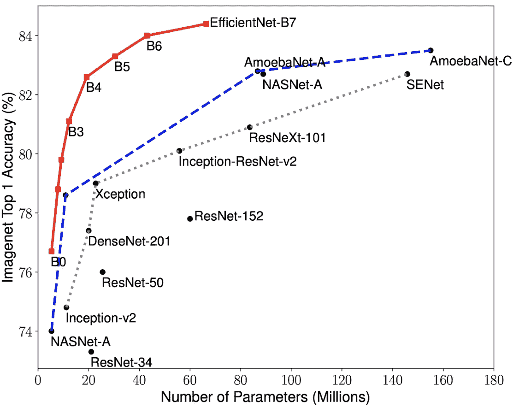
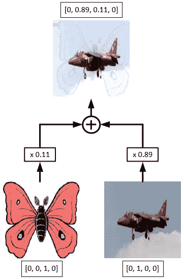
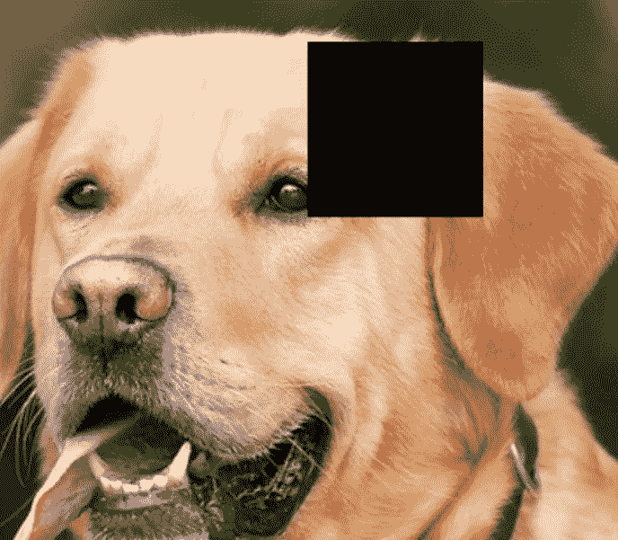
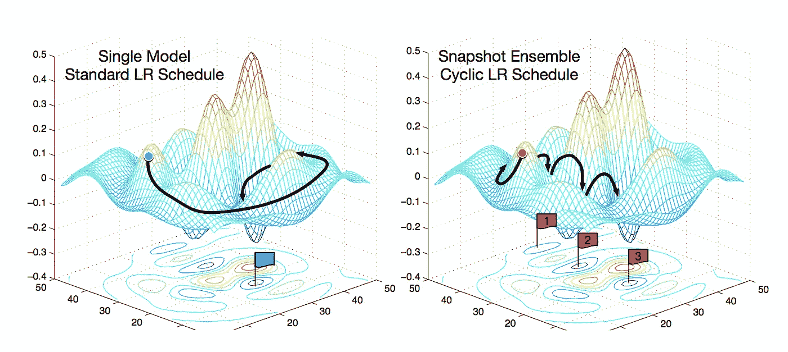
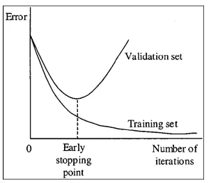

# 如何在 2020 年提高 CNN 模型的准确性？

> 原文：<https://medium.com/analytics-vidhya/how-to-increase-accuracy-of-cnn-models-d1b96edfe64e?source=collection_archive---------3----------------------->

我将分享一些技巧和诀窍，通过它们我们可以提高深度学习中 CNN 模型的准确性。

我们可以通过以下方法做到这一点

1.  **使用预训练模型** →首先，我们必须使用预训练模型权重，因为它们在识别大量图像时是通用的。因此，学习到的它们的权重将有助于对我们将在数据集中分类的少数几个类进行分类。为此，我们只需要**改变我们将使用的预训练模型的最终层**，并冻结除最终层之外的所有层的权重。



显示预训练模型的**精度与模型中使用的**参数数量**的图表**

因此，从上图中我们可以看到，与其他模型相比，EfficientNet 模型表现最佳，因为与其他模型相比，EfficientNet 的参数数量较少。我们可以在 **pytorch** 中使用高效网络作为→

```
!pip install efficientnet_pytorch
```

然后，

```
from efficientnet_pytorch import EfficientNet
model = EfficientNet.from_pretrained('efficientnet-b0')
```

然后，根据我们的要求对最后一层进行修改。

2.**使用数据扩充方法进行推广** →我们可以在内核中使用以下数据扩充方法来提高模型的准确性。

## # **混淆** →

在 MixUp 中，我们在将两个原始图像输入到我们的模型(可能在同一个类中，也可能不在同一个类中)之前混合它们，并对它们进行线性组合:根据张量。



混乱的图示

为了在 pytorch 中实现混合，我们可以使用:

```
!pip install torchtoolbox
from torchtoolbox.tools import mixup_data, mixup_criterion
```

然后在 **train** 类中我们可以添加这行代码

```
alpha = 0.2
for i, (inputs, labels) in enumerate(train_data):
    if torch.cuda.is_available():
        inputs= inputs.cuda()
        labels = labels.cuda()

    inputs, labels_a, labels_b, lam = mixup_data(inputs, labels, alpha)
    optimizer.zero_grad()
    outputs = model(data)
    loss = mixup_criterion(**Loss**, outputs, labels_a, labels_b, lam)

    loss.backward()
    optimizer.update()
```

其中，`**Loss = torch.nn.CrossEntroyLoss()**`

## # **断流器** →

在裁剪中，我们从训练数据中的各种图像类别中移除随机正方形块。



为了在 pytorch 中实现 CutOut，我们可以使用:

```
!pip install torchtoolbox
from torchtoolbox.transform import Cutout
import albumentations
```

在图像变换中，我们可以用它来→

```
transforms = albumentations.Compose([
 albumentations.Resize(img_height , img_width, always_apply = True) ,**Cutout()**,
 albumentations.Normalize(mean , std , always_apply = True),
 albumentations.ShiftScaleRotate(shift_limit = 0.0625,
 scale_limit = 0.1 ,
 rotate_limit = 5,
 p = 0.9)
```

## # **CutMix** →

在剪切混合中，我们从一个类中取出一片图像，粘贴到另一个类的图像上。


芒果图像上的苹果剪辑图像实例

```
# in Pytorch
$ pip install git+https://github.com/ildoonet/cutmix
```

然后，对于训练图像数据集类的对象，我们必须在 pytorch 数据加载器中加载数据集之前执行此操作

```
cutMix_train_dataset = CutMix(train_dataset, num_class=100, beta=1.0, prob=0.5, num_mix=2)
```

我们将使用的损失是

```
Loss = CutMixCrossEntropyLoss(True)
```

## #F **混合** →

FMix 是 Mix、CutMix 等的变体。Fmix 采用从傅立叶空间采样的掩码来混合训练样本。


fmix 示例

在 pytorch 中，我们可以像这样实现 fmix

```
from os.path import existsif not exists(‘fmix.zip’): !wget -O fmix.zip [https://github.com/ecs-vlc/fmix/archive/master.zip](https://github.com/ecs-vlc/fmix/archive/master.zip)
 !unzip -qq fmix.zip
 !mv FMix-master/* ./
 !rm -r FMix-master
```

最后，**用 pytorch dataloaders** 创建一批数据，并在上述 gitHub repo 的 fmix.py 文件中应用`sample_and_apply`函数。此外，在训练这些新图像和新标签时，我们使用损失函数作为:

```
alpha, decay_power = 1.0, 3.0

for epoch in range(epochs):
    for batch, labels in training_dataloader:
        batch, perm, lambda = sample_and_apply(batch, alpha,       decay_power, (img_height, img_width))
        out = my_model(batch)
        loss = torch.nn.CrossEntroyLoss(out, labels) * lambda + torch.nn.CrossEntroyLoss(out, target[perm]) * (1 - lambda)
```

仅在**训练阶段**。

**3** 。**使用随机加权平均** →这是一个简单的过程，在没有额外成本的情况下，在深度学习中提高了随机梯度下降(SGD)的泛化能力，可以作为 **PyTorch** 中任何其他优化器的替代。 **SWA** 使用修改的学习率计划对 SGD 遍历的权重进行平均。



在 pytorch 中，我们可以像这样实现 **SWA**

```
!pip install torchcontrib
```

然后导入它

```
from torchcontrib.optim import SWA
```

然后我们可以像这样用 SWA 包装我们的优化器

```
**our_optimizer** = torch.optim.Adam(model.parameters(), lr=1e-4)
optimizer = SWA(**our_optimizer**, swa_start=5, swa_freq=5, swa_lr=0.05)
```

最后，在训练循环的最后加上这个。

```
optimizer.swap_swa_sgd()
```

将我们模型的权重设置为它们的 **SWA** 平均值。

4.**使用早期停止** →这是一种正则化形式，用于避免在训练数据集上过度拟合。提前停止会跟踪验证损失，如果损失连续几个时期停止下降，则训练也会停止。



```
!pip install pytorchtools   #first install pytorchtools
```

然后，导入**提前停止**

```
from pytorchtools import EarlyStopping
```

之后，在训练和验证循环开始之前初始化 early_stopping 对象，如下所示

```
**early_stopping** = EarlyStopping(patience=patience, verbose=**True**)

for epoch in range(n_epochs):
  ..............
```

然后，在得到训练和验证损失后，借助`**early_stopping**` 对象将早停检查点放在那里。

```
*# early_stopping needs the validation loss to check if it has decresed and if it has, it will make a checkpoint of the current model*early_stopping(valid_loss, model)
if early_stopping.early_stop:
   print("Early stopping")
   break
```

这些是我们在分类问题中可以使用的一些技巧和窍门。如果你有任何问题、意见或担忧，请在评论中告诉我。感谢阅读，并在此之前享受学习。

## GitHub 回购信用:→

**预训练模型→**https://github.com/Cadene/pretrained-models.pytorch T21

**效率网模型→**https://github.com/lukemelas/EfficientNet-PyTorch

**混淆、断流**→[https://github.com/PistonY/torch-toolbox](https://github.com/PistonY/torch-toolbox)

**剪切混合**→[https://github.com/ildoonet/cutmix](https://github.com/ildoonet/cutmix)

**Fmix**→[https://github.com/ecs-vlc/FMix](https://github.com/ecs-vlc/FMix)

**随机加权平均**→[https://github.com/pytorch/contrib](https://github.com/pytorch/contrib)

**提前停车**→【https://github.com/Bjarten/early-stopping-pytorch 