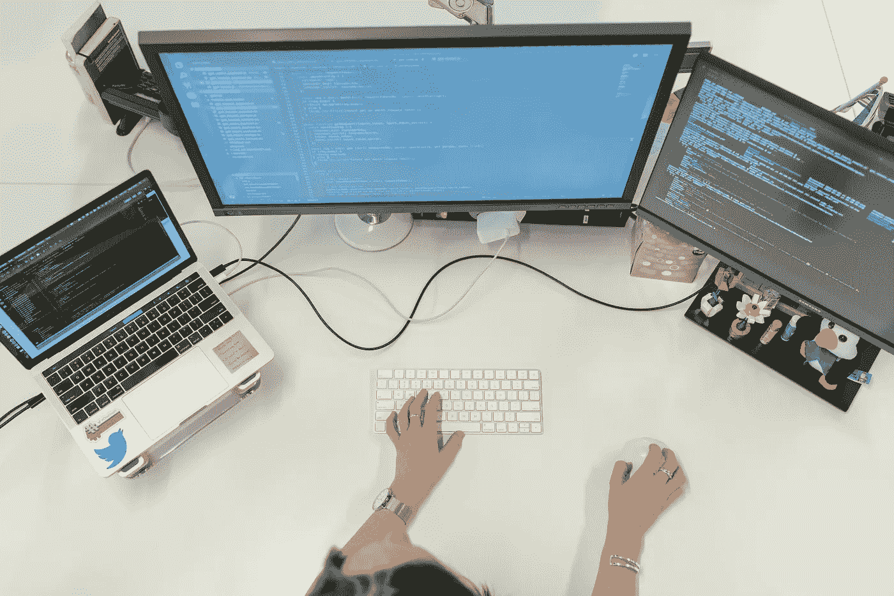
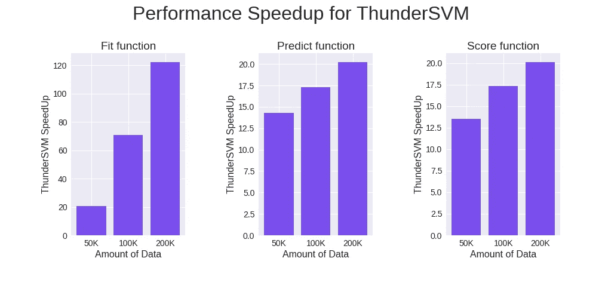

# ThunderSVM 简介:基于 GPU 和 CPU 的快速 SVM 库

> 原文：<https://medium.com/analytics-vidhya/how-to-install-and-run-thundersvm-in-google-colab-de1fe49eef85?source=collection_archive---------6----------------------->

以及如何在 Google Colab 上运行它…



在 [Unsplash](https://unsplash.com/?utm_source=unsplash&utm_medium=referral&utm_content=creditCopyText) 上拍摄的 [ThisisEngineering RAEng](https://unsplash.com/@thisisengineering?utm_source=unsplash&utm_medium=referral&utm_content=creditCopyText)

支持向量机(SVM)是一种用于分类和回归的机器学习算法。它是最基本的 ML 算法之一，可用于对高维空间中的点进行分类，并从一组给定的特征中预测实数。如果你想更深入地了解 SVM，请随意阅读以下内容:

## 分类中的 SVM

*   [第二章:SVM(支持向量机)——理论](/machine-learning-101/chapter-2-svm-support-vector-machine-theory-f0812effc72)
*   [支持向量机(SVM)——概述](https://towardsdatascience.com/https-medium-com-pupalerushikesh-svm-f4b42800e989)
*   [支持向量机——简单解释](https://towardsdatascience.com/support-vector-machine-simply-explained-fee28eba5496)

## 回归的 SVM

*   [支持向量回归(SVR)简介](https://towardsdatascience.com/an-introduction-to-support-vector-regression-svr-a3ebc1672c2)
*   [机器学习的支持向量回归教程](https://www.analyticsvidhya.com/blog/2020/03/support-vector-regression-tutorial-for-machine-learning/)

在本文中，我们将了解如何在 Google Colab 中安装和运行 ThunderSVM。先来看看 thundersvm 是什么…

# ThunderSVM

[ThunderSVM](https://github.com/Xtra-Computing/thundersvm) 是一个开源库，它利用 GPU 和多核 CPU 应用 SVM 以更快、更高效的方式解决问题。使用 *thundersvm* 相比 *scikit-learn svm* 在分类中的加速提高随着数据量成比例增加。只需更改一行代码，您就可以将算法速度提高大约 70 倍！

在使用 thundersvm 时，首先您必须按照以下步骤安装它。

# 装置

为了充分利用 cpu 和 gpu，请使用 google colab 中的 gpu 运行时。首先打开 [colab](https://colab.research.google.com/) ，从菜单栏*点击*运行时* > > *改变运行时类型*。*接下来，在*硬件加速器*下拉菜单中点击 *GPU* 。这将为您的 google colab 脚本激活一个 gpu 后端。

运行 thundersvm 需要 CUDA Toolkit 9.0。我们先安装这个。

现在，按如下所示的顺序依次执行以下代码行:

```
1\. !wget [https://developer.nvidia.com/compute/cuda/9.0/Prod/local_installers/cuda-repo-ubuntu1704-9-0-local_9.0.176-1_amd64-deb](https://developer.nvidia.com/compute/cuda/9.0/Prod/local_installers/cuda-repo-ubuntu1704-9-0-local_9.0.176-1_amd64-deb)2\. !ls  # Check if required cuda 9.0 amd64-deb file is downloaded3\. !dpkg -i cuda-repo-ubuntu1704-9-0-local_9.0.176-1_amd64-deb4\. !ls /var/cuda-repo-9-0-local | grep .pub5\. !apt-key add /var/cuda-repo-9-0-local/7fa2af80.pub6\. !apt-get update7\. !sudo apt-get install cuda-9.0
```

接下来，运行以下命令检查 CUDA 9.0 是否安装成功:

```
!nvcc --version
```

运行后，如果您看到 *Cuda 编译工具，发布 9.0* ，在输出的最后一行是具体的版本号，那么安装就完成了。如果您想将它安装在您的本地电脑上，只需在终端中去掉“！”即可按顺序运行上述命令对他们每个人来说。如果您想检查输出结果，安装代码可从[这里](https://github.com/SifatMd/thundersvm-tutorial/blob/master/Installation_Steps.ipynb)获得。

接下来，我们将安装 thundersvm。

# 安装 ThunderSVM

运行以下命令将其安装在 google colab 中。

```
!pip install thundersvm
```

如果您只想使用 cpu 而不使用 gpu 来执行 thundersvm，请在 colab 中执行以下命令:

```
!pip install thundersvm-cpu
```

您也可以在计算机的终端中运行上述命令，删除“！”安装到您的电脑中。

对于纯 cpu 版本，不需要安装 CUDA 9.0。在这两种情况下，Thundersvm 将使用 cpu 的所有核心。以下步骤对于 cpu 和 gpu 版本是相同的。

# 执行

让我们以如下方式用 thundersvm 运行支持向量分类:

我们可以看到，除了修改 import 语句，其他都类似于运行[*scikit-learn SVM*](https://scikit-learn.org/stable/modules/generated/sklearn.svm.SVC.html)。

# 加速评估

要查看 *scikit-learn svm* 和 *thundersvm* 的速度提升对比，让我们看看下面的代码。

我们已经可以看到拟合训练数据的速度提高了 50 多倍。预测和评分功能的速度也提高了 17 倍以上。如果我们继续增加数据量，以上三个函数的加速都会成比例增加。



将数据量从 50，000 增加到 100，000，将 *Fit* 函数的加速从 20 倍提高到 70 倍。当我们跨越 200，000 个样本时， *thundersvm* 在训练速度上实现了超过 120 倍的加速！*得分*和*预测*功能也导致执行时间加速超过 20 倍。我在 google colab 使用期间，用的是特斯拉-P100 gpu。根据 gpu 类型的不同，加速比的个别增加率可能会有所不同。

加速和可视化的比较代码可以在[这里](https://github.com/SifatMd/thundersvm-tutorial/blob/master/compare_and_visualize.ipynb)找到。

# 结论

SVM 在处理大量数据时会非常慢。但是，通过使用 thundersvm，您可以轻松地加速代码的各个方面。可以在 Linux，Windows，MacOS 中使用。Thundersvm 还支持 LibSVM 的所有功能，包括支持向量回归(SVR)、单类支持向量机和概率支持向量机。你可以点击[了解更多信息。](https://thundersvm.readthedocs.io/en/latest/get-started.html)

我希望这对您的编码之旅有所帮助。万事如意！😀

感谢阅读！如果你喜欢这个帖子或者有任何问题/评论，请在下面留下评论！

这篇文章的代码可以在我的 GitHub 页面上找到。