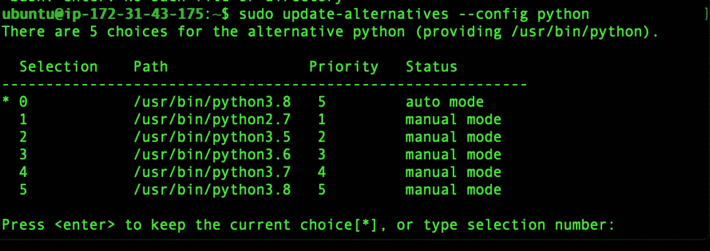

# 如何在 ubuntu 16.04 中安装和切换不同的 python 版本？

> 原文：<https://medium.com/analytics-vidhya/how-to-install-and-switch-between-different-python-versions-in-ubuntu-16-04-dc1726796b9b?source=collection_archive---------0----------------------->

当我使用 python 时，有时我会面临一些 python 版本的问题。虽然我知道在那种情况下哪个命令会起作用，但是在那段时间里，我只是忘记了确切的命令，我不得不在 google 或 stackoverflow 上搜索确切的命令。

在这里，我将记录安装不同版本的 python 和每次使用时更改版本的过程。

# **如何安装不同版本的 python？**

## python 2.7:

运行以下命令:

```
sudo apt install python-minimal
```

现在，如果您运行 python -V 命令，您将得到 2.7.12 作为输出。通常安装路径是/usr/bin/python。

## python 3.5:

运行以下命令:

```
sudo apt install python3
```

现在，如果您运行 python -V 命令，您将得到 3.5.2 作为输出。通常安装路径是/usr/bin/python3.5。

## python 3.6:

运行以下命令:

```
sudo add-apt-repository ppa:deadsnakes/ppa
sudo apt update
sudo apt install python3.6
```

现在，如果您运行 python -V 命令，您将得到 3.6.10 作为输出。通常安装路径是/usr/bin/python3.6。

## python 3.7:

运行以下命令:

```
sudo add-apt-repository ppa:deadsnakes/ppa
sudo apt update
sudo apt install python3.7
```

现在，如果您运行 python -V 命令，您将得到 3.7.6 作为输出。通常安装路径是/usr/bin/python3.7。

## python 3.8:

运行以下命令:

```
sudo add-apt-repository ppa:deadsnakes/ppa
sudo apt update
sudo apt install python3.8
```

现在，如果您运行 python -V 命令，您将得到 3.8.1 作为输出。通常安装路径是/usr/bin/python3.8。

# 如何在不同的 python 版本之间切换？

如果我们的系统中安装了多个 python 版本，那么 python 将只使用一个可执行文件。通常，如果我们通过“python program.py”运行一个名为 program.py 的程序，那么这个程序将由 python2.7 运行。如果我们通过“python -V”检查 python 版本，它将返回 2.7.12。但是如果我们想要 3.5 作为‘python-V’的结果，并且程序将由 python 3.5 可执行文件运行，那么我们可以用两种方式改变默认的 python 可执行文件。

## 在 bashrc 中创建别名:

我们可以在用户的主目录中创建一个别名，并将其添加到 bashrc 中。但是它只对当前用户有效。

使用以下命令打开 bashrc 文件:

```
nano ~/.bashrc
```

将下面一行添加到 bashrc 文件的下面。

```
alias python=‘/usr/bin/python3.5’
```

现在，如果我们使用“python -V”来检查 python 版本，它将返回 3.5.2。如果我们使用“python program.py”运行 program.py 文件，那么它将由 python3.5 可执行文件运行。

## 使用更新替代方案:

要在所有用户的 python 版本之间切换，我们可以使用 update-alternatives 命令。

我们将使用更新选项设置每个版本的优先级。具有最高优先级的 Python 可执行文件将被用作默认 python 版本。

我们将通过以下命令设置优先级:

```
 sudo update-alternatives --install /usr/bin/python python /usr/bin/python2.7 1sudo update-alternatives --install /usr/bin/python python /usr/bin/python3.5 2sudo update-alternatives --install /usr/bin/python python /usr/bin/python3.6 3sudo update-alternatives --install /usr/bin/python python /usr/bin/python3.7 4sudo update-alternatives --install /usr/bin/python python /usr/bin/python3.8 5
```

这里我把 python 2.7，3.5，3.6，3.7，3.8 的优先级设置为 1，2，3，4，5。因为 python3.8 具有最高的优先级，所以现在默认的 python 可执行文件是 python3.8。

要在任何版本之间切换，我们可以使用以下命令:

```
sudo update-alternatives --config python
```

它将给出如下响应:



现在，默认的 python 可执行文件可以通过设置其相应的选择号来更改。例如，如果我们输入 4，python 将使用 python3.7 作为默认的可执行文件。

# 注意:

这个故事只是为了我的文档目的。没什么严重的:D·:D