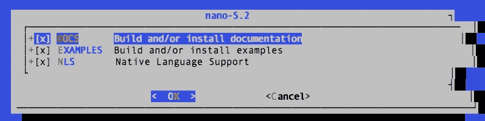

# 如何在 freebsd 中安装应用？

> 原文：<https://medium.com/analytics-vidhya/how-to-install-applications-in-freebsd-49425b8aaa47?source=collection_archive---------27----------------------->

要在 freebsd 下安装应用程序，您可以使用`pkg`工具或`make`工具。`pkg`工具将安装预编译的二进制文件，而`make`工具将从源代码构建二进制文件。

# pkg 工具

## 安装 pkg 工具

默认情况下，freebsd 中没有预装 pkg 工具，但是您可以通过运行以下命令来安装它:

```
$ su -
# switch user to root . 
Password:root$ /usr/sbin/pkg -v
# install the pkg tool 
The package management tool is not yet installed on your system.
Do you want to fetch and install it now? [y/N]: y
Bootstrapping pkg from pkg+[http://pkg.FreeBSD.org/FreeBSD:12:amd64/quarterly](http://pkg.FreeBSD.org/FreeBSD:12:amd64/quarterly), please wait...
Verifying signature with trusted certificate pkg.freebsd.org.2013102301... done
Installing pkg-1.14.6...
Extracting pkg-1.14.6: 100%
1.14.5
```

## 更新 pkg 数据库

安装 pkg 工具后，必须更新软件包数据库，以便获得可用应用程序的最新信息。这可以通过发出以下命令来实现:

```
root$ pkg update
Updating FreeBSD repository catalogue...
Fetching meta.conf: 100%    163 B   0.2kB/s    00:01
Fetching packagesite.txz: 100%    6 MiB   8.0kB/s    13:40
Processing entries: 100%
FreeBSD repository update completed. 32006 packages processed.
All repositories are up to date.
```

当尝试安装或升级应用程序时，软件包数据库会自动更新。

## 搜索应用程序

现在已经安装了`pkg`工具，您可以使用`pkg search`命令搜索您想要安装的应用程序。

默认情况下，pkg search 命令采用 Posix 扩展正则表达式。在 posix 中有两种类型的正则表达式，名为`BRE`的基本正则表达式和名为 ere 的扩展正则表达式，`ERE`包含了比 BRE 更多的元字符和类。

默认情况下，正则表达式与应用程序的 ***名称*** 匹配，不区分大小写。例如:

```
$ pkg search chromium
# search for the chromium browser 
chromium-84.0.4147.135         Google web browser based on WebKit
chromium-bsu-0.9.16.1_1        Arcade-style, top-scrolling space shooter
chromium-gn-84.0.4147.135      Gn meta build framework
```

通过使用`-q`选项，您可以显示关于应用程序的较少信息，并且通过使用`-f`选项，您可以显示关于应用程序的全部 ***信息*** 。例如:

```
$ pkg search 'chromium-8'
# search for an application which name
# contains the pattern chromium-8 . 
chromium-84.0.4147.135         Google web browser based on WebKit$ pkg search -q 'chromium-8'ƒ
# search for an application which name
# contains the pattern chromium-8 . 
# The -q option is used , pkg search
# shows less details . 
chromium-84.0.4147.135$ pkg search -f 'chromium-8'
# search for an application which name
# contains the pattern chromium-8 . 
# The -f option is used , pkg search
# shows full details .chromium-84.0.4147.135
Name           : chromium
Version        : 84.0.4147.135
Origin         : www/chromium
Architecture   : FreeBSD:12:amd64
Prefix         : /usr/local
Repository     : FreeBSD [pkg+[http://pkg.FreeBSD.org/FreeBSD:12:amd64/quarterly](http://pkg.FreeBSD.org/FreeBSD:12:amd64/quarterly)]
Categories     : java www
Licenses       : BSD3CLAUSE, LGPL21, MPL11
Maintainer     : [chromium@FreeBSD.org](mailto:chromium@FreeBSD.org)
WWW            : [https://www.chromium.org/Home](https://www.chromium.org/Home)
Comment        : Google web browser based on WebKit
Options        :
        ALSA           : on
        CODECS         : on
        CUPS           : on
        DEBUG          : off
        DRIVER         : on
        KERBEROS       : on
        PULSEAUDIO     : off
        SNDIO          : off
        TEST           : off
Shared Libs required:
        libavutil.so.56
        libexpat.so.1
        libxslt.so.1
        libjpeg.so.8
        libopus.so.0
        libfreetype.so.6
        libFLAC.so.8
        libXtst.so.6
        libX11-xcb.so.1
        libatk-1.0.so.0
        libdrm.so.2
        libcups.so.2
        libplc4.so
        libatspi.so.0
        libXss.so.1
        libasound.so.2
        libwebpmux.so.3
        libnss3.so
        libnssutil3.so
        libgbm.so.1
        libXrender.so.1
        libglib-2.0.so.0
        libharfbuzz.so.0
        libintl.so.8
        libXrandr.so.2
        libsnappy.so.1
        libavformat.so.58
        libsmime3.so
        libXi.so.6
        libgdk-3.so.0
        libpci.so.3
        libpangocairo-1.0.so.0
        libatk-bridge-2.0.so.0
        libXext.so.6
        libpango-1.0.so.0
        libcairo.so.2
        libgtk-3.so.0
        libxml2.so.2
        libwebp.so.7
        libcairo-gobject.so.2
        libgmodule-2.0.so.0
        libXcomposite.so.1
        libxcb.so.1
        libopenh264.so.6
        libgio-2.0.so.0
        libgdk_pixbuf-2.0.so.0
        libXfixes.so.3
        libwebpdemux.so.2
        libnspr4.so
        libharfbuzz-subset.so.0
        libgobject-2.0.so.0
        libXcursor.so.1
        libplds4.so
        libavcodec.so.58
        libdbus-1.so.3
        libXdamage.so.1
        libGL.so.1
        libX11.so.6
        libpng16.so.16
        libfontconfig.so.1
        libxcb-dri3.so.0
        libgthread-2.0.so.0
Shared Libs provided:
        libvk_swiftshader.so
        libEGL.so
        libGLESv2.so
        libVkICD_mock_icd.so
Annotations    :
        FreeBSD_version: 1201000
        cpe            : cpe:2.3:a:google:chrome:84.0.4147.135:::::freebsd12:x64
        deprecated     : Uses Python 2.7 which is EOLed upstream
        expiration_date: 2020-12-31
Flat size      : 270MiB
Pkg size       : 73.8MiB
Description    :
Chromium is an open-source browser project that aims to build a safer,
faster, and more stable way for all users to experience the web.
The Chromium website contains design documents, architecture overviews,
testing information, and more to help you learn to build and work with
the Chromium source code.
WWW: [https://www.chromium.org/Home](https://www.chromium.org/Home)
```

也可以搜索描述应用程序的其他字段。要使用应用程序的 ***描述*** 搜索应用程序，可以使用`-D`选项。例如:

```
$ pkg search -Dq 'chromium'
# -D : Search for applications which 
#      contain in their description the
#      pattern chromium .
# -q : quiet option , shows less 
#      details . 
cld2-20150505
py27-cld-20150113_1
py37-cld-20150113_1
crosextrafonts-caladea-20130214_4
crosextrafonts-carlito-20130920_4
chromium-bsu-0.9.16.1_1
chromium-84.0.4147.135
chromium-gn-84.0.4147.135
iridium-browser-2020.04.81
keepassxc-2.5.4
ja-fcitx-mozc-2.23.2815.102.00_7
ja-uim-mozc-2.23.2815.102.00_7
ja-mozc-tool-2.23.2815.102.00_7
ja-mozc-server-2.23.2815.102.00_7
ja-mozc-el-emacs28_nox-2.23.2815.102.00_1
ja-mozc-el-emacs28-2.23.2815.102.00_1
ja-mozc-el-emacs26_nox-2.23.2815.102.00_1
ja-mozc-el-emacs26_canna-2.23.2815.102.00_1
ja-mozc-el-emacs26-2.23.2815.102.00_1
ja-ibus-mozc-2.23.2815.102.00_7
ninja-1.10.0,2
icingaweb2-module-pdfexport-php74-0.9.0_2
icingaweb2-module-pdfexport-php73-0.9.0_2
icingaweb2-module-pdfexport-php72-0.9.0_2
ots-8.0.0
py37-codesearch-py-g20190528,1
py27-codesearch-py-g20190528,1
cquery-20180718_7
py37-hstspreload-2020.6.23
libyuv-0.0.1280
```

## 安装应用程序

找到您正在寻找的应用程序后，您可以使用`pkg install`命令安装它。

```
root$ pkg search 'google.*translate'
# search for an application which contains 
# the pattern google , followed by zero
# or more characters , followed by the
# word translate . 
google-translate-cli-0.9.6.10  Google Translate to serve as a command line tool
py37-google-cloud-translate-1.3.1_1 Python Client for Google Cloud Translationroot$ pkg install google-translate-cli
# install the application named :
# google-translate-cli . 
Updating FreeBSD repository catalogue...
FreeBSD repository is up to date.
All repositories are up to date.
The following 7 package(s) will be affected (of 0 checked):
New packages to be INSTALLED:
        bash: 5.0.17
        gawk: 5.1.0
        gettext-runtime: 0.20.2
        google-translate-cli: 0.9.6.10
        indexinfo: 0.3.1
        libsigsegv: 2.12
        readline: 8.0.4
Number of packages to be installed: 7
The process will require 16 MiB more space.
3 MiB to be downloaded.
Proceed with this action? [y/N]: y
[1/7] Fetching google-translate-cli-0.9.6.10.txz: 100%   38 KiB  38.7kB/s    00:01
[2/7] Fetching bash-5.0.17.txz: 100%    2 MiB 396.6kB/s    00:04
[3/7] Fetching indexinfo-0.3.1.txz: 100%    6 KiB   5.8kB/s    00:01
[4/7] Fetching gettext-runtime-0.20.2.txz: 100%  161 KiB 165.1kB/s    00:01
[5/7] Fetching gawk-5.1.0.txz: 100%  924 KiB 236.6kB/s    00:04
[6/7] Fetching readline-8.0.4.txz: 100%  354 KiB 181.1kB/s    00:02
[7/7] Fetching libsigsegv-2.12.txz: 100%   18 KiB  18.0kB/s    00:01
Checking integrity... done (0 conflicting)
[1/7] Installing indexinfo-0.3.1...
[1/7] Extracting indexinfo-0.3.1: 100%
[2/7] Installing gettext-runtime-0.20.2...
[2/7] Extracting gettext-runtime-0.20.2: 100%
[3/7] Installing readline-8.0.4...
[3/7] Extracting readline-8.0.4: 100%
[4/7] Installing libsigsegv-2.12...
[4/7] Extracting libsigsegv-2.12: 100%
[5/7] Installing bash-5.0.17...
[5/7] Extracting bash-5.0.17: 100%
[6/7] Installing gawk-5.1.0...
[6/7] Extracting gawk-5.1.0: 100%
[7/7] Installing google-translate-cli-0.9.6.10...
[7/7] Extracting google-translate-cli-0.9.6.10: 100%
=====
Message from libsigsegv-2.12:
--
Note that the stackoverflow handling functions of this library need
procfs mounted on /proc.$ trans 'salut le monde'
# translate 'salue le monde'
salut le monde
Hello world
Translations of salut le monde
[ Français -> English ]
salut le monde
    Hello world
```

## 更新应用程序

要升级所有应用程序，您可以运行`pkg upgrade`，要升级特定应用程序，您可以运行`pkg upgrade application_name`。例如:

```
root$ pkg upgrade espeak
# upgrade the espeak application .
Updating FreeBSD repository catalogue...
FreeBSD repository is up to date.
All repositories are up to date.
Checking integrity... done (0 conflicting)
Your packages are up to date.
root@freebsd:~ #root$ pkg upgrade
# upgrade all installed applications .
Updating FreeBSD repository catalogue...
FreeBSD repository is up to date.
All repositories are up to date.
Checking for upgrades (1 candidates): 100%
Processing candidates (1 candidates): 100%
Checking integrity... done (0 conflicting)
Your packages are up to date.
```

## 列出已安装的应用程序

要获得所有已安装应用程序的列表，您可以运行命令`pkg info`，例如:

```
$ pkg info
# List installed applications 
bash-5.0.17                    GNU Project's Bourne Again SHell
espeak-1.48.04_7               Software speech synthesizer
gawk-5.1.0                     GNU version of AWK scripting language
gettext-runtime-0.20.2         GNU gettext runtime libraries and programs
google-translate-cli-0.9.6.10  Google Translate to serve as a command line tool
indexinfo-0.3.1                Utility to regenerate the GNU info page index
libsigsegv-2.12                Handling page faults in user mode
pkg-1.14.6                     Package manager
portaudio-19.6.0_4,1           Portable cross-platform Audio API
readline-8.0.4                 Library for editing command lines as they are typed
```

## 卸载应用程序

要卸载 ***应用*** ，可以运行`pkg delete application_name`命令，例如:

```
root$ pkg delete espeak
# Delete the espeak application . 
Checking integrity... done (0 conflicting)
Deinstallation has been requested for the following 1 packages (of 0 packages in the universe):
Installed packages to be REMOVED:
        espeak: 1.48.04_7
Number of packages to be removed: 1
The operation will free 3 MiB.
Proceed with deinstalling packages? [y/N]: y
[1/1] Deinstalling espeak-1.48.04_7...
[1/1] Deleting files for espeak-1.48.04_7: 100%
```

要删除应用程序安装的任何 ***库*** ，在卸载应用程序后，您可以运行命令`pkg autoremove`。例如:

```
root$ pkg autoremove
Checking integrity... done (0 conflicting)
Deinstallation has been requested for the following 1 packages:
Installed packages to be REMOVED:
        portaudio: 19.6.0_4,1
Number of packages to be removed: 1
Proceed with deinstalling packages? [y/N]: y
[1/1] Deinstalling portaudio-19.6.0_4,1...
[1/1] Deleting files for portaudio-19.6.0_4,1: 100%
```

# 制作工具

make 工具将从源代码安装应用程序。ports 集合是一个应用程序集合，可以使用 make 工具安装在 freebsd 下。

可以使用 pkg 工具安装 ports 集合中应用程序的预编译版本。如果要使用某些选项编译应用程序，可以使用 ports 集合。

## 下载端口集合

要下载端口集合，您可以使用命令
`portsnap fetch extract`。例如:

```
root$ portsnap fetch extract
# fetch : Download the ports collection .
# extract : extract the ports collection . 
Looking up portsnap.FreeBSD.org mirrors... 4 mirrors found.
Fetching public key from ipv4.aws.portsnap.freebsd.org... done.
Fetching snapshot tag from ipv4.aws.portsnap.freebsd.org... done.
Fetching snapshot metadata... done.
Fetching snapshot generated at Sun Sep 27 20:04:35 EDT 2020:
d3a47f9fcd506dfa3103c5c6719d2d5de0b45c7201d4ec          86 MB  524 kBps 02m48s
Extracting snapshot... done.
Verifying snapshot integrity...
Fetching snapshot tag from ipv4.aws.portsnap.freebsd.org... done.
Fetching snapshot metadata... done.
Updating from Sun Sep 27 20:04:35 EDT 2020 to Mon Sep 28 09:13:01 EDT 2020.
Fetching 4 metadata patches... done.
Applying metadata patches... done.
Fetching 0 metadata files... done.
Fetching 196 patches.
(196/196) 100.00%  done. .
done.
Applying patches...
done.
Fetching 1 new ports or files... done.
/usr/ports/.arcconfig
/usr/ports/.gitattributes
...
...
/usr/ports/x11/zenity/
Building new INDEX files... done.
```

端口集合被安装到`/usr/ports`。

## 更新端口集合

要更新端口集合，您可以运行命令`portsnap fetch update`，例如:

```
root$ portsnap fetch update
# fetch  : download the ports collection .
# update : the ports collection . 
Looking up portsnap.FreeBSD.org mirrors... 4 mirrors found.
Fetching snapshot tag from ipv4.aws.portsnap.freebsd.org... done.
Fetching snapshot metadata... done.
Updating from Mon Sep 28 09:13:01 EDT 2020 to Mon Sep 28 09:39:04 EDT 2020.
Fetching 1 metadata patches. done.
Applying metadata patches... done.
Fetching 0 metadata files... done.
Fetching 1 patches.
(1/1) 100.00%  done.
done.
Applying patches...
done.
Fetching 0 new ports or files... done.
Removing old files and directories... done.
Extracting new files:
/usr/ports/multimedia/gstreamer/
Building new INDEX files... done.
```

## 配置端口

在安装一个端口之前，最好运行与这个端口相关的所有配置，这可以通过在你想要安装的端口内使用命令`make config-recursive`来完成。例如:

```
root$ cd /usr/ports/editors/nano 
root:/usr/ports/editors/nano$ make config-recursive
# configure the nano port , and 
# all the ports or libraries , it
# depends upon . 
===> Setting user-specified options for nano-5.2 and dependencies
===> Building/installing dialog4ports as it is required for the config dialog
===>  Cleaning for dialog4ports-0.1.6
===>  License BSD2CLAUSE accepted by the user
===>   dialog4ports-0.1.6 depends on file: /usr/local/sbin/pkg - found
=> dialog4ports-0.1.6.tar.gz doesn't seem to exist in /usr/ports/distfiles/.
=> Attempting to fetch [https://files.etoilebsd.net/dialog4ports/dialog4ports-0.1.6.tar.gz](https://files.etoilebsd.net/dialog4ports/dialog4ports-0.1.6.tar.gz)
dialog4ports-0.1.6.tar.gz                               10 kB   55 MBps    00s
===> Fetching all distfiles required by dialog4ports-0.1.6 for building
===>  Extracting for dialog4ports-0.1.6
=> SHA256 Checksum OK for dialog4ports-0.1.6.tar.gz.
===>  Patching for dialog4ports-0.1.6
===>  Applying FreeBSD patches for dialog4ports-0.1.6 from /usr/ports/ports-mgmt/dialog4ports/files
```



纳米结构

## 安装端口

配置完端口后，您可以使用`make install`命令 ***安装*** 。如果在安装之前没有配置端口，则必须在安装时进行配置。

```
root:/usr/ports/editors/nano $ make install
# compile and install the 
# nano port .
===>  License GPLv3 accepted by the user
===>   nano-5.2 depends on file: /usr/local/sbin/pkg - found
=> nano-5.2.tar.xz doesn't seem to exist in /usr/ports/distfiles/.
=> Attempting to fetch [https://www.nano-editor.org/dist/v5/nano-5.2.tar.xz](https://www.nano-editor.org/dist/v5/nano-5.2.tar.xz)
nano-5.2.tar.xz                                       1362 kB  602 kBps    03s
===> Fetching all distfiles required by nano-5.2 for building
===>  Extracting for nano-5.2
=> SHA256 Checksum OK for nano-5.2.tar.xz.
===>  Patching for nano-5.2
/usr/bin/sed -i.bak -e 's/^groff.*/false/' /usr/ports/editors/nano/work/nano-5.2/configure
===>   nano-5.2 depends on package: pkgconf>=1.3.0_1 - not found
===>  License ISCL accepted by the user
...
...
====> Compressing man pages (compress-man)
===>  Installing for nano-5.2
===>  Checking if nano is already installed
===>   Registering installation for nano-5.2
Installing nano-5.2.
```

一个 ***工作目录*** 是 make 在编译端口时创建的，它包含编译时使用的文件。可以通过在端口目录中运行命令`make clean`来删除该目录，例如:

```
root:/usr/ports/editors/nano$ ls
# list the content of the
# nano folder.
Makefile        distinfo        pkg-descr       pkg-plist       workroot:/usr/ports/editors/nano$ make clean
# remove the work directory . 
===>  Cleaning for pkgconf-1.7.3,1
===>  Cleaning for gettext-tools-0.21
===>  Cleaning for libtextstyle-0.21
===>  Cleaning for indexinfo-0.3.1
===>  Cleaning for gettext-runtime-0.21
===>  Cleaning for nano-5.2root:/usr/ports/editors/nano$ ls
# list the content of the
# nano folder.
Makefile        distinfo        pkg-descr       pkg-plist
```

## 查看已安装端口的列表

`pkg info`可用于查看已安装应用程序的列表，但这将显示使用 ports 集合安装的应用程序和包含 ports 集合预编译版本的 FreeBsd 存储库。例如:

```
root$ pkg info
dialog4ports-0.1.6             Console Interface to configure ports
gettext-runtime-0.21           GNU gettext runtime libraries and programs
gettext-tools-0.21             GNU gettext development and translation tools
indexinfo-0.3.1                Utility to regenerate the GNU info page index
libtextstyle-0.21              Text styling library
nano-5.2                       Nano's ANOther editor, an enhanced free Pico clone
pkg-1.14.6                     Package manager
pkgconf-1.7.3,1                Utility to help to configure compiler and linker flags
```

要从 ports 集合中仅查看使用 make 命令安装的应用程序，可以发出以下命令:

```
$ pkg query -a '%n %R' | grep 'unknown-repository' | cut -d ' ' -f1
# query : query information installed 
#         packages .
# %n : display package name . 
# %R : display name repository from which 
#      package installed .
# grep : packages which repository is 
#.    not known .
# cut : using the space delimiter , 
#     and extract the first field .
dialog4ports
gettext-runtime
gettext-tools
indexinfo
libtextstyle
nano
pkg
pkgconf
```

## 卸载端口

`pkg delete`命令可用于卸载使用 make 安装的应用程序，而`pkg autoremove`命令可用于移除该应用程序剩余的已安装依赖项。例如:

```
root$ pkg info
dialog4ports-0.1.6             Console Interface to configure ports
gettext-runtime-0.21           GNU gettext runtime libraries and programs
gettext-tools-0.21             GNU gettext development and translation tools
indexinfo-0.3.1                Utility to regenerate the GNU info page index
libtextstyle-0.21              Text styling library
nano-5.2                       Nano s ANOther editor, an enhanced free Pico clone
pkg-1.14.6                     Package manager
pkgconf-1.7.3,1                Utility to help to configure compiler and linker flagsroot$ pkg delete nano
# Delete the nano application installed from
# the ports collection . 
Updating database digests format: 100%
Checking integrity... done (0 conflicting)
Deinstallation has been requested for the following 1 packages (of 0 packages in the universe):
Installed packages to be REMOVED:
        nano: 5.2
Number of packages to be removed: 1
The operation will free 2 MiB.
Proceed with deinstalling packages? [y/N]: y
[1/1] Deinstalling nano-5.2...
[1/1] Deleting files for nano-5.2: 100%root$ pkg info
# List installed packages .
dialog4ports-0.1.6             Console Interface to configure ports
gettext-runtime-0.21           GNU gettext runtime libraries and programs
gettext-tools-0.21             GNU gettext development and translation tools
indexinfo-0.3.1                Utility to regenerate the GNU info page index
libtextstyle-0.21              Text styling library
pkg-1.14.6                     Package manager
pkgconf-1.7.3,1                Utility to help to configure compiler and linker flagsroot$ pkg autoremove
# remove any left over dependencies .
Checking integrity... done (0 conflicting)
Deinstallation has been requested for the following 5 packages:
Installed packages to be REMOVED:
        gettext-runtime: 0.21
        gettext-tools: 0.21
        indexinfo: 0.3.1
        libtextstyle: 0.21
        pkgconf: 1.7.3,1
Number of packages to be removed: 5
The operation will free 17 MiB.
Proceed with deinstalling packages? [y/N]: y
[1/5] Deinstalling gettext-tools-0.21...
[1/5] Deleting files for gettext-tools-0.21: 100%
[2/5] Deinstalling gettext-runtime-0.21...
[2/5] Deleting files for gettext-runtime-0.21: 100%
[3/5] Deinstalling libtextstyle-0.21...
[3/5] Deleting files for libtextstyle-0.21: 100%
[4/5] Deinstalling indexinfo-0.3.1...
[4/5] Deleting files for indexinfo-0.3.1: 100%
[5/5] Deinstalling pkgconf-1.7.3,1...
[5/5] Deleting files for pkgconf-1.7.3,1: 100%root$ pkg info
# List installed packages . 
dialog4ports-0.1.6             Console Interface to configure ports
pkg-1.14.6                     Package manager
```

## 更新端口

要更新端口，最好使用端口管理工具，这样您就不必处理依赖性或其他升级问题。这种工具的一个例子是 `portmaster`。

要 ***安装*** portmaster，可以发出命令:

```
$ pkg install portmaster
# install the portmaster utility .
Updating FreeBSD repository catalogue...
FreeBSD repository is up to date.
All repositories are up to date.
The following 1 package(s) will be affected (of 0 checked):
New packages to be INSTALLED:
        portmaster: 3.19_25
Number of packages to be installed: 1
41 KiB to be downloaded.
Proceed with this action? [y/N]: y
[1/1] Fetching portmaster-3.19_25.txz: 100%   41 KiB  42.3kB/s    00:01
Checking integrity... done (0 conflicting)
[1/1] Installing portmaster-3.19_25...
[1/1] Extracting portmaster-3.19_25: 100%
```

为了 ***升级*** 所有安装好的端口，可以发出命令 `portmaster -a`，例如:

```
root$ portmaster -a 
===>>> Gathering distinfo list for installed ports
===>>> Starting check of installed ports for available updates
===>>> Launching child to update pkg-1.14.6 to pkg-1.15.6
===>>> All >> pkg-1.14.6 (1/1)
===>>> Currently installed version: pkg-1.14.6
===>>> Port directory: /usr/ports/ports-mgmt/pkg
===>>> Launching 'make checksum' for ports-mgmt/pkg in background
===>>> Gathering dependency list for ports-mgmt/pkg from ports
===>>> No dependencies for ports-mgmt/pkg
===>>> Returning to update check of installed ports
===>>> All >> (1)
===>>> The following actions will be taken if you choose to proceed:
        Upgrade pkg-1.14.6 to pkg-1.15.6
===>>> Proceed? y/n [y] y
===>>> Starting build for ports that need updating <<<===
...
===>>> Upgrade of pkg-1.14.6 to pkg-1.15.6 succeeded
===>>> Returning to update check of installed ports
===>>> Update check of installed ports complete
===>>> The following actions were performed:
        Upgrade of pkg-1.14.6 to pkg-1.15.6
```

如果你不想使用`postmaster`，你可以总是 ***尝试*** 删除端口及其依赖项，使用 pkg 命令，并使用 make 工具安装端口的新版本。

## 搜索端口集合

要搜索 ports 集合，您可以从 ports 集合的根目录中使用`make search`命令。

在能够搜索之前，您必须 ***获取*** 将用于执行搜索的索引文件，这可以通过发出命令 `make fetchindex`来完成，例如:

```
root:/usr/ports$ make fetchindex
# fetch the index used to search ,
# the ports collection .
/usr/bin/env  fetch -am -o /usr/ports/INDEX-12.bz2 [https://www.FreeBSD.org/ports/INDEX-12.bz2](https://www.FreeBSD.org/ports/INDEX-12.bz2)
/usr/ports/INDEX-12.bz2                               2289 kB  189 kBps    12s
# Index has been successfully downloaded .
```

如果您在尝试下载索引时收到`Certificate verification failed`的 ***错误*** 消息，那么这意味着您必须首先安装`ca_root_nss`包:

```
root:/usr/ports$ make fetchindex
# Certificate error while trying to fetch the index .
/usr/bin/env  fetch -am -o /usr/ports/INDEX-12.bz2 [https://www.FreeBSD.org/ports/INDEX-12.bz2](https://www.FreeBSD.org/ports/INDEX-12.bz2)
Certificate verification failed for /C=US/O=Let's Encrypt/CN=Let's Encrypt Authority X3
34370633728:error:1416F086:SSL routines:tls_process_server_certificate:certificate verify failed:/usr/src/crypto/openssl/ssl/statem/statem_clnt.c:1915:
fetch: [https://www.FreeBSD.org/ports/INDEX-12.bz2](https://www.FreeBSD.org/ports/INDEX-12.bz2): Authentication errorroot$ pkg install ca_root_nss
# To solve the certificate error ,
# install the ca_root_nss package . 
Updating FreeBSD repository catalogue...
FreeBSD repository is up to date.
All repositories are up to date.
Updating database digests format: 100%
The following 1 package(s) will be affected (of 0 checked):
New packages to be INSTALLED:
        ca_root_nss: 3.56
Number of packages to be installed: 1
285 KiB to be downloaded.
Proceed with this action? [y/N]: y
[1/1] Fetching ca_root_nss-3.56.txz: 100%  285 KiB  97.2kB/s    00:03
Checking integrity... done (0 conflicting)
[1/1] Installing ca_root_nss-3.56...
[1/1] Extracting ca_root_nss-3.56: 100%
=====
Message from ca_root_nss-3.56:
--
FreeBSD does not, and can not warrant that the certification authorities
whose certificates are included in this package have in any way been
audited for trustworthiness or RFC 3647 compliance.
Assessment and verification of trust is the complete responsibility of the
system administrator.
This package installs symlinks to support root certificates discovery by
default for software that uses OpenSSL.
This enables SSL Certificate Verification by client software without manual
intervention.
If you prefer to do this manually, replace the following symlinks with
either an empty file or your site-local certificate bundle.
  * /etc/ssl/cert.pem
  * /usr/local/etc/ssl/cert.pem
  * /usr/local/openssl/cert.pem
```

索引文件是 ***下载*** 到`/usr/ports`目录，它的名字是`INDEX-N`，其中`N`可以是例如`12`或`13`取决于安装的 freebsd 版本。

索引文件 ***包含*** 对端口的描述，如名称、路径、信息、依赖关系…您可以通过索引中的任何字段搜索端口。

例如到 ***通过*** 搜索一个端口名:

```
/usr/ports$ make search name='^google-e'
# search the ports collection , for a port
# which has a name that starts with ,
#google-e .
Port:   google-earth-7.1.7.2606_1,3
Path:   /usr/ports/astro/google-earth
Info:   Virtual globe, map and geographical information program
Maint:  [ports@FreeBSD.org](mailto:ports@FreeBSD.org)
B-deps: desktop-file-utils-0.26 gettext-runtime-0.21 glib-2.66.0_1,1 indexinfo-0.3.1 libffi-3.3_1 libiconv-1.16 libxml2-2.9.10_1 pcre-8.44 python37-3.7.9 readline-8.0.4
R-deps: desktop-file-utils-0.26 gettext-runtime-0.21 glib-2.66.0_1,1 indexinfo-0.3.1 libffi-3.3_1 libiconv-1.16 libxml2-2.9.10_1 linux-c7-dri-18.3.4_3 linux-c7-elfutils-libelf-0.176_1 linux-c7-expat-2.1.0_3 linux-c7-fontconfig-2.13.0 linux-c7-freetype-2.8_1 linux-c7-libdrm-2.4.97 linux-c7-libglvnd-1.0.1 linux-c7-libpciaccess-0.14 linux-c7-libpng-1.5.13_2 linux-c7-wayland-1.15.0 linux-c7-xorg-libs-7.7_8 linux_base-c7-7.8.2003_1 pcre-8.44 python37-3.7.9 readline-8.0.4
WWW:    [https://www.google.com/earth/](https://www.google.com/earth/)
```

并通过 向 ***搜索一个端口信息，这是端口的一个小描述:***

```
/usr/ports$ make search info='virtual.*box' | grep Port
# Search the index for a port which 
# contains in its info , the pattern
# virtual followed by zero or more 
# characters followed by the word box .
Port:   vboxtool-0.5_4
Port:   virtualbox-ose-additions-nox11-5.2.44_2
Port:   virtualbox-ose-additions-5.2.44_2
Port:   virtualbox-ose-kmod-5.2.44_3
Port:   remotebox-2.5_3
Port:   fusefs-sandboxfs-0.2.0_5
Port:   rubygem-vagrant-vbguest-0.16.0
Port:   phpvirtualbox-5.2.1
```

*最初发表于 2020 年 9 月 28 日*[*https://twiserandom.com*](https://twiserandom.com/freebsd/how-to-install-applications-in-freebsd/)*。*