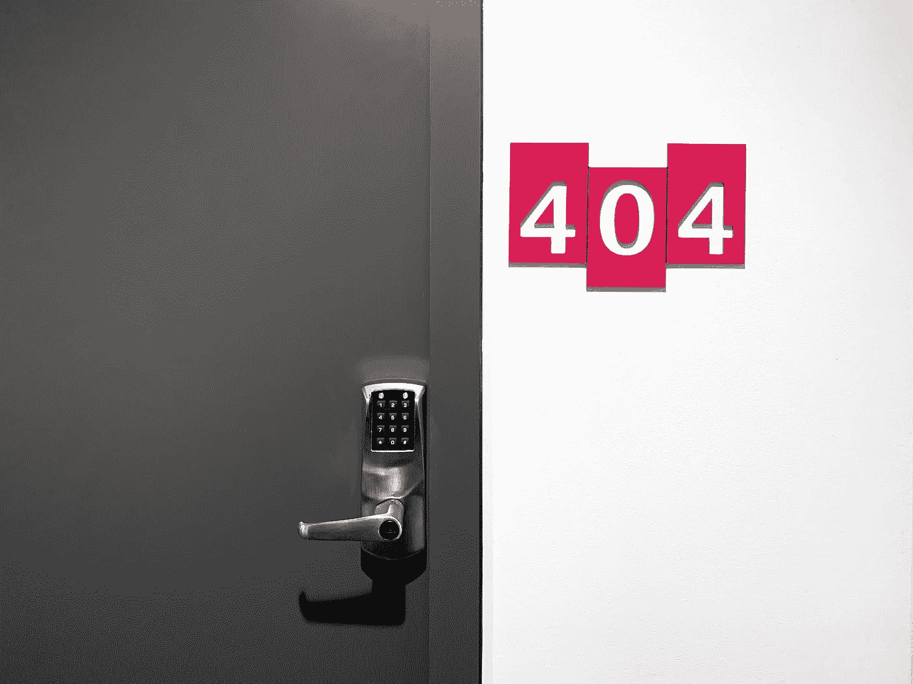
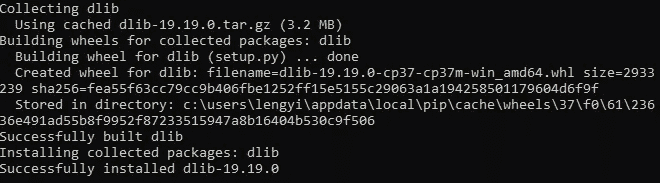

# 如何在 Windows 10 中安装 Python 的 dlib 库

> 原文：<https://medium.com/analytics-vidhya/how-to-install-dlib-library-for-python-in-windows-10-57348ba1117f?source=collection_archive---------0----------------------->

嗨！这是我的第一篇英文博客*(或者文章取决于你怎么称呼)* **。无论如何，我写这篇博客是因为我已经面临这个包的麻烦有一段时间了。我试图在谷歌上搜索解决方案，但我找不到替代方案。所以！这是我在 Windows 10 中安装 **dlib 库**的解决方案。**



有些人可能会说，为什么不使用已经编译好的 conda install 呢？安装起来要容易得多。嗯…我同意，我能做到。**然而，**其他的包，比如`face_recognition`在你使用`conda install`的时候无法利用`dlib`。因此，我们需要使用`pip install`。

## 准备

先说第一件事，有两件事需要**(真的真的需要！)**。

*   **CMake:** 这是因为 dlib 是用基于 C 的编程语言开发的，所以它需要这个程序来使用它。可以在[https://cmake.org/download/](https://cmake.org/download/)的链接中找到。为了确保与您的操作系统匹配，在我们的情况下是 Windows 10 64 位版本。


选择作为您正在使用的操作系统

*   正如我之前提到的，dlib 是基于 C 的编程语言。另一个真正需要的是编译器。Visual studio 可以在 https://visualstudio.microsoft.com/visual-cpp-build-tools/的[链接下载。完成安装后，您需要安装 C、C++编程的附加包，即**包 CMake tools for Windows**](https://visualstudio.microsoft.com/visual-cpp-build-tools/)


确保您在红色框中选择了

## 注意

有时我们需要为 CMake 管理 Windows 路径环境。(如果您已经在安装过程中添加了，则可以跳过这一部分)。

要检查路径是否已经添加，您可以通过进入这台电脑>属性>高级系统设置进入 Windows 上的环境变量。然后，转到标签**高级**并点击**环境变量**。

另一个窗口将弹出，并点击编辑…


如果您无法找到 CMake 路径，您应该添加 CMake 安装目录，如下图所示。


## 安装

到目前为止一切都很好。现在我们可以将 dlib 安装到我们的 python 环境中。首先，你需要安装 CMake 库。

```
pip install cmake
```

然后，您可以使用`pip install`安装 dlib 库。

```
pip install dlib
```

通过 enter 后，您的笔记本电脑或台式机将运行 C，C++编译器。如果你得到了类似下图的东西，你会没事的。


C，C++用于程序兼容



嘣！你能行的！

做完这些，你就可以通过不使用`conda install`编译器在你的 Windows 10 上安装 dilb 了。

进一步讨论或任何人想与我联系。我们可以通过下面的链接来做。

 [## sasiwut chaiyade cha-EY 高级顾问| LinkedIn

### Sasiwut 是泰国 EY 公司从事绩效改进(PI)的高级顾问。目前，主要重点是…

www.linkedin.com](https://www.linkedin.com/in/sasiwut-chaiyadecha/) 

下次见！