# 如何在 Ubuntu 18.04/ 19.10 & Ubuntu 16.04 上安装 IntelliJ IDEA！

> 原文：<https://medium.com/analytics-vidhya/how-to-install-intellij-idea-on-ubuntu-18-04-19-10-ubuntu-16-04-5bc45bb6c022?source=collection_archive---------13----------------------->

**注意:-** 在开始在你的 Ubuntu 机器上安装 IntelliJ IDEA 进程之前，你必须确认 **java/Scala** 都应该安装在我们的系统上。

[IntelliJ IDEA](https://www.jetbrains.com/) 是一个面向 Scala 开发的集成开发环境。值得注意的是，Google 使用 IntelliJ IDEA 作为其 Android Studio 的基础，这是一个用于开发 Android 应用程序的开源 Android 开发 IDE。它由 **JetBrains** 开发，有两个版本，**社区**和**终极**。

[IntelliJ IDEA](https://www.jetbrains.com/) 是用于 JVM 和 Android 开发的全功能 IDE。它内置了调试支持， **Docker** 和 **Docker Compose** 支持，嵌入了 **Git 控件**，集成了主要的构建自动化工具如 **Maven** 和 **Gradle** ，语法高亮，代码完成， **ssh** 终端，代码重构，以及丰富的导航功能。

T *这里有几个只在* ***旗舰版*** *支持的语言和技术。在安装 IntelliJ IDEA 之前，请比较社区版和旗舰版，并决定哪一个适合您的需要。*

**系统要求:**
*最低 2 GB RAM，4 GB RAM 推荐
2.5 GB 磁盘空间。SSD 推荐
1024×768 最小屏幕分辨率*

**安装 IntelliJ 理念:-**

最简单的方法是在 Ubuntu 18.04 上安装 IntelliJ IDEA，你必须打开 Firefox 浏览器，搜索下面的链接。

 [## 下载 IntelliJ IDEA:JetBrains 为专业开发人员提供的 Java IDE

### 我们注意到您的网络浏览器禁用了 JavaScript。请启用 JavaScript 以便利用…

www.jetbrains.com](https://www.jetbrains.com/idea/download/#section=linux) 

根据我们的操作系统，您可以选择 IntelliJ IDEA 社区版。一旦你点击下载按钮，它会要求保存文件如下，你可以保存 **.tar.gz** 文件在所需的位置。

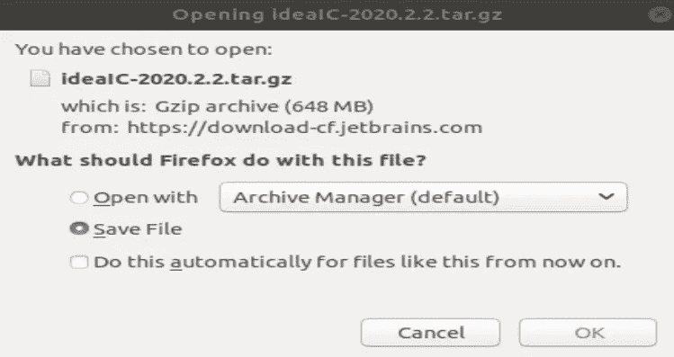

我用外部截屏工具从我的 Ubuntu 机器上拍摄这个截屏。

或者您也可以在输入以下代码后从终端下载。

https://www.jetbrains.com/idea/download

下载 tar.gz 文件后，你必须在特定的位置解压文件。你可以参考下面的截图供你参考。

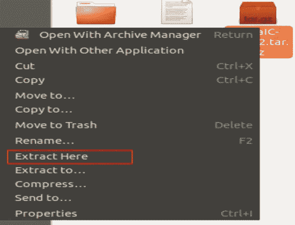

解压文件后，你需要进入 **bin 文件夹，**点击鼠标右键后打开终端，输入以下代码后，启动 **.idea.sh** 文件。

*~/Downloads/idea IC-2020.2/idea-IC-202.6397 . 94/bin $****。/idea . sh***

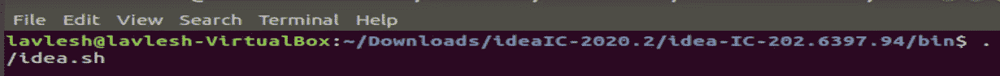

选择确认复选框以接受隐私，然后单击继续按钮。

在下一个屏幕上，您可以自定义 IntelliJ IDEA 安装。选择 IntelliJ IDEA 界面的主题。

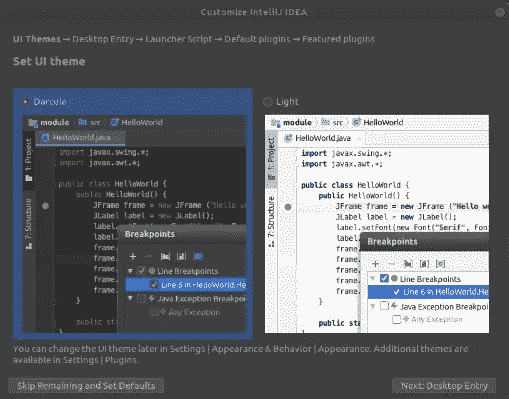

你需要选择你选择的布局。

创建一个桌面条目，从系统应用程序菜单启动应用程序。

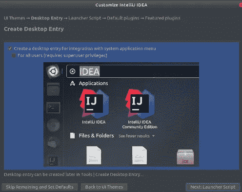

根据您的要求启用或禁用默认插件。

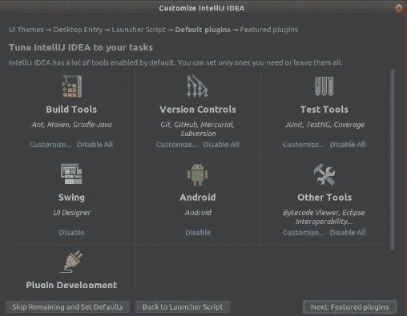

如果对你有用，考虑安装 IntelliJ IDEA 特色插件。否则，如果您不想安装它们，可以跳过。

点击**开始使用 IntelliJ IDEA。**

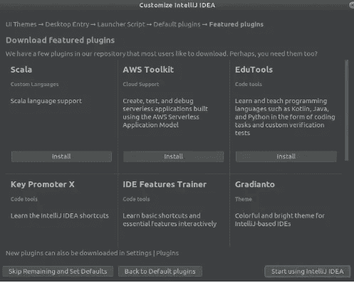

如果 IntelliJ IDEA 向导要求完成安装，请输入您的密码。

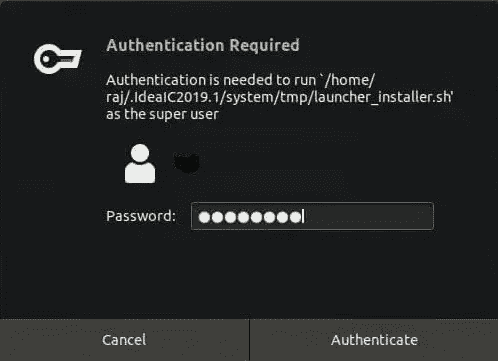

我隐藏了我的用户名，在你的情况下，你可以看到你的用户名。

# 用 Scala 语言创建新项目:-

Scala 插件用于将一个普通的 IntelliJ 思想转化为一个方便的 Scala 开发环境。在本文中，我们将讨论如何为 IntelliJ IDEA IDE 设置 Scala 插件。如果你没有 IntelliJ IDEA，你可以从这里下载。

默认情况下，IntelliJ IDEA 没有 Scala 特性。Scala Plugin 增加 Scala 特性意味着我们可以创建 Scala/Play 项目，我们可以创建 Scala 应用程序、Scala 工作表等等。

Scala 插件包含以下技术:

*   斯卡拉
*   游戏框架
*   SBT
*   Scala.js

> 跟随 JetBrains 快速教程，学习如何创建你的第一个 Scala 应用。
> 
> 它支持三种流行的操作系统环境:Windows、Mac 和 Linux。

## 为 IntelliJ IDE 设置 Scala 插件:-

1-打开 IntelliJ IDE。

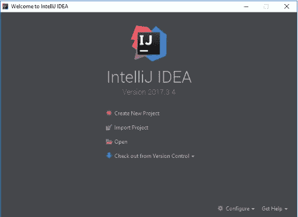

2-转到右下角的“配置”,单击下拉列表中的“插件”选项，如下所示:

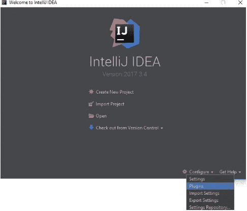

3-这将打开插件窗口，如下所示。

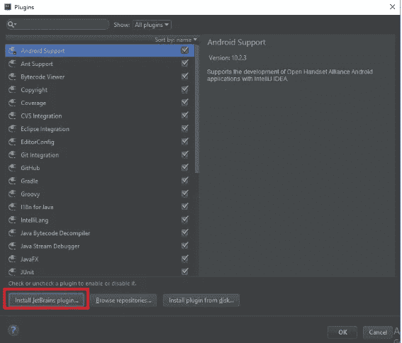

4-现在单击 InstallJetbrainsplugins，如前面的屏幕截图所示。

5-接下来，在搜索栏中键入单词 Scala 来查看 ScalaPlugin，如下所示。

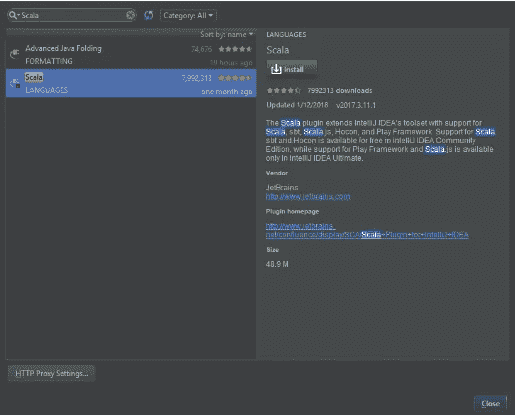

6-点击安装按钮安装 IntelliJ IDEA 的 Scala 插件。
7-对于 Scala 项目，您需要选择 Scala 并点击下一步。

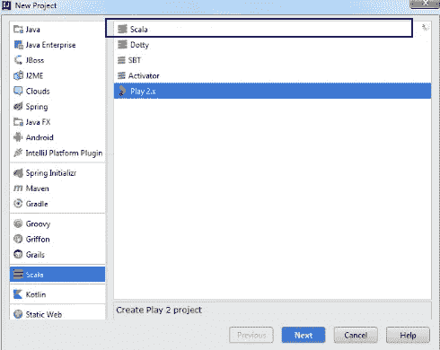

8-一旦你进入编辑器页面，你会得到默认的项目结构，如项目->src->main->Scala。选择 Scala 后，你可以创建你的第一个 Scala 对象。请参考下面的屏幕截图。

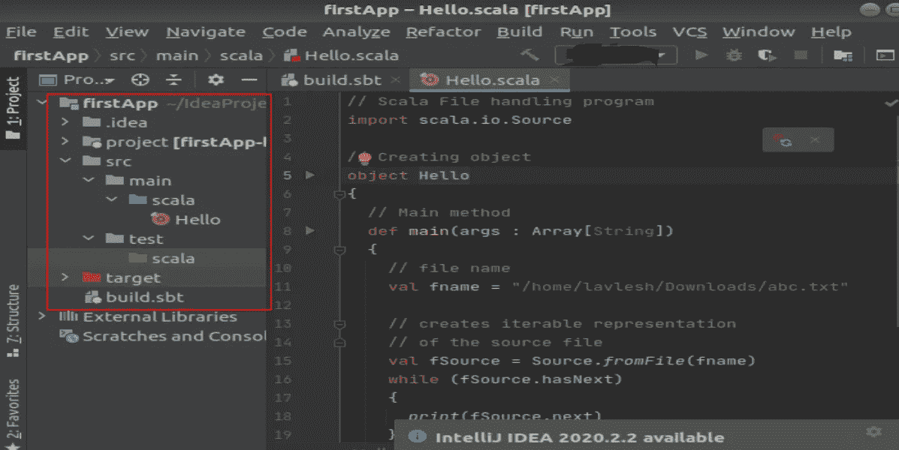

> **总之，**我们对 Scala Plugin 有了一个了解，并介绍了 Scala Plugin for IntelliJ 的安装步骤。

如果你想看我之前的关于 Scala 语言的帖子，点击吹链接。

[*https://medium . com/@ duke . lavlesh/installing-Scala-SBT-on-Ubuntu-part-3-FD 08 FEC 70946？source = friends _ link&sk = 43f 139d 25 e 908 c 440 bb 01850 dcaa 17 c 2*](/@duke.lavlesh/installing-scala-sbt-on-ubuntu-part-3-fd08fec70946?source=friends_link&sk=43f139d25e908c440bb01850dcaa17c2)

> 感谢阅读！如果你喜欢这个帖子……
> 你可以在 [Medium](/@duke.lavlesh) 上关注我以获得更多类似的帖子。