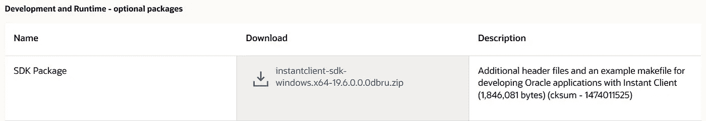
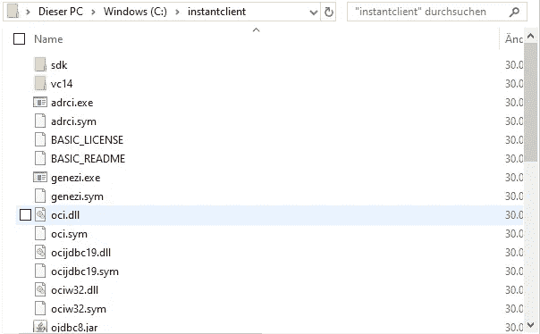
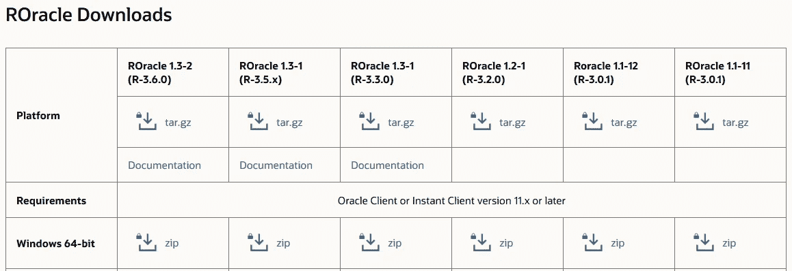
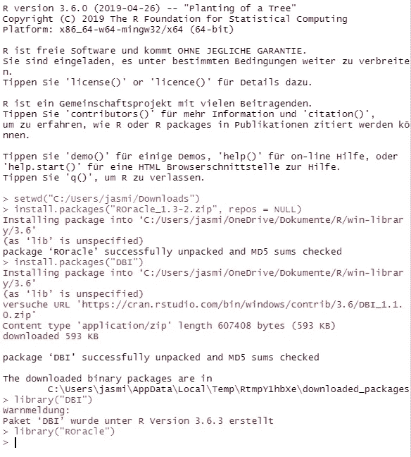
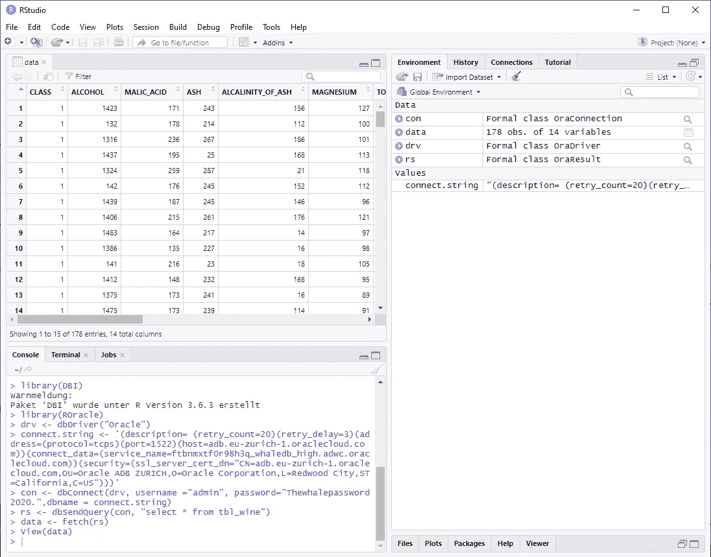
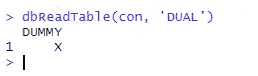

# 如何在 Windows 10 上安装 ROracle

> 原文：<https://medium.com/analytics-vidhya/how-to-install-roracle-on-windows-10-144b0b923dac?source=collection_archive---------5----------------------->


Bild von[stock snap](https://pixabay.com/de/users/StockSnap-894430/?utm_source=link-attribution&utm_medium=referral&utm_campaign=image&utm_content=2617112)auf[pix abay](https://pixabay.com/de/?utm_source=link-attribution&utm_medium=referral&utm_campaign=image&utm_content=2617112)

**对于数据分析，有一个大的数据集比较方便。为了有效地处理数据，最好将数据保留在数据库中。本文展示了如何将 RStudio 与 ROracle 和 Oracle 自治数据库一起安装。**

要开始安装，您必须了解您的本地体系结构—32 位或 64 位。本指南使用 64 位安装文件。

## 👩‍💻即时客户端和 SDK

首先，下载适合您架构的**基础** [**oracle 即时客户端**](https://www.oracle.com/database/technologies/instant-client/downloads.html) 。

您还需要下载与您的基本即时客户端版本匹配的 [**即时客户端 SDK**](https://www.oracle.com/database/technologies/instant-client/winx64-64-downloads.html) 。这里我们用的是 19.6.0 版本。



Oracle Instant Client SDK 软件包—开发和运行时—可选软件包

📁提取两个下载的 ZIP 文件，并将即时客户端 SDK 中的 SDK 目录放在提取的基本即时客户端目录的子目录中，与 vc14 文件夹处于同一级别。目标结构的屏幕截图如下所示。⏬



instant client 中 SDK 的文件夹—与 vc14 文件夹在同一层

将组装的即时客户端目录复制到`C:\instantclient` 或您喜欢的另一个路径。

## 🔨RTools

下载并安装 [RTools](https://cran.r-project.org/bin/windows/Rtools/) 。

 [## 在 Windows 上使用 Rtools40

### 从 R 4 . 0 . 0(2020 年 4 月发布)开始，R for Windows 使用了一个名为 rtools40 的全新工具链包。这个…

cran.r-project.org](https://cran.r-project.org/bin/windows/Rtools/) 

## 👛钱包

下载你的钱包，解压并复制到即时客户端或你喜欢的其他路径。

```
C:\instantclient\wallet\whaleDB
```


即时客户端目录中的钱包文件夹

## 🌍环境变量

🧙‍♂️Set `OCI_LIB`取决于你的架构是 64 位还是 32 位。

```
OCI_LIB64 = C:\instantclient
OCI_LIB32 = C:\instantclient
```

🧙‍♂️Set `OCI_INC`到 SDK-include 文件夹，而`ORACLE_HOME`到您的 instantclient，如果您没有另一个本地 Oracle 安装。

```
OCI_INC = C:\instantclient\sdk\include
ORACLE_HOME = C:\instantclient
```

🧙‍♂️Set `TNS_ADMIN`到你提取钱包的位置。

```
TNS_ADMIN = C:\instantclient\wallet\whaleDB
```

🧙‍♂️Set `RTOOLS40_HOME`到你的 RTools 安装的位置。

```
RTOOLS40_HOME = C:\rtools40
```

🧙‍♂️Set 变量`PATH`包含了`oci.dll` 的位置，它通常位于即时客户端的顶层。对于这个例子，路径应该是`C:\instantclient`。

## 🎬RStudio

现在下载并安装 [RStudio](https://rstudio.com/products/rstudio/download/#download) 。在此设置中，使用了 RStudio Desktop 1.3.959 的免费版本。

[](https://rstudio.com/products/rstudio/download/#download) [## 下载 RStudio

### RStudio 是一套集成工具，旨在帮助您更高效地使用 r。它包括一个控制台…

rstudio.com](https://rstudio.com/products/rstudio/download/#download) 

当您启动 RStudio 时，您可以使用以下命令检查环境变量是否设置正确。⏬

```
R.home(component = "home")
Sys.getenv("PATH")
Sys.getenv("OCI_INC")
Sys.getenv("OCI_LIB64")
Sys.getenv("ORACLE_HOME")
Sys.getenv("TNS_ADMIN")
```

如果您必须更改环境变量，则需要在更改生效之前重新启动 RStudio。💨

## 🧮河

现在安装 R 的[版本 3.6.0。并非所有的 R 版本都与 ROracle 版本兼容。兼容版本列在每个 ROracle 版本下的 ROracle 下载页面上(见下面的截图)。](https://cran.r-project.org/bin/windows/base/old/3.6.0/)

 [## 下载适用于 Windows 的 R-3.6.0。统计计算的 R 项目。

### 如果你想再次检查你下载的包是否与 CRAN 发布的包匹配，你可以…

cran.r-project.org](https://cran.r-project.org/bin/windows/base/old/3.6.0/) 

## 📄ROracle

下载与 r 版本 3.6.0 兼容的 ROracle 版本[1.3–2 的 ZIP 文件。](https://www.oracle.com/database/technologies/roracle-downloads.html)

 [## ROracle 下载

### 未找到结果您的搜索没有匹配任何结果。我们建议您尝试以下方法来帮助找到您想要的…

www.oracle.com](https://www.oracle.com/database/technologies/roracle-downloads.html) 

ROracle 下载及其与 R 版本的兼容性

要安装 ROracle，请进入 RStudio 并执行以下命令。

💬首先将 RStudio 的当前工作目录设置为存储 ROracle ZIP 文件的路径。

```
setwd("C:/Users/me/Downloads")
install.packages("ROracle_1.3-2.zip",repos = NULL)
install.packages("DBI")
library("DBI")
library("ROracle")
```

切换到正确的目录后，安装 ROracle 包。如果一切设置正确，您应该在 RStudio 中看到以下输出。



在 RStudio 中成功安装 ROracle

# 🔁连接到您的云数据库

若要检查您是否拥有所有正确的凭据，请使用 SQLDeveloper 或其他 IDE 检查您的数据库连接。

📝编辑`sqlnet.ora`文件来包含你的钱包位置。

```
WALLET_LOCATION = (SOURCE = (METHOD = file) (METHOD_DATA = (DIRECTORY="C:\instantclient\wallet\whaleDB")))
SSL_SERVER_DN_MATCH=yes
```

📋转到 wallet 中的 tnsnames.ora 文件，复制要使用的连接字符串(或以 _high 结尾的字符串),并替换以下查询中的`' '`之间的字符串:

```
connect.string <- '(description= (retry_count=20)(retry_delay=3)(address=(protocol=tcps)(port=1522)(host=adb.eu-zurich-1.oraclecloud.com))(connect_data=(service_name=ftbnmxtf0r98h3q_whaledb_high.adwc.oraclecloud.com))(security=(ssl_server_cert_dn="CN=adb.eu-zurich-1.oraclecloud.com,OU=Oracle ADB ZURICH,O=Oracle Corporation,L=Redwood City,ST=California,C=US")))'
```

第二个(更简单的)解决方案是使用 tnsnames.ora 中的连接字符串别名。

```
connect.string <- 'whaledb_high'
```

🔀打开 RStudio 并输入以下命令来设置连接。

```
library(DBI)
library(ROracle)
drv <- dbDriver("Oracle")
connect.string <- 'whaledb_high'
```

❔Then 使用`dbConnect`命令连接到您的 oracle 数据库。

```
con <- dbConnect(drv, username ="admin", password="YourSecretPassword.",dbname = connect.string)
```

❓创建一个简单的查询来测试连接是否工作:

```
rs <- dbSendQuery(con, "select * from tbl_wine")
data <- fetch(rs)
View(data)
```

如果您的数据库中还没有任何数据，您也可以使用`dbReadTable`测试连接。

```
dbReadTable(con, 'DUAL')
```



设置从 RStudio 到 ADB 的连接



使用空数据库测试数据库连接—使用 DUAL 表

如果您在执行 ROracle 命令时遇到问题，请尝试以管理员身份运行 RStudio。

# 摘要

➡️在 rstudion 中安装 ROracle 并设置本地环境来使用云数据库并不容易。💬我希望本安装指南能够帮助其他人在开始使用 R 和 Oracle 数据库时节省大量时间。

请用你的掌声支持这篇文章👏👏👏帮助它传播给更广泛的受众。💭如果你对这个主题有任何想法或问题，请随时联系我！我在推特上→ @ [jasminfluri](https://twitter.com/jasminfluri)

# 来源/参考

【https://cran.r-project.org/web/packages/ROracle/ROracle.pdf 

[https://download.oracle.com/otn/nt/roracle/ROracle.pdf](https://download.oracle.com/otn/nt/roracle/ROracle.pdf)

[](https://technology.amis.nl/2017/08/23/r-and-the-oracle-database-using-dplyr-dbplyr-with-roracle-on-windows-10/) [## r 和 Oracle 数据库:在 Windows 10 上使用 dplyr / dbplyr 和 ROracle-AMIS，数据驱动博客

### r 广泛使用数据。数据通常驻留在数据库中。在这篇博客中，我将介绍如何安装和使用 dplyr…

技术. amis.nl](https://technology.amis.nl/2017/08/23/r-and-the-oracle-database-using-dplyr-dbplyr-with-roracle-on-windows-10/)  [## 下载适用于 Windows 的 R-3.6.0。统计计算的 R 项目。

### 如果你想再次检查你下载的包是否与 CRAN 发布的包匹配，你可以…

cran.r-project.org](https://cran.r-project.org/bin/windows/base/old/3.6.0/) [](https://rstudio.com/products/rstudio/download/#download) [## 下载 RStudio

### RStudio 是一套集成工具，旨在帮助您更高效地使用 r。它包括一个控制台…

rstudio.com](https://rstudio.com/products/rstudio/download/#download)  [## Microsoft Windows 即时客户端(x64) 64 位

### 未找到结果您的搜索没有匹配任何结果。我们建议您尝试以下方法来帮助找到您想要的…

www.oracle.com](https://www.oracle.com/database/technologies/instant-client/winx64-64-downloads.html)  [## 在 Windows 上使用 Rtools40

### 从 R 4 . 0 . 0(2020 年 4 月发布)开始，R for Windows 使用了一个名为 rtools40 的全新工具链包。这个…

cran.r-project.org](https://cran.r-project.org/bin/windows/Rtools/)