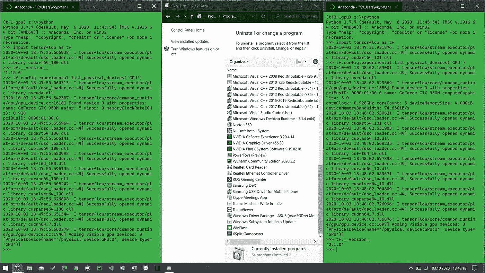
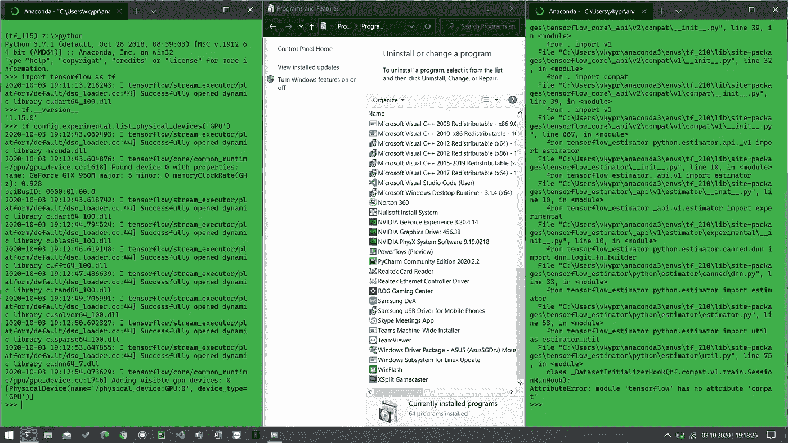
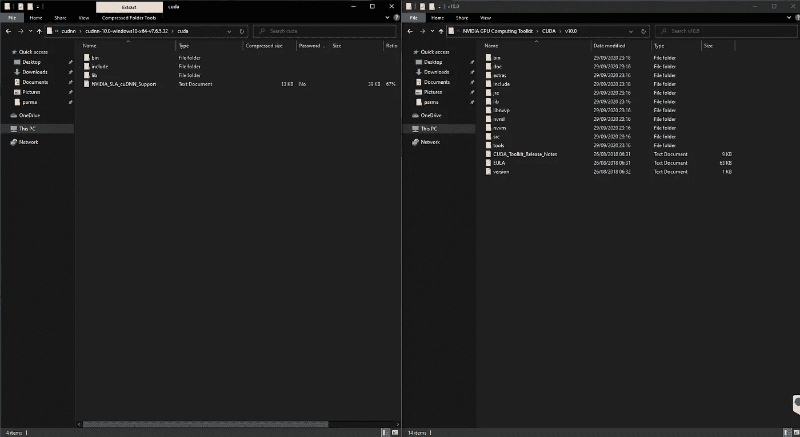
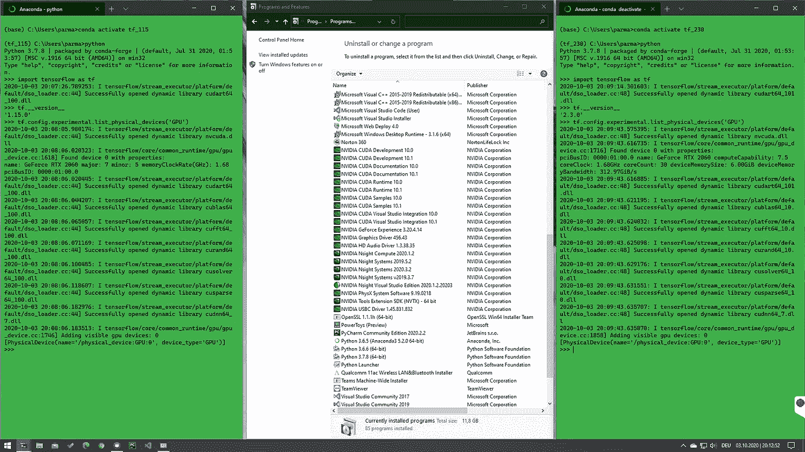

# 如何在 Windows 10 上安装 TensorFlow、cuda-toolkit、cudnn？

> 原文：<https://medium.com/analytics-vidhya/how-to-install-tensorflow-cuda-toolkit-and-cudnn-on-windows-10-9efa075b448c?source=collection_archive---------4----------------------->

## 让 TensorFlow 与 GPU 协同工作的分步指南。


在 [Unsplash](https://unsplash.com?utm_source=medium&utm_medium=referral) 上由[娜娜杜瓦](https://unsplash.com/@nanadua11?utm_source=medium&utm_medium=referral)拍摄的照片

# 介绍

我个人使用 Anaconda 作为我的 *goto* Python 发行版。因此，我选择的包管理器是 ***conda*** 。直到大约一个月前，我所要做的就是让 TensorFlow 与 GPU 一起工作:*conda install tensor flow-GPU = version *。*我确实用上面的命令行安装了 TensorFlow-GPU 1.15 和 2.1.0，运行起来完美无缺。下图向我们展示了这一点。



TensorFlow v1.15.0 和 v2.1.0 使用 GPU，无需手动安装 cuda-toolkit 和 cudnn

从*程序和功能*窗口可以看到，没有手动安装 cuda-toolkit 的组件。*康达*以前是在环境本身做的。因此，当我写 [*我以前的文章*](/analytics-vidhya/comparing-gpu-performance-for-deep-learning-between-pop-os-ubuntu-and-windows-69aa3973cc1f?source=friends_link&sk=1039650505eec776dbd5e186f3f5910b) 时，我试图在我的机器学习平台上以同样的方式安装它。它抛出了一个如下所示的错误(因为我已经在我的钻机上安装了它，所以我在我的笔记本电脑上重新创建了这个错误)。



导入 tf 版本 2.1.0 时出错

它证明 TensorFlow v1.15 仍然可以检测到我的 GPU，但当我试图使用 v2.1.0 时，我抛出了一个错误。我谷歌了一下，大多数答案导致我手动安装 cuda-toolkit 和 cudnn。由于许多人认为在 Windows 上运行这个程序很麻烦，所以我决定写一个循序渐进的指南。

当 cuda-toolkit 和 cudnn 版本与 TensorFlow 版本的要求不匹配时，我还得到一个错误。你可以在这里 *(查看已测试的构建配置)*阅读更多关于哪个版本的 TensorFlow 需要哪个版本的 cuda-toolkit 和 cudnn [*。*](https://www.tensorflow.org/install/source_windows)

# 所以让我们开始吧。

## 第一步

检查您是否有支持 Cuda 的显卡。点击 可以找到一个列表 [*。如果是，您需要将显卡驱动程序更新到 418.x 版或更高版本。可以从*](https://developer.nvidia.com/cuda-gpus) *[*Nvidia 的网站*](https://www.nvidia.com/download/index.aspx?lang=en-us) 手动下载驱动或者使用 [*GeForce 体验*](https://www.nvidia.com/de-de/geforce/geforce-experience/) 。*

## 第二步

安装 cuda 工具包。你可以在 [*这个档案*](https://developer.nvidia.com/cuda-toolkit-archive) 里找到所有版本。

*   首先，决定你想要哪个版本的 TensorFlow。
*   看这里的[](https://www.tensorflow.org/install/source_windows)**你将需要一个测试版的工具包。**
*   **下载那个版本。您可以下载并安装多个版本。**

**(我下载了 v10.0 和 v 10.1-更新 2)**

**在安装 cuda-toolkit 之前，您还需要安装 Visual Studio。安装 [*VS 2017*](https://visualstudio.microsoft.com/vs/older-downloads/) 。安装 Visual Studio 之后，像其他任何正常安装一样安装 cuda-toolkit。**

## **第三步**

**下载适合您的 cuda 版本的 cudnn。你将需要一个开发者帐户来做到这一点。如果没有，请创建一个。可以从 [*这里*](https://developer.nvidia.com/rdp/cudnn-archive) 下载。您将下载一个 zip 文件。如果您选择默认设置，您的 cuda 工具包将安装在下面的路径中。**

```
**C:\Program Files\NVIDIA GPU Computing Toolkit\CUDA\v10.1**
```

****

**Cudnn**

**将 cudnn zip 中的文件复制到 cuda-toolkit 安装中相应的文件夹中。也就是说，**

```
**from the bin folder in your zip file to C:\Program Files\NVIDIA GPU Computing Toolkit\CUDA\v10.1\bin\
from the include folder in zip to C:\Program Files\NVIDIA GPU Computing Toolkit\CUDA\v10.1\include\
and
from the lib\x64 to C:\Program Files\NVIDIA GPU Computing Toolkit\CUDA\v10.1\lib\x64\**
```

## **第四步**

**将所有 cuda-toolkit 版本添加到 path 变量中。为此，请打开命令提示符并键入以下命令-**

```
**SET PATH=C:\Program Files\NVIDIA GPU Computing Toolkit\CUDA\v10.1\bin;%PATH%
SET PATH=C:\Program Files\NVIDIA GPU Computing Toolkit\CUDA\v10.1\extras\CUPTI\lib64;%PATH%
SET PATH=C:\Program Files\NVIDIA GPU Computing Toolkit\CUDA\v10.1\include;%PATH%**
```

**确保对所有已安装的版本都这样做。因此，在我的例子中，我也添加了下面的命令。**

```
**SET PATH=C:\Program Files\NVIDIA GPU Computing Toolkit\CUDA\v10.0\bin;%PATH%
SET PATH=C:\Program Files\NVIDIA GPU Computing Toolkit\CUDA\v10.0\extras\CUPTI\lib64;%PATH%
SET PATH=C:\Program Files\NVIDIA GPU Computing Toolkit\CUDA\v10.0\include;%PATH%**
```

## **第五步**

**现在是时候安装 TensorFlow 了。使用 pip 创建一个新环境并安装 TensorFlow。我用 pip 是因为 TensorFlow 推荐，而 conda 只有 2.1.0 以上的版本，而 pip 有 2.3.1。**

```
**conda create --name env_name
conda install python=3.7 -y
pip install tensorflow-gpu==version***
```

## **就是这样。你可以走了。现在你可以在你的 GPU 上训练你的模型。**

****

**TensorFlow 使用 GPU，手动安装 cuda-toolkit 和 cudnn**

****奖励**:你可以使用动态模式进行训练，也可以分配特定数量的 GPU 内存。您可以通过在脚本中添加以下几行来实现这一点。**

```
**# Dynamic memory by allowing memory growth
physical_devices = tf.config.experimental.list_physical_devices('GPU')
for physical_device in physical_devices:
  tf.config.experimental.set_memory_growth(physical_device, True)# Static by allocating fixed amount of memory
gpu_mem = 6
gpus = tf.config.experimental.list_physical_devices('GPU')# The variable GB is the memory size you want to use.
config = [tf.config.experimental.VirtualDeviceConfiguration(memory_limit=(1024 * gpu_mem))]
if gpus:    # Restrict TensorFlow to only allocate 1*X GB of memory on the first GPU    
  try:         
    tf.config.experimental.set_virtual_device_configuration(gpus[0], config)        
    logical_gpus = tf.config.experimental.list_logical_devices('GPU')         
    print(len(gpus), "Physical GPUs,", len(logical_gpus), "Logical GPUs")    
  except RuntimeError as e:        
    # Virtual devices must be set before GPUs have been initialized           
    print(e)**
```

## **我希望这在某种程度上帮助了你。祝你训练模特愉快。**