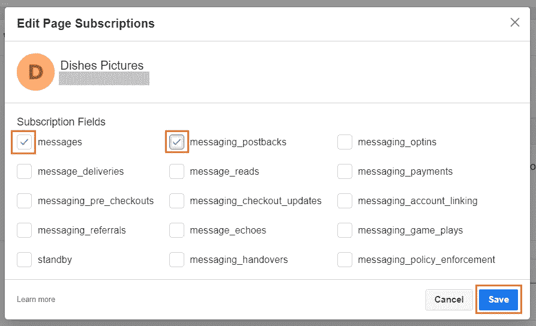
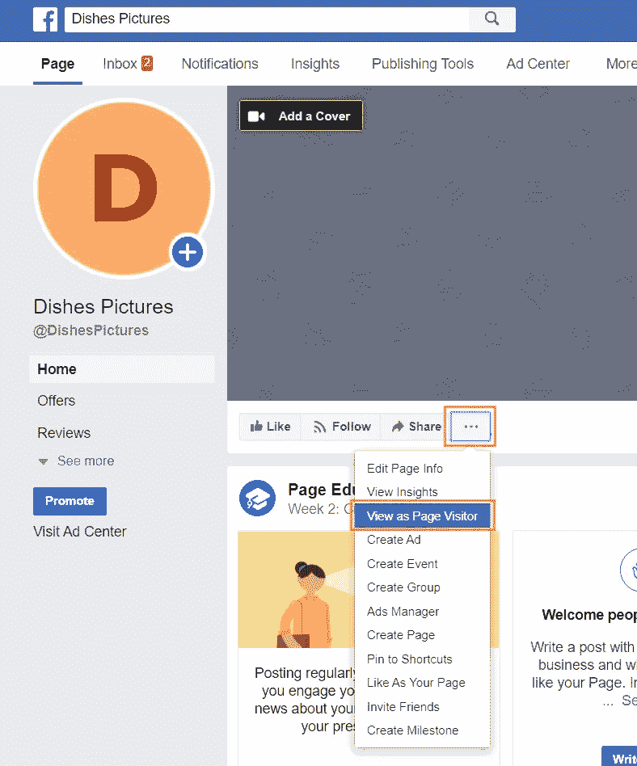
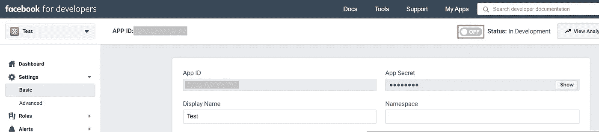

# 如何将 DialogFlow 集成到 Facebook Messenger 中

> 原文：<https://medium.com/analytics-vidhya/how-to-integrate-dialogflow-to-facebook-messenger-df2733ef7094?source=collection_archive---------14----------------------->

对于没有编程背景的首次 DialogFlow 聊天机器人构建者来说，这是一个快速简单的分步指南，可以帮助他们将 DialogFlow 聊天机器人集成到 Facebook Messenger。

为了给你的代理设置脸书集成，你需要[一个脸书账户](https://www.facebook.com/)和 [DialogFlow](https://dialogflow.com/) 代理。在这里，我们将继续假设您已经拥有它们。

## 创建脸书应用程序

1.  登录[脸书开发者控制台](https://developers.facebook.com/)。
2.  点击右上角的**我的应用**。
3.  点击**创建应用**

点击**我的应用**，然后**创建应用**(用橙色标记)

4.输入应用程序的名称和联系电子邮件地址

5.点击**创建应用 ID**

在弹出的部分输入**姓名**和**邮箱**，然后点击**创建 App ID** (用橙色标记)

6.在下一页的左侧，点击**产品**旁边的添加按钮

7.在**添加产品**部分的**信使**卡中点击**设置**

点击 **+** 图标，然后点击**设置**

8.在下一页中，滚动至**访问令牌**

9.(如果您正在将您的聊天机器人连接到现有页面，请跳过此步骤)
如果您想要将您的聊天机器人连接到新的脸书页面，请点击**创建新页面**，它会将您带到一个新标签页。
按照说明创建新的脸书页面

向下滚动到**访问令牌**部分，然后点击**创建新页面**

10.返回脸书开发者控制台标签，点击**添加或删除页面**添加脸书页面

11.按照弹出窗口确认脸书帐户，然后选择您想要连接聊天机器人的脸书页面

向下滚动到**访问令牌**部分，然后点击**添加或删除页面**

12.点击**生成令牌**生成访问令牌。

13.阅读完信息后，勾选**我理解**框，然后点击**复制**，并**完成**

勾选**我明白**框→点击**复制** →点击**完成**

## 设置对话流

1.  在新选项卡中打开[对话流控制台](https://dialogflow.cloud.google.com/)
2.  选择您想要连接到 Facebook Messenger 的代理
3.  点击左侧菜单中的**集成**选项，并点击打开 **Facebook Messenger**

选择代理，进入**集成**，然后点击打开 Facebook Messenger

4.在打开的对话框中，输入以下信息:

*   **验证令牌** —您可以将任何字符串指定为自己的验证令牌
*   **页面访问令牌** —粘贴我们刚刚复制的脸书开发人员控制台中生成的令牌

5.点击**开始**

创建**验证令牌**，从我们刚刚复制的脸书控制台粘贴**页面访问令牌**，然后点击**开始**

6.点击**回拨网址**中的复制图标，复制网址

## Webhook 配置

1.  返回脸书开发者控制台选项卡
2.  点击 **Webhooks** 部分下的**添加回调 URL** 按钮(就在访问令牌部分下)

点击 **Webhooks** 部分下的**添加回调 URL** 按钮

3.在打开的对话框中，输入以下信息:

*   **回调 URL** —粘贴我们刚刚复制的 DialogFlow 控制台上提供的 URL
*   **验证令牌** —您刚刚在 DialogFlow 控制台中创建的令牌

4.点击**验证并保存**

输入**回调 URL** 、**验证令牌**，然后点击**验证并保存**

5.点击**添加订阅**

点击**添加订阅**

6.检查**订阅字段**下的**消息**和**消息 _ 回发**，然后点击**保存**

检查**消息**和**消息传递 _ 回发**，然后点击**保存**

## 测试

1.  打开[脸书](https://www.facebook.com/)
2.  单击脸书右上角的箭头图标，打开您的脸书页面。它应该在**您的页面**部分列出，或者点击**查看更多……**找到它。

3.点击**共享**右侧的 **…** 按钮，选择**作为页面访问者查看**

4.点击**发送消息**，应弹出消息框。

你的聊天机器人应该已经启动并运行了！恭喜你！:-)

## 公开它

现在你的聊天机器人为你工作了…但只为你。
除非公开，否则无法回复其他访客。
如果您想要发布您的机器人，请遵循以下步骤:

1.  返回脸书开发者控制台选项卡
2.  输入**隐私政策网址** (如果你需要一个，网上有一些隐私政策网址生成器。[这里的](https://www.privacypolicies.com/)是我用过的。)
3.  选择一个**类别**
4.  点击**保存更改**

5.点击工具栏上的开关，将聊天机器人切换到实时模式

6.抱歉，还没完成…

你可能会认为和**状态上的绿色小**: Live**意味着它已经向所有访问者发布了，但事实并非如此。**

不幸的是，点击发布按钮将**而不是**公开你的机器人。您需要将您的 Messenger 应用程序提交给脸书进行审核，以便真正将其公开。这是脸书的投稿指南。一旦得到脸书的批准，你的聊天机器人应该可以在你的脸书页面信使上为所有的访问者流畅地工作！

*参考:* [*谷歌指南*](https://cloud.google.com/dialogflow/docs/integrations/facebook)[*博文—“用 Nodejs 和标准库 10 分钟打造个人 Facebook Messenger Bot*](https://hackernoon.com/build-a-personal-facebook-messenger-bot-in-10-minutes-a7a237f3f018)*”* [*GitHub—“Facebook Messenger Bot 只回复我，不回复我页面上的其他人”*](https://github.com/microsoft/botframework-sdk/issues/1465)