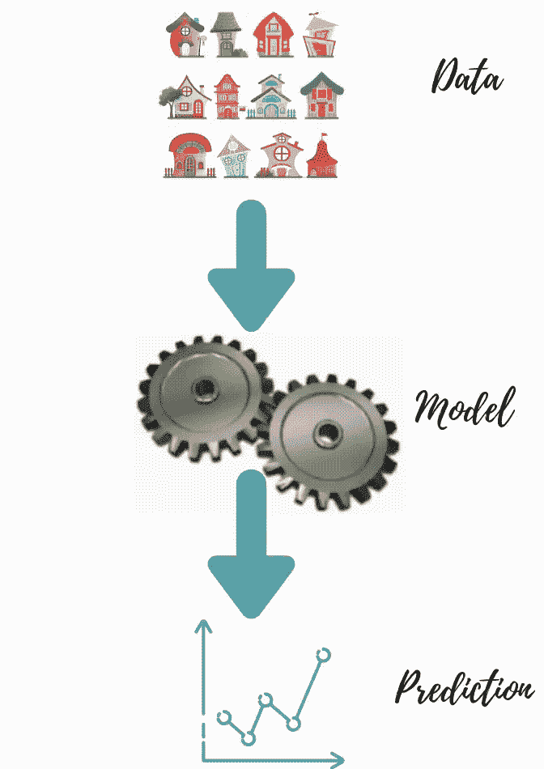
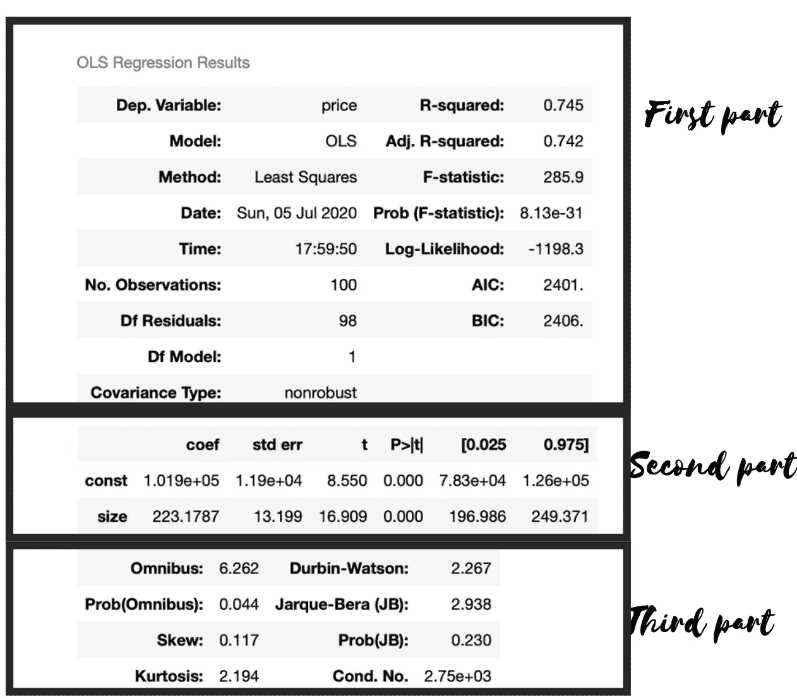

# OLS 口译成绩

> 原文：<https://medium.com/analytics-vidhya/how-to-interpret-result-from-linear-regression-3f7ae7679ef9?source=collection_archive---------8----------------------->

无论你是数据科学的新手，甚至是经验丰富的老手，解释机器学习算法的结果都可能是一个挑战。挑战在于理解这个模型的结果。这一结果是否意味着该模型与您用来训练它的数据配合得有多好？线性回归是用于推断和预测的最常用方法之一。但是在解释这个结果之前，人们往往会忽略 OLS 假设。因此，这是分析 OLS 发布的各种统计数据的重要一步。我将探索房价预测数据集，这是一个小而简单的数据集，包含对各种房屋特征和价格的观察。

**相关(预测)**可变价格

**自变量** -大小

# ***第一部分(车型总结)解读***

部门。变量:这里的因变量是我们将要通过模型预测的价格。

**模型:** OLS 代表普通最小二乘。**普通最小二乘法** ( **OLS** )是一种估计线性回归模型中未知参数的线性最小二乘法。OLS 通过最小二乘法原理选择一组解释变量的线性函数的参数。

**方法:最小二乘法**是回归分析中的标准方法，通过最小化残差平方和来近似求解。

**观察值数量:**数据集中存在的观察值总数

**Df 残差:**Df(残差)是样本量减去被估计的参数个数，所以变成 Df(残差)= n — (k+1)

在我们的例子中，n=100，k=1

df(残差)=98

**R-Squared:***R*2 是一个统计量，它将给出模型拟合优度的一些信息。范围从 0 到 1。在我们的例子中，R 平方的值是 0.745，因此它解释了模型解释的 74%的方差。

"***R 的平方值是多少？"*** 答将，**【看情况】**。这取决于你的目标和因变量是如何定义的。如果因变量是非平稳(如趋势)时间序列，非常接近 1 的 R 平方值可能不会给人留下深刻印象。事实上，如果 R 平方非常接近 1，并且数据由时间序列组成，这通常是一个不好的迹象:误差中通常会有显著的时间模式。另一方面，当您在大量噪声环境中寻找微弱信号时，10%或更小的 R 平方可能会提供一些信息，在这种环境中，即使是非常微弱的信号也会引起普遍关注。永远不要让自己陷入拟合回归模型的陷阱，这种回归模型看起来 R 平方不错，但实际上远不如简单的时间序列模型。

***R 平方不是底线*** *。*

**Adj. R Squared:** 每向模型中添加一个自变量， **R-squared** **增加**，即使自变量不显著。它从不减少。而**调整后的 R 平方**仅在自变量显著并影响因变量时增加。

***为回归模型选择重要预测因子(自变量)时，应使用调整后的 R-square。***

**F-统计量和概率 F-统计量:**“F 值”和“概率(F)”统计量测试回归模型的总体显著性。具体来说，他们测试了所有回归系数都等于零的零假设。F 值是平均回归平方和除以平均误差平方和的比值。其值的范围从零到任意大的数。

Prob(F)的值是完整模型的零假设为真的概率(即所有回归系数为零)。例如，如果 Prob(F)的值为 **8.13e-31** ，那么所有回归参数为零的概率几乎为零。

**AIC & BIC:** AIC 是*赤池信息标准*的缩写，用于选型。在回归方程中加入新变量的情况下，它会对错误模式产生不利影响。它被计算为参数的数量减去整个模型的可能性。较低的 AIC 意味着更好的模型。然而，BIC 代表*贝叶斯信息标准*，是 AIC 的变体，在那里惩罚更加严厉。

# ***第二部分(系数表)释义***

**系数**:这里我们有常数和大小的系数 1.019e+5 和 223.17，所以如果我说*价格*=*B0+B1 *大小*

就会得到 ***价格=(1.019 e+5)+223.17 *尺寸***

**std err:** 显示每次预测的准确性。标准差越低，估计值越好。

**t & p(t):** 显示 t 统计值和 p 值。这涉及到假设。它回答了这样一个问题，它是一个有用的变量，还是帮助我们解释了这种情况下的可变性。众所周知，p 值< 0.05 被视为变量显著。在我们的例子中，我们可以说“大小”是预测“价格”的重要预测因素。

# ***第三部分解读***

让我们来看看列出的每个值:

**Omnibus/Prob(Omnibus)**—进行综合检验是为了检查误差是否正态分布(线性回归的假设之一)。这里，零假设是误差是正态分布的。接近零的值是优选的，这将表示正常。Prob(综合)执行统计测试，显示残差呈正态分布的概率。这里优选接近 1 的值。

**偏斜** —偏斜值最好接近零，表示残差分布正常。注意，这个值也控制综合。

**峰度** —它是数据曲率(峰值)的度量。更高的峰值导致更大的峰度。峰度值越高，表示残差在零附近的聚类越紧密，意味着模型越好，离群值越少。

德宾-沃森 —它测试同质性(误差的独立性)。1 和 2 之间的值是优选的。

**jar que-Bera(JB)/Prob(JB)**—该测试针对残差的正态性(线性回归的假设之一)该测试以 Carlos Jarque 和 Anil K. Bera 的名字命名。测试统计总是正的。Jarque-Bera 检验的大值表明误差不是正态分布的。

**条件编号** —该测试测量功能输出相对于输入的敏感度。在多重共线性的情况下，我们可以预期数据的微小变化会产生更大的波动。

***参考文献:***

1.  [https://people.duke.edu/~rnau/rsquared.htm](https://people.duke.edu/~rnau/rsquared.htm)
2.  [https://medium . com/@ jyotiyadav 99111/statistics-how-should-I-interpret-results-of-ols-3 bde 1 ebeec 01](/@jyotiyadav99111/statistics-how-should-i-interpret-results-of-ols-3bde1ebeec01)
3.  https://en.wikipedia.org