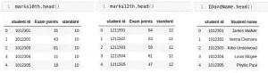
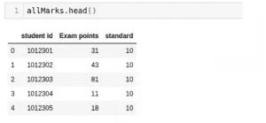
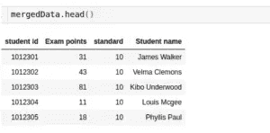
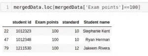

# 如何在 Python 中连接多个数据帧

> 原文：<https://medium.com/analytics-vidhya/how-to-join-multiple-dataframes-in-python-1cf205550556?source=collection_archive---------7----------------------->

## 在 Python 中合并多个数据帧的挑战

这里有一个场景，几乎会绊倒每一个有抱负的新数据科学家:

> 您正在从事一个项目，该项目从多个来源收集数据。在进入探索和建模部分之前，您需要首先连接这些多个数据集(以表格、数据框等形式)。).您如何做到这一点而不丢失任何信息？

这听起来似乎是一个简单的场景，但是对于许多新手来说，尤其是那些不熟悉 Python 编程的人来说，这可能是一个令人生畏的场景。

深入研究一下，我可以大致将其分为两种情况:

1.  首先，属性相似的数据可能被分布到**多个文件**中。例如，假设为您提供了多个文件，每个文件都存储了一年中某一周的销售信息。因此，全年您将有 52 个文件。每个文件都有相同数量和名称的列。
2.  第二，你可能需要结合来自**多个来源**的信息。例如，假设您想要获取购买过您产品的人的联系信息。这里有两个文件—第一个包含销售信息，第二个包含客户信息。

我将向您展示如何处理这两种场景，并在 [Python](https://courses.analyticsvidhya.com/courses/introduction-to-data-science?utm_source=blog&utm_medium=join-dataframes-in-python) 中连接多个数据帧。

# 理解手头的问题

出于本文的目的，我将举一个通俗易懂的例子。

让我们考虑一个特定学校的考试的例子。有各种各样的科目，每个科目都有不同的老师。他们更新自己的学生成绩和总体表现档案。我们在这里讨论的是多个文件！

在本文中，我们将使用我创建的两个这样的文件来演示 Python 中函数的工作。第一个文件包含 12 班学生的数据，另一个包含 10 班学生的数据。我们还将使用第三个文件来存储学生的姓名和学号。

*注意:虽然这些数据集是从零开始创建的，但我鼓励您将学到的知识应用到自己选择的数据集上。*

# 在 Python 中合并数据帧的分步过程

我们将这样处理这个问题:

1.  在 Python 中加载数据集
2.  组合两个相似的数据帧(追加)
3.  合并两个数据框架中的信息(合并)

# 步骤 1:在 Python 中加载数据集

在本文中，我们将使用三个独立的数据集。首先，我们需要将这些文件加载到单独的数据帧中。

前两个数据帧包含学生的百分比以及他们的学号。在我们的第一个数据帧中，我们有 10 年级学生的分数，而第二个数据帧包含 12 年级学生的分数。第三个数据帧包含学生的姓名以及他们各自的学号。

我们可以使用“head”函数来检查每个数据帧的前几行:

# 步骤 2:组合两个相似的数据帧(追加)

让我们结合 10 班和 12 班的档案，找出学生的平均分数。这里，我们将使用 Pandas 库中的‘append’函数:

**输出:((50，3)，(50，3)，(100，3))**

> *正如您在输出中看到的，append 函数将两个数据帧垂直相加。*

得到的数据帧是*所有标记*。上面比较了所有三个数据帧的形状。

接下来，让我们看看“allMarks”的内容并计算平均值:

**输出:49.74**

# 步骤 3:合并两个数据框中的信息(合并)

现在，假设我们想找出两个批次中第一个到达的学生的名字。这里，我们不需要垂直添加数据帧。**我们将不得不水平缩放它，以便为学生姓名再添加一列。**

为此，我们将找到最高得分:

**输出:100**

学生的最高分数是 100 分。现在，我们将使用“合并”功能来查找该学生的姓名:

最后，得到的数据帧中有学生的名字和他们的分数。

> *合并功能需要一个必要的属性，在该属性上两个数据帧将被合并。我们需要在“on”参数中传递该列的名称。*

合并的另一个重要论点是“如何”。这指定了要在数据帧上执行的连接类型。以下是您可以执行的不同联接类型(SQL 用户对此非常熟悉):

*   内部联接(如果不提供任何参数，默认情况下执行)
*   外部连接
*   右连接
*   左连接

我们还可以使用“sort”参数对数据帧进行排序。这些是合并两个数据帧时最常用的参数。

现在，我们将看到数据帧中包含 100 个“考试点”的行:

三个学生得了 100 分，其中两个是第十名。干得好！

# 结束注释

很简单，对吧？没必要再为这个而烦恼了！您可以将它应用于您选择的任何数据集。我的建议是选择包含 3 个不同文件的[食品预测挑战](https://datahack.analyticsvidhya.com/contest/genpact-machine-learning-hackathon-1/)。

如果你是 Python 的数据科学新手，可以报名参加[这个](https://courses.analyticsvidhya.com/courses/introduction-to-data-science)免费课程。

你也可以在分析 Vidhya 的 Android 应用上阅读这篇文章

*原载于 2020 年 2 月 5 日*[*【https://www.analyticsvidhya.com】*](https://www.analyticsvidhya.com/blog/2020/02/join-dataframes-in-python/)*。*