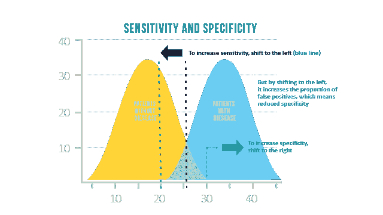
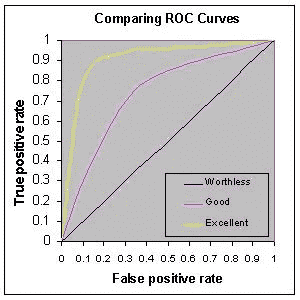

# 如何判断一个机器学习模型？(第二部分)

> 原文：<https://medium.com/analytics-vidhya/how-to-judge-a-machine-learning-model-part-2-ce6f899593bf?source=collection_archive---------19----------------------->

如何比较机器学习模型？什么指标能告诉你是在进步还是在走下坡路？对于特定的问题，哪一个指标是最好的？

本系列的第 2 部分讨论基于分类的模型度量…

演职员表:[https://talktome.nz/judging-process/](https://talktome.nz/judging-process/)

1.  **回忆或敏感度或真阳性率(TPR):**

*   在真阳性总数中被正确识别为阳性的项目数
*   公式:TP/(TP+FN)

**2。特异性或真阴性率(TNR):**

*   在全部否定中被正确识别为否定的项目数
*   公式:TN/(TN+FP)

**3。灵敏度与特异性:**

*   选择了多少个相关项目？—灵敏度。有多少病人被正确地诊断为患有这种疾病？
*   有多少负面项目是真正的负面？—特异性。有多少健康的人被确定没有这种情况？

[https://www . technology networks . com/analysis/articles/sensitivity-vs-specificity-318222](https://www.technologynetworks.com/analysis/articles/sensitivity-vs-specificity-318222)

**4。精度:**

*   在确定为阳性的项目总数中，正确确定为阳性的项目数。
*   公式:TP/(TP+FP)

**5。假阳性率或 I 类错误:**

*   总真阴性中被错误识别为阳性的项目数。
*   男子被宣布怀孕
*   公式:FP/(TN+FP)

**6。假阴性率或第二类错误:**

*   真阳性总数中被错误识别为阴性的项目数。
*   孕妇被宣布没有怀孕
*   公式:FN/(TP+FN)

**7。准确度:**

*   正确分类的项目总数的百分比
*   公式:(TP+TN)/(N+P)
*   不应该用于不均匀的类集合，因为一个类的精度可能压倒另一个类。

**8。F1 得分:**

*   这是精确和回忆和谐统一
*   公式:2*(精度*召回)/(精度+召回)
*   F1 分数优于精确度，因为对于不均匀的类，它给出了计算模型性能的更好的度量。

9。ROC-AUC 评分:

*   ROC 是概率曲线，AUC 代表可分性的程度或度量。
*   它告诉我们一个模型在多大程度上能够区分不同的类。
*   这是一个用 X 轴上的 FPR(1-灵敏度)和 Y 轴上的 TPR(灵敏度)绘制的图。

[http://gim.unmc.edu/dxtests/ROC3.htm](http://gim.unmc.edu/dxtests/ROC3.htm)

如果你喜欢我的文章，并且想用浅显易懂的数学知识寻找更多关于数据科学的帖子，请在 medium 上关注我。如果您有任何疑问，可以在 LinkedIn 上与我联系(【https://www.linkedin.com/in/aishwarya-nair-21091994/】*)。谢谢你一路读到这里，请继续关注！*