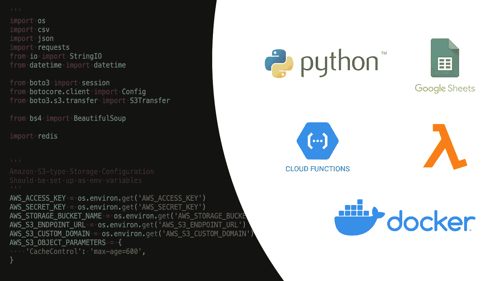
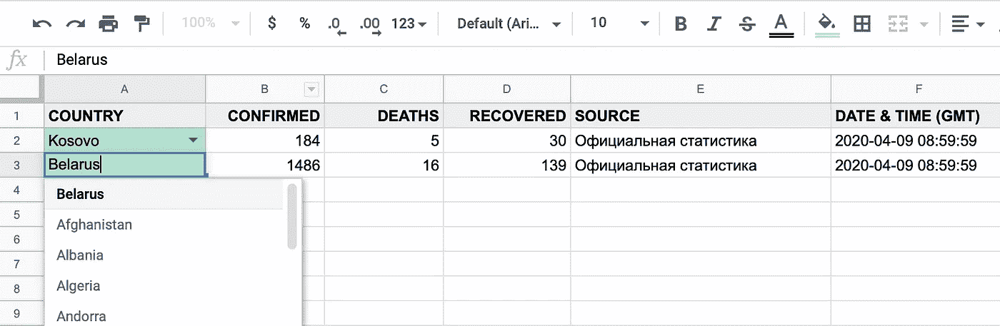
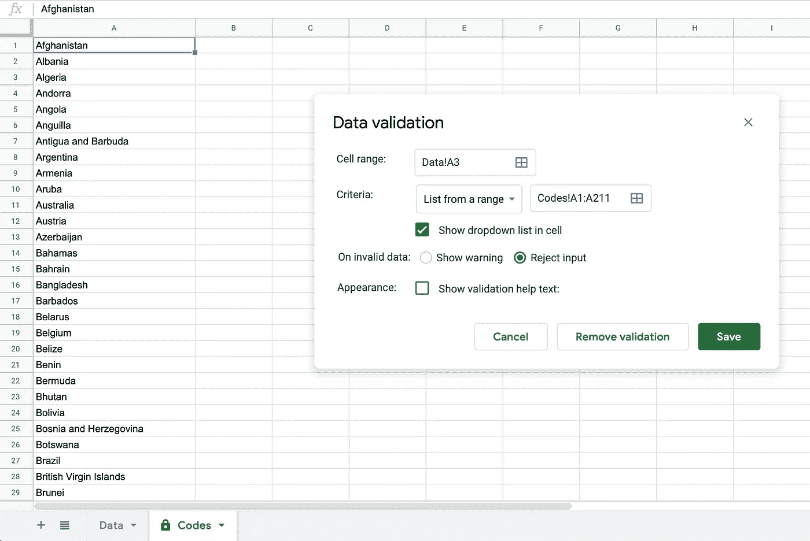
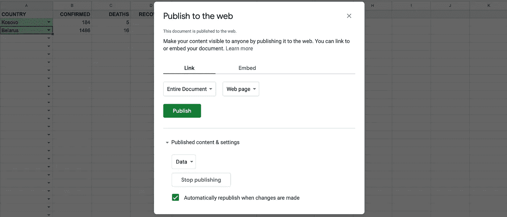
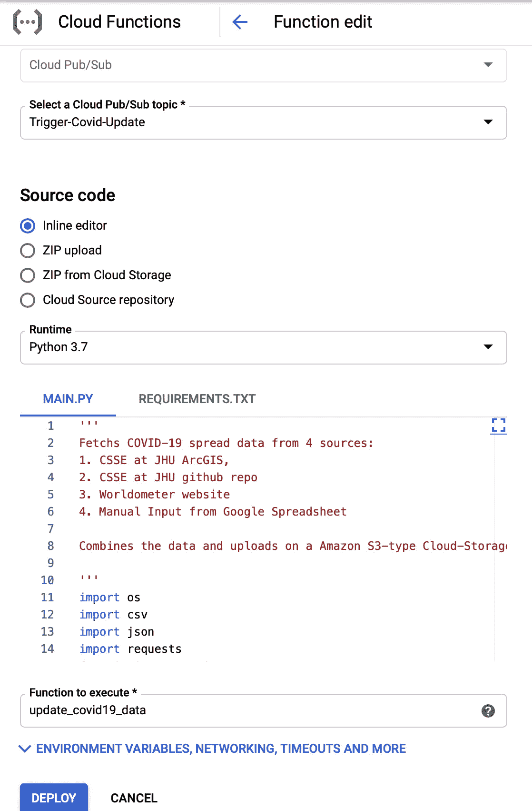
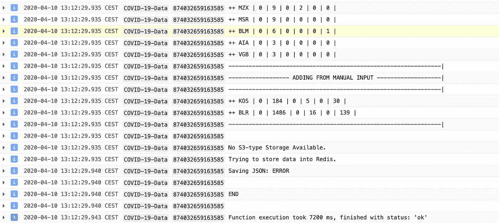

# 如何用 Google Sheets 作为数据存储让你的应用不需要服务器

> 原文：<https://medium.com/analytics-vidhya/how-to-keep-your-app-serverless-with-google-sheets-as-a-data-storage-e80dff70e9fc?source=collection_archive---------18----------------------->

使用 Python、Google Sheets 和云功能实现无服务器化

这是从数据新闻的角度报道新冠肺炎全球新闻的第三篇文章。[的第一篇文章](/@joeface/building-a-covid-19-map-using-django-leafletjs-google-spreadsheets-and-s3-cloud-storage-75bb522771f9)是对我们交互式地图背后的解决方案的总体描述。[第二个](/@joeface/extra-f549a4a0fc4f)是关于处理各种数据源和在地图上渲染自定义特征。

这一篇是关于在 Python 上构建一个**无服务器应用程序的技术方面，用于获取、组合、存储和提供 JSON 数据。**

# 云函数

最初，报废应用打算作为使用 cli 的简单 **Python** 脚本来执行，作为 **Google Cloud Function** 、 **Amazon Lambda** 或 **Docker 容器**。作为一个 crontab 作业，它在我的 Ubuntu 服务器上运行得很好。

然而，手动数据输入有一个障碍，需要我在源代码中更新科索沃和白俄罗斯的新冠肺炎数据，然后将其推送到 repo。这不是一个方便且有弹性的解决方案。

但是，如何存储和更新这些数据，保持应用程序的轻量级。如何让没有技术背景的人(记者)更新数据的过程变得顺畅？

有一个解决办法。

# 作为存储引擎的谷歌电子表格

想象一下，您必须存储和更新您的应用程序经常使用的数据。数据必须由不同的人安全地更新，并具有用户友好的界面。

当然，您可能需要花费几个小时来设置整个虚拟机，为此解决方案配置 web 服务器和 web 框架，管理用户凭证。

但是，如果我们简单地使用谷歌电子表格作为存储引擎和 API 层会怎么样呢？

## 电子表格的主要优势

*   访问控制模型
*   众所周知的用户界面和工作流程
*   数据有效性
*   通过 URL 将数据导出为 CSV 格式(这里我们忽略 [Google Sheets API](https://developers.google.com/sheets/api/quickstart/python)

# 解决方案

这是我们在谷歌电子表格中的数据存储:

谷歌电子表格数据存储

为了让用户更容易更新数据并避免输入错误，我们可以实现**数据验证**和格式化列。

“国家”列中的每个字段都变成一个下拉列表，其中包含另一个工作表中的国家列表。没有唯一索引的模型中的外键关系。

设置列的值列表

现在我们必须通过 URL 将电子表格制作成 CSV 文件:**File→Publish to web**。

将 Google 电子表格发布为 CSV 格式

搞定了。现在，您有了一个带有可读格式数据的 [URL](https://docs.google.com/spreadsheets/d/e/2PACX-1vSZ_YhO6H0Q-dBX1sifVmDN9nonyx0xBePvqsU6NdsJJVO-B1MdBRXRCjHo9NBlYpl96AZai8_HGXKa/pub?gid=0&single=true&output=csv) 。您可以与指定人员共享电子表格，并让 Google 为您管理认证和授权。

> 显然，可以使用 [Google Sheets API](https://developers.google.com/sheets/api/quickstart/python) 来获取数据。然而，在我看来，CSV 导出在这种特殊情况下更快更容易。

# Python 云函数

最后要做的事情是写一些代码。下面是一个获取电子表格内容并返回记录列表的基本函数:

用 Python 从 Google 电子表格中获取和解析数据

然而，这对于一个无服务器的应用程序来说是不够的。我们必须从 JHU 的**CSSE**[ArcGIS map feed](https://services1.arcgis.com/0MSEUqKaxRlEPj5g/arcgis/rest/services/ncov_cases/FeatureServer/2/query?f=json&where=1%3D1&returnGeometry=false&spatialRel=esriSpatialRelIntersects&outFields=*&orderByFields=OBJECTID%20ASC&outSR=102100&resultOffset=0&resultRecordCount=250&cacheHint=true&quantizationParameters=%7B%22mode%22%3A%22edit%22%7D)和 [github repo](https://github.com/CSSEGISandData/COVID-19/) 、 **Worldometer** [网站](https://www.worldometers.info/coronavirus/)获取数据，最后，将数据与我们的 **Google Sheets** 来源结合起来。

因此，我们从安装依赖项开始(参见 requirements.txt)。为了将我们的 JSON 输出存储在亚马逊 S3 类型的存储中，我们必须设置 AWS_*环境变量。否则，该应用程序会尝试将数据存储在 Redis 中，作为向云的备份。

支持 Redis 和亚马逊 S3 类型云存储的 Google Cloud/Amazon Lambda 的新冠肺炎数据解析器

在上面的要点中，谷歌电子表格的 URL 被移到了环境变量中，使得应用程序更加灵活。

# 运行谷歌云功能

在[云控制台](https://console.cloud.google.com/functions)中加入你的 Python 功能是相当明显的:

1.  选择如何触发功能执行(例如云发布/订阅主题)
2.  为代码选择源代码(在我们的例子中，我们使用行内编辑)
3.  复制并粘贴功能代码，并提供所需软件包的列表
4.  设置环境变量(我们用 Google Sheet 的 URL 设置 MANUAL_DATA_SOURCE_URL ),然后单击 Deploy

就这些。

将 Python 代码部署为谷歌云功能

作为 Google 云功能运行 update_covid19_data 的日志

# 支持 Redis 的 go Docker

您可能想更进一步，将整个东西包装成 Docker 容器。没问题伙计们。

用于运行 Python 应用程序的 Docker 容器

感谢阅读！你可以在 [github](https://github.com/joeface/COVID-19-Data-Fabric) 上找到详细的自述文件、项目的所有源代码以及带有 crontab 任务的 Ubuntu-container 的 **Docker 配置。**