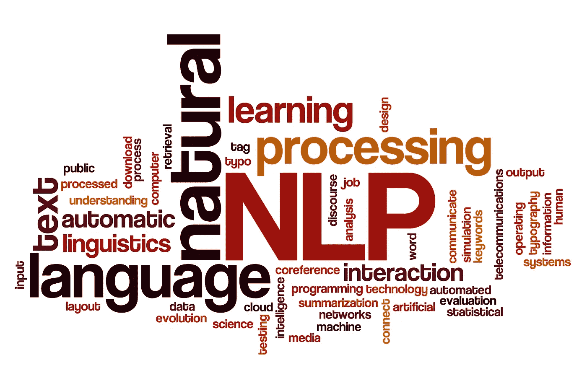

# 如何循序渐进地学习 NLP 以破解任何面试

> 原文：<https://medium.com/analytics-vidhya/how-to-learn-nlp-in-a-sequence-manner-to-crack-any-interview-742c5ce048f9?source=collection_archive---------12----------------------->

学习 NLP 并不是一项困难的任务，学习起来非常简单，只要遵循这些步骤，你肯定可以涵盖 NLP 中的所有内容，并解决任何工作面试，所以不要浪费太多时间，让我们开始吧。

我们简单地将这些步骤分为不同的级别，如 1 级、2 级和 3 级，这样你就可以很容易地理解。所以让我们深入第一层

第一级:在这一级，你可以简单地学习 NLP 是如何工作的，NLP 有哪些不同的应用，如何使用它们等等。然后是文本预处理，比如如何做记号化、词条化，如何从句子中去除停用词。

完成后，进入下一个层次

第二级:在这个级别中，我们简单地学习如何将单词转换为向量，以便我们的机器学习模型可以轻松理解。您可以学习更多的文本预处理技术，如 Bagofwords、TFIDF、Unigram、Bigram。

到了第二级的高级技巧，你也可以学习 Gensim，word2vec，average word2vec。

完成这些后，你可以简单地解决一些机器学习用例，这样你就有了一些强大的学习能力。

现在进入深度学习部分，您也可以使用深度学习来实现 NLP，因此，首先，您对深度学习模型是如何工作的有一个基本的了解，神经网络的基本知识，隐藏层如何工作，什么是优化器，不同类型的优化器，梯度下降的知识，损失函数如何工作，向前传播向后传播所有这些事情。

理解人工神经网络是必须的，然后来 RNN，LSTM，格鲁

第三级:现在，在学习了所有这些东西之后，在这一级，我们简单地学习单词嵌入，word2vec 使用一些高级的深度学习技术，然后跳到高级技术，如双向 LSTM RNN，编码器和解码器，注意力模型转换器，Bert。

完成这一关后，使用 NLP 深度学习解决一些用例

然后你就准备好面对任何面试，记住深入学习，因为在面试中他们会问你每个话题的深度。

我希望这个博客能帮助你以一种更简单的方式学习 NLP

祝您好运