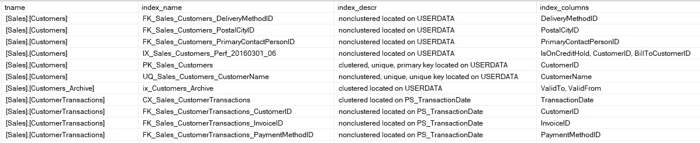

# 如何列出 SQL Server 中的所有索引

> 原文：<https://medium.com/analytics-vidhya/how-to-list-all-indexes-in-sql-server-6bb45c2c10e9?source=collection_archive---------14----------------------->

我创建了一个列出 SQL Server 中所有索引脚本。同时，我想向您展示一些 SQL Server 脚本属性。我使用了 **sp_MSforeachtable** 存储的过程来列出索引。下面的脚本显示了所有的索引，包括列和表名。

```
drop table if exists ##tmpTablesAndIndexescreate table ##tmpTablesAndIndexes(id            int identity(1,1),tname         varchar(100) null,index_name    varchar(250) null,index_descr   varchar(250) null,index_columns varchar(250) null)EXEC sp_MSforeachtable @command1='declare @tname varchar(100)SELECT @tname=''?''insert into#tmpTablesAndIndexes (index_name,index_descr,index_columns)
exec sp_helpindex ''?''update ##tmpTablesAndIndexes
set tname=@tname
where tname is null
'select tname,index_name,index_descr,index_columnsfrom ##tmpTablesAndIndexesorder by tname asc
```



让我们来分析脚本:

在 SQL Server 2016 之前，如果要删除现有对象，可以使用以下类型的脚本:

```
IF OBJECT_ID('dbo.Product, 'U') IS NOT NULL  DROP TABLE dbo.Product;
```

但是在 2016 版之后你可以使用 **drop 如果存在**。例如:

```
DROP TABLE IF EXISTS dbo.Product
```

表名前的##符号是什么？

意思是全局临时表。临时表在表名前显示一个#符号。临时表在当前会话期间有效。但是在主会话关闭之前，可以从其他会话访问全局临时表。主会话是指创建表的时间。

什么是 **sp_MSforeachtable？**

sp_MSforeachtable 是一个存储过程，用于对当前数据库中的每个表迭代应用 T-SQL 命令。'?'表示表名。

一些样品:

```
--- display all table names in a databaseexec sp_MSforeachtable @command1='select ''?'''---  display the size of all tables in a databaseEXEC sp_MSforeachtable @command1="EXEC sp_spaceused '?'"--- rebuild all indexes of all tables in a database with fillfactor 80
EXEC sp_MSforeachtable @command1="print '?' DBCC DBREINDEX ('?', ' ', 80)"
```