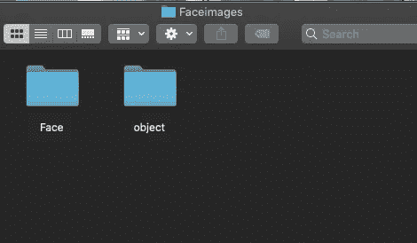

# 如何在 python 中加载任意影像数据集？

> 原文：<https://medium.com/analytics-vidhya/how-to-load-any-image-dataset-in-python-3bd2fa2cb43d?source=collection_archive---------1----------------------->

## 1.设置您的图像数据

创建一个文件夹，在其中以文件夹的形式添加所需的图像。例如，如果您有一个包含狗图像的文件夹和一个包含猫图像的文件夹，您可以将这两个文件夹放在一个单独的文件夹中，并将其命名为数据集。因此，当我打开数据集文件夹时，我必须看到一个名为狗和猫的文件夹。

人和对象数据集的示例

## 2.使用类加载数据集

您可以使用此类来加载数据集。该课程的链接将在下面提供:

[https://drive . Google . com/file/d/1 haapzdmvez 8 x 1 tfrs 2 efeqi 0 r 7 ww 7 ul/view？usp =共享](https://drive.google.com/file/d/1hAaPzDMVEZ8X1tfRS2ieFEqi0R7Ww7uL/view?usp=sharing)

或者你可以访问我的网站来获得这个类的代码

 [## 开源机器学习数据集| DataSeller

### DataSeller 向您展示了使用我们的数据集很容易制作的机器学习教程。我们通知你…

www.thedataseller.com](https://www.thedataseller.com/) 

## 3.如何使用该类

这是一个加载数据集两次的示例

因此，首先您需要给出保存两个数据集文件夹的文件夹的路径，定义图像的大小，并按照上面给出的语法加载训练和测试数据和标签。

感谢您访问我的页面:)

如果你有兴趣学习如何在没有代码知识的情况下制作一个机器学习应用程序，请看看这个视频: