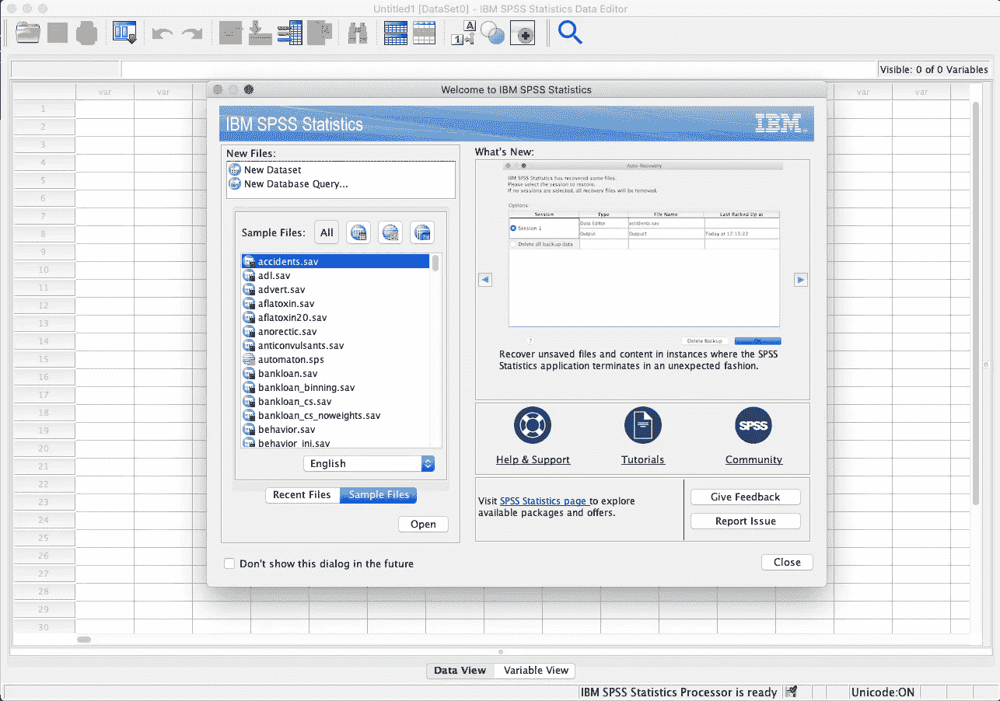

# 如何将数据加载到 SPSS

> 原文：<https://medium.com/analytics-vidhya/how-to-load-data-into-spss-3208420e950d?source=collection_archive---------24----------------------->

当第一次开始使用 SPSS 环境时，这可能会令人望而生畏。这个加载数据的快速介绍应该可以帮助您开始。

当你第一次打开 SPSS 时，你应该看到这个。此时，您可以选择点击*新建数据集*，创建一个空白数据集，您可以在其中输入数据，或者您可以点击*打开。*

**点击*打开***