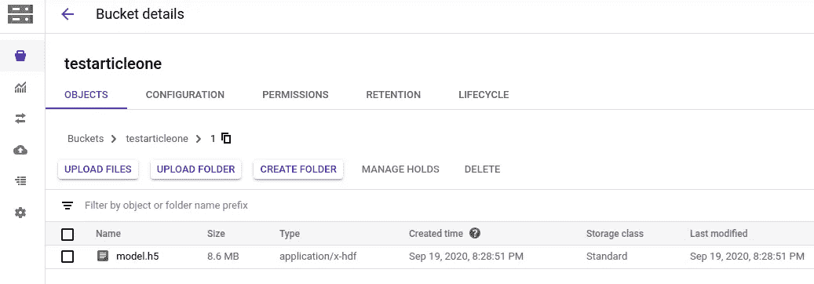

# 如何从谷歌云桶加载 Keras h5 模型格式

> 原文：<https://medium.com/analytics-vidhya/how-to-load-keras-h5-model-format-from-google-cloud-bucket-abf9a77d3cb4?source=collection_archive---------13----------------------->


卡洛琳五世在 [Unsplash](https://unsplash.com?utm_source=medium&utm_medium=referral) 上的照片

***注 1:此方法只在 Google 云存储桶上有效。***

***注 2:tensor flow 2 . 3 . 0 和 Keras 2.4.3*** 上训练的所有命令和模型

***注 3:我还假设你知道如何在谷歌云存储桶中上传数据，以及如何创建*** [***服务帐户 JSON 键***](https://cloud.google.com/iam/docs/creating-managing-service-account-keys) ***来访问你的谷歌项目中的任何内容。***

当我部署我的模型时，由于的尺寸很大，很难将它们从一个环境移动到另一个环境，如果我想从任何地方访问它们，都非常困难。所以，我想知道为什么我不只是把它们上传到谷歌云存储桶，并进行适当的版本控制，以便随时随地访问任何版本。所以，这是步骤。

**第一步:**将您保存的 **.h5 格式的 Keras 模型**上传到桶中。



**第二步:**创建**服务账户密钥**。因此，您可以从云存储桶中访问文件。

**第三步**:现在安装这些 python 包 **gcsfs** 用于访问 bucket 文件 **h5py** 用于读取 **h5 格式**文件。

```
pip install h5py
pip install gcsfs
```

**步骤 4:** 现在，运行下面的代码来访问你的模型。

```
from keras.models import load_model
import h5py
import gcsfsPROJECT_NAME = 'testone'
CREDENTIALS = 'cred.json'
MODEL_PATH = 'gs://testarticleone/1/model.h5'FS = gcsfs.GCSFileSystem(*project*=PROJECT_NAME,
                         token=CREDENTIALS)with FS.open(MODEL_PATH, 'rb') as model_file:
     model_gcs = h5py.File(model_file, 'r)
     myModel = load_model(model_gcs)
```

**FS** 是文件系统对象。

**PROJECT_NAME** 是你的云桶所在项目的名称。

**凭证**是你的服务账号 **JSON** 文件的路径。

**MODEL_PATH** 是您的模型在桶中的路径。

在**我的模型**中，你将得到你的模型，现在你可以用它来预测。

此外，如果您在将令牌发送到模型之前使用预处理、令牌化或填充，并且您已经获得了 **pickle** 文件，您也可以将它上传到 bucket 并访问它，只需遵循以下代码，确保您的令牌文件在**中。pkl 或者。泡菜**格式。

```
import pickleTOKEN_PATH = 'gs://testarticleone/token.pkl'with FS.open(TOKEN_PATH, 'rb') as handle:
     myToken = pickle.load(handle)
```

**TOKEN_PATH** 是您的令牌文件在 bucket 中的路径。

在 **myToken** 中，您将获得您的令牌文件，并使用它来预处理您的输入。

***注:如果你有任何建议和疑问，可以在评论区问我。谢谢，祝编码愉快。***