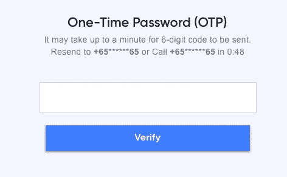
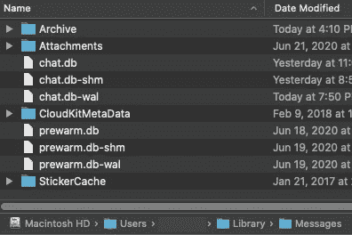
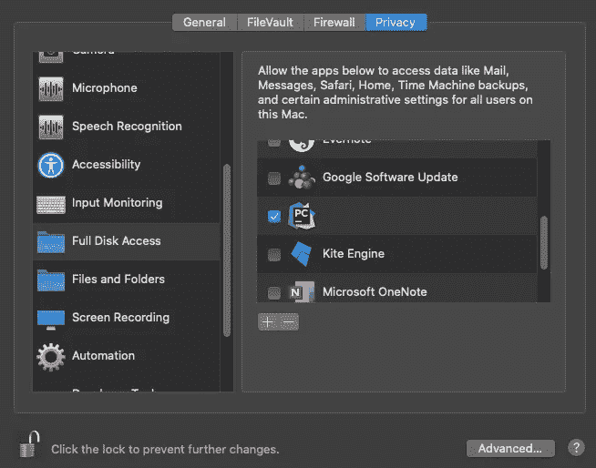

# 如何使用 python 登录需要 OTP(文本消息)的网站？

> 原文：<https://medium.com/analytics-vidhya/how-to-login-to-websites-requiring-otp-text-message-using-python-65f435c8b4f6?source=collection_archive---------11----------------------->

使用 python 获取登录所需的文本消息一次性密码(OTP)。



需要 OTP 的登录页面的屏幕截图

如果您想在登录后访问需要 OTP 的网站，如上图所示，这篇文章将非常有用。这里需要注意的是，这只适用于 Mac。

# 一些假设/要求

1.  使用的 Mac 和 iPhone
2.  动态口令以文本消息的形式发送
3.  谷歌浏览器成为浏览器的选择
4.  计算机编程语言

## 将您的 iPhone 链接到 mac

第一步是将你的 iPhone 信息链接到你的 Mac 电脑上，这样你以后就可以在 Mac 电脑上访问这些信息了。为此，请检查 Mac 上的“信息”应用程序是否与 iPhone 在同一个 Apple ID 上。(“信息”>“偏好设置”>“Apple ID ”)

现在，在你的 iPhone 上，确保你启用了短信转发选项。(设置>信息>短信转发)

这样，你的 iPhone 收到的短信应该也可以在你的 Mac 上看到了。

## 在 Mac 上查找短信



文本消息应存储在以下文件路径中:“/Users/user _ account _ name/Library/Messages/chat . db”

应该隐藏库文件。若要查看它，请按下“Command + Shift +”查看隐藏文件。您应该手动检查 chat.db 文件是否位于此文件路径。

## 授予访问权限



接下来要访问 chat.db 文件，我们必须首先访问 IDE(在我的例子中是 Pycharm)或终端，我们将从那里运行脚本。为此，请在 Mac 上进入“系统偏好设置”>“安全与隐私”>“隐私”>“全磁盘访问”>“选择终端/IDE”。

## 读取聊天数据库

接下来的部分主要基于 Yorgos Askalidis 关于媒体的文章，当我试图设置它时，这篇文章非常有用。下面是他文章的链接:

[](https://towardsdatascience.com/heres-how-you-can-access-your-entire-imessage-history-on-your-mac-f8878276c6e9) [## 以下是您在 Mac 上访问全部 iMessage 历史记录的方法

### 关于如何用你的 iMessage 历史创建一个数据科学友好文件的指南。

towardsdatascience.com](https://towardsdatascience.com/heres-how-you-can-access-your-entire-imessage-history-on-your-mac-f8878276c6e9) 

要开始，需要的库是 sqlite3 和 pandas。我们首先建立到数据库的连接，然后从中提取相关数据。

```
import sqlite3
import pandas as pdconn = sqlite3.connect("/Users/user_account_name/Library/Messages/chat.db")
```

有了这个，我们现在可以访问这些表了。您的消息位于消息表中，发件人的联系信息/号码位于句柄表中。因此，我们必须得到两个表，合并它们，以便得到文本消息以及发送者信息。我们通过将限制设置为 1 来选择最新的文本消息，但是您可以通过更改该数字来阅读任意数量的消息。

 [## pandas . read _ SQL _ query-pandas 1 . 0 . 5 文档

### 将 SQL 查询读入数据帧。返回与查询字符串的结果集对应的 DataFrame。可选地…

pandas.pydata.org](https://pandas.pydata.org/pandas-docs/stable/reference/api/pandas.read_sql_query.html) 

```
messages = pd.read_sql_query("select * from message order by ROWID desc limit 1", conn)
handles = pd.read_sql_query("select * from handle order by ROWID desc limit 1", conn)
```

消息和句柄数据帧都有一个 ROWID 列，但是一个引用消息的 ID，另一个引用句柄的 ID。因此，在最终合并两个数据帧之前，我们将其重命名以避免冲突。

```
messages.rename(columns={'ROWID': 'message_id'}, inplace=True)
handles.rename(columns={'id': 'phone_number', 'ROWID': 'handle_id'}, inplace=True)
imessage_df = pd.merge(messages[['text', 'handle_id', 'date', 'is_sent', 'message_id']],
                       handles[['handle_id', 'phone_number']], on='handle_id', how='left')
```

接下来，我们必须检查 handle_id 是否与我们期望的发送者匹配。为此，您必须手动检查一次发件人 ID，以获得 handle_id 号。在这个例子中，我期望的发送者的 handle_id 是 236。

```
for index, row in imessage_df.iterrows():
    if row['handle_id'] == 236:
        verification_code_text = row['text']
        return verification_code_text
```

返回 text 列将得到包含您正在寻找的 OTP 的文本，可以使用 regex 或 string splitting 进一步筛选出来。

下面是完整的功能供参考:

## 将动态口令插入网站

有了 OTP，我们可以使用 selenium 将其插入到网站提示中。这部分可以参考我的[上一篇文章](https://link.medium.com/beNlGF5zL7)。

[](https://link.medium.com/beNlGF5zL7) [## 如何使用 python 登录需要 OTP 的网站？

### 使用 python 抓取电子邮件获取登录所需的一次性密码。

link.medium.com](https://link.medium.com/beNlGF5zL7) 

还有……就这些了！

## 评论

再一次，写这个指南的动机是因为我很难找到信息来使这些为我自己的项目服务。我希望这证明是有帮助的，感谢您的阅读。