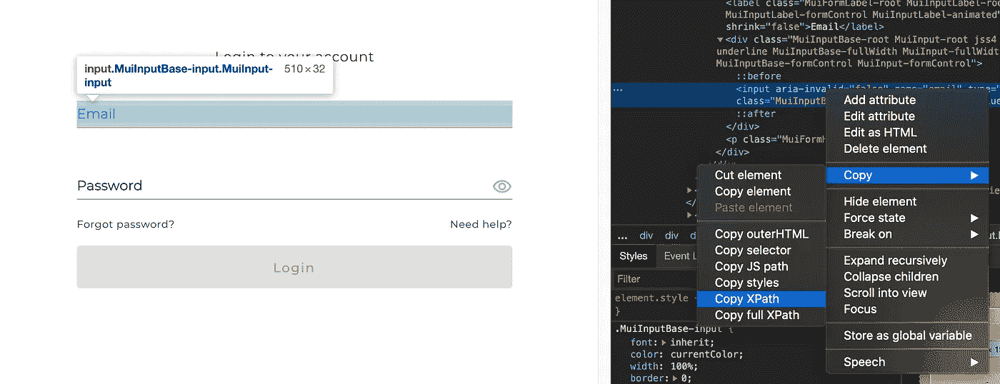

# 如何使用 python 登录需要 OTP(电子邮件)的网站？

> 原文：<https://medium.com/analytics-vidhya/how-to-login-to-websites-requiring-otp-using-python-6e5339a5c740?source=collection_archive---------2----------------------->

使用 python 抓取电子邮件获取登录所需的一次性密码。


需要 OTP 的登录页面的屏幕截图

如果您想在登录后访问需要 OTP 的网站，如上图所示，这篇文章将非常有用。

## **一些假设/要求**

1.  使用 Gmail
2.  可以通过电子邮件获得动态口令
3.  谷歌浏览器成为浏览器的选择
4.  计算机编程语言

## 入门指南

第一步是访问登录页面。为此，我使用了 python 的 Selenium 包。如果您还没有 selenium，可以按照以下网址上的说明进行安装:

[](https://pypi.org/project/selenium/) [## 硒

### Selenium WebDriver 的 Python 语言绑定。selenium 包用于从…自动化 web 浏览器交互

pypi.org](https://pypi.org/project/selenium/) 

此外，要实现这一点，您需要下载 chromedriver(检查您的 chrome 版本并下载相关版本):

 [## 下载-Chrome driver-Chrome 的 WebDriver

### Chrome 的网络驱动

Chromechromedriver.chromium.org 的 web 驱动程序](https://chromedriver.chromium.org/downloads) 

至此，让我们开始深入研究实现。首先从 selenium 导入 webdriver，然后添加 chromedriver 的位置和登录页面的 url。

```
import time
from selenium import webdriverbrowser = webdriver.Chrome(
    "filepath of your chrome driver")
browser.get('login page url')
```

## 常规登录

下一步是输入网站的用户名和密码。我用了。find_element_by_xpath 查找用户名和密码表单。然后，使用。send_keys 填写登录凭证，然后点击登录按钮。要获取元素的 XPath，可以右键单击想要访问的元素的位置，然后单击 inspect on chrome。然后右键单击 html 代码并选择 copy XPath。



```
username_elem = browser.find_element_by_xpath('xpath of username form')
username_elem.send_keys(username)password_elem = browser.find_element_by_xpath('xpath of password form')
password_elem.send_keys(password)login_elem = browser.find_element_by_xpath('xpath of login button')
login_elem.click()
```

之后，您将看到第二个登录页面，该页面需要 OTP。对于这个例子，我将假设 OTP 发送到您的电子邮件。

## 从电子邮件中获取动态口令

这是一个棘手的问题。对于这一部分，我在实现部分遇到了相当多的问题。在谈论一些潜在的问题之前，我将首先解释代码。此外，本部分主要参考和改编自:

[](https://www.thepythoncode.com/article/reading-emails-in-python) [## 如何用 Python - Python 代码阅读电子邮件

### Abdou Rockikz 7 分钟读取更新 2020 年 5 月 Python 标准库能够创建一个应用程序…

www.thepythoncode.com](https://www.thepythoncode.com/article/reading-emails-in-python) 

为了使下面的工作，假设最新的电子邮件包含 OTP。大部分代码可以从上面的链接中得到更好的解释。然而，您必须做的主要修改是从第 45 行开始的。变量 body 中的电子邮件内容是一个字符串。为了简单起见，我使用了一种字符串分割方法来定位 OTP，在将它附加到一个列表之前，在 OTP 之前和之后分割字符串。最后退单。

## 现在，在网站上填写动态口令…

从初始登录部分继续，登录后，我们将调用 time.sleep 来等待 OTP 发送到我们的电子邮件。有了上面的函数，我们只需调用它就可以得到 OTP。接下来，我们将 OTP 拆分并类型转换成单独的字符串，以便以后调用它们。

使用 for 循环，我们可以访问 OTP 元素，并通过编辑 XPaths 和单独发送 OTP 来填充它们。最后点击提交按钮。

```
# wait for OTP
time.sleep(10)

# get OTP
otp = get_otp()
otp_split = [str(i) for i in str(otp[0])]

# fills in 4 pin OTP code
for i in range(4):
    otp_elem = browser.find_element_by_xpath('//*[@id="loginForm"]/div[1]/div/div[1]/input' + str([i + 1]))
    otp_elem.send_keys(otp_split[i])

otp_login_elem = browser.find_element_by_xpath('XPath of submit button')
otp_login_elem.click()
```

还有……就这些了！

## 需要一些 gmail 设置

你可能面临的一个问题是访问你的电子邮件。为此，您必须更改 gmail 的设置；

1.  启用 IMAP 访问(Gmail >设置>转发和 POP/IMAP >单击启用 IMAP)
2.  启用不太安全的应用程序访问([https://support.google.com/accounts/answer/6010255](https://support.google.com/accounts/answer/6010255))

## 评论

就这些，希望这有帮助！当我在一个个人项目中从一个需要 OTP 的网站上收集一些数据时，我没有找到很多关于这个主题的文章。所以我想我会写点东西来帮忙！

这是我的第一篇中型文章…我相对来说是编程新手。这大部分是基于反复试验、阅读指南和许多 stackoverflow 文章。我知道这可能不是实现 OTP 登录的最佳方式，但它很简单，对我很有效！