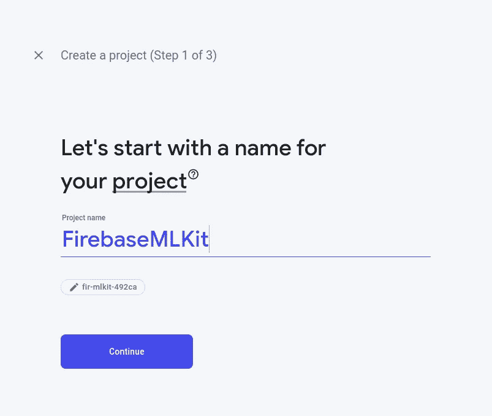

# 如何用 ML Kit 做一个微笑检测颤振 app？

> 原文：<https://medium.com/analytics-vidhya/how-to-make-a-flutter-app-using-ml-kit-which-detects-smile-5259033a97b3?source=collection_archive---------7----------------------->

当今世界正在关注机器学习，许多东西都在使用机器学习进行开发，从自动驾驶汽车到全脸识别软件。因此，跟上技术的发展趋势很重要，这样我们才不会落后。

在这篇文章中，我将告诉你如何使用 Firebase ML 工具包来制作一个 Android Flutter 应用程序，它可以检测微笑。

首先你需要建立一个 Firebase 账户。所以去 Firebase 控制台开始吧！

[](https://firebase.google.com/) [## 重火力点

### Firebase 为您提供了分析、数据库、消息传递和崩溃报告等功能，因此您可以快速移动并…

firebase.google.com](https://firebase.google.com/) 

首先，添加一个新项目，给它起任何名字



然后，选择 firebase 的默认帐户，如下所示，并单击“创建项目”:


一切准备就绪后，点击继续。很容易不是吗？

到达 firebase 控制台后，点击 android 图标，开始在 Android 应用程序中设置 Firebase


接下来屏幕上会要求你输入包名，如果你不知道可以在 Android/app/src/main/Android manifest . XML 中找到包名。点击注册应用程序

然后下载 json 文件，粘贴到 Android app 级根目录。

然后确保在您的项目级 build.gradle 文件中有以下内容

```
**Project-level build.gradle (****<project>/build.gradle****)**buildscript {
  repositories {
    // Check that you have the following line (if not, add it):
    google()  // Google's Maven repository
  }
  dependencies {
    ...
    // Add this line
    classpath 'com.google.gms:google-services:4.3.3'
  }
}

allprojects {
  ...
  repositories {
    // Check that you have the following line (if not, add it):
    google()  // Google's Maven repository
    ...
  }
}
```

和应用级构建。gradle:-

```
**App-level build.gradle (****<project>/<app-module>/build.gradle****):**apply plugin: 'com.android.application'
// Add this line
apply plugin: 'com.google.gms.google-services'

dependencies {
  // add the Firebase SDK for Google Analytics
  implementation 'com.google.firebase:firebase-analytics:17.5.0'
  // add SDKs for any other desired Firebase products
  // https://firebase.google.com/docs/android/setup#available-libraries
}
```

现在点击下一步，恭喜你已经为你的应用程序设置了 firebase！

**安装包:-**

在下一步中，您需要两个依赖项来使用 ML 工具包，第一个是`Image Picker`，另一个是`Firebase ML Vision`。

[](https://pub.dev/packages/image_picker) [## 图像拾取器| Flutter 包

### 一个适用于 iOS 和 Android 的 Flutter 插件，用于从图像库中拾取图像，并使用…

公共开发](https://pub.dev/packages/image_picker) [](https://pub.dev/packages/firebase_ml_vision) [## firebase_ml_vision | Flutter 包

### 一个使用 Firebase ML 功能的 Flutter 插件，包括 Firebase 所有基于云的 ML 特性，以及…

公共开发](https://pub.dev/packages/firebase_ml_vision) 

在 pubspec.yaml 文件中包含依赖项，并运行 get packages 命令。

接下来打开你的应用程序级 gradle 文件，包括以下内容:

```
apply plugin: 'com.google.gms.google-services'android{
/.../
    dependencies { api 'com.google.firebase:firebase-ml-vision-image-label-model:19.0.2' api 'com.google.firebase:firebase-ml-vision-face-model:17.0.2' }
/.../}
```

现在打开您的项目级 build.gradle 文件，并包含以下内容:

```
buildscript {/.../ dependencies {
             /.../ classpath 'com.google.gms:google-services:4.3.3' /.../ }}
```

将以下内容添加到您的 Android 清单文件中。这是为了让 ML 模型自动从 play store 安装到您的设备上。

```
<application ...>
  ...
  <meta-data
    android:name="com.google.firebase.ml.vision.DEPENDENCIES"
    android:value="face" />
  *<!-- To use multiple models: android:value="ocr,label,barcode,face" -->*
</application>
```

好了，现在设置完成了。让我们开始编码部分！

要获取图像，您可以指定从相机或画廊。我会在镜头前做。为此，您需要一个图像拾取器对象:

```
var image = await *ImagePicker*.pickImage(source: *ImageSource*.camera);
```

从你的图像中创建一个`FirebaseVisionImage`物体。

```
var visionImage = *FirebaseVisionImage*.fromFile(image);
```

现在创建一个检测器的实例，并在其中指定 FaceDetector 选项以获得 enableClassification。利用这一点，我们将有可能检测到图像中的微笑。

```
var faceDetection =*FirebaseVision*.instance.faceDetector(*FaceDetectorOptions*(enableClassification: true,enableLandmarks: true,));
```

现在你需要用 FaceDetector 的 processImage 方法处理图像。

```
*List*<*Face*> faces = await faceDetection.processImage(visionImage);
```

然后我们循环 faces 列表，将边界框添加到 Rect 类型的列表中

```
for (*Face* f in faces) {rect.add(f.boundingBox);smileProb = f.smilingProbability; // this will give the smiling probability of the image.}
```

然后我们将使用这个`smilingProbability`值来设置不同类型的微笑特征。

```
*String* detectSmile() {if (smileProb > 0.86) {return 'Big smile with teeth';}else if (smileProb > 0.8) {return 'Big Smile';} else if (smileProb > 0.3) {return 'Smile';} elsereturn 'Sad';}
```

所以在做了所有这些之后，我们的代码应该是这样的:

```
class *_FaceDetectionState* extends *State*<*FaceDetection*> {ui.*Image* image;var smileProb;*List*<*Rect*> rect = *List*<*Rect*>();*Future* getImage() async {var image = await *ImagePicker*.pickImage(source: *ImageSource*.camera);var visionImage = *FirebaseVisionImage*.fromFile(image);setState(() {rect = *List*<*Rect*>();}); var faceDetection =*FirebaseVision*.instance.faceDetector(*FaceDetectorOptions*(enableClassification: true,enableLandmarks: true,));*List*<*Face*> faces = await faceDetection.processImage(visionImage);for (*Face* f in faces) {rect.add(f.boundingBox);smileProb = f.smilingProbability;print('============================================');print(smileProb);}loadImage(image).then((img) {setState(() {this.image = img;});});}*Future*<ui.*Image*> loadImage(*File* image) async {var img = await image.readAsBytes();return decodeImageFromList(img);}*String* detectSmile() {if (smileProb > 0.86) {return 'Big smile with teeth';}else if (smileProb > 0.8) {return 'Big Smile';} else if (smileProb > 0.3) {return 'Smile';} elsereturn 'Sad';}/.../
Widget build
/.../}
```

现在主要部分已经完成，剩下的就是在检测到的人脸上绘制矩形。我们将使用 CustomPainter 在图像上使用 canvas.drawImage 绘制矩形

```
class *Painter* extends *CustomPainter* { *List*<*Rect*> rect; ui.*Image* image; *Painter*({@required this.rect, @required this.image}); @override
   void paint(ui.*Canvas* canvas, ui.*Size* size) { canvas.drawImage(image, *Offset*.zero, *Paint*());

   if (rect != null) {
      for (*Rect* rect in this.rect) { canvas.drawRect(
        rect,
        *Paint*()
        ..color = *Colors*.red
        ..strokeWidth = 5.0
        ..style = *PaintingStyle*.stroke);}}}@override*bool* shouldRepaint(*CustomPainter* oldDelegate) {return true;}}
```

这样就完成了脸上矩形的绘制。这样我们就可以走了。现在要在屏幕上显示图像，您需要使用 CustomPaint 小部件

```
*FittedBox*(child: *SizedBox*(width: image != null ? image.width.toDouble() : 500.0,height: image != null ? image.height.toDouble() : 500.0,child: *CustomPaint*(painter: *Painter*(rect: rect, image: image),),),),
```

仅此而已。你准备从头开始做一个人脸检测 app。如果您发现任何问题，您可以参考以下链接中的源代码:

[](https://github.com/ug2454/FaceDetectionFlutter) [## ug2454/FaceDetectionFlutter

### 一个用 Firebase ML 工具包制作的人脸检测抖动项目。ML Kit 是一个移动 SDK，带来了谷歌的机器…

github.com](https://github.com/ug2454/FaceDetectionFlutter)