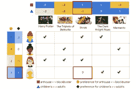

# 如何制作电影推荐器:使用 Keras 和 TensorFlow 创建推荐器引擎

> 原文：<https://medium.com/analytics-vidhya/how-to-make-a-movie-recommender-creating-a-recommender-engine-using-keras-and-tensorflow-a8e34c9ce48e?source=collection_archive---------5----------------------->

我们将要创建的推荐引擎类型是一个协作过滤器。我们将用于模型的数据是 MovieLens 数据集，这是一个公共数据集，包含观众和电影的信息。这个模型的代码基于 Keras 的教程。这个教程的代码可以在[这里](https://github.com/jdortuzar5/movie-recommender/tree/master/ai-model)找到，整个项目的代码可以在[这里](https://github.com/jdortuzar5/movie-recommender)找到。


[https://www . ka ggle . com/rounakbanik/movie-recommender-systems](https://www.kaggle.com/rounakbanik/movie-recommender-systems)

# 协同过滤是如何工作的

协同过滤模型背后的思想是使用来自两个来源的数据，在这种情况下是用户评论和用户观看历史，来找到具有相似品味的用户。这使用了观看相同电影的人具有相同品味的假设。

为了达到这个结果，我们必须创建表示用户和电影之间关系的嵌入。一维示例的结果是一个矩阵，其中用户是行，列是电影。所以看下面这个例子，最后一排的用户应该喜欢电影《怪物史莱克》吧？



[https://developers . Google . com/machine-learning/recommendation/collaborative/basics](https://developers.google.com/machine-learning/recommendation/collaborative/basics)

我们可以说，她可能不喜欢史莱克，这是基于她过去的电影历史(《黑暗骑士》和《纪念品》)，如果我们看看和我们当前的用户观看过相同电影的用户，我们会发现两个例子。也看过《黑暗骑士》的用户也看过《怪物史莱克》,所以投票推荐《怪物史莱克》,但是没有看过《怪物史莱克》的用户投票反对推荐《怪物史莱克》。这给我们留下了一个“结”，我们可以查看观看过《怪物史莱克》的用户，看看我们是否能找到与该用户的一些相似之处。因为我们不容易找到相关性，我们应该**而不是**向我们的用户推荐《怪物史莱克》。

这或多或少是我们的机器学习模型要学习的东西，要找到用户和电影的异同。为了更深入地理解这一模式，以下是一些资料来源:

*   [https://developers . Google . com/machine-learning/recommendation/collaborative/basics](https://developers.google.com/machine-learning/recommendation/collaborative/basics)
*   [https://www . research gate . net/publication/20012 10 27 _ Collaborative _ Filtering _ Recommender _ Systems](https://www.researchgate.net/publication/200121027_Collaborative_Filtering_Recommender_Systems)
*   【https://en.wikipedia.org/wiki/Collaborative_filtering 

# 如何用 TensorFlow 和 Keras 进行协同过滤

[TensorFlow](https://www.tensorflow.org/) 是一个用于计算数学和机器学习的开源库。 [Keras](https://keras.io/) 是一个深度学习 API，属于 TensorFlow 内部，使得定义和编写神经网络更加容易。这些库将帮助我们定义、训练和保存我们的推荐器模型。

我们还将使用 Pandas、Numpy 和 Matplolib 等库进行数据转换和数据可视化。

让我们从使用 virtualenv 创建一个虚拟环境开始(查看这个[教程](https://help.dreamhost.com/hc/en-us/articles/115000695551-Installing-and-using-virtualenv-with-Python-3)关于什么是以及如何使用 python 中的虚拟环境)。以下是该脚本的依赖项:

```
tensorflow
pandas
matplotlib
```

安装完依赖项后，让我们将数据加载到系统中。由于数据集是 Keras API 的一部分，我们可以使用以下命令直接下载。

```
import pandas as pd
import numpy as np
from zipfile import ZipFile
import tensorflow as tf
from tensorflow import keras
from tensorflow.keras import layers
from pathlib import Path
import matplotlib.pyplot as plt
import os
import tempfile
LOCAL_DIR = os.getcwd()os.environ['CUDA_VISIBLE_DEVICES'] = '-1'
movielens_data_file_url = (
    "<http://files.grouplens.org/datasets/movielens/ml-latest-small.zip>"
)
movielens_zipped_file = keras.utils.get_file(
    "ml-latest-small.zip", movielens_data_file_url, extract=False
)
keras_datasets_path = Path(movielens_zipped_file).parents[0]
movielens_dir = keras_datasets_path / "ml-latest-small"
# Only extract the data the first time the script is run.
if not movielens_dir.exists():
    with ZipFile(movielens_zipped_file, "r") as zip:
        # Extract files
        print("Extracting all the files now...")
        zip.extractall(path=keras_datasets_path)
        print("Done!")
```

这段代码会将数据集下载到您的计算机上，并将文件提取到一个目录中。现在，我们必须加载数据并进行一些更改，以生成数据集来训练模型。

```
ratings_file = movielens_dir / "ratings.csv"
df = pd.read_csv(ratings_file)user_ids = df["userId"].unique().tolist()
user2user_encoded = {x: i for i, x in enumerate(user_ids)}
userencoded2user = {i: x for i, x in enumerate(user_ids)}
movie_ids = df["movieId"].unique().tolist()
movie2movie_encoded = {x: i for i, x in enumerate(movie_ids)}
movie_encoded2movie = {i: x for i, x in enumerate(movie_ids)}
df["user"] = df["userId"].map(user2user_encoded)
df["movie"] = df["movieId"].map(movie2movie_encoded)num_users = len(user2user_encoded)
num_movies = len(movie_encoded2movie)
df["rating"] = df["rating"].values.astype(np.float32)
# min and max ratings will be used to normalize the ratings later
min_rating = min(df["rating"])
max_rating = max(df["rating"])print(
    "Number of users: {}, Number of Movies: {}, Min rating: {}, Max rating: {}".format(
        num_users, num_movies, min_rating, max_rating
    )
)df = df.sample(frac=1, random_state=42)
```

使用 Pandas 将评级数据作为数据帧加载到计算机中。这里我们必须找到所有唯一的`userId`并给它们一个编码值。这个值将告诉我们推荐矩阵的哪一行是每个用户。然后冲洗并重复`movieId`的操作。最后，我们将取最高和最低评级，以便稍后对它们进行标准化，并打乱我们的数据。

现在，让我们创建我们的培训和评估集。我们将使用 90%的可用数据进行训练，10%用于评估我们的模型。

```
x = df[["user", "movie"]].values
# Normalize the targets between 0 and 1\. Makes it easy to train.
y = df["rating"].apply(lambda x: (x - min_rating) / (max_rating - min_rating)).values
# Assuming training on 90% of the data and validating on 10%.
train_indices = int(0.9 * df.shape[0])
x_train, x_val, y_train, y_val = (
    x[:train_indices],
    x[train_indices:],
    y[:train_indices],
    y[train_indices:],
)
```

处理完数据后，我们就可以用 Keras 创建模型了。

```
EMBEDDING_SIZE = 32class RecommenderNet(keras.Model):
    def __init__(self, num_users, num_movies, embedding_size, **kwargs):
        super(RecommenderNet, self).__init__(**kwargs)
        self.num_users = num_users
        self.num_movies = num_movies
        self.embedding_size = embedding_size
        self.user_embedding = layers.Embedding(
            num_users,
            embedding_size,
            embeddings_initializer="he_normal",
            embeddings_regularizer=keras.regularizers.l2(1e-6),
            mask_zero=True
        )
        self.user_bias = layers.Embedding(num_users, 1)
        self.movie_embedding = layers.Embedding(
            num_movies,
            embedding_size,
            embeddings_initializer="he_normal",
            embeddings_regularizer=keras.regularizers.l2(1e-6),
            mask_zero=True
        )
        self.movie_bias = layers.Embedding(num_movies, 1) def call(self, inputs):
        user_vector = self.user_embedding(inputs[:, 0])
        user_bias = self.user_bias(inputs[:, 0])
        movie_vector = self.movie_embedding(inputs[:, 1])
        movie_bias = self.movie_bias(inputs[:, 1])
        dot_user_movie = tf.tensordot(user_vector, movie_vector, 2)
        # Add all the components (including bias)
        x = dot_user_movie + user_bias + movie_bias
        # The sigmoid activation forces the rating to between 0 and 1
        return tf.nn.sigmoid(x)
```

该模型由两个嵌入层定义，一个用于用户，一个用于电影。然后我们将使用用户嵌入层和电影嵌入层之间的点积。为了得到这个结果，我们添加了一个用户偏见嵌入层和一个电影偏见嵌入层。最后，我们对结果运行一个 sigmoid 函数，得到一个介于 0 和 1 之间的向量。

现在，让我们训练和测试我们的模型。

```
model = RecommenderNet(num_users, num_movies, EMBEDDING_SIZE)
model.compile(
    loss=tf.keras.losses.BinaryCrossentropy(), optimizer=keras.optimizers.Adam(lr=0.001)
)history = model.fit(
    x=x_train,
    y=y_train,
    batch_size=64,
    epochs=5,
    verbose=1,
    validation_data=(x_val, y_val),
)model.summary()
test_loss = model.evaluate(x_val, y_val)
print('\\nTest Loss: {}'.format(test_loss))print("Testing Model with 1 user")
movie_df = pd.read_csv(movielens_dir / "movies.csv")
user_id = "new_user"
movies_watched_by_user = df.sample(5)
movies_not_watched = movie_df[
    ~movie_df["movieId"].isin(movies_watched_by_user.movieId.values)
]["movieId"]
movies_not_watched = list(
    set(movies_not_watched).intersection(set(movie2movie_encoded.keys()))
)
movies_not_watched = [[movie2movie_encoded.get(x)] for x in movies_not_watched]user_movie_array = np.hstack(
    ([[0]] * len(movies_not_watched), movies_not_watched)
)
ratings = model.predict(user_movie_array).flatten()
top_ratings_indices = ratings.argsort()[-10:][::-1]
recommended_movie_ids = [
    movie_encoded2movie.get(movies_not_watched[x][0]) for x in top_ratings_indices
]print("Showing recommendations for user: {}".format(user_id))
print("====" * 9)
print("Movies with high ratings from user")
print("----" * 8)
top_movies_user = (
    movies_watched_by_user.sort_values(by="rating", ascending=False)
    .head(5)
    .movieId.values
)
movie_df_rows = movie_df[movie_df["movieId"].isin(top_movies_user)]
for row in movie_df_rows.itertuples():
    print(row.title, ":", row.genres)print("----" * 8)
print("Top 10 movie recommendations")
print("----" * 8)
recommended_movies = movie_df[movie_df["movieId"].isin(recommended_movie_ids)]
for row in recommended_movies.itertuples():
    print(row.title, ":", row.genres)print("==="* 9)
print("Saving Model")
print("==="* 9)
```

如果我们对我们的模型满意，我们可以保存它，这样我们就可以在我们的 web 应用程序中使用它。

# 如何保存你的 TensorFlow 模型

由于我们使用 Keras 来描述我们的模型，我们只需要将它保存在我们计算机的一个文件夹中。有一件事要记住，随着更多的数据可用，我们将需要重新训练我们的模型，或者如果我们想试验新的参数。为了跟踪所有这些，我们将使用版本控制。由于我们将使用 Tensorflow 服务来调用我们的模型，Tensorflow 服务将自动更新到最新版本。

```
MODEL_DIR = tempfile.gettempdir()
version = 1
export_path = os.path.join(LOCAL_DIR, f"ai-model/model/{version}")print('export_path = {}\\n'.format(export_path))tf.keras.models.save_model(
    model,
    export_path,
    overwrite=True,
    include_optimizer=True,
    save_format=None,
    signatures=None,
    options=None
)
```

# 如何让 TensorFlow 模型适用于 web 应用程序

为了从我们的应用程序中提出建议，我们需要提供模型。为此，我们将使用 Tensorflow 服务。这是 Tensorflow 的扩展，允许使用 HTTP 请求运行我们的模型。这是使用 Tensorflow 服务的 Docker 图像完成的，我们将在教程的 Docker 部分对此进行讨论。