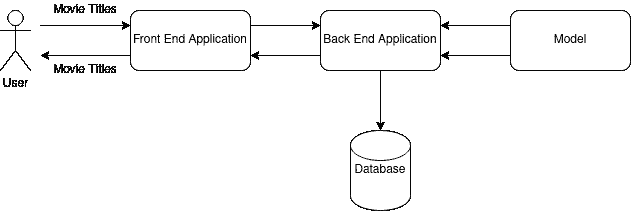

# 如何制作电影推荐器:使用 Svelte、FastAPI、MongoDB & TensorFlow Serving 制作应用程序

> 原文：<https://medium.com/analytics-vidhya/how-to-make-a-movie-recommender-making-a-application-using-svelte-fastapi-mongodb-tensorflow-6b952f7cb1f1?source=collection_archive---------8----------------------->

你好，我们要做一个 web 应用来制作推荐电影。在这个应用程序中，用户将能够写电影的标题或更多，应用程序将返回电影列表作为推荐。制作这个项目你将学习如何制作一个电影推荐引擎，一个 REST API 和一个前端反应式应用。本教程将分为几个部分，这样你就可以了解你想要的。这个项目的代码是[这里是](https://github.com/jdortuzar5/movie-recommender)。

这篇文章是为了让你知道我们要做什么和我们要用什么工具。让我们从不同部分的图表以及与应用程序的交互开始。

因此，我们需要制作一个用户可以交互的前端应用程序，然后我们有一个后端 API 来处理和协调数据库和人工智能模型。然后我们有一个数据库来保存电影和人工智能模型

如此简单，现在我们知道我们将使用电影名称向用户展示。现在，让我们考虑一下我们将要使用的技术堆栈:

*   [身材苗条](https://svelte.dev/)
*   [张量流](http://tensorflow.org/)
*   [MongoDB](https://www.mongodb.com/)
*   [FastAPI](http://fastapi.tiangolo.com/)
*   [码头工人](https://www.docker.com/)

当然，你可以选择任何你想要的技术。让我们看看这些工具的用途:

*   Svelte:用于创建反应式应用程序的 JavaScript 框架。想一个更小更被动的 React、VueJS 或 Angular 版本。这将是我们的前端，用户将与我们的应用程序进行交互的地方。
*   TensorFlow:由 Google 创建的用于创建和训练 ML/AI 模型的机器学习/人工智能框架，我们将使用 TensorFlow 的 python 版本。此外，我们将使用 TensorFlow 服务，以便能够向我们训练过的模型发出 HTTP 请求。
*   MongoDB:它是一个非 SQL 数据库引擎，这意味着你可以以任何方式保存任何你想要的东西，只要它可以被制成字典。因为我们不打算使用关系表，这样会更好。如果你愿意，可以使用 SQL 数据库引擎，比如 SQLite 或 MySQL。
*   FastAPI:一个用 python 编写的 REST API 框架，想想 Django，但它非常适合原型化和制作更快的 API。我喜欢这个框架，因为它很容易创建新的端点，并且它抽象了很多困难的东西。
*   Docker:这是一个环境容器框架。这意味着您可以将您的代码制作成一个名为 containers 的包，它可以与其他容器通信，而不必担心服务之间的依赖性或“交叉污染”。

# 我们将如何做

我把推荐的每一部分都分成了不同的部分，所以你可以随时开始，只要点击链接。但是建议的顺序如下:

1.  [推荐器模型](https://jdortuzar5.medium.com/how-to-make-a-movie-recommender-creating-a-recommender-engine-using-keras-and-tensorflow-a8e34c9ce48e)。
2.  [后端](https://jdortuzar5.medium.com/how-to-make-a-movie-recommender-making-a-rest-api-using-fastapi-196cc0299a13)。
3.  [前端](https://jdortuzar5.medium.com/how-to-make-a-movie-recommender-using-svelte-as-a-front-end-application-5907d1610b09)。
4.  使用 Docker 让事情一起工作。

# 最后说几句话

这绝不是一个生产就绪的应用程序，也不是创建电影推荐器的唯一方法。这是一个简单的教程，创建一个使用机器学习的演示应用程序，并展示创建一个全栈应用程序的所有不同部分和概念。我只想分享我所学到的。