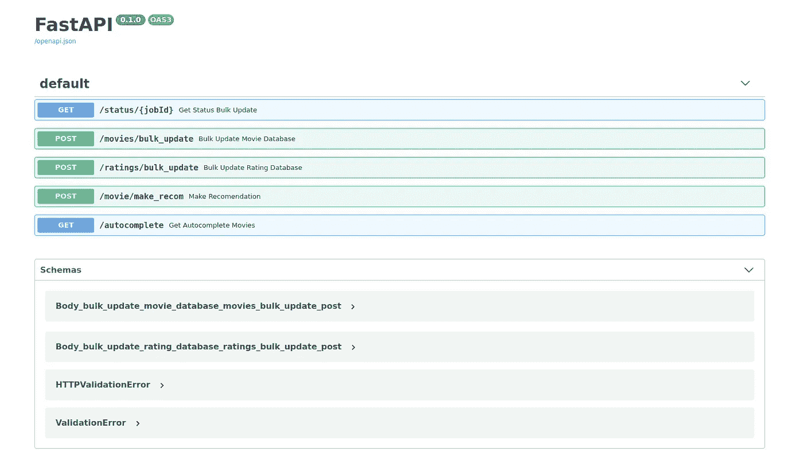

# 如何制作电影推荐器:使用 FastAPI 制作 REST API

> 原文：<https://medium.com/analytics-vidhya/how-to-make-a-movie-recommender-making-a-rest-api-using-fastapi-196cc0299a13?source=collection_archive---------6----------------------->

[FastAPI](https://fastapi.tiangolo.com/) 是 Python 的后端框架，就像 Flask 或者 Django 一样(比 Django 更 Flask)。这个框架使得创建和测试端点变得非常容易，因为它抽象了 REST API 的许多复杂部分。这有其利弊，主要是易用性与可配置性的交换。后端的所有代码都可以在[这里](https://github.com/jdortuzar5/movie-recommender/tree/master/backend)找到。该项目的所有代码可以在[这里](https://github.com/jdortuzar5/movie-recommender)找到。

# 什么是 REST API？

API(应用程序编程接口)是一个接口，它根据规则和定义定义了一个程序可以与另一个程序交互的数量([源](https://en.wikipedia.org/wiki/API))。REST(表示状态转移)API 是编写 web 服务的“风格”或“指南”。换句话说，Rest API 是一个专门设计用于在网络中交流和交互的软件。

在这个项目中，我们将我们的应用程序分为两个后端和前端。前端是用户如何与我们的应用程序、按钮、用户看到的文本等进行交互。这将是我们使用苗条。后端的工作是处理用户和前端之间的交互，它处理数据，在我们的例子中，它是与我们的推荐模型交互的人。举个例子，我们可以使用自动售货机，前端是你选择产品的按钮，投币口，以及告诉你已经加了多少钱的屏幕。后端是数钱的系统，是给你产品的马达，是计算你的零钱的系统。

# 我们还需要一个数据库

因此，为了保存我们的数据和其他东西，我们将使用 MongoDB，因为我想使用基于文档的数据库引擎。要安装数据库，您可以使用下面的[教程](https://docs.mongodb.com/manual/installation/#mongodb-community-edition-installation-tutorials)，但这不是必需的，因为我们将使用 Docker 镜像来简化事情。如果你要在没有 Docker 的情况下测试系统，你只需要安装 MongoDB。您可以随意修改本教程的代码，以使用您喜欢的任何数据库引擎。

# 让我们创建一个 REST API

让我们开始为我们的后端创建一个虚拟环境。为此，我们将使用 virtualenv(查看这个[教程](https://help.dreamhost.com/hc/en-us/articles/115000695551-Installing-and-using-virtualenv-with-Python-3)关于什么是以及如何使用 python 中的虚拟环境)。以下是该脚本的依赖项:

```
fastapi[all]
pymongo
pandas
requests
uvicorn
```

您可以将它们保存在一个名为`requirements.txt`的文件中，并使用命令`pip install -r requirements.txt`，或者您可以单独安装每个依赖项。

让我们从将应用程序连接到 MongoDB 数据库开始。既然我们要用 Docker 把我们不同的系统合并在一起，那么当你运行脚本的时候，会有一些东西不能工作，这是可以的。为了测试，有注释的参数，您可以取消注释并注释同名的参数。

```
from fastapi import FastAPI, BackgroundTasks, File, UploadFile
from fastapi.middleware.cors import CORSMiddleware
from pymongo import MongoClient
import pandas as pd
import json
import uvicorn
import uuid
from bson import json_util
from typing import List
import requests
import numpy as np
import os
import time
# MONGO_HOST = "localhost"
MONGO_HOST = os.getenv("MONGOHOST")
# TF_SERVING = "localhost"
TF_SERVING = os.getenv("TF_SERVING_HOST")mongo_client = MongoClient(MONGO_HOST, 27017)
db = mongo_client["MovieRecommenderDB"]
movie_col = db["movies"]
user_col = db["user"]
status_col = db["status"]
ratings_col = db["ratings"]
movie_encoded_col = db["movieEncoding"]
```

忽略导入，我们只是连接到我们的 MongoDB 实例，选择名为`MovieRecommenderDB`的数据库和我们的集合。如果您以前没有实例化过您的数据库或集合，不要担心 MongoDB 会处理好的。

现在，让我们开始创建 FastAPI 应用程序。

```
app = FastAPI()origins = [
    "*"
]app.add_middleware(
    CORSMiddleware,
    allow_origins=origins,
    allow_credentials=True,
    allow_methods=["*"],
    allow_headers=["*"],
)
```

在这几行中，我们有很多东西要解开。首先，`app`是 FastAPI 实例，这是创建我们的 API 所需的最少实例。下面几行是为了让我们的前端与后端进行通信，要了解更多关于 CORS 的信息，你可以阅读[这里](https://developer.mozilla.org/en-US/docs/Web/HTTP/CORS)和/或[这里](https://fastapi.tiangolo.com/tutorial/cors/?h=+cors)。

让我们假设数据库将使用我们的 API 进行更新，因此让我们创建逻辑来实现这一点。

```
def get_number_of(collection):
    num_of_movies = collection.find({}).count()
    return num_of_moviesdef save_to_db(csv_file, file_size, jobId, collection):
    _index = get_number_of(collection)
    csv_file.file.seek(0)
    for i, l in enumerate(csv_file.file):
        pass
    csv_file.file.seek(0)
    headers = csv_file.file.readline().decode().replace(";\\n", "").split(";")
    for j, l in enumerate(csv_file.file):
        line = l.decode()
        line = line.replace(";\\n", "")
        row_elem = line.split(";")
        if len(row_elem) > len(headers):
            job_doc = {"jobId": jobId,
                "status": "Error",
                "percentage": int((j/i)*100),
                "reason": f"Ilegal Character in line {j}"}
            status_col.update_one({"jobId": jobId}, {"$set": job_doc})
        else:
            doc = {}
            for e in range(len(row_elem)):
                doc[headers[e]] = row_elem[e]
            doc["index"] = _index + j
            if collection.find_one(doc) is None: 
                collection.insert_one(doc)
            else:
                pass
            status_col.update_one({"jobId": jobId}, {"$set": {"percentage": int((j/i)*100)}})
    status_col.update_one({"jobId": jobId}, {"$set": {"percentage": 100, "status": "complete", "fileName": csv_file.filename, "fileSize": file_size, "numOfRows": i}})

def make_movie_encoding():
    unique_movies = ratings_col.distinct("movieId")
    movie_encoder = {x: i for i, x in enumerate(unique_movies)}
    for key, item in movie_encoder.items():
        doc = {"movieId": key, "index": item}
        movie_encoded_col.insert_one(doc)def save_ratings_to_db(csv_file, file_size, jobId):
    save_to_db(csv_file, file_size, jobId, ratings_col)
    make_movie_encoding()@app.get("/status/{jobId}")
def get_status_bulk_update(jobId: str):
    job_doc = status_col.find_one({"jobId": jobId}, {'_id': False})
    job_doc = json.loads(json_util.dumps(job_doc))
    return job_docdef insert_status(doc):
    status_col.insert_one(json.loads(json.dumps(doc)))@app.post("/movies/bulk_update")
def bulk_update_movie_database(background_task: BackgroundTasks, csv_file: UploadFile = File(...)):
    jobId = str(uuid.uuid4())
    csv_file.file.seek(0, 2)
    file_size = csv_file.file.tell()/1000
    job_doc = {"jobId": jobId,
                "status": "inProgress",
                "percentage": 0}
    insert_status(job_doc)
    background_task.add_task(save_to_db, csv_file, file_size, jobId, movie_col) return {"filename": csv_file.filename,
            "file_size": file_size,
            "job": job_doc}@app.post("/ratings/bulk_update")
def bulk_update_rating_database(background_task: BackgroundTasks, csv_file: UploadFile = File(...)):
    jobId = str(uuid.uuid4())
    csv_file.file.seek(0, 2)
    file_size = csv_file.file.tell()/1000
    job_doc = {"jobId": jobId,
                "status": "inProgress",
                "percentage": 0}
    insert_status(job_doc)
    background_task.add_task(save_ratings_to_db, csv_file, file_size, jobId) return {"filename": csv_file.filename,
            "file_size": file_size,
            "job": job_doc}
```

在这段代码中，我们将从函数`bulk_update_rating_database`、`bulk_update_movie_database`和`get_status_bulk_update`开始。如您所见，在所有这些函数之上，您可以找到一个 python 装饰器`@app.get`或`@app.post`。这些装饰器允许我们创建 URL 路径或端点。端点不能是许多端点中的一个，但是大多数时候你使用四个:获取、发布、更新和删除。对于数据管道，我们使用 POST 用新的收视率或新的电影更新我们的数据库。我们使用 GET 方法来检查任务的状态

FastAPI 的一个很棒的特性就是所谓的 BackgroundTasks。您可以告诉 FastAPI 发送一些工作，比如本例中的数据预处理，在后台运行，并为您的用户提供一种检查任务状态的方法。

现在让我们开始调用我们的模型来提出建议。

```
def find_movies_by_ids(id_list):
    title_list = []
    for id in id_list:
        movie_title = movie_col.find_one({"movieId": str(id)})
        if movie_title is not None:
            title_list.append(movie_title["title"])
        else:
            pass
    return title_listdef get_recomendation(movie_ids):
    movie_array = np.hstack(([[0]]*len(movie_ids), movie_ids))
    body = {"instances": movie_array.tolist()}
    url = f"http://{TF_SERVING}:8501/v1/models/movie_model:predict"
    response = requests.request("POST", url, data=json.dumps(body))
    aux = response.json()
    return auxdef get_movie_index(movieIds):
    movie_indexs = []
    for movie in movieIds:
        movie_doc = movie_col.find_one({"movieId": str(movie)})
        if movie_doc is not None:
            movie_indexs.append([movie_doc["index"]])
        else:
            pass return movie_indexsdef encode_movieIds(movieIds):
    encoded_movies = [] for movie in movieIds:
        doc = movie_encoded_col.find_one({"movieId": str(movie)})
        if doc is not None:
            encoded_movies.append([doc["index"]])
        else:
            pass

    return encoded_moviesdef find_movies_not_watched(movieIndexs):
    indexs_to_watch = []
    movies_to_watch = movie_col.find({"$nor": [{"movieId": {"$in": movieIndexs}}]})
    indexs_to_watch = [int(x["movieId"]) for x in movies_to_watch]
    return indexs_to_watchdef clean_up_recommendations(recommendation_scores, top_indexes):
    recommendation_body = []
    for index in top_indexes:
        movieId = movie_encoded_col.find_one({"index": int(index)}, {'_id': False})["movieId"]
        movieDoc = movie_col.find_one({"movieId": movieId}, {'_id': False})
        movieScore = recommendation_scores[index]
        body = {
            "title": movieDoc["title"],
            "genre": movieDoc["genres"],
            "movieScore": movieScore[0]
        }
        recommendation_body.append(body)
    return recommendation_bodydef generate_recommendations(movieIds, jobId):
    start = time.time()
    movieIds = [str(x) for x in movieIds]
    still_to_watch_indxs = find_movies_not_watched(movieIds)
    encoded_movies = encode_movieIds(still_to_watch_indxs)
    recommendation = get_recomendation(encoded_movies)
    recomender_scores = np.array(recommendation["predictions"]).flatten()
    top_recommendations_indx  = np.array(recomender_scores).argsort()[-10:][::-1]
    recommendations = clean_up_recommendations(recommendation["predictions"], top_recommendations_indx)
    inputMovieTitles = find_movies_by_ids(movieIds)
    end = time.time()
    timeTaken = end-start
    status_col.update_one({"jobId": jobId}, {"$set": {"status": "complete", "input": inputMovieTitles, "recommendation": recommendations, "timeTaken": timeTaken}})@app.post("/movie/make_recom")
def make_recomendation(movies: List, background_task: BackgroundTasks):
    jobId = str(uuid.uuid4())
    job_doc = {"jobId": jobId,
                "status": "inProgress"
                }
    insert_status(job_doc)
    background_task.add_task(generate_recommendations, movies, jobId)

    return job_doc@app.get("/autocomplete")
def get_autocomplete_movies():
    movie_all = movie_col.find()
    data = {}
    for doc in movie_all:
        data[doc["title"]] = doc["movieId"]
    return dataif __name__ == "__main__":
    uvicorn.run("main:app", host="127.0.0.1", port=8000, log_level="info")
```

这些功能的要点或多或少很简单。它首先接收一个电影 id 列表，然后我们过滤掉所有不在这个列表中的电影。然后，我们使用对 Tensorflow 服务服务器的 HTTP 请求来调用模型。我们得到一个概率列表，我们得到概率最高的 10 个指数。最后，我们将这些索引转换回电影，并使用我们的状态端点返回给用户。

# 这个怎么测试？

FastAPI 最棒的一点是使用 Swagger 的自动文档。你可以在你的电脑上运行这个脚本，在网络浏览器中点击下面的地址:`[http://localhost:8000/docs](http://localhost:8000/docs)`，你应该会看到类似这样的内容:



在这里，您可以尝试您的端点，有些可能无法工作，因为外部依赖，如 MongoDB 或 Tensorflow 服务。不过不要担心，因为在本教程的 Docker 部分，我们将把所有的东西连接在一起。