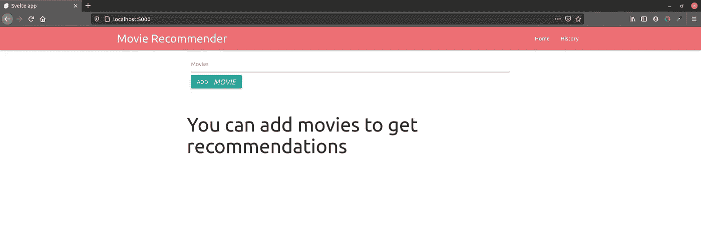
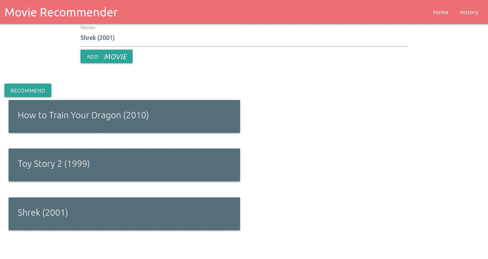
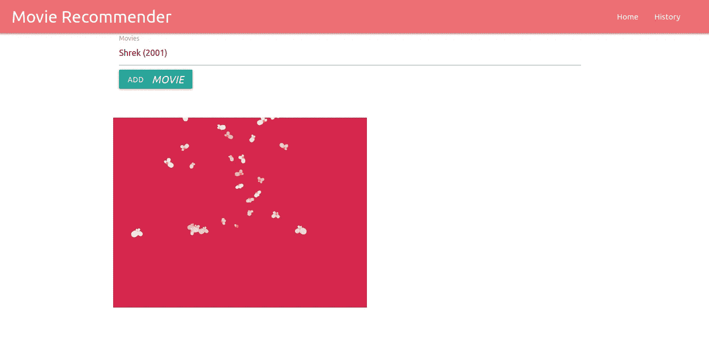
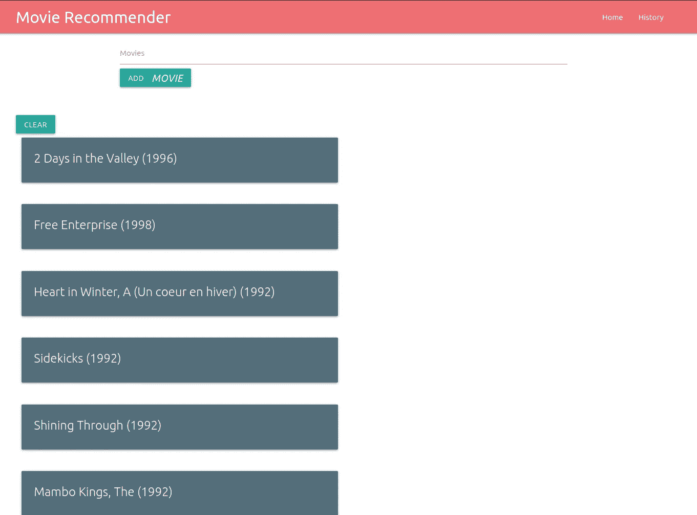

# 如何制作电影推荐器:使用 Svelte 作为前端应用程序

> 原文：<https://medium.com/analytics-vidhya/how-to-make-a-movie-recommender-using-svelte-as-a-front-end-application-5907d1610b09?source=collection_archive---------9----------------------->

svelte([https://svelte.dev/](https://svelte.dev/))是一个用于创建反应式 web 应用程序的优秀 JavaScript 框架。在本教程中，我们将制作一个单页面应用程序(SPA ),换句话说，用户可以交互的所有内容都在一个页面中。由于一些应用程序可以使用多个页面，我们将创建一个空白页面，这样您就可以知道如何创建更多的页面。我不是 JavaScript 开发人员，所以这段代码可能不是最棒的代码，但它是有效的，这才是最重要的。我从这个教程中学到了很多关于苗条身材的知识。本教程所有代码[此处](https://github.com/jdortuzar5/movie-recommender/tree/master/frontend)，本项目所有代码[此处](https://github.com/jdortuzar5/movie-recommender/tree/master/frontend)。因此，让我们首先看看用户将如何与我们的应用程序进行交互:

# 用户旅程



这是用户在应用程序启动时会看到的，这个想法是用户将制作一个他或她想看的风格的电影列表。



当用户添加一部电影时，当她点击推荐按钮时，一个漂亮的动画告诉用户它正在工作。



几秒钟后，用户将收到一个电影推荐列表。



就这样，简单明了，一页纸就能写完。现在让我们去做吧。

# 用苗条编码

要安装 svelite，你应该按照官方[svelite 网站](https://svelte.dev/)里的简单教程 en。这样一来，我们将安装 [Materialize CSS](https://materializecss.com/) 库，让我们无需编写 CSS 文件就能创建时尚的网站。

让我们从使用 NPM 安装库开始。

```
npm install materialize-css@next
```

现在，为了能够使用物化 CSS 和苗条，我们需要把它和 Rollup 捆绑在一起。为此，我们首先需要一个插件，所以让我们安装它:

```
npm install rollup-plugin-css-only -D
```

现在，让我们转到我们的`rollup.config.js`文件，你可以将我的文件复制并粘贴到你的文件上，但是有非常小的变化。

```
import svelte from 'rollup-plugin-svelte';
import resolve from '@rollup/plugin-node-resolve';
import commonjs from '@rollup/plugin-commonjs';
import livereload from 'rollup-plugin-livereload';
import { terser } from 'rollup-plugin-terser';
// Tutorial: Here we are importing our css plugin
import css from "rollup-plugin-css-only";const production = !process.env.ROLLUP_WATCH;function serve() {
	let server;

	function toExit() {
		if (server) server.kill(0);
	} return {
		writeBundle() {
			if (server) return;
			server = require('child_process').spawn('npm', ['run', 'start', '--', '--dev'], {
				stdio: ['ignore', 'inherit', 'inherit'],
				shell: true
			}); process.on('SIGTERM', toExit);
			process.on('exit', toExit);
		}
	};
}export default {
	input: 'src/main.js',
	output: {
		sourcemap: true,
		format: 'iife',
		name: 'app',
		file: 'public/build/bundle.js'
	},
	plugins: [
		svelte({
			// enable run-time checks when not in production
			dev: !production,
			// we'll extract any component CSS out into
			// a separate file - better for performance
			css: css => {
				css.write('public/build/bundle.css');
			}
		}),
		//Tutorial: Here we are linking our bundler to our css files.
		//These will be saved in the public folder with the name extra.css
		css({output: 'public/extra.css'}),
		// If you have external dependencies installed from
		// npm, you'll most likely need these plugins. In
		// some cases you'll need additional configuration -
		// consult the documentation for details:
		// <https://github.com/rollup/plugins/tree/master/packages/commonjs>
		resolve({
			browser: true,
			dedupe: ['svelte']
		}),
		commonjs(), // In dev mode, call `npm run start` once
		// the bundle has been generated
		!production && serve(), // Watch the `public` directory and refresh the
		// browser on changes when not in production
		!production && livereload('public'), // If we're building for production (npm run build
		// instead of npm run dev), minify
		production && terser()
	],
	watch: {
		clearScreen: false
	}
};
```

现在，在文件夹`public`的文件`index.html`中，我们必须添加我们的 css 链接。

```
<!DOCTYPE html>
<html lang="en">
<head>
	<meta charset='utf-8'>
	<meta name='viewport' content='width=device-width,initial-scale=1'> <title>Svelte app</title> <link rel='icon' type='image/png' href='/favicon.png'>
	<!-- Tutorial: the tag below makes sure that we can use Materialize CSS --!>
	<link rel="stylesheet" href="extra.css"> <script defer src='/build/bundle.js'></script>
</head><body>
</body>
</html>
```

最后，我们需要将物化 CSS 导入到我们的苗条组件中。为此，我们转到`src`文件夹中的`App.Svelte`文件。在`script`标签中，我们可以添加以下几行:

```
<script>
	import "../node_modules/materialize-css/dist/css/materialize.min.css"
	import "../node_modules/materialize-css/dist/js/materialize.min.js"

</script>
```

现在我们可以开始创建应用程序的其余部分，而不必编写所有的 CSS 代码。这个方法可以和其他 CSS 库一起工作，比如 Bootstrap 或者 Tailwind。

# 苗条的路线

路由是在应用程序中更改页面或路由的过程。因为我们的应用程序只需要一个页面，所以我们不需要路由。但是我们无论如何都会使用它，所以你可以把它添加到你自己的应用程序中。现在，Svelte 没有配备官方路由器，但有一个允许路由的插件，名为 [Svelte Routing](https://github.com/EmilTholin/svelte-routing) 。要安装它，我们将使用以下命令:

```
npm install --save svelte-routing
```

# 苗条是如何工作的

Svelte 和许多 JavaScript 框架一样，使用了组件的概念。这意味着站点的每个部分都应该包含在一个组件中，并且它们应该能够相互通信。现在，Svelte 最大的特点之一(以我的拙见)是它使组件之间的通信变得非常简单。现在，我们应用程序中的主要组件叫做 App。苗条(所有在`src`中以`.svelte`结尾的文件都被认为是组件)。为什么我们不从为我们的应用程序制作一个导航栏开始呢？

在`src`文件夹中，我们创建另一个名为`components`的文件夹，这是我们保存组件的地方。在`components`中，我们创建一个名为`Navbar.svelte`的文件，并添加以下代码:

```
<script>
  import {Link} from 'svelte-routing'
</script>
  <nav>
    <div class="nav-wrapper">
      <div class="container">
        <Link to="/"><span class="brand-logo">Movie Recommender</span></Link>
        <ul id="nav-mobile" class="right hide-on-med-and-down">
          <li><Link to="/" class="brand-logo">Home</Link></li>
          <li><Link to="/history" class="brand-logo">History</Link></li>
        </ul>
      </div>
    </div>
  </nav>
```

一个苗条的组件有三个部分 a `script`、`style`和`main`(没有真正的名字，但我是这样称呼它的)。组件的`script`部分是组件的所有 JavaScript 逻辑所在的地方，在`<script>`标签之间，对于我们的`Navbar`组件，我们只是从`svelte-routing`库中导入了一个`Link`组件。组件的`style`部分是你可以为组件编写定制 CSS 的地方，因为每个组件都是相互独立的，CSS 不会互相覆盖。您可以在`<style>`标记之间编写自己的自定义 CSS。不在`script`或`style`标签中的任何东西都是`main`部分的一部分，在这里你编写组件的 HTML 部分。在 Navbar 组件中，我们使用`<nav>`来定义一个导航栏，使用几个`div`来以物化 CSS 样式包装我们的导航栏。`Link`选项卡很重要，因为它们允许我们使用`svelte-router`库，告诉他们去哪里，查看标签到`History`页面的路线，我们有一条路线`/history`，所以当我们单击那个`Link`时，那就是我们要去的地方。

让我们创建我们的页面，在我们的`src`文件夹内名为`pages`的文件夹中，让我们创建两个空组件:`Home.svelte`和`History.svelte`。我们稍后将填写它们，但是现在在我们的`App.svelte`组件中，让我们添加我们的`Navbar`。

```
<script>
	import "../node_modules/materialize-css/dist/css/materialize.min.css"
	import "../node_modules/materialize-css/dist/js/materialize.min.js"
	import { Router, Link, Route } from "svelte-routing";
	import Navbar from "./components/Navbar.svelte";
	import History from "./pages/History.svelte";
	import Home from "./pages/Home.svelte"

</script><style>
	main {
		text-align: center;
		padding: 1em;
		max-width: 240px;
		margin: 0 auto;
		background-color: #d5274c;
	} h1 {
		color: #ff3e00;
		text-transform: uppercase;
		font-size: 4em;
		font-weight: 100;
	} @media (min-width: 640px) {
		main {
			max-width: none;
		}
	}
</style><Router>
	<Navbar/>
	<div class="container">
		<Route path="/" component={Home} />
		<Route path="/history" component={History} />
	</div>
</Router>
```

让我们不要担心组件的样式，让我们关注于`script`部分。除了导入 Materialize CSS，我们还导入了使用`Router`所需的元素。此外，我们正在导入`Home`和`History`组件，因此我们可以将路线与页面链接起来。现在`Router`标签负责分配`Links`和`Routes`，所以当你改变 URL 时，Svelte 将知道加载哪个组件。`Route`标签用于链接一个 URL 和一个组件，而`Link`标签(类似于`Navbar`上使用的标签)在点击时为文本按钮分配一个 URL 的变化。通过将我们的`Navbar`添加到`Router`标签中，我们告诉 Svelte 这个组件能够使用`svelte-routing`库改变路径。一个组件中可以有多个`Routers`，但是只有`Router`中的组件可以使用`svelte-routing`库。

# 为什么我们使用苗条路线？

我们使用`svlete-routing`是因为我们使用客户端渲染。这意味着当你进入应用程序时，你是负责渲染网站的计算机，而不是世界上某个地方的服务器。这主要取决于你在做什么，但是如果你正在使用一个像 Svelte 这样的框架，让应用程序的前端成为一个客户端渲染应用程序是很有意义的。

# 让我们提出一些建议

在大量的设置之后，让我们把推荐作为教程的一部分。在`Home`页面上，您可以复制并粘贴代码，我将解释这些代码背后的概念:

```
<script>
    import Searchbar from '../components/Searchbar.svelte';
    import MovieCard from '../components/MovieCard.svelte';
    import { onMount } from "svelte"; var movieCards = [];
    var movieIds ={};
    var loading = false;
    var recommendations = [];
    onMount(async () => {
        const response = await fetch("<http://localhost:8000/autocomplete>")
        movieIds = await response.json()

    });
    function getMovieIds(movieTitle){
        var movieIndex = movieIds[movieTitle];
        return movieIndex
    };

    async function postMovieRecommendations(movieIndexes){
        loading = true;
        var message;

        const response = await fetch("<http://localhost:8000/movie/make_recom>",
                                    {
                                        method: 'POST',
                                        body: JSON.stringify(movieIndexes)
                                    })
        message = await response.json();
        while(message["status"] == "inProgress"){

            const response = await fetch("<http://localhost:8000/status/"+message["jobId>"])
            message = await response.json()
        }
        return message["recommendation"]
    }

    async function makeRecommendations(){
        var recom_index = [];
        var i;
        for(i = 0; i<movieCards.length; i++){
            var movIndx = getMovieIds(movieCards[i])
            recom_index.push(movIndx)
        }
        var newMovies = await postMovieRecommendations(recom_index)

        for(i=0; i<newMovies.length; i++){
            recommendations = [...recommendations, newMovies[i]["title"]]
        }
        loading = false;
    }; function clearRecommendations(){
        recommendations = []
        movieCards = []
    }
</script><style>
</style><Searchbar bind:movieTitles={movieCards} />
{#if loading == false}
    {#if recommendations.length < 1}
        {#if movieCards.length < 1}
            <div class="container">
            <h2>You can add movies to get recommendations</h2>
            </div>
        {:else}
            <button class="btn waves-effect waves-light" type="submit" name="action" on:click={makeRecommendations}>Recommend
            </button>
            {#each movieCards as card}
                    <MovieCard movieTitle={card} />
            {/each}
        {/if}
    {:else}
        <button class="btn waves-effect waves-dark" type="submit" name="action" on:click={clearRecommendations}>Clear</button>
        {#each recommendations as card}
            <MovieCard movieTitle={card} />
        {/each}
    {/if}
{:else}
    <div class="container">
        
    </div>
{/if}
```

我们从导入`MovieCard`和`Searchbar`组件开始，它们的定义如下。我们也在导入`onMount`这是 Svelte 中的一个很棒的函数，它允许我们在页面中一呈现组件就运行代码，所以组件会在出现之前等待它运行。在这种情况下，我们使用它来调用我们的后端(在端点`/autocomplete`)来获取我们数据库中所有电影的名称和 id。

以下函数是调用我们的后端生成推荐的函数。逻辑是我们有一个电影 id 列表和一个名为`loading`的状态。然后我们将列表发送到我们的`/movie/make_recom`，后端将返回一个`jobId`和一个状态，我们将变量`loading`设置为 true。我们问我们的后端，如果我们的工作完成了，当我们等待时，我们将显示我们的 gif。一旦工作完成，我们的后端将返回一个电影 id 列表，我们可以将它改回我们的电影名称。现在我们将能够在组件的`main`部分在加载状态和推荐阶段之间切换。Svelte 允许我们使用简单的逻辑，如`if`语句或`for`循环，如下例所示:

```
{#each recommendations as card}
    <MovieCard movieTitle={card} />
{/each}
```

这里我们为推荐的`each`电影创建一个`MovieCard`组件，并结束循环。我们将电影 Id 作为变量放在花括号中。

```
{#if loading == false}
   /// ... code here
{:else}
    <div class="container">
        
    </div>
{/if}
```

在这里，我们正在检查我们是否在等待一个作业，我们正在显示一个 GIF(GIF 可以在这里找到[，并且必须保存在`public`文件夹中)。这将允许我们根据条件改变状态。这个和更多的特性在官方的苗条教程中有更详细的解释。](https://giphy.com/gifs/eat-popcorn-snack-5bDaEqBgVZXfpY8Qdk)

# 电影卡组件

在`components`文件夹中，创建名为`MovieCard.svelte`的新文件。该组件将接收一个电影标题，并将呈现一张卡片。

```
<script>
    export let movieTitle;
</script><div class="row">
<div class="col s12 m6">
    <div class="card blue-grey darken-1">
        <div class="card-content white-text">
            <span class="card-title">{movieTitle}</span>

        </div>
    </div>
</div>
</div>
```

# 搜索栏组件

这个组件是一个简单的搜索栏，具有自动完成功能。为了能够使用自动完成功能，我们需要数据库中所有电影的名称。然后我们初始化 autocomplete 并将其链接到搜索栏标签。有关更多信息，您可以查看物化 CSS [文档](https://materializecss.com/autocomplete.html)。

```
<script>
    import { onMount } from "svelte";
    let response = [];
    export let movieTitles;
    onMount(async () => {
        const response = await fetch("<http://localhost:8000/autocomplete>")
        var options = { data:  await response.json(),
                        limit: 5};
        var elems = document.querySelectorAll(".autocomplete");
        var instances = M.Autocomplete.init(elems, options);
    });

    function addNewMovie(){
      var newMovie = document.getElementById("autocomplete-input").value
      movieTitles = [...movieTitles, newMovie]
    };

</script><style></style><div class="container">
  <div class="row">
    <div class="col s12">
      <div class="row">
        <div class="input-field col s12">
          <input type="text" id="autocomplete-input" class="autocomplete" />
          <label for="autocomplete-input">Movies</label>
          <button class="btn waves-effect waves-light" type="submit" name="action" on:click={() => addNewMovie()}>Add
            <i class="material-icons right">Movie</i>
          </button>
        </div>
      </div>
    </div>
  </div>
</div>
```

# 结论

现在，我们有了一个很好的方式来以有趣的方式展示模型，而不是笔记本或文本文件。Svelte 是一个伟大的新框架，这意味着几件事。首先，没有很多人使用它，有些问题你可能在栈溢出上找不到答案。第二，不知道会不会有足够多的开发者采用。但是我确实发现 Svelte 背后的想法非常棒，框架的简单性、小的包大小和它的速度让我希望它将成为新的 JavaScript 开发人员的好去处。