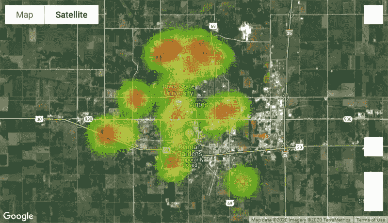
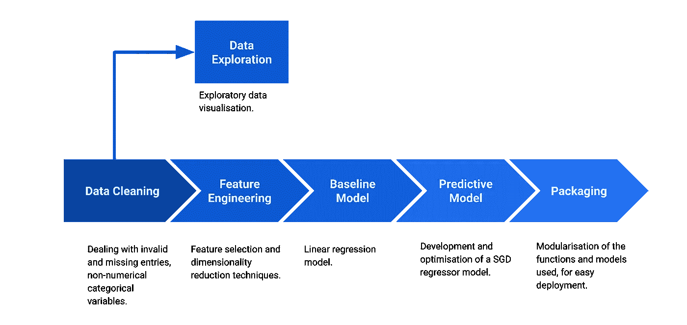
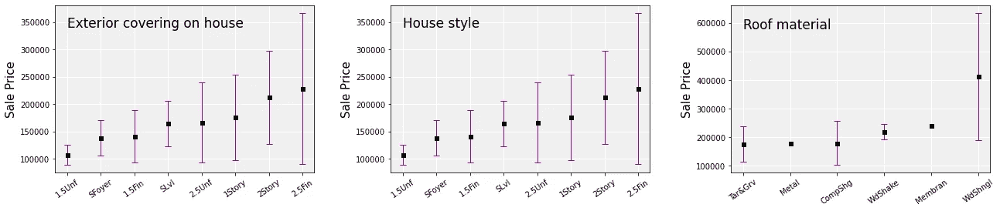
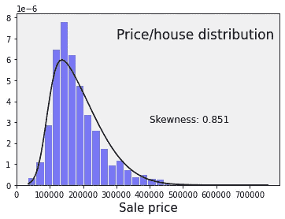
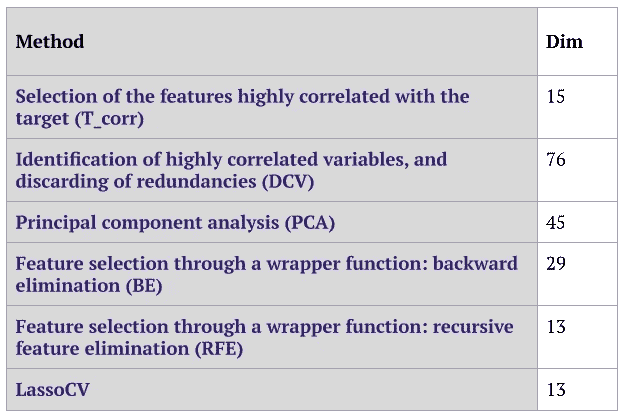
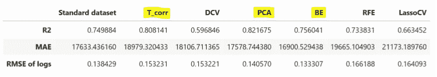
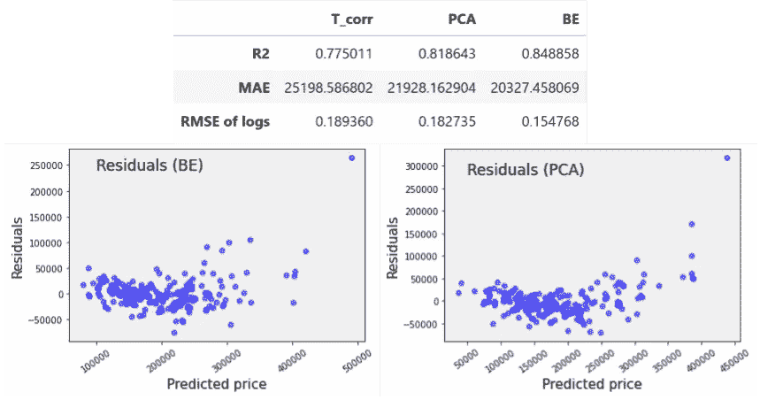
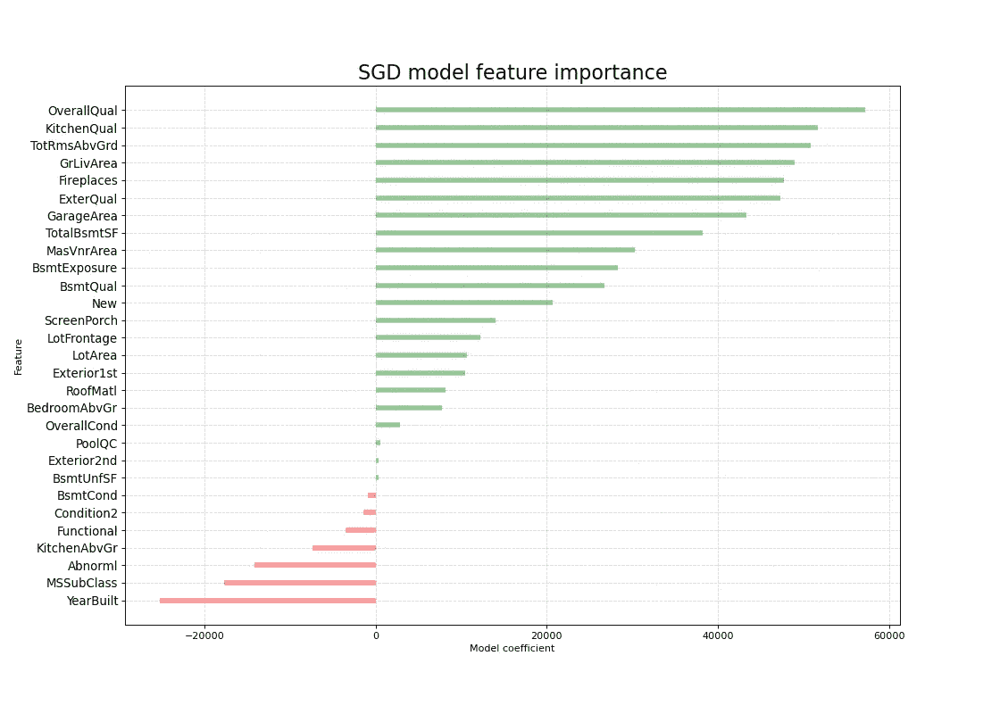

# 通过一个初学者友好的项目获得关键的机器学习技能

> 原文：<https://medium.com/analytics-vidhya/how-to-make-a-simple-machine-learning-project-and-learn-in-the-process-c4d0dd605eb9?source=collection_archive---------22----------------------->

爱荷华州艾姆斯的房地产价格热图。

作为一名有抱负的数据科学家，最重要的事情之一是找到合适的个人项目——那些让你能够从数据中提取有意义的信息，同时促进学习的项目。

在本文中，我分享了我围绕商业数据集构建项目的经验，我使用该数据集创建了一个模型，该模型可以预测房价，均方根绝对误差约为 39k 美元。这个项目帮助我建立了数据清理、特征工程和预测建模技能。

一个很好的起点是 [Kaggle](https://www.kaggle.com/) ，它有数千个数据集可供选择。我选择了[一个关于爱荷华州埃姆斯市出售的房屋的数据集](https://www.kaggle.com/c/predict-the-housing-price)，并决定我将致力于为埃姆斯市的房价建立一个简单有效的预测器**，**基于数据集中呈现的房屋描述特征**。**

**为什么是这个数据集？**因为看起来数据清理和特征工程将是一个挑战，而且它是一个很好的游乐场数据集。为了实现我的目标，除了数据收集和商业部署之外，我必须经历数据科学生产过程的所有主要步骤，如本文中的[所述。我遵循了这个过程:](/ml-research-lab/data-science-methodology-101-2fa9b7cf2ffe)

通过使用模块化和简单的项目结构，我打算使我的工作易于理解和遵循，这样任何人都可以提供反馈或改进建议，或将其作为自己想法的参考。我希望它能激励你去追求你自己的 ML 目标。

更多信息，请查看[项目回购](https://github.com/RaffaToSpace/House-Price-Predictor)。

# 数据清理和探索

如果你看一看原始数据，你可能会认为有人对 Kaggle 用户开了一个糟糕的玩笑:79 个描述性变量，其中 43 个是非数字分类的，许多没有任何明确的顺序或值的层次结构。附上的数据描述文件有点乱，到处都有错别字。

一些非数值变量有明确的有序值(如*好*、*差*、*优*等)。)，因此整数编码和处理缺失值很容易；在其他情况下，当处理无序的、非数字的分类变量时，一个好的策略是[一键编码](https://scikit-learn.org/stable/modules/generated/sklearn.preprocessing.OneHotEncoder.html)，但是在这种情况下，它会产生一个包含数百列的数据集，其中大多数都没有什么影响。

有关变量值的信息，请参见数据集文档。

我决定对所有变量进行一次彻底的分析，并进行一些数据探索，以便找到变量值的顺序。例如，建筑材料有不同的成本，对销售价格有影响，用价格相关的顺序对它们进行编码是有意义的。请注意，这是一个任意的选择，也可以选择其他策略。

我想看看目标变量*销售价格*是什么样的，它很好地符合一个偏斜的正态分布，这与全国水平的[房价分布](https://www.brookings.edu/research/housing-in-the-u-s-is-too-expensive-too-cheap-and-just-right-it-depends-on-where-you-live/)一致。这意味着该项目中开发的数据工程包和预测模型很容易导出，并且不特定于该数据集中的城镇。

# 特征工程

## 位置，位置，位置

每栋房屋的位置信息都是以一个代码的形式提供的，该代码是指一个街区(或地理参考)，为了对其有所了解，我决定用街区的实际名称填充一个查找表，并通过使用 *geopy* 包获得街区坐标来计算到镇中心的距离。

通过使用谷歌地图工具，比如 gmaps 包，我能够生成埃姆斯的房价热图，你可以在文章的顶部找到它。

通过这种方式，我打算定义一种方法，这种方法可以很容易地复制到任何类型的感兴趣的地点，在选择的城镇中，可能会对房地产价格产生影响。

## 降维

如果有人仔细研究数据集，他们会发现 79 个描述性变量中有几个是多余的，或者与大多数情况无关。例如，房子的不同部分有几个质量分数，可以合理地假设，如果房子的质量分数高，所有或大部分分数也会高；并且第二层的表面延伸仅在存在第二层的情况下相关，这可能是少数情况。

执行特征约简的另一个原因是获得数据集中重要特征的第一个指示，即那些携带有用信息(就方差而言)并有助于模型可解释性的特征。

项目这一部分的主要目标是减少数据的维度，作为一种学习方式，我决定尝试一些常用的方法:

*   选择与目标高度相关(即相关系数> 0.5)的特征；
*   识别高度相关的变量(即相关系数> 0.8)，并丢弃冗余；
*   主成分分析，限制成分数量保留 95%的样本方差；
*   通过包装函数的特征选择，通过反向消除(用回归函数拟合数据，并迭代地去除最不重要的特征)和[递归特征消除](https://scikit-learn.org/stable/modules/generated/sklearn.feature_selection.RFE.html)；
*   通过 [LassoCV](https://scikit-learn.org/stable/modules/generated/sklearn.linear_model.LassoCV.html?highlight=lassocv#sklearn.linear_model.LassoCV) 进行功能选择。

我将特性工程方法整齐地打包在一个模块中，该模块可以在项目存储库中获得，这样任何人都可以将它们应用到与所提供的数据集结构相似的数据集，如果您碰巧找到这样的数据集的话。

# 基线模型

我使用一个简单的线性回归模型来评估降维的数据集，并为预测模型建立一个基线。Kaggle competition 根据价格对数的均方根误差对该项目的提交进行排名，以便评估指标不会偏向较高的价格。

附表显示了基线模型在完整数据集和降维数据集上的表现。如您所见，有几个数据集的性能优于其他数据集，我将把它们用于我的预测模型。

同样，这是一个主观的选择，你可以只使用一个降维的数据集，或者所有的数据集，在这样做的时候，我只是展示了我基于证据的决策过程。

# 我的预测模型

对于我的预测模型，我选择了[随机梯度下降(SGD)回归器](https://scikit-learn.org/stable/modules/generated/sklearn.linear_model.SGDRegressor.html)，遵循了 [scikit-learn 算法图](https://scikit-learn.org/stable/tutorial/machine_learning_map/index.html)的建议。与其他算法相比，SGDregressor 实现和调整相对简单[，非常适合可用的数据集类型，并为拟合函数提供特征系数，这对分析非常有用。](https://scikit-learn.org/stable/modules/sgd.html#regression)

对于这种问题，有许多有效的替代算法，例如 [LightGBM、CatBoost 和 XGBoost](https://machinelearningmastery.com/gradient-boosting-with-scikit-learn-xgboost-lightgbm-and-catboost/) ，如果有人想尝试它们，请让我知道会发生什么。我尝试构建一个简单的神经网络预测器，但它在 SGD 方面的表现一直不佳。我是[随机森林](https://scikit-learn.org/stable/modules/generated/sklearn.ensemble.RandomForestRegressor.html) (RF)的忠实粉丝，所以我可能会在某个时候将基于 RF 的预测模型添加到项目中。

在使用 [GridSearchCV](https://scikit-learn.org/stable/modules/generated/sklearn.model_selection.GridSearchCV.html) 进行一轮参数优化后，我生成了数据集的训练/测试分割以测试我的模型，我选择了数据集的两个最佳表现版本(通过向后消除和主成分分析减少了维度)提交给 Kaggle 竞赛。

从残差图中，可以看出模型分数可能会被异常值丢弃，异常值可能会将在特定情况下出售的房屋视为未被描述性特征捕获，或者被一些丢弃的特征最佳捕获。

PCA 的不便之处在于，数据集的新成分不能容易地与初始数据集中的任何特征相关联，尽管这对于预测模型可能足够有效，但是它使得不可能从特征系数中获得任何洞察力。幸运的是，我可以使用通过反向消除减少的数据集，并获得关于特征重要性的信息。

关于特性的更多细节，请参考[数据描述文件](https://github.com/RaffaToSpace/House-Price-Predictor/blob/master/data/datadescription.txt)。

不出所料，影响房价的主要特征是质量得分(整体质量、厨房质量等。)、大小(地上总房间、地面居住面积等。)，而房屋的年龄明显对房价有负面影响，尽管不如质量和表面。

# 项目产出和主要收获

在这个项目中，我采用了一个商业数据集，对其进行了处理，并使用它建立了一个模型，该模型可以预测房价，均方根绝对误差约为 39k 美元，由 Kaggle competition 提交评估页面返回，约为数据集内中值房价的 24%。

SGD 预测模型的表现似乎与基线模型没有太大的不同，这可能意味着我没有充分利用算法的潜力。然而，基线模型预测房价的均方根误差为 69k 美元，这可能意味着它过度拟合了。下一步，将模型优化推进一点，或者尝试新的算法，会很有意思。

在处理这个数据集时，我使用了相当多的数据科学技术和关键工具来进行数据清理、特征工程、建模和数据分析。在项目结束时，我保存了一个测试包中使用的函数和算法，我将它上传到 TestPyPi 。

# 关于我

我是一名数据科学家，目前正在寻找新的机会。在过去的几年里，我一直致力于空间应用的量子技术。如果你想在我的 GitHub 页面上谈论这个或其他项目，请随时给我发消息。

GitHub:【https://github.com/RaffaToSpace 

领英:【https://www.linkedin.com/in/raffaele-nolli-581a4351/ 