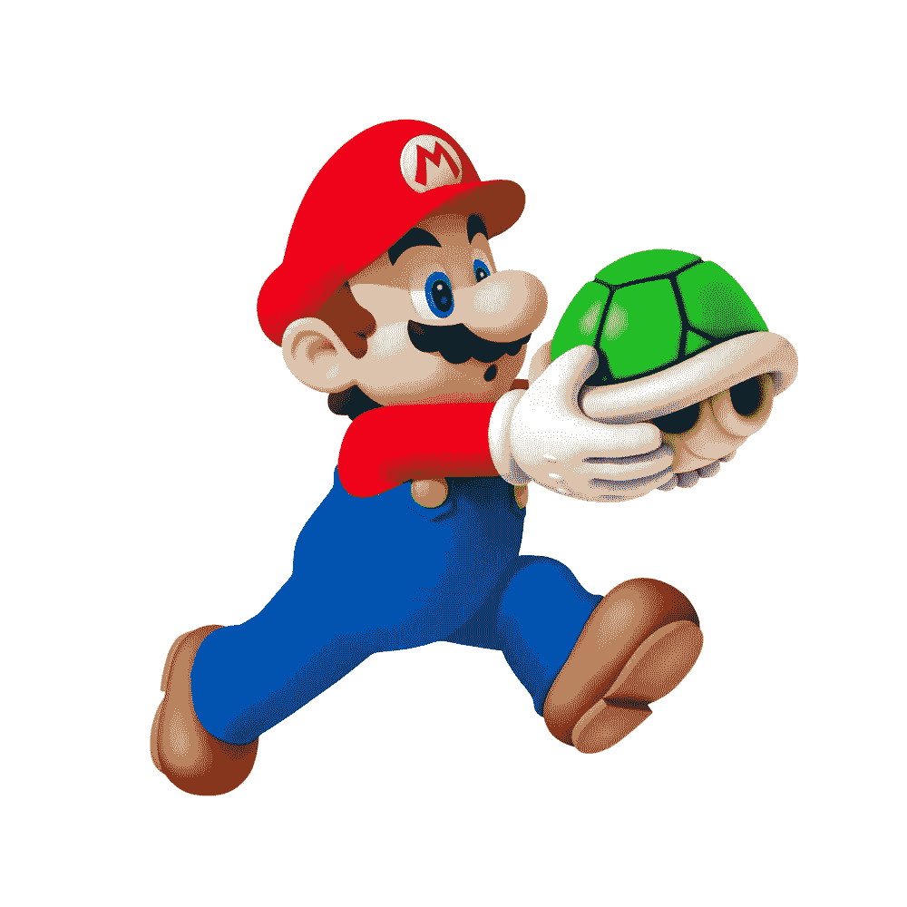
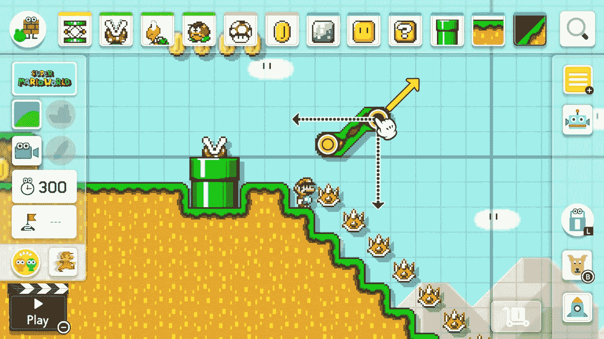
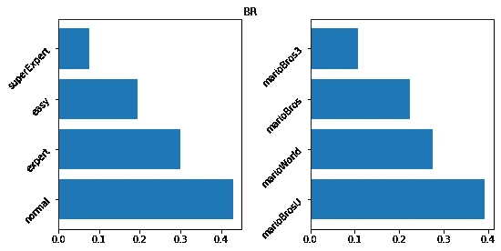
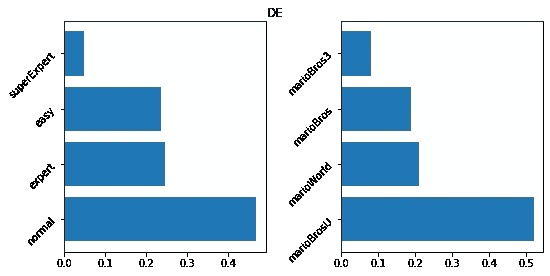
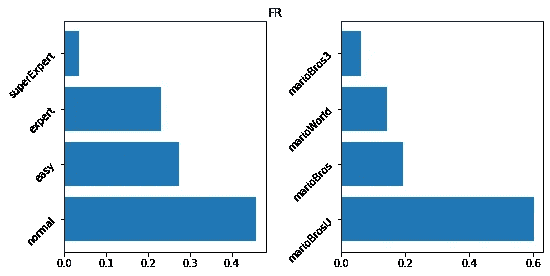
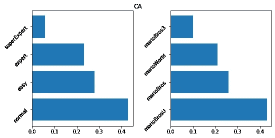
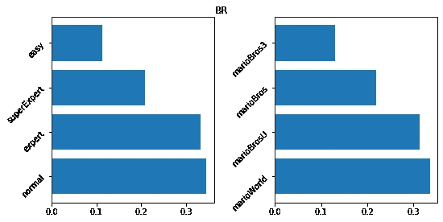
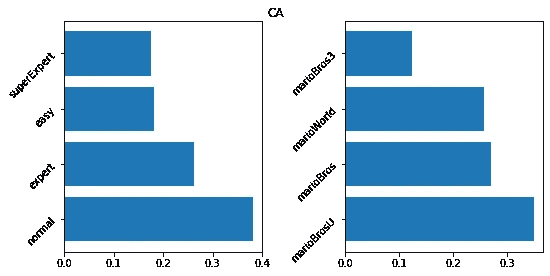
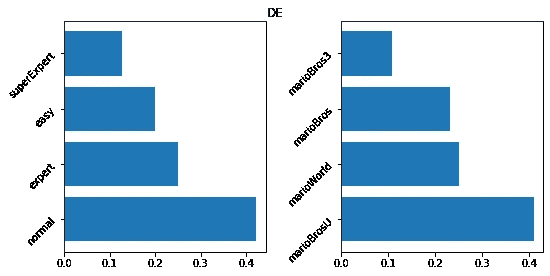
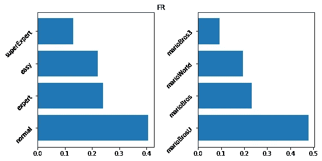

# 如何使超级马里奥制造水平，岩石

> 原文：<https://medium.com/analytics-vidhya/how-to-make-a-super-mario-maker-level-that-rocks-4453c0711609?source=collection_archive---------18----------------------->

## 利用数据进行以玩家为中心的关卡设计

有谁比任天堂可爱的水管工更适合学习游戏设计呢？经常被引用为游戏和关卡设计的巅峰，使用超级马里奥系列的游戏似乎很容易。(来源:[Flickr 上的里卡多·萨拉马戈](https://www.flickr.com/photos/odrakir/))。

M 制作视频游戏结合了许多创意领域:从声音和音乐设计到艺术作品和故事写作。然而，虽然其他媒体，如电影，也包括所有这些元素，但有两个领域特别使视频游戏作为一种媒体和艺术形式脱颖而出:*游戏性*和*水平*设计。不想过多地讨论这两个术语的定义，让我在这里放下相应维基百科文章的介绍性陈述:

> **游戏性**是玩家与游戏互动的特定方式，尤其是视频游戏。游戏性是通过游戏规则、玩家和游戏之间的联系、挑战和克服挑战、情节和玩家与游戏之间的联系定义的模式。视频游戏的玩法不同于图形和音频元素。
> 
> — [关于游戏性的维基百科](https://en.wikipedia.org/wiki/Gameplay)

…或者，简而言之:游戏性是一个非常复杂的概念。事实上，即使我刚刚贴上的定义也不是这个概念的准确定义，[因为这仍然是一个辩论的主题](https://en.wikipedia.org/wiki/Gameplay#Ambiguity_in_definition)，而是一个工具，为我在这篇文章中将要谈论的内容设置一个参考框架。更简单的定义是术语级设计:

> **关卡设计**，[…]，是一门游戏开发的学科，涉及创建视频游戏关卡——地点、关卡或任务。这通常是使用关卡编辑器来完成的，这是一个为建造关卡而设计的游戏开发软件；但是，有些游戏内置了关卡编辑工具。关卡设计是一个艺术和技术的过程。
> 
> — [维基百科关于关卡设计](https://en.wikipedia.org/wiki/Level_design)

这个定义仍然很宽泛，但它给了我们一个更清晰、更容易描述的，而且最重要的是非常具体的观察单位:电子游戏等级。

现在，对我来说，电子游戏和它们的设计最有趣的一个方面是它们在艺术和工程的交叉点上的位置。这允许在设计目标时有一定的灵活性。我想做一个简单的让玩家享受的游戏吗？我是否想创造一种体验，讲述一个我想让玩家听到的故事？我使用哪些工具来实现这一点？

例如，你可能会选择主要使用艺术设计和故事写作来传达你的信息，但选择保持游戏性和关卡设计面向娱乐和玩家参与(反之亦然)。我绝对不希望所有的创意都被从关卡设计中剔除，但是根据你的设计目标，利用玩家数据和引导关卡设计过程来创造玩家玩得开心的关卡可能是有意义的。如上所述，视频游戏开发处于工程和艺术的交叉点，我认为利用这两个看似遥远的两极之间的灵活性是有意义的。

我们所说的“关卡”可以根据你所看的游戏类型而有不同的形式(任务，世界等等)。但是为了简单起见，我们不去寻找更多的定义，让我们继续玩一个我们大多数人都熟悉的游戏，这个游戏可能塑造了人们对“关卡”的看法，这是其他游戏所没有的:*马里奥兄弟*系列，或者更具体地说,*超级马里奥制造者。*

有几个原因使得超级马里奥制作商成为开始调查关卡设计如何由数据驱动的绝佳选择。其中之一就是马里奥兄弟*的地位。系列享有作为一个流行的例子，什么是好的水平和游戏设计看起来像什么。这是因为马里奥兄弟*过于简单的游戏设计。游戏强调关卡设计是创造吸引玩家体验的工具。另一个原因是游戏的前提。对于那些不熟悉这个游戏的人来说，这里有一个简单的描述:超级马里奥制作人允许玩家按照系列游戏之一的风格创建关卡，并与在线社区共享，供其他人玩。这有两个优点:**

1.  如果每个玩家都为游戏贡献等级，我们可以期待大量的数据被创造出来。这种财富来自于所创造的不同层次的数量以及所创造的层次的多样性。通过这种方式，我们可以探索在专业游戏设计师的通常环境中看不到的水平，并可以收集足够的数据，通过使用设计良好的分析方法自信地得出结论。
2.  我们可以看到两种角色的玩家:首先是他们作为玩家的“自然”角色，其次是创造者的角色，试图创造他们的理想水平。利用这一点，我们可以仔细比较*玩家真正玩的和* *玩家希望看到的*，从而创造。此外，我们还有衡量关卡成功的标准，如*星*或游戏。

对我们来说幸运的是，莱昂纳多·毛罗已经在 Kaggle 上提供了一个[相应的数据集，这使我们能够基于可靠的数据深入研究玩家行为的主题。使用这些数据，下面的文章将解决以下问题:](https://www.kaggle.com/leomauro/smmnet)

*   作为一名创作者，你如何确保获得尽可能多的明星或最高水平的病毒式传播(即推文数量)？
*   明星数量和推文数量是由同样的因素驱动的吗？
*   不同国家的流行级别特征是否不同，即是否存在不同的级别“市场”？

在这篇文章的剩余部分，我们将使用公认简单的分析技术来解决这些问题，尽管如此，这些技术允许我们得出一些关于玩家行为的结论，并且可以启发在关卡设计和游戏行业工作的人收集和利用数据，以便根据玩家的偏好来设计关卡。

超级马里奥制造器允许玩家创建不同难度和风格的超级马里奥关卡——比如这里的超级马里奥世界——并与社区分享。(来源:attackofthefanboy.com)

# 创造一个震撼的关卡——是什么推动了一个关卡的明星和推特数量？

在上面链接的数据集中，我们有两个指标可以用来衡量一个级别的受欢迎程度和成功程度:一个是一个级别获得的星级数，另一个是它获得的 tweets 数。使用这些作为我们感兴趣的指标，我们可以使用[线性模型](https://en.wikipedia.org/wiki/Linear_regression)来了解哪些因素会影响一个级别收到的明星或推文的数量。

## 我如何在我的关卡中获得更多的星星？

决定一个关卡获得星级的 10 大特征。

下表显示了线性模型在数据中发现的前 10 个级别特征。关于如何解释这些数字的几点:

*   系数最好被解释为一个给定变量对一个关卡预期获得的星级数有多大影响的指标。
*   就我们这里的目的而言，知道绝对系数越高意味着影响力越大，正系数意味着正面影响，负系数意味着负面影响就足够了。
*   难度的基线是“简单”难度。对于游戏风格，基线是马里奥兄弟风格。例如，这意味着“超级专家”的负系数表示该难度的等级比“简单”难度的等级获得的星数少。

有了这些知识，我们就可以继续解释这些系数了。对于困难，规则似乎是*越容易越好，*因为所有的困难都有一个负号。同样，我们可以看到马里奥兄弟 3 似乎是最受欢迎的明星风格，因为它是唯一一个积极的迹象。此外，我们可以看到，接收推文和拥有更多玩家——毫不奇怪——可能会增加您在您的级别上获得的星级数。变量“创建者的其他级别”表示一个级别的创建者已经发布了多少个其他级别。正系数意味着创建者发布的等级越多，该等级就越有可能获得更多的星，这可能被解释为作为创建者的经验或受欢迎程度对获得的星的积极影响。

## 我如何让我的水平像病毒一样传播？

这可能是更难回答的问题。分析驱动级别被转发次数的因素的线性模型比分析对星数量的影响的模型具有更少的解释能力，这可以通过小系数等看出。这可能有几个原因:我们要么只包括了很少或没有相关性的因素，要么我们只是选择了错误的方法来分析数据(这里似乎就是这种情况)。

尽管如此，看看决定推文数量的主要特征还是有启发性的。

决定一个级别接收的 tweets 数量的 10 大特征。

尽管我们不得不半信半疑地看待这些结果，但它们仍然帮助我们回答了一个问题:一个级别收到的明星和推文数量是否都是由相同的因素驱动的；答案似乎是否定的。然而，这两种型号共有的一些特征是:

*   越容易，越成功。
*   德国的创造者似乎创造了最成功的关卡。
*   已经创建了更多课程的创建者倾向于发布更多成功的关卡。

# 各国流行程度有差异吗？

## 哪些关卡受创作者欢迎？

使用为每种风格和每种难度创建的级别份额，我们可以探索，如果我们发现哪个级别在哪个国家受欢迎的差异。然而，看看下面的情节，在创作者中，大多数级别都是在普通难度类别和*超级马里奥兄弟 U.* 的风格中创建的。最少和最受创作者欢迎的类别似乎是相同的，无论哪个国家，只有排名第二和四分之三似乎会发生变化。因此，玩家喜欢创造的关卡在不同的国家看起来都差不多。

按国家划分的每个难度/风格中创建的等级的相对份额。

## 球员呢？

当我们看玩家等级的受欢迎程度时，我们又有两个指标要看；一个是每个类别中明星的*份额和每个类别中戏剧*的*份额。然而，似乎更合理的假设是，明星份额比纯粹的播放份额提供了更好的受欢迎程度(毕竟你只有在播放后才真正知道你是否喜欢*a 级)。**

类似于创作者方面，每个级别的流行特征似乎都差不多，不管哪个国家:普通和马里奥兄弟。唯一的例外是巴西，在那里更高比例的星级被给予马里奥世界风格的级别，但即使在那里，与排名第二的通常最受欢迎的风格的差异也不是太大。

按国家划分的每个难度/风格中创建的等级的相对份额。

# 结论

## 数据告诉我们的是

现在我们已经研究了数据，让我们花点时间总结一下我们在简短分析中发现的要点:

1.  如果你想增加你的等级得到的星的数量，你想使他们容易接近(即容易)，并且也使用经典的马里奥兄弟游戏的风格。因此，似乎存在某种怀旧效应，关卡可以从中受益。此外，我们的模型表明，创建了更多级别的创建者在星级方面似乎做得更好。
2.  弄清楚是什么在推动一个级别的推文并不简单。该指标似乎是由我们在这里没有考虑的因素或完全不同的模型驱动的。这可能会促使采用更复杂的分析方法进行更深入的研究。
3.  所创造的关卡中，普通难度和超级马里奥兄弟的风格所占比例最高。来自某个国家的玩家给予关卡的星级比例也是如此，而且似乎在各个国家都是如此。

细心的读者可能会说第一点。第三。似乎部分互相矛盾。然而，这并不是真的，其原因在本质上有点技术性。但是可以说，我们使用了统计推断，考虑到了我们有数据的所有水平特征，从而得出了 1 中的结果。，而我们只看了*描述性汇总统计*，或者可以说是原始数字，并且在每一类*中孤立地看了* f *或* 3 *。*

## 这对我意味着什么？

正如我在开始时提到的，制作电子游戏是工程和艺术的结合，这使得创作者有很大的灵活性。但要真正利用这种灵活性，创作者必须在各种角落寻找工具，他们可以利用这些工具来提供他们想要提供的体验。

这篇文章旨在给开发者和设计者一点启发和一个起点，他们希望将来自数据科学和统计学的方法用于游戏 AI 之外的目的。了解受众的需求也有助于你选择合适的工具，让他们参与到你想要提供给他们的体验中。

## 我不完全相信你的分析…

很公平！处理数据需要适度的怀疑。如果您想了解更多关于我为撰写本文所做的分析，您可以查看包含我所用代码的[库](https://github.com/b-kaindl/dsnd_proj1)。请随时留下您的反馈！我很乐意读它。