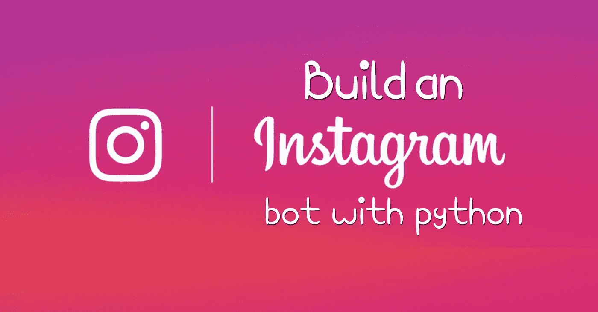
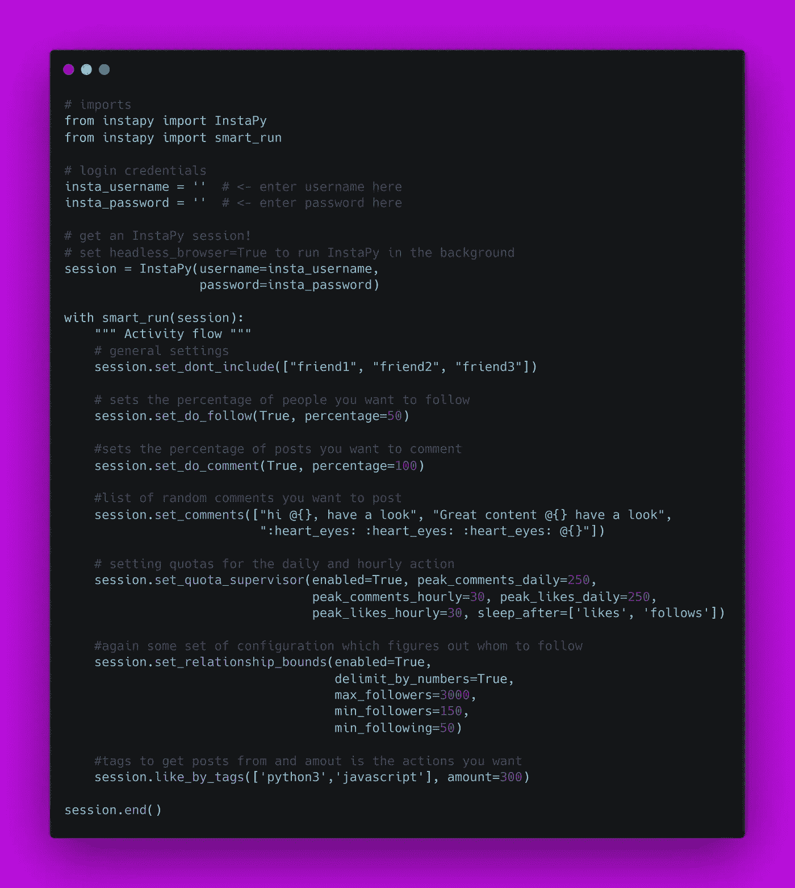

# 如何用 Python 制作 Instagram Bot

> 原文：<https://medium.com/analytics-vidhya/how-to-make-an-instagram-bot-with-python-fec28bb12e95?source=collection_archive---------1----------------------->



你用 Instagram 吗？你想知道如何搭建 Instagram Bot 吗？


*我们开始吧！*

# 制作一个(Bot)的先决条件

```
- Instapy module in Python
- An Instagram account, which you will use to run the bot script.
```

就是这样。现在让我们直接进入代码。

# 该编码了！



# 现在让我们来理解代码。

# instapy 的安装

```
pip install Instapy
```

**重要:** *根据您的系统，确保使用 pip3 和 python3 来代替。*

如果您想安装 Instapy 的特定版本，您可以使用:

```
pip install instapy==0.1.1
```

# 设置登录凭据

现在，您可以通过将用户名和密码参数传递给 bot 脚本中的 InstaPy()函数来输入您的帐户详细信息，如下所示:

```
InstaPy(insta_username="abc", 
        insta_password="123")
```

如果想让 InstaPy 在后台运行，从 CLI
运行时传递`--headless-`浏览器选项，或将`headless_browser=True`参数添加到`InstaPy(headless_browser=True)`构造函数中。

# 爱好

该机器人将获取带有标签 python3 和 javascript 的帖子。
将数量设置为您希望喜欢的帖子数量。

```
session.like_by_tags(['python3','javascript'], amount=300)
```

# 跟随

默认情况下`enabled=False`，从图像中跟踪每两个用户

```
session.set_do_follow(True, percentage=50)
```

# 评论

启用评论(默认情况下 enabled=False)并将评论概率设置为 100%,这样～每张图片都会被评论

```
session.set_do_follow(True, percentage=100)
```

配置可选注释的简单列表，注释时会随机选择一个:

```
session.set_comments(['Comment1', 'Comment2', 'Comment3'])
```

# 不包括朋友

将阻止对您的好友发表评论和取消关注(这些图片仍然会被人喜欢)

```
session.set_dont_include(['friend1', 'friend2', 'friend3'])
```

# 基于关注者数量和/或用户关注的互动

这用于检查关注者和/或用户拥有的关注者的数量，如果这些数量超过数量集或没有超过数量集，或者如果它们的比率没有达到期望的效力比率，则不会发生进一步的交互

```
session.set_relationship_bounds(enabled=True,
                                    delimit_by_numbers=True,
                                    max_followers=3000,
                                    min_followers=150,
                                    min_following=50)
```

# 配额主管

用最复杂的方法完全控制行动

```
session.set_quota_supervisor(enabled=True,
                                    peak_comments_daily=250,
                                    peak_comments_hourly=30,
                                    peak_likes_daily=250,
                                    peak_likes_hourly=30,
                                 sleep_after=['likes', 'follows'])
```

一旦完成，我们将在`session.end()`前结束会议。

您已经准备好运行机器人了！

配置好 bot 脚本后，您可以使用以下命令执行该脚本。

```
python instagrambot.py
```

你可以在 [GitHub](https://github.com/ayushi7rawat/Instagram-Bot) 找到我的代码。

另外，看看我的推特机器人博客:

*   [推特机器人](/@ayushi7rawat/how-to-make-a-twitter-bot-with-python-f65d07dd56d2)

你也可以在推特上和我联系

祝你做自己的好运。如果你有任何疑问或建议，请在下面的评论区联系我。