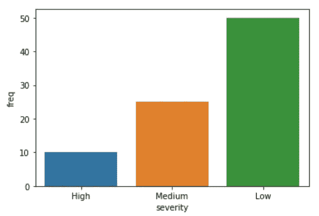
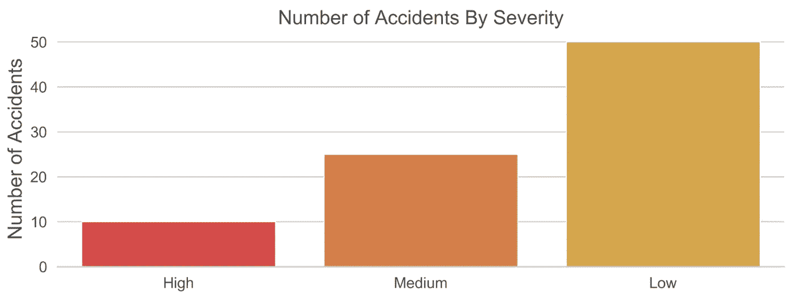

# 如何用 Python 制作更好看的图表

> 原文：<https://medium.com/analytics-vidhya/how-to-make-better-looking-charts-in-python-81058bd37ac3?source=collection_archive---------3----------------------->

有了 ***matplotlib*** 和 ***seaborn*** 库，用 Python 制作图表很容易，但是默认设置会导致图表看起来很难看。如果您只是出于自己的目的需要图表，这可能不是问题，但是如果您打算共享它，您可能希望改进它的外观，使它更容易解释。

可以通过一些简单的更改来改善图表的外观。然而，对于那些刚接触编码/python 的人来说，文档可能会让人不知所措，而且通常不清楚在图表代码中添加各种代码片段的位置。在这篇文章中，我将一步一步地展示一个简单的例子，说明我是如何改进默认条形图的:


…对此:


首先，让我们导入库并创建一些虚拟数据来创建图表。

```
# import libraries
import pandas as pd
import matplotlib.pyplot as plt
import seaborn as sns# create and view data
severity = ["High", "Medium", "Low"]
freq = [10, 25, 50]
data = pd.DataFrame(list(zip(severity, freq)), 
               columns =['severity', 'freq'])
data
```

因此，我们有一个包含 2 列 3 行的数据框，显示每个严重级别(高、中、低)的事故数量:


# 默认图

仅使用 matplotlib 库，我们就可以用下面一行简单的代码创建一个条形图:

```
# default matplotlib bar plot
data.plot.bar(x="severity", y="freq")
```

…但是看起来不太好:


它在图表上方输出我们不想要的文本("*<matplotlib . axes . _ subplots)。AxesSubplot 在 0x1045f02e8 >* "，x 轴刻度标签是垂直的，就是看起来不太专业。

seaborn 默认设置看起来稍微好一点:

```
# default seaborn bar plot
sns.barplot(data=data, x="severity", y="freq")
```


这也会在绘图上方显示不需要的文本，但至少 x 轴刻度标签是水平的，因此更容易阅读。尽管如此，还有很多可以改进的地方。

# 删除不需要的文本

要删除绘图上方不需要的文本，请在代码末尾添加一个分号。这适用于 matplotlib 和 seaborn 地块。从这一点上，我们将致力于改善 seaborn 情节。

```
# without the matplotlib text
sns.barplot(data=data, x="severity", y="freq")**;**
```



# 更改轴标签

接下来，让我们使用`plt.xlabel()`和`plt.ylabel()`将轴标签更改为“事故严重性”和“事故数量”。

```
# change the axis labels
sns.barplot(data=data, x="severity", y="freq")
**plt.xlabel('Accident Severity')
plt.ylabel('Number of Accidents')**;
```


# 添加标题

目前还不清楚图表是关于什么的，所以让我们用`plt.title()`添加一个标题。

```
# add a title
sns.barplot(data=data, x="severity", y="freq")
plt.xlabel('Accident Severity')
plt.ylabel('Number of Accidents')
**plt.title('Number of Accidents By Severity')**;
```


# 移除 X 轴标签

现在我们有了一个标题，x 轴标签实际上并不需要。当混乱减少时，图表看起来更好。因此，让我们通过删除引号中的文本来删除 x 轴标签。如果我们只是删除了整个`plt.xlabel()`行，那么 matplotlib 将显示映射到 x 轴的 dataframe 列的名称(“severity”)，这不是我们想要的。因此，我们使用`plt.xlabel(‘’)`。

```
# remove x axis label
sns.barplot(data=data, x="severity", y="freq")
**plt.xlabel('')**
plt.ylabel('Number of Accidents')
plt.title('Number of Accidents By Severity');
```


# 移除顶部和右边框

移除边框的顶部和右侧也有助于减少混乱，并使图表看起来更“干净”和更现代。这可以通过像这样的`sns.despine()`来完成:

```
# remove top and right border
sns.barplot(data=data, x="severity", y="freq")
plt.xlabel('')
plt.ylabel('Number of Accidents')
plt.title('Number of Accidents By Severity')
**sns.despine()**;
```


# 移除左边框

我们可以更进一步，也删除左边的边界(y 轴)。这种方法可以使图表看起来更好，目前被许多出版物使用，例如《金融时报》。可以通过在`sns.despine()`中添加`left=True`来移除 y 轴边框，如下所示:

```
# remove left border
sns.barplot(data=data, x="severity", y="freq")
plt.xlabel('')
plt.ylabel('Number of Accidents')
plt.title('Number of Accidents By Severity')
sns.despine(**left=True**);
```


# 添加水平网格线

这看起来不太对，因为我们已经删除了 y 轴线，因为图表没有任何网格线。让我们添加水平网格线，这样更容易看到每个条形的值。这可以通过像这样添加`sns.set(style=”whitegrid”)`来实现:

```
# add horizontal grid lines to the background
**sns.set(style="whitegrid")**
sns.barplot(data=data, x="severity", y="freq")
plt.xlabel('')
plt.ylabel('Number of Accidents')
plt.title('Number of Accidents By Severity')
sns.despine(left=True);
```


# 放大标题和轴标签

为了使标题和轴标签更容易阅读，让我们通过在`plt.ylabel()`和`plt.title()`中的参数列表中添加`, size=18`来使它们变大:

```
# Make the title and axis labels bigger
sns.set(style="whitegrid")
sns.barplot(data=data, x="severity", y="freq")
plt.xlabel('')
plt.ylabel('Number of Accidents'**, size=18**)
plt.title('Number of Accidents By Severity'**, size=18**)
sns.despine(left=True);
```


# 放大轴刻度标签

让我们也增加轴刻度标签的大小。这可以通过像这样的`plt.xticks`和`plt.yticks()`来完成:

```
# Make the axis tick labels bigger
sns.set(style="whitegrid")
sns.barplot(data=data, x="severity", y="freq")
plt.xlabel('')
plt.ylabel('Number of Accidents', size=18)
plt.title('Number of Accidents By Severity', size=18)
**plt.xticks(size=14)
plt.yticks(size=14)**
sns.despine(left=True);
```


# 改变条形的颜色

如果条形的颜色有意义，代表严重程度，那就更好了。让我们使用`sns.barplot()`中的`palette`参数将颜色更改为红色、橙色和黄色。

```
# Change the colours of the bars
sns.set(style="whitegrid")
sns.barplot(data=data, x="severity", y="freq", **palette=['red', 'orange', 'yellow']**)
plt.xlabel('')
plt.ylabel('Number of Accidents', size=18)
plt.title('Number of Accidents By Severity', size=18)
plt.xticks(size=14)
plt.yticks(size=14)
sns.despine(left=True);
```


这个更好，但是那些颜色的深浅伤了我的眼睛！

我倾向于在使用在线颜色选择器工具选择特定颜色后，使用十六进制值定义颜色(只需谷歌“颜色选择器”，第一个结果会显示一个工具)。您可以将光标滑动到您想要的颜色和阴影，并将十六进制值复制粘贴到您的代码中。


下面是我用我想要的色度的十六进制值替换颜色名称后的更新代码:

```
# Change the colours of the bars
sns.set(style="whitegrid")
sns.barplot(data=data, x="severity", y="freq", palette=['**#eb3434', '#eb7a34', '#ebae34'**])
plt.xlabel('')
plt.ylabel('Number of Accidents', size=18)
plt.title('Number of Accidents By Severity', size=18)
plt.xticks(size=14)
plt.yticks(size=14)
sns.despine(left=True);
```


啊…这样看起来更舒服！

# 增加图表的清晰度

目前图表的分辨率看起来有点低。为了提高图表的清晰度，我们可以用`plt.rcParams[‘figure.dpi’] = 360`定义图表显示的“每英寸点数”

```
# Increase the sharpness of the display
**plt.rcParams['figure.dpi'] = 360**
sns.set(style="whitegrid")
sns.barplot(data=data, x="severity", y="freq", palette=['#eb3434', '#eb7a34', '#ebae34'])
plt.xlabel('')
plt.ylabel('Number of Accidents', size=18)
plt.title('Number of Accidents By Severity', size=18)
plt.xticks(size=14)
plt.yticks(size=14)
sns.despine(left=True);
```


这样看起来好多了！不过现在有点太大了。

# 更改图表的大小

要改变图表的尺寸，在`fig, ax = plt.subplots(figsize=())`中定义宽度和高度。我将尺寸设置为宽度 12，高度 4，如下所示:

```
# change the size of the plot
plt.rcParams['figure.dpi'] = 360
sns.set(style="whitegrid")**fig, ax = plt.subplots(figsize=(12,4))**
sns.barplot(data=data, x="severity", y="freq", palette=['#eb3434', '#eb7a34', '#ebae34'])
plt.xlabel('')
plt.ylabel('Number of Accidents', size=18)
plt.title('Number of Accidents By Severity', size=18)
plt.xticks(size=14)
plt.yticks(size=14)
sns.despine(left=True);
```


# 更改标题、轴标签和刻度标签的颜色

比起纯黑色，我更喜欢深灰色的文本，所以我用谷歌的拾色器选择了我喜欢的深灰色，并使用`plt.ylabel()`、`plt.title(),`、`plt.xticks()`和`plt.yticks()`中的`color`参数将颜色改为`#4f4e4e `,如下所示:

```
# change the colour of the title, axis labels and tick labels
plt.rcParams['figure.dpi'] = 360
sns.set(style="whitegrid")fig, ax = plt.subplots(figsize=(12,4))
sns.barplot(data=data, x="severity", y="freq", palette=['#eb3434', '#eb7a34', '#ebae34'])
plt.xlabel('')
plt.ylabel('Number of Accidents', size=18**, color='#4f4e4e'**)
plt.title('Number of Accidents By Severity', size=18**, color='#4f4e4e'**)
plt.xticks(size=14**, color='#4f4e4e'**)
plt.yticks(size=14**, color='#4f4e4e'**)
sns.despine(left=True);
```



# 添加文本注释

向图表添加文本注释通常有助于读者理解图表所提供的关键见解。或者，当你不在的时候，当人们看着图表时，你需要传达一些关于图表的重要信息。在这个图表中并不真的需要，但是让我们添加一个作为例子，这样你就知道怎么做了。可以像这样使用`plt.text()`来完成:

```
# Add a text annotation
plt.rcParams['figure.dpi'] = 360
sns.set(style="whitegrid")fig, ax = plt.subplots(figsize=(12,4))
sns.barplot(data=data, x="severity", y="freq", palette=['#eb3434', '#eb7a34', '#ebae34'])
plt.xlabel('')
plt.ylabel('Number of Accidents', size=18, color='#4f4e4e')
plt.title('Number of Accidents By Severity', size=18, color='#4f4e4e')
plt.xticks(size=14, color='#4f4e4e')
plt.yticks(size=14, color='#4f4e4e')
**plt.text(x=1, y=48, s='Most accidents were low severity', 
                 color='#4f4e4e', fontsize=12, horizontalalignment='center')**
sns.despine(left=True);
```

知道为你的文本设置什么样的 x 和 y 坐标通常是很棘手的。我只是输入一些数字，然后通过反复试验来改变它们，直到文本被放置在我想要的位置。


# 添加数据标签

此时，如果查看图表的人想知道有多少起事故属于中等严重程度，他们必须在横条和 y 轴之间画一条线，然后猜测数值是多少。这在这张图上相对容易，但在其他图上可能更难。一个好的图表不会让读者努力从中获取信息。让读者更容易理解的一种方法是添加数据标签，这样值是什么就一目了然了。

注意:如果图表上有很多条形，这可能不是一个好主意，因为它可能会看起来太杂乱。在这种情况下，最好只为“标题”条形图添加数据标签，例如最大和最小的条形图，或者您在分析中关注的条形图(例如，如果条形图显示您的团队与其他团队相比的销售额，则您可能希望为代表您的团队的条形图添加数据标签)。

可以像这样使用`plt.text()`添加数据标签:

```
# Add data labels
plt.rcParams['figure.dpi'] = 360
sns.set(style="whitegrid")fig, ax = plt.subplots(figsize=(12,4))
sns.barplot(data=data, x="severity", y="freq", palette=['#eb3434', '#eb7a34', '#ebae34'])
plt.xlabel('')
plt.ylabel('Number of Accidents', size=18, color='#4f4e4e')
plt.title('Number of Accidents By Severity', size=18, color='#4f4e4e')
plt.xticks(size=14, color='#4f4e4e')
plt.yticks(size=14, color='#4f4e4e')
plt.text(x=1, y=48, s='Most accidents were low severity', 
                 color='#4f4e4e', fontsize=12, horizontalalignment='center')
**plt.text(x=0, y=2, s="10", 
                 color='white', fontsize=18, horizontalalignment='center')
plt.text(x=1, y=2, s="25", 
                 color='white', fontsize=18, horizontalalignment='center')
plt.text(x=2, y=2, s="50", 
                 color='white', fontsize=18, horizontalalignment='center')**
sns.despine(left=True);
```


# 移除 Y 轴刻度标签

现在我们有了所有 3 个条形的数据标签，y 轴有些多余，所以让我们删除它。我们需要删除 y 轴标签，y 轴刻度标签，以及背景网格线。

*   通过将`plt.ylabel()`设置为空字符串，可以移除 y 轴标签
*   通过将`plt.yticks()`设置为两个空列表，可以移除 y 轴刻度标签，如下:`plt.yticks([],[])`
*   如果不再显示 y 轴，我们将不再需要背景网格线。上述更改将自动删除网格线，但您可能希望删除代码的`sns.set(style=”whitegrid”)`行，以保持代码整洁。我刚刚在这里注释了它。

```
# Remove y axis tick labels and y axis label
plt.rcParams['figure.dpi'] = 360
**#sns.set(style="whitegrid")**fig, ax = plt.subplots(figsize=(12,4))
sns.barplot(data=data, x="severity", y="freq", palette=['#eb3434', '#eb7a34', '#ebae34'])
plt.xlabel('')
**plt.ylabel('')**
plt.title('Number of Accidents By Severity', size=18, color='#4f4e4e')
plt.xticks(size=14, color='#4f4e4e')
**plt.yticks([], [])**
plt.text(x=1, y=48, s='Most accidents were low severity', 
                 color='#4f4e4e', fontsize=12, horizontalalignment='center')
plt.text(x=0, y=2, s="10", 
                 color='white', fontsize=18, horizontalalignment='center')
plt.text(x=1, y=2, s="25", 
                 color='white', fontsize=18, horizontalalignment='center')
plt.text(x=2, y=2, s="50", 
                 color='white', fontsize=18, horizontalalignment='center')
sns.despine(left=True);
```


# 将图表保存为图像

就是这样！我们现在有了一个更专业、更整洁、更易读的图表，可以与他人分享。

如果您想在另一个应用程序(如 Powerpoint)中使用该图表，那么您可能希望使用`plt.savefig()` 将其保存为图像，如下所示:

```
# save your chart as an image
plt.rcParams['figure.dpi'] = 360
#sns.set(style="whitegrid")fig, ax = plt.subplots(figsize=(12,4))
sns.barplot(data=data, x="severity", y="freq", palette=['#eb3434', '#eb7a34', '#ebae34'])
plt.xlabel('')
plt.ylabel('')
plt.title('Number of Accidents By Severity', size=18, color='#4f4e4e')
plt.xticks(size=14, color='#4f4e4e')
plt.yticks([], [])
plt.text(x=1, y=48, s='Most accidents were low severity', 
                 color='#4f4e4e', fontsize=12, horizontalalignment='center')
plt.text(x=0, y=2, s="10", 
                 color='white', fontsize=18, horizontalalignment='center')
plt.text(x=1, y=2, s="25", 
                 color='white', fontsize=18, horizontalalignment='center')
plt.text(x=2, y=2, s="50", 
                 color='white', fontsize=18, horizontalalignment='center')
sns.despine(left=True)**plt.savefig('accidents.png')**;
```

你可以调整图表的更多方面，当然还有许多不同类型的图表，但希望这足以让你开始。我建议尝试一下图表设置，也可以看看一些经常包含图表的流行专业出版物，以获得一些灵感。下面是一些启发我的地方的链接。

*   金融时报——例如他们的[冠状病毒图表](https://www.ft.com/coronavirus-latest)
*   英国广播公司——例如 [2019 年英国大选结果](https://www.bbc.co.uk/news/election-2019-50770798)
*   唐纳德·特朗普有多受欢迎？