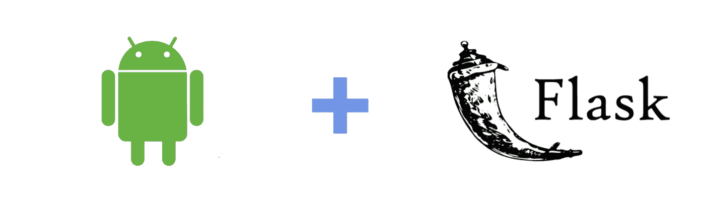
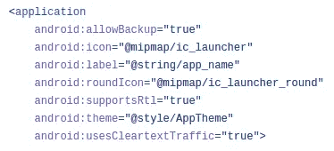

# 如何用 Flask server 制作客户端 android 应用

> 原文：<https://medium.com/analytics-vidhya/how-to-make-client-android-application-with-flask-for-server-side-8b1d5c55446e?source=collection_archive---------1----------------------->

您将了解如何连接 android studio 和 flask server。



荣誉属于我

我们都知道，与 PC 相比，移动设备并不强大，我们可以用智能手机做很多事情，但由于资源有限，我们大多数人认为这是一个弱点。

所以，从上一段我们可以得出结论，对于机器学习等很多事情，移动设备并不是最佳选择。当我们说机器学习时，我们还必须提到深度学习，因为这最后一个包括在内，为了记录，深度神经网络需要大量的样本来训练，所以我们另一方面需要大量的资源。

今天，我们将学习如何将一个用 java 编写的简单的 android 客户端应用程序连接到 python flask server，阅读完本文后，您将能够部署您的机器学习模型。您将需要 Android studio，HTTP 请求和响应在 Android 中使用 [OkHttp](https://square.github.io/okhttp/) 和 Pycharm IDE 进行 python 编码。

本教程将向您展示如何发送一个简单的文本，其中 Android 应用程序只是制作一个 HTTP POST 消息来发送它，另一方面，flask 应用程序将返回一个简单的消息来确认连接成功。

GitHub 上有这个项目的实现:[点击这里](https://github.com/dombroks/Android_client-Flask_server/)。

说够了，让我们开始吧…


来自 unsplash 的 Hal Gatewood

# 构建 Android 应用程序的布局

我们的应用程序设计简单，但这不会妨碍您在未来改进它。所以我决定在主界面上做一个按钮，当你点击这个按钮后，它将测试 android 应用程序和 flask 应用程序之间的连接，flask 应用程序返回的消息将显示为 Toast 通知。

您可以看到我们只使用了一个 ID = connect 的按钮。

构建好 app 用户界面(UI)后，下一步就是实现 postRequest `()`方法，负责消息发送。

但是，要做到这一点，我们必须经历一个小过程…


由[西尔万·索雷尔](https://medium.com/u/a4963fa09f17?source=post_page-----8b1d5c55446e--------------------------------)

首先，在使用 OkHttp 之前，项目必须支持使用它。您可以通过在 build.gradle(应用程序模块)的 dependencies 部分添加一行来实现这一点，这一行是:

```
implementation 'com.squareup.okhttp3:okhttp:4.5.0'
```

其次，您必须在您的应用程序中激活明文流量的使用，在中，您可以通过在清单文件的应用程序部分插入以下行来实现:

```
android:usesCleartextTraffic="true"
```

它会是这样的:



但是我们不要忘记在清单文件中添加下一个权限:

```
<uses-permission android:name="android.permission.INTERNET" />
```

没有它，您的应用程序将崩溃。

# 编写 Android 应用程序的 java 代码

现在，我们将转向 java 代码。

当你开始阅读代码时，你会注意到我们使用 IP@ 10.0.2.2，这只是 android 模拟器的默认本地地址，5000 是我们将与之一起使用的端口号。你会听到一些像 mediaType 和 requestBody 这样的词，mediaType 只是输入我们要发送的数据，如文本或图像等，requestBody 是保存我们消息的对象。这些是代码中的一些方法，你必须理解它们:

1.  `onFailure()`:当请求由于取消、连接问题或超时而无法执行时调用。
2.  `onResponse()`:远程服务器成功返回 HTTP 响应时调用。

剩下的代码很容易理解，但是如果你遇到了一些问题，你可以从这里的[回到 OkHttp 文档。](https://square.github.io/okhttp/)

现在，您可以测试应用程序，但它会显示一条错误消息，因为服务器已关闭。当我们提到服务器时，让我们继续使用 Flask 构建 Python HTTP 服务器。

# 使用 Flask 构建服务器端

**Flask** 是一个用 [Python](https://en.wikipedia.org/wiki/Python_(programming_language)) 编写的微型 [web 框架](https://en.wikipedia.org/wiki/Web_framework)。它被归类为[微框架](https://en.wikipedia.org/wiki/Microframework)，因为它不需要特殊的工具或库。它没有数据库抽象层、表单验证或任何其他组件，而现有的第三方库提供了通用功能。然而，Flask 支持可以添加应用程序特性的扩展，就好像它们是在 Flask 本身中实现的一样。 [*来自维基百科，免费百科*](https://en.wikipedia.org/wiki/Flask_(web_framework)) *。*

从上图中，你可以看到我们创建了一个 flask 应用程序作为`Flask()`类的实例，`app.route()`装饰函数将一个 URL 与一个回调函数相关联。`/`表示服务器的主页，因为 Android 应用程序的请求将被发送到那里。

`handle_request()`方法负责返回确认客户端和服务器之间连接的消息。

`run()`方法使用`host`参数来指定 IP 地址。当`host`设置为`“0.0.0.0”`时，这意味着使用当前的 IPv4 地址。当然还有，`5000`作为端口号。

`debug`参数用于允许服务器在代码改变时自动重启，否则你必须手动重启以应用新的改变。

# 最后一步:测试

你需要一个互联网连接。

现在，您将能够测试您的应用程序，您必须运行 android 应用程序和 python 代码，单击连接按钮，然后您会看到它将返回“成功连接”。

# 摘要

在这篇文章中，您了解了如何使用 python flask server 构建一个客户端 android 应用程序。你可以阅读一篇文章来学习如何保存你的机器学习模型以便稍后部署它，你只需点击这里，如果你想联系我，这是我的 [*LinkedIn*](https://www.linkedin.com/in/younes-belouche-641bb3197/) 帐户，我希望你喜欢，不要忘了打拍手鼓励我:)