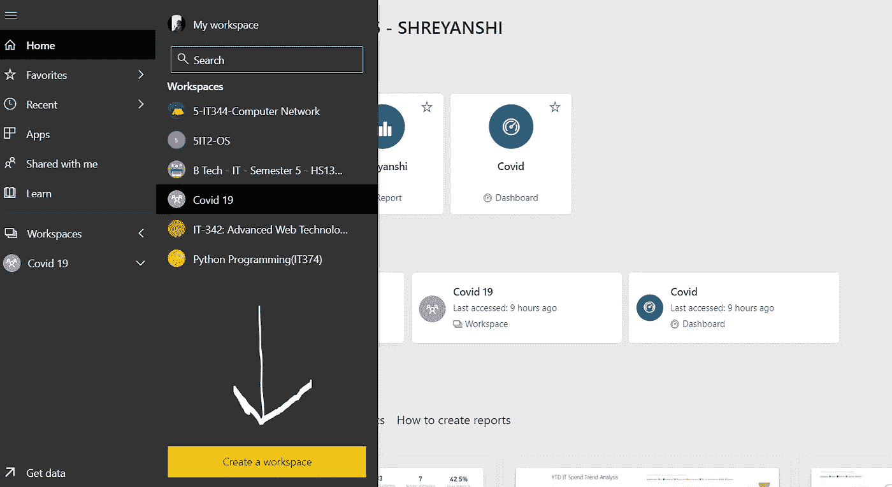

# 如何用 Power-BI 制作“新冠肺炎实时仪表盘”。

> 原文：<https://medium.com/analytics-vidhya/how-to-make-covid-19-live-dashboard-using-power-bi-e5424dae3d93?source=collection_archive---------9----------------------->

让我们不要以 Covid 的咆哮开始，而是数据如何成为新的金钱。我们有过多的数据，但如果我们没有以正确的方式建模，这些数据是没有用的，excel 表格中隐藏着无数的信息。

> *“信息是 21 世纪的石油，分析是内燃机”*

我将在这里解释如何创建自己的新冠肺炎现场仪表板的所有步骤。如果你发现它有帮助，那就分享它来帮助别人。

在 Power BI 本身上，我们将使用数据流函数进行数据的清理和导入。

1-登录到您的 PowerBI 帐户，单击创建工作区并相应地命名。使用数据流，你可能需要专业版，学生可以用他们的学生证，其余的可以享受 60 天免费试用。

2-点击数据流框，然后点击“添加新实体”。

3-点击文本/Csv 文件并插入提到的网址-[https://raw . githubusercontent . com/CSSEGISandData/新冠肺炎/master/csse _ covid _ 19 _ data/csse _ covid _ 19 _ time _ series/time _ series _ covid 19 _ confirmed _ global . Csv](https://raw.githubusercontent.com/CSSEGISandData/COVID-19/master/csse_covid_19_data/csse_covid_19_time_series/time_series_covid19_confirmed_global.csv)

这是 Covid 19 的动态数据，其中包含全球所有值，并且每天更新。

4-单击“下一步”将打开 Power BI 的 Web 版本，我们将在其中清理我们的数据。点击“转移”并继续。

为了清理数据，首先我们将去掉不需要的列- 3 和 4，因为我们不需要纬度，因为我们已经有了区域。

我们可以选择“使用第一行作为标题”选项来更好地修改。

任何好的数据集都不应该有空的行/列，而应该有正确的标题。为此，我们将选择国家/地区列，并右键单击它以选择“Unpivot other Columns”。

5.单击屏幕右侧的 source，然后单击公式栏更改删除“columns=digit ”,以便每天添加新列时不会显示任何错误。

6- Unpivot 操作完成，您可以根据需要重命名列。通过使用**区域设置**更改每个日期的数据类型，主要是日期。

祝贺你清理你的数据，你可以用你想要的名字保存它。

7-保存后，只需点击 3 点，使每天刷新所需时间的内容。

8-转到 Power BI，点击“获取数据”,选择 Power Plaatform，然后选择刚刚创建的数据流。点击**加载。**

9-在“列”工具选项卡中，通过选择具有国家类别的国家列来给出数据类别，数据列具有正确的格式。

10-让我们从显示正常的国家名称及其案例开始，因此选择条形图，将国家放在轴上，将案例放在标签上作为数值以便于理解。

12-这没有显示准确的结果，数值重复，所以我们必须找到最新的日期。对于单击新度量并在公式栏中键入此代码，max date = last date(' Covid Data '[CDate])。

现在，我们希望找到该日期的最新案例，因此，单击新的衡量标准，并在代码中写入，最新案例=

变量温度=[最大日期]

返回(

CALCULATE(sum('Covid 数据'[事例])，' Covid 数据'[CDate]= temp)

)

13-将“值”选项卡中的案例替换为最新案例，以获得准确的结果。另外，选择另一个名为多行卡片的图表，将最大日期和最新案例放在上面，以便更好地查看。

14-选择带状图，使用户了解国家/地区随时间的增长情况，轴=日期，图例=国家/地区，值=案例，过滤前 20 个或一些定义数量的国家/地区，以获得良好的可视化和比较分析。您可以从顶部的视图中更改颜色。

15-我们可以有另一个日期的功能，让用户从特定的时间跨度或特定日期检查图形，选择日期切片器，并与之间的功能过滤它。在字段中添加日期。

日期会改变图形，并给出图形表示。

此外，通过单击特定国家，您可以在图表中查看其进展情况，我们已经对其进行了交叉过滤。

太棒了。我们制作了新冠肺炎直播仪表板。

你可以点击发布按钮。转到 Power-BI web，选择您刚刚保存的报告，单击编辑，然后单击文件，最后单击发布到 web 以与其他人共享。

这些都是我身边的人说的。您可以从 [***这里***](http://bit.ly/Shreyanshishah) 进入我的仪表盘

教育的真正意义是用它来丰富你的社区，我很高兴收到你的来信并学习新的东西。如果你觉得这很有见地，那么请告诉我。敬请关注更多教程！