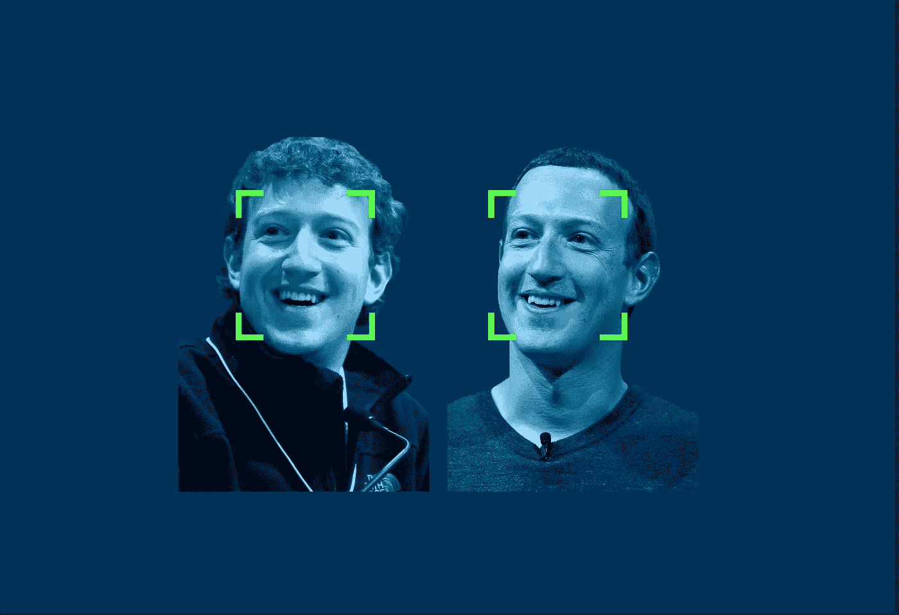
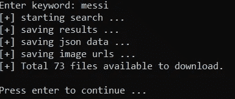
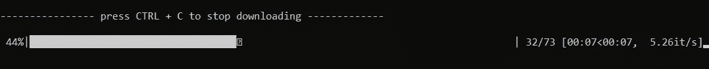
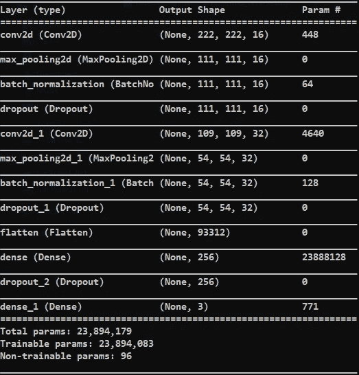
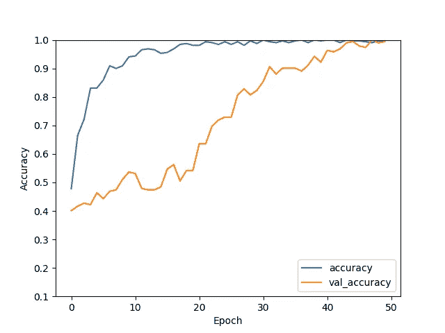
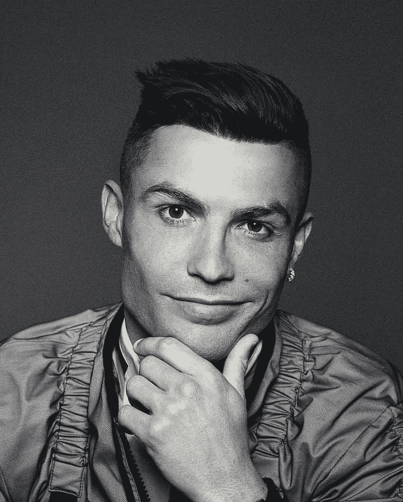
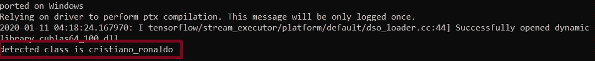

# 如何用 Tensorflow 2 和数据抓取进行人脸识别

> 原文：<https://medium.com/analytics-vidhya/how-to-make-face-recognition-with-tensorflow-2-and-data-scraping-fac960445e56?source=collection_archive---------4----------------------->

在这篇文章中，我们将使用自己的数据集(是的，我们将使用我的一个刮刀来创建数据集)来构建人脸识别系统，并从零开始建模，无需任何预先训练的模型或其他人的数据。你可以在这里找到相同[的代码](https://github.com/iamatulsingh/Face_Recognition_Tensorflow)



人脸识别

首先克隆并使用下面的命令创建数据集。Scraper 的名字是“pinterest ”,因为它从那里下载图片。请检查代码以获取更多信息。

[](https://github.com/iamatulsingh/pinterest-image-scrap/blob/master/pinterest.py) [## iamatulsingh/Pinterest-图像-废料

### 此时您不能执行该操作。您已使用另一个标签页或窗口登录。您已在另一个选项卡中注销，或者…

github.com](https://github.com/iamatulsingh/pinterest-image-scrap/blob/master/pinterest.py) 

```
git clone [https://github.com/iamatulsingh/pinterest-image-scrap.git](https://github.com/iamatulsingh/pinterest-image-scrap.git)
python3 [pinterest](https://github.com/iamatulsingh/pinterest-image-scrap.git).py
```

之后你会在屏幕上看到类似这样的东西。



于是我们刮出了“莱昂内尔·梅西”的影像资料。就像这样，你想刮多少就刮多少。同样，在完成抓取部分后，只需在项目的根目录下创建一个文件夹，并给它命名为“people”。把你所有刮下来的文件夹都存进去。现在这只是一个初始步骤，我们必须从图像中裁剪出人脸，因为我们正在创建人脸识别，所以我们希望只在人脸上训练我们的模型，而不是图像中的其他事物，为此我们将在代码中使用“ [MTCNN](https://github.com/ipazc/mtcnn) ”。

创建一个文件名为“[face _ detection _ operation . py](https://gist.github.com/iamatulsingh/390d4a54b8236b6e76c1914a0c5f65dd#file-face_detection_operation-py)”的文件，并将下面的代码复制粘贴到其中。这个文件将帮助我们清理数据。所以只要使用命令“python 3[face _ detection _ operation . py](https://gist.github.com/iamatulsingh/390d4a54b8236b6e76c1914a0c5f65dd#file-face_detection_operation-py)运行这个文件，它就会将图像中的所有人脸保存到数据集文件夹中。

如你所见，这里有两种方法。1)“保存 _ 裁剪 _ 面”和 2)“获取 _ 检测 _ 面”。我们将使用方法 1，即“save_cropped_face”用于从刮擦的图像中裁剪面部，而“get_detected_face”用于我们的模型预测。

现在我们将创建我们的模型。再次复制粘贴以下代码到新的文件名“模型. py”。



模型摘要

为了简单起见，我们将创建“face_recognition.py ”,它将包含我们与训练和预测相关的所有代码，以便我们可以将它导入主文件中，只需调用它的方法，我们就可以训练和测试模型。

必须创建一个文件名“main.py ”,并将以下代码复制粘贴到其中。这个文件将是我们将要执行的用于培训和测试的文件。

训练后，我们可以检查我们的模型准确性。仅仅过了 50 个纪元就相当不错了。



现在让我们看看我们模型的预测。我已经创建了一个“梅西、c 罗(CR7)和小内马尔”的数据集，所以让我们来测试一下。



test.jpg



预测结果

瞧啊。！！，你就用自己的数据集创建了自己的机器学习模型，用于人脸识别。

如果你喜欢这篇文章或者你有任何建议/反馈，请在这里评论。祝你有美好的一天😃。