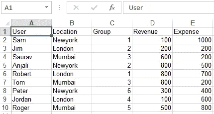
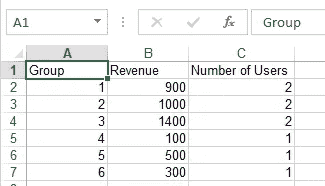
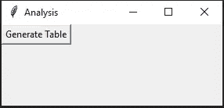

# 如何用 python 制作用于数据分析的 GUI

> 原文：<https://medium.com/analytics-vidhya/how-to-make-gui-in-python-for-data-analysis-f5cee63f4ff8?source=collection_archive---------2----------------------->


我写了一篇关于如何使用 Excel VBA 制作数据分析管道的中型文章。它很好地满足了我的大部分需求。但是 Excel 并不是处理大数据的好工具。我们需要处理的数据不断增加。

所以我写了一个 python 程序来处理我的数据分析工作。在本文中，我将概述我为数据分析任务创建 python 程序所采取的步骤。

我们在 excel 数据表中有以下数据。



我们有一个跨不同群体和地点的用户列表。收入和费用列包含每个用户给公司带来的收入和费用。

我们希望创建以下报告



对于每个组，我们希望合并收入和用户数量。在上一篇文章中，我使用 excel 创建了这个表。现在我将展示如何用 Python 创建这个表。

我正在使用 Python 3.6.9 和 Pandas 0.22 进行数据分析。你可以按照这个[网站](https://www.liquidweb.com/kb/install-pip-windows/)上的说明安装 python 和 pip。之后，您可以使用 pip 安装任何 python 库。只需在 cmd 上运行以下命令。

```
pip install library_name
```

然后我们首先导入熊猫图书馆

```
import pandas
```

在接下来的几个步骤中，我将展示制作 GUI 的代码。

**1。读取文件**

我们可以使用下面的代码读取数据文件

```
data = pandas.read_excel(‘data.xls’)
```

这将加载 pandas 的 Dataframe 对象中的数据。你可以在这里阅读更多关于熊猫[的 Dataframe API。Dataframe 在结构上类似于 Excel 表格。数据以类似于 Excel 的行列结构存储在 Dataframe 对象中。您可以像 Excel 一样通过引用行号和列号来访问 Dataframe 中的特定数据。此外，您可以通过引用数据的行名和列名来访问数据。](https://pandas.pydata.org/pandas-docs/stable/reference/api/pandas.DataFrame.html)

**2。创建表格**

我们可以通过下面的代码创建所需的表

```
groups = data.groupby('Group')
table = groups.agg({'Revenue':sum, 'Group': len})
```

pandas 的 Groupby 功能根据指定列中的数据将数据分成不同的组。你可以在这里阅读更多关于 Groupby API [的内容。](https://pandas.pydata.org/pandas-docs/stable/reference/groupby.html)

我们将 agg 函数应用于 Groupby 创建的组。我们为数据中“收入”列的聚合指定了 sum 函数，为“组”列的聚合指定了 len 函数。最终结果是包含每个组的总收入和用户数量的表格。

**3。保存表格**

现在，我们可以使用以下代码保存输出表

```
table.to_csv('table.csv')
```

这将把输出表保存为代码工作目录中的“table.csv”文件。

**4。Jupyter 笔记本**

以上所有代码我们都可以在 Jupyter notebook 中执行。这是我执行数据分析任务的常用工具。您可以在 jupyter notebook 中交互式地执行您的代码。您不仅可以处理数据，还可以在笔记本中查看和绘制数据。

如果你想与之共享代码的人也是程序员，那么你可以和他们共享你的代码。

**5 Tkinter GUI**

否则，您希望为非程序员提供 GUI 来与您的代码进行交互。对于用 python 创建 GUI，Tkinter 库是最好的库之一。

所以我用 Tkinter 为上面的代码做了一个图形用户界面，如下所示。

当您运行上面的代码时，会弹出如下所示的 GUI



GUI 就像在无限循环中运行的代码。在上面的代码中，第 18 行和第 25 行之间的代码运行了一次。然后 python 程序等待诸如点击按钮、菜单、鼠标悬停等事件。在我们的代码中，名为“生成表格”的按钮链接到分析函数。当用户点击“生成表格”按钮时，分析功能被调用。

分析功能通过窗口提示要求数据文件。选择文件后，数据将被处理。该函数要求保存名称，并用指定的名称保存文件。

**6。用 pyinstaller 编译**

然后，要分发程序，您需要使用 pyinstaller 库创建一个可执行文件。首先，您必须安装 pyinstaller 库。然后，您需要将步骤 5 中的代码保存为“filename.pyw”。请注意。pyw 扩展。如果您在 python 代码中使用 tkinter，那么您需要保存它。pyw 扩展，然后通过 pyinstaller 运行它。

然后打开命令提示符，进入代码所在的目录，在 cmd 中运行以下命令

```
pyinstaller --noconsole --onefile filename.pyw
```

这将在当前目录的“dist”子文件夹中保存“filename.exe”。您可以分发该可执行文件供组织中的其他人使用。

**总结**

从 Excel 跳到 python 语言是令人畏惧的。你不仅要学习 python 编程语言，还要学习很多库，比如 pandas 和 numpy。

然而一旦你掌握了库和语言。Python 为数据分析提供了更强大的功能。

在本文中，我只想对制作数据分析 GUI 所需的每个库进行基本介绍。在接下来的几篇文章中，我将详细介绍它们。

接下来，我将写如何使用熊猫图书馆做常见的 excel 任务。