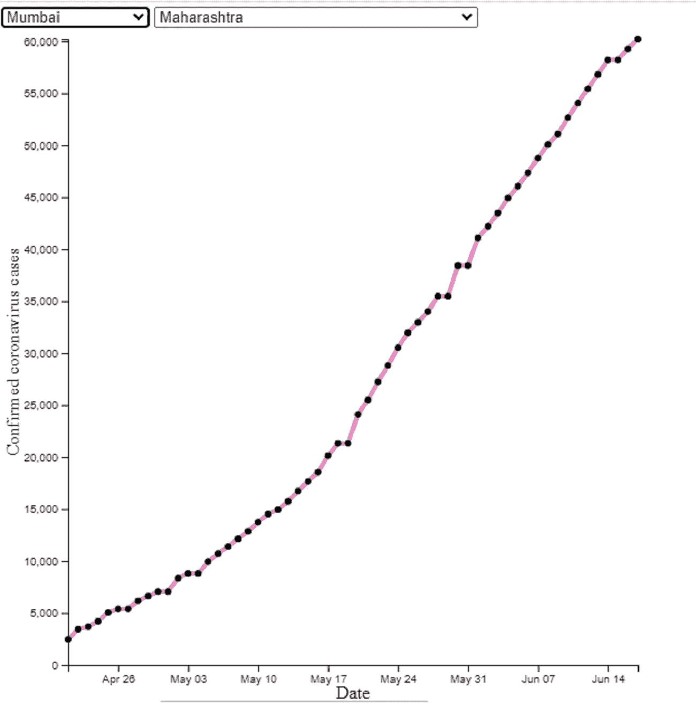
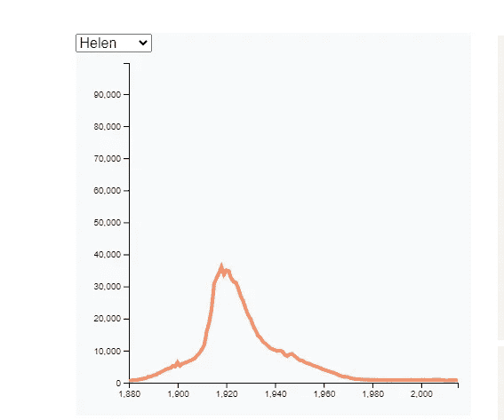

# 如何在 D3.js 中制作交互式折线图

> 原文：<https://medium.com/analytics-vidhya/how-to-make-interactive-line-chart-in-d3-js-4c5f2e6c0508?source=collection_archive---------3----------------------->



D3.js 是用于制作交互式数据驱动图表的 javascript 库。它可以用来制作最酷的图表。它的学习曲线非常陡峭。但是一旦你理解了 D3.js 的基础，你就可以制作最酷的图表。

在我上一篇[文章](/analytics-vidhya/analysis-of-indian-covid-data-6cd043856215)中，我写了如何使用 matplotlib 库绘制印度的 covid19 案例。但是使用 matplotlib 库制作的图表是静态的。它们只能包含一个故事。通常不止有一个故事要讲。用户希望与数据交互以查看多个视图。

互动互动图表的制作方法有很多。Plotly 库是用 python 制作交互式图表的好方法之一。但是我不想把自己限制在图书馆可能有的标准图表上。于是我学习了 D3.js 库。

一旦你克服了最初学习 D3 基础时的不适，你可以从 D3 示例库中的数千种图表类型中进行选择，并根据自己的需要进行修改。

我想显示 covid 案例的地区图表。所以我选择了这个折线图作为基础。

[](https://www.d3-graph-gallery.com/graph/line_filter.html) [## d3.js 折线图中的筛选器组

### 这个帖子描述了如何使用 d3.js 在折线图中平滑地在组之间过渡。它与此非常接近…

www.d3-graph-gallery.com](https://www.d3-graph-gallery.com/graph/line_filter.html) 

该图表从 csv 文件中读取数据，并为一个类别制作折线图。它允许你使用下拉菜单改变类别。

图表的 Javascript 代码如下所示:

可缩放矢量图形(SVG)用于在浏览器中定义形状。你可以告诉浏览器圆的位置和半径，而不是一个像素一个像素地画图像。同样的方法也适用于其他形状，如直线、弧线等等。D3 库允许分配形状和属性给你的数据。进一步与进入和退出方法，它允许您创建壮观的转变与您的数据。

在上面的代码中，第 1 到 15 行定义了浏览器中的 svg 元素及其大小。D3。csv 读取链接中给出的 CSV 文件，并执行数据的代码。

为了深入了解 D3，你可以通过下面的链接

[](https://www.d3indepth.com/) [## 深度 D3

### 关于 D3.js 的详细信息。

www.d3indepth.com](https://www.d3indepth.com/) 

为了制作我的图表，我将只讲述我对图表所做的更改。

这是上面给出的代码的基本图表:



我想更改代码，以便它直接从 Covid19india API 上可用的 JSON 数据中读取。x 轴需要从整数刻度更改为日期时间刻度。在当前的图表中，坐标轴不会随着数据的变化而更新，所以我修改了代码，使坐标轴随着数据自动更新。我还想添加第二个过滤器，这样我们有一个用于地区的过滤器，另一个用于州的过滤器。

D3.csv 函数读取 csv 文件，并将数据转换为以 csv 文件头为关键字的字典列表。Covid19india api 地区数据 api 以地区更新嵌套在州对象中且州对象进一步嵌套在顶层的格式给出数据。

所以我解析了从 API 接收的 json，如下所示:

```
d3.json('districts_daily.json', function(data) {
  var data2 = [];
for (state in data["districtsDaily"]) {
    for (district in data["districtsDaily"][state]) {
        for (day in data["districtsDaily"][state][district]) {
            days = data["districtsDaily"][state][district][day]
            var data3 = {};
            data3.states = state;
            data3.name = district;
            data3.date = days['date'];
            data3.active = days['active'];
            data3.confirmed = days['confirmed'];
            data3.deceased =days['deceased'];
            data3.recovered = days['recovered'];
            data2.push(data3)
          }}}
```

D3 将 json 数据作为字符串读取。您必须将其格式化为数字或日期时间格式。所以我将日期数据格式化如下

```
var parseTime = d3.timeParse("%Y-%m-%d");data2.forEach(function(d) {
      d.date = parseTime(d.date);
  });
```

javascript 的 Foreach 函数将日期时间转换应用于日期列的每个值。

我使用 javascript 的 map 函数提取了州和地区的列表，如下所示:

```
var districtlist = d3.map(data2, function(d){return(d.name)}).keys();
var statelist = d3.map(data2, function(d){return(d.states)}).keys();
```

javascript 的 Map 函数提取状态列数据并提取其唯一值。

我用下面的代码添加了地区和州的下拉菜单:

```
// add the options to the button
    d3.select("#districtButton")
      .selectAll('option')
      .data(districtlist)
      .enter()
     .append('option')
      .text(function (d) { return d; }) // text showed in the menu
      .attr("value", function (d) { return d; }) // corresponding value returned by the buttond3.select("#stateButton")
      .selectAll('myOptions')
      .data(statelist)
      .enter()
      .append('option')
      .text(function (d) { return d; }) // text showed in the menu
      .attr("value", function (d) { return d; }) // corresponding value returned by the button
```

这将创建一个 select 元素，并将其与我们在上面提取的地区和州的数据相关联。

我们使用以下代码创建日期时间 x 轴:

```
var x = d3.scaleTime()
      .domain([d3.min(firstdata, function(d) { return d.date; }),      d3.max(firstdata, function(d) { return d.date; })])
      .range([ 0, width ]);

svg.append("g")
      .attr('class', 'xaxis')
      .attr("transform", "translate(0," + height + ")")
      .call(d3.axisBottom(x));
```

它创建日期时间刻度，并使用它来缩放 x 轴。

我使用以下代码添加了 xlabel 和 ylabel:

```
//add xlabel
  // text label for the x axis
  svg.append("text")             
      .attr("transform",
            "translate(" + (width/2) + " ," + 
                           (height + margin.top + 20) + ")")
      .style("text-anchor", "middle")
      .text("Date");//add y label
 // text label for the y axis
  svg.append("text")
      .attr("transform", "rotate(-90)")
      .attr("y", 0 - margin.left)
      .attr("x",0 - (height / 2))
      .attr("dy", "1em")
      .style("text-anchor", "middle")
      .text("Confirmed coronavirus cases");
```

它将文本元素附加到 svg 中，并相对于轴的位置进行平移。

我修改了更新功能，以便在地区改变时修改轴并显示工具提示:

```
// When the button is changed, run the updateChart function
    d3.select("#districtButton").on("change", function(d) {
        // recover the option that has been chosen
        var selectedOption = d3.select(this).property("value")
        // run the updateChart function with this selected option
        update(selectedOption)
    })
 // A function that update the chart
    function update(selectedGroup) {// Create new data with the selection?
    var dataFilter = data2.filter(function(d){return d.name==selectedGroup})// Scale X axis    
     x.domain([ d3.min(dataFilter, function(d) { return d.date; }), d3.max(dataFilter, function(d) { return d.date; })]);// Scale Y axis
    y.domain([0, d3.max(dataFilter, function(d) { return +d.confirmed; })]);// Give these new data to update line
      line
          .datum(dataFilter)
          .transition()
          .duration(1000)
          .attr("d", d3.line()
            .x(function(d) { return x(d.date) })
            .y(function(d) { return y(+d.confirmed) })
          )
          .attr("stroke", function(d){ return myColor(selectedGroup) })//update x axis
    svg.select('.xaxis')
      .transition()
      .duration(1000)
      .call(d3.axisBottom(x));//update y axissvg.select('.yaxis')
     .transition()
     .duration(1000)
    .call(d3.axisLeft(y));}
```

每次区改变时，用区的值调用更新函数。它过滤地区的数据，并将其分配给线和轴元素。

由于数据的影响，过渡方法允许平稳过渡。

我想在线上显示工具提示。因此，我在上面给出的更新函数中添加了以下代码

```
// add the dots with tooltips
  var dot = svg.selectAll("circle")
     .data(dataFilter);dot.exit().remove();dot.enter().append("circle")
     .attr("r", 3)
     .merge(dot)
     .transition()
     .duration(1000)
     .attr("cx", function(d) { return x(d.date); })
     .attr("cy", function(d) { return y(+d.confirmed); })
     .on("mouseover", function(d) {
       tip.transition()
         .duration(200)
         .style("opacity", .9);
       tip.html(formatTime(d.date) + "<br/>" + d.confirmed)
         .style("left", (d3.event.pageX) + "px")
         .style("top", (d3.event.pageY - 28) + "px");
       })
     .on("mouseout", function(d) {
       tip.transition()
         .duration(500)
         .style("opacity", 0);
       });
```

一旦数据被分配给一个 svg 元素，D3 返回输入、更新和退出选择。在 exit selection 中，您可以定义现在没有数据分配给它 svg 元素会发生什么。

因此，我们使用 dot.exit()删除不再需要的点，因为它们属于出口选择。移除()。在使用数据方法更新分配给圆的数据后，移除方法应用于未分配数据的元素。

分配了数据但没有圆的点属于输入选择。我们在输入选择时使用 append 方法创建新的圆。

在 D3 v4 中，通过在输入选择时使用合并方法来创建更新选择。现在，您可以更改使用 enter 方法新创建的元素的属性，这些属性在 html 中已经存在。

如果你使用的是 D3 v3，那么就不需要使用 merge 方法。

现在，在 merge 方法中，我将一个 html 元素分配给了这个圆圈，它在鼠标经过时被激活，当鼠标移出元素时被停用。

我添加了第二个更新函数，当状态改变时触发:

```
// When the state button is changed, run the updategroup function
    d3.select("#stateButton").on("change", function(d) {
        // recover the option that has been chosen
        var selectedOption = d3.select(this).property("value")
        // run the updateChart function with this selected option
        update2(selectedOption)
    })
function update2(selectedGroup) {
    var newgroup = data2.filter(function(d){return d.states==selectedGroup});
    var newGroup = d3.map(newgroup, function(d){return(d.name)}).keys();
    console.log(newGroup)d3.select("#districtButton")
      .selectAll('option')
      .remove();// add the options to the button
    var newbutton = d3.select("#districtButton")
      .selectAll('option')
      .data(newGroup);

       newbutton
      .enter()
      .append('option')
      .text(function (d) { return d; }) // text showed in the menu
      .attr("value", function (d) { return d; });update(newGroup[0])}
```

每当使用州按钮改变州时，该州的区被分配到区按钮选项，整个图表用该州的第一个区更新。

我的最终图表如下:

如果您在媒体中查看有问题，您可以在以下链接中查看

[https://jsfiddle.net/rohitrajjsfiddle/o5tpq9s0/show](https://jsfiddle.net/rohitrajjsfiddle/o5tpq9s0/show)

它链接到 covid19india 网站的 api。您可以查看您所在地区的冠状病毒病例图表。

如果你喜欢这篇文章，请为文章鼓掌以示赞赏。