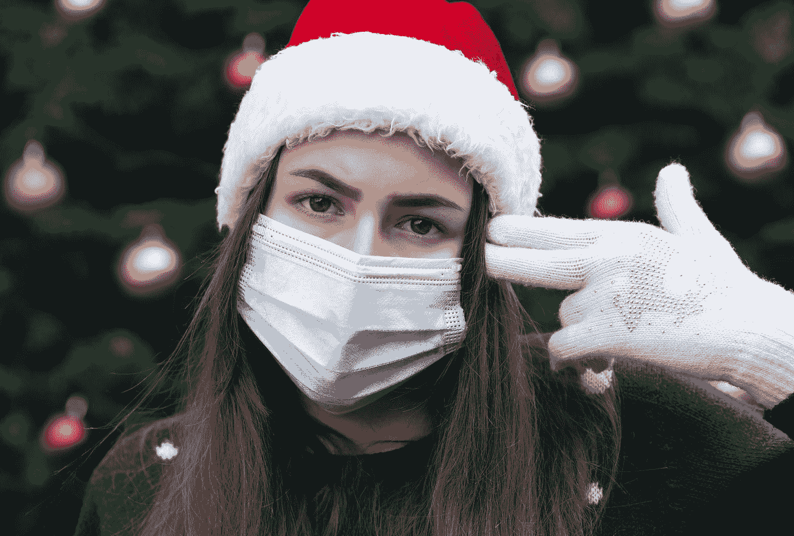
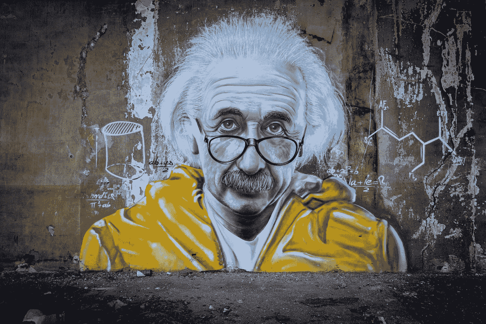
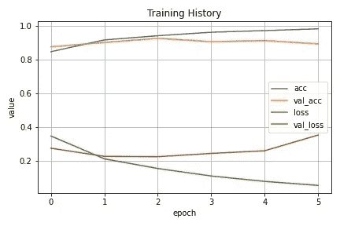
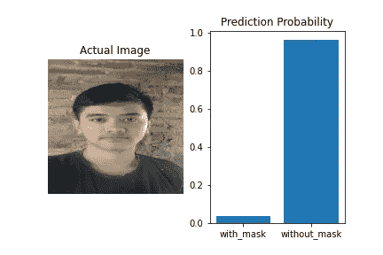

# 如何用 6 个步骤用 Python 制作掩膜检测 AI

> 原文：<https://medium.com/analytics-vidhya/how-to-make-mask-detection-ai-using-python-in-6-steps-157696e84871?source=collection_archive---------5----------------------->

## 使用 keras 一步一步创建面具检测人工智能的综合指南



[沃洛德梅尔·赫里先科](https://unsplash.com/@lunarts?utm_source=medium&utm_medium=referral)在 [Unsplash](https://unsplash.com?utm_source=medium&utm_medium=referral) 拍摄的照片

# 抽象

在这篇文章中，我想分享我制作面具检测应用程序的经验。我创建卷积神经网络使用 Keras，Python。这个项目的目的是对面部照片进行分类，这里我们将数据分为两类，这样我们就可以回答下面的问题。

> 那个人到底有没有戴面具？

我以前甚至没有想过这个想法，这个想法只是在我的脑海中闪过。我觉得这很酷，所以我很快就写完了。也许这就是爱因斯坦所说的证明。

> “想象力比知识更重要”



照片由[Taton moise](https://unsplash.com/@moyse?utm_source=medium&utm_medium=referral)在 [Unsplash](https://unsplash.com?utm_source=medium&utm_medium=referral) 上拍摄

# 项目工作流程

## **第一步:数据收集**

你可以在 Kaggle 网站上轻松找到数据集。我在找理想的数据集(下载大小不要太大也不要太小)。我最终决定使用下面的数据集。

[](https://www.kaggle.com/omkargurav/face-mask-dataset) [## 面罩检测数据集

### 面罩检测数据集 7553 幅图像

www.kaggle.com](https://www.kaggle.com/omkargurav/face-mask-dataset) 

数据集大小为 160 MB，包含 7553 张具有 3 通道 jpg 扩展(RGB)的照片。该数据集由 3725 张带面具的人脸照片和 3828 张不同照片大小的不带面具的人脸照片组成。您可以搜索大型数据集，并使用迁移学习来建立更精确的模型。

## 步骤 2:准备好环境

首先，您需要下载数据集并提取 zip 文件。重构目录，使其看起来像这样。

```
dataset
    ├── train 
    │   ├── with_mask
    │   └── without_mask
    └── valid
        ├── with_mask
        └── without_mask
```

接下来，我们需要导入所有需要的库。定义`loading_data()`函数来遍历目录，将目录中的所有文件放入 python 列表中。

## **第三步:数据预处理**

这里我不使用 Keras `flow_from_directory` 加载数据集，而是使用 Tensorflow input output `tf.io.read_file(path)` ，因为我想在训练模型之前创建一批数据，这样训练过程可以运行得更快。

在预处理过程中，您可以使用图像增强技术来改变数据，以便通过翻转、旋转、裁剪、缩放和移动图像位置来提高模型性能并避免过度拟合。

## 步骤 4:构建神经网络

我用 Keras 创建了一个卷积神经网络(CNN)。这里，我使用 Softmax 激活的密集第 2 层单元作为输出节点，因为我想要 2 个阵列输出，以便更容易接收预测的信息。因为，我也试过用 1 个单位的致密层进行 Sigmoid 激活，结果并不显著。

使用`model.summary()`函数获取模型摘要。

```
Model: "Mask Detector"
_________________________________________________________________
Layer (type)                 Output Shape              Param #   
=================================================================
conv2d_18 (Conv2D)           (None, 222, 222, 32)      896       
_________________________________________________________________
max_pooling2d_18 (MaxPooling (None, 111, 111, 32)      0         
_________________________________________________________________
conv2d_19 (Conv2D)           (None, 109, 109, 64)      18496     
_________________________________________________________________
max_pooling2d_19 (MaxPooling (None, 54, 54, 64)        0         
_________________________________________________________________
conv2d_20 (Conv2D)           (None, 52, 52, 128)       73856     
_________________________________________________________________
max_pooling2d_20 (MaxPooling (None, 26, 26, 128)       0         
_________________________________________________________________
flatten_6 (Flatten)          (None, 86528)             0         
_________________________________________________________________
dense_12 (Dense)             (None, 128)               11075712  
_________________________________________________________________
activation_6 (Activation)    (None, 128)               0         
_________________________________________________________________
dense_13 (Dense)             (None, 2)                 258       
_________________________________________________________________
activation_7 (Activation)    (None, 2)                 0         
=================================================================
Total params: 11,169,218
Trainable params: 11,169,218
Non-trainable params: 0
```

## 第五步:培训模式

训练过程仅运行 5 个时期。我还使用早期停止，这样如果模型在 3 个 epcohs 内没有改善，训练过程可以自动停止。这也用于避免过度拟合。



5 个时期的训练过程图

## 第六步:演示

我用 4 张模特从未见过的照片做了一个演示。这个结果让我很惊讶，因为这个模型可以用很大的概率值正确地预测一切。



神经网络预测人们不戴口罩

我使用`model.save('output/face_mask_ai.h5')`将模型保存到 h5 文件中，然后使用 opencv 库创建了一个 python 脚本。之后我尝试用这个模型通过视频进行预测。我使用视频的唯一原因是，如果使用摄像头实时完成，我的计算机太弱了。

# 解决

您可以在部署过程中继续这个项目，并将其创建为一个 API，以便在其他项目中使用。对于一个令人满意的投资组合，也许您可以在移动设备上创建一个口罩相机应用程序来实时检测口罩佩戴情况。应用程序应该使用 API 在线运行，这样就不会消耗智能手机的资源。

如果你想要这个项目的完整代码，你可以检查我的 Github 库【https://github.com/PhilipPurwoko/Face-Mask-Detection 

> 享受学习！