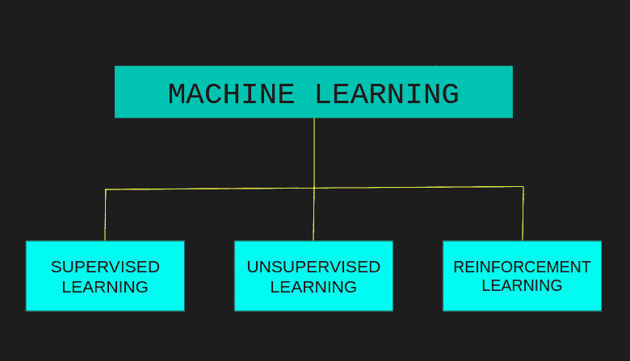
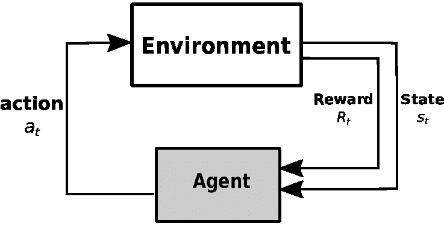
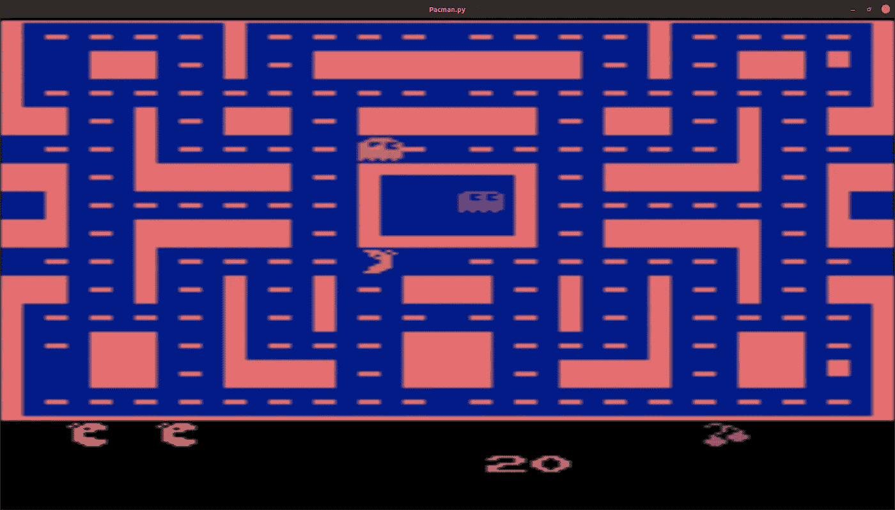

# 如何利用强化学习制作自学游戏？

> 原文：<https://medium.com/analytics-vidhya/how-to-make-self-learning-games-using-reinforcement-learning-dee2f8904b71?source=collection_archive---------3----------------------->

# 介绍

你好，世界！当我开始学习强化学习时，没有多少文章解释强化学习实现背后的代码是如何工作的。大部分只是教我什么是强化学习。

因此，我决定推出一个教程，帮助其他人理解我们在为街机游戏实现强化学习时使用的代码背后的直觉。在本教程中，我将触及强化学习的主题，然后一点一点地解释特定游戏的代码。

本教程的先决条件是:

对 Python 面向对象编程的基本理解

# 强化学习背后的直觉



强化学习是机器学习的一个分支，它不同于监督和非监督学习，因为它不需要数据集进行训练。



图来源:[https://www . researchgate . net/profile/Roohollah _ Amiri/publication/323867253/figure/fig 2/AS:606095550738432 @ 1521515848671/Reinforcement-Learning-Agent-and-environment . png](https://www.researchgate.net/profile/Roohollah_Amiri/publication/323867253/figure/fig2/AS:606095550738432@1521515848671/Reinforcement-Learning-Agent-and-Environment.png)

强化学习包括两个常量组件和三个随每个时间步长不断变化的组件。

常量组件包括:

*   代理——通过执行不同的动作来扮演积极角色的东西。
*   环境——代理外部的某种世界模型。它为代理提供观察，代理基于观察采取行动并为其行动获得奖励。环境基于代理所采取的动作来改变代理的状态。

我们的代理人的目标是找到一套行动，将最大限度地提高整体回报。

# 开放 AI 健身房

对于本教程，我们使用 OpenAI 的健身房。OpenAI 的 Gym 是一个工具包，可以帮助开发和比较各种强化学习算法。正如网站提到的，“我们提供环境；你提供算法。”健身房为我们提供了各种各样的环境，从基本的物理问题到不同的街机游戏。不要忘记查看他们的网站获取更多信息。https://gym.openai.com/

对于我们的教程，我们使用 Gym 提供的 Atari 游戏环境。而我们使用的具体环境是吃豆小姐，这是一款迷宫追逐街机游戏。

# 理解代码

在我们深入研究代码之前，如果您还没有下面的包，请确保您已经安装了它们。

## 必需的包

*   体育馆
*   健身房[雅达利]
*   张量流
*   matplotlib
*   收集
*   随意
*   numpy

您可以通过在终端中键入以下命令来安装该软件包。只需将“package_name”替换为包的名称。

```
pip install “package_name”
```

现在我们准备动手做一些编码工作。打开您选择的文本编辑器并导入包，如下所示。

*   健身房帮助我们创造一个环境和它的功能。
*   Matplotlib 绘制了我们的代理在一段时间内的性能。
*   集合存储来自环境的观察结果。
*   最后，所有 TensorFlow 软件包都有助于我们设计神经网络。

在导入所有的包之后，我们定义一些全局变量。

“集数”是我们的代理为训练自己而玩的游戏数。

load_model 变量决定我们是训练还是测试我们的代理。当 load_model 为 False 时，说明我们的 agent 是在训练而不是在测试。当代理在训练而不是测试时，神经网络在每 50 场比赛后保存权重。除此之外，培训和测试之间唯一的另一个重要区别是我们的代理类的超参数。

现在我们初始化一个类，并将其命名为 Agent。

让我们试着理解一些基本超参数背后的直觉。

*   state_size:由环境提供，是一个状态的大小。在帕克曼女士的案例中，是 128。
*   action_size:是一个代理可以采取的动作的数量，它可以是连续的；然而，在我们的例子中，它是 9 的离散值。
*   ε:该值介于 0 和 1 之间。该值越接近 0，我们的代理利用的就越多(用于测试)。该值越接近 1，我们的代理使用探索策略(在培训中使用)的次数就越多。

初始化之后，是时候给我们的代理一个大脑了。

我们使用 deque 数据类型作为代理的内存，并将其存储在一个名为 memory 的变量中。然后创建一个名为 model 的变量，它存储我们构建的神经网络，以决定采取什么行动。

继续，我们现在给我们的代理一些功能。

build_model 函数不接受输入，也不产生输出。然而，它创建了一个神经网络。神经网络的输入是代理所处的状态。网络的输出是我们的代理最终能得到的所有回报的近似值。把 output 想象成一个表格，其中第一列是行动列表，第二列是我们的代理在游戏结束时获得的相应行动的大概奖励。

第二个函数称为 get_action 函数，它将代理的状态作为输入。在使用神经网络之后，它返回动作，该动作具有最高可能报酬的近似值。

你们可能还记得，我们定义了一个可变内存。append_sample 函数将代理的状态、代理采取的行动、代理因该行动获得的奖励、基于代理行动的下一个状态以及游戏是否结束作为其输入。之后它将所有这些信息存储在代理的存储器中。该函数不返回任何输出。

train_model 是代理类的最后一个函数。您可以将这个函数称为 heavy lifter，即使它没有任何输入或输出。在这个函数中，我们从内存中随机抽取一个样本，然后训练我们创建的神经网络。随机样本的大小可以通过增加或减少超参数中 batch_size 的值来改变。

我们终于完成了代理类的编码，是时候让我们的代理进入现实世界，让它自己学习了。

我们首先创建一个环境实例，并将其保存在名为 env 的变量中。之后，我们从环境中获取 state_size 和 action_size。我们使用这两个变量来创建一个使用代理类的代理实例，并将其保存在名为 agent 的变量中。

既然我们已经把代理放在世界里面，是时候让代理在 x 个游戏中训练自己了，其中 x 是剧集的数量。

这个 for 循环中的每一次迭代都意味着我们的代理玩了一局游戏。在一局游戏中，我们的代理人有 3 次生命来最大化它的分数。在 for 循环内部，有一个 while 循环，它在代理没有完成时继续运行(3 个生命没有结束)。这个 while 循环是代理计算的主要症结。在这个循环中，我们的代理根据其所处的状态采取行动，为其行动获得奖励，并根据该行动改变其状态。不仅这些信息会被发送到内存中，而且基于这些信息，神经网络会自我更新。我们的特工每死一次，就获得 100 的负奖励。一旦我们的代理死了三次，这个游戏的最终分数和游戏号就存储在一个列表中，这个列表是我们在 for 循环之外初始化的。这些信息被绘制出来，我们打印出一些关于特定游戏/剧集的统计数据。一旦循环的一次迭代结束，环境被重置，整个过程重复。如果我们训练模型，每 50 场比赛，神经网络的权重就会被保存。

我们终于理解了所有的代码。这就是我们把所有东西放在一起时的样子。

就这样了，伙计们。现在我们保存我们的脚本，并到终端运行它。首先，导航到保存脚本的目录，通过键入下面的命令来运行它，观察操作的展开。

```
python “filename”
```



成功运行代码后，会弹出此窗口。

# 结论

代码到 GitHub 仓库的链接是

[](https://github.com/Jash-R/ReinforcmentLearning-For-MsPacman) [## 吴家浩-R/加强为微软学生学习

### Hello world，这个存储库为 Pacman 女士实现了强化学习。我们使用 Open AI 的健身房来获得 Pacman 女士的…

github.com](https://github.com/Jash-R/ReinforcmentLearning-For-MsPacman) 

我也制作了一个关于这个主题的短片。请随意查看。

我希望你已经对使用强化学习来玩街机游戏有了基本的了解。请随意试验代码以提高其性能。请注意，你需要给你的代理一些时间，让它看到一个巨大的进步。不要指望在几场训练后就成为 Pacman 女士世界冠军，除非你能获得灵感，自己创造一个；) .