# 如何使用多标签分类器制作自动标记器—第 1 部分

> 原文：<https://medium.com/analytics-vidhya/how-to-make-the-auto-tagger-using-multilabel-classifier-part-1-c8c9bceb9f6b?source=collection_archive---------1----------------------->

## Python 中自然语言处理的多标签分类


照片由 [Unsplash](https://unsplash.com/?utm_source=unsplash&utm_medium=referral&utm_content=creditCopyText) 上的 [Edgar Castrejon](https://unsplash.com/photos/1CsaVdwfIew?utm_source=unsplash&utm_medium=referral&utm_content=creditCopyText) 拍摄

**简介**

多标签分类是这样一类问题，其中每个对象被分配一组一个或多个目标标签。这与预测电影或歌曲的类型非常相似。一部电影或一首歌曲可以同时拥有一种或多种风格，这些目标标签之间不需要相互排斥。

**动机**

你一定遇到过 StackOverflow。你有没有想过，你在这个平台上提问的时候，那些相关的标签是怎么建议的？。这是多标签分类的一个典型用例。

下面是 [**演示**](/@gopal151295/auto-tagging-of-stack-overflow-questions-with-nlp-part-1-7ecdabe322ff)

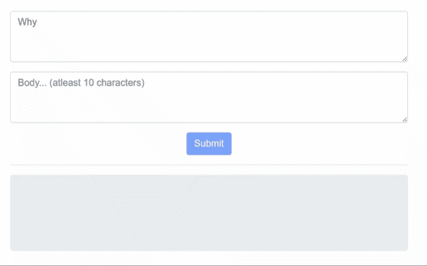

演示

如果你很想知道这是如何工作的，那么请系好安全带，因为我将一步一步地向你解释如何构建一个工具，为一个问题建议相关的标签。

这将是一个 **5 部分**教程系列。这是第一个。在这一部分，我们将探索我们的数据并进行数据分析。听起来很有趣？。但是数据在哪里呢？


来源[地理](https://gph.is/1kEV9yq)

我们将使用堆栈示例:10%的堆栈溢出 Q & A

先来导入 [**numpy**](http://www.numpy.org/) 和 [***熊猫***](https://pandas.pydata.org/)

> ***NumPy:*-**NumPy 是用 Python 进行科学计算的基础包。
> 
> ***熊猫:-*** 它用于数据操作和分析。特别是，它提供了数据结构和操作来操作数字表和时间序列。

```
***Output:-***
[‘Questions.csv’, ‘Tags.csv’, ‘Answers.csv’]
```

**加载数据集:-**

这里我们使用熊猫的 **read_csv 函数将我们的数据加载到数据框中**

> **DataFrame** 是一个表格或类似二维数组的结构，其中每一列包含一个变量的值，每一行包含每一列的一组值。

让我们来看看这个问题的数据框架。

*   **问题**包含 Id 为 10 的倍数的所有未删除堆栈溢出问题的标题、正文、创建日期、关闭日期(如果适用)、分数和所有者 ID。

```
ques.head()
```

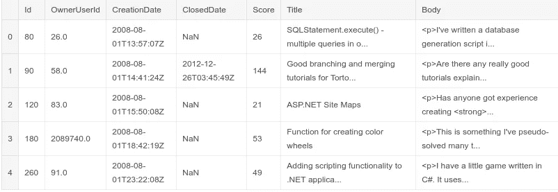

问题数据框架

这是答案数据框的外观。

*   **答案**包含这些问题每个答案的正文、创建日期、分数和所有者 ID。ParentId 列链接回问题表。

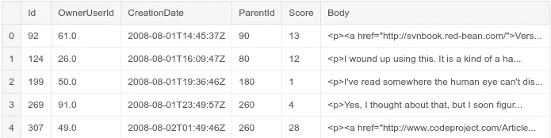

答案数据框架

和标签数据帧

*   **标签**包含每个问题的标签

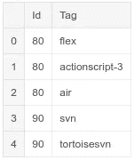

标签数据帧

**让我们看看有多少问题、答案和标签。**

> shape 属性返回数据框的维度。在我们的例子中，它是二维的，其中第一个数字代表我们有多少个条目，第二个数字代表每个条目的属性。

```
Ques shape:  (1264216, 7)
Ans shape:  (2014516, 6)
Tags shape:  (3750994, 2)
```

**让我们将数据集可视化，以便更好地理解它。**

绘制**问题 id**与其**答案计数**的分布图。为了绘制这个图形，我们将使用 [**matplotlib**](https://matplotlib.org/)

> matplotlib 是一个非常棒的 Python 可视化库，用于数组的 2D 绘图。
> 
> 一个**计数器**是`*dict*`的子类，顾名思义，它对可散列对象进行计数。基本上，它将元素存储为字典键，将它们的计数存储为字典值:

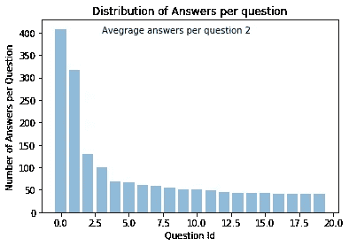

绘制**答案计数**与**问题计数**的分布图

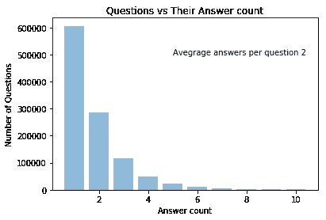

绘制**标签数与问题数的分布图**

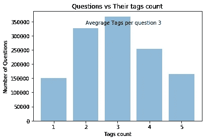

让我们看看 StackOverflow 上哪些标签**最受欢迎**。

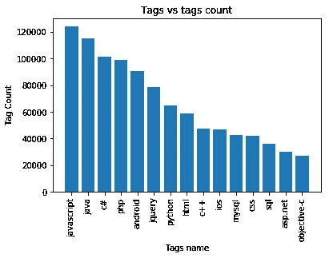

[s](https://media.giphy.com/media/c20UV66B7zCWA/giphy.gif) 源[吉菲](https://media.giphy.com/media/oOTTyHRHj0HYY/giphy.gif)

让我们探索问题数据集，看看**在平台上发布**问题的趋势是如何随着时间的推移而变化的。

我们将每月对问题数据集进行重新采样，为此，我们需要根据问题的创建日期对数据进行重新索引

> Pandas `***dataframe.resample()***`函数主要用于时间序列数据。
> 时间序列是按时间顺序索引(或列出或绘制)的一系列数据点。

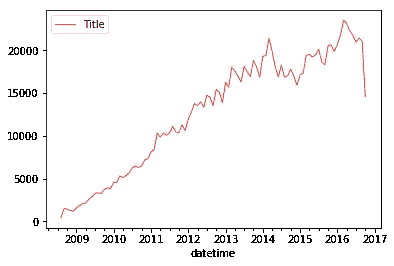

张贴的问题数量随时间变化的图表

众所周知，一个问题可以有多个标签。在标签数据集中,“Id”字段表示问题 Id,“Tag”表示分配给它的标签。

要查看分配给每个问题的所有标签，让我们按“Id”字段对这些标签进行分组，并按空格字符连接这些标签。分组后，我们需要重置标签数据集的索引。

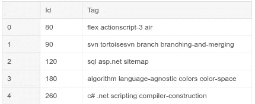

分别合并了每个问题的标签

**过滤问题数据集**

我们现在处理的问题太多了。如果我们要用这么多的问题来训练我们的机器学习模型，这将永远需要时间。

现在，我们将只保留那些得分大于或等于 5 分的问题，并删除不必要的列。这有两个目的。

> 第一:我们将不必处理大量的问题。
> 
> 第二:-我们的模型将只训练质量问题。

**你已经听过无数遍了。你没有吗？**

> 垃圾输入，垃圾输出(GIGO)
> 由于提供的数据不准确，程序会给出不准确的结果，因为计算机总是试图处理提供给它的数据。换句话说，一个系统的输出质量通常不会比输入质量更好。

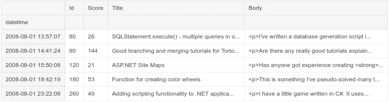

得分大于或等于 5 分的问题

只是为了确认我们的数据集中是否有空的或者重复的条目。

```
**isNull**
Id       0
Score    0
Title    0
Body     0
dtype: int64**isDuplicate** 0
```

对于进一步的数据处理，我们将在“Id”的基础上**合并问题数据帧和标签数据帧**

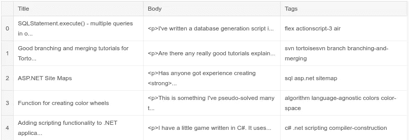

最终问题数据框架

目前就这些。

在下一部分，我们将使用自然语言处理来获得更多关于问题和答案的见解。

# 这篇文章值得多少掌声？

如果你喜欢这篇文章，请多次鼓掌(你知道你想！)或与朋友分享。你可以给哪个故事 50 个掌声的限制…尽量不要超过:)💥嘣！这让我更专注于写更多。

# 说到这个…

如果我设法让你注意到这一点，请留下评论，描述这篇文章如何对你产生影响，以及你想知道的关于媒介写作的其他话题。