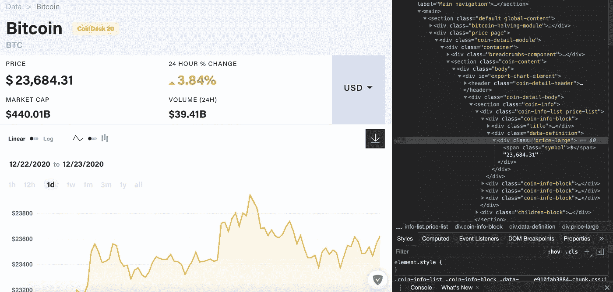
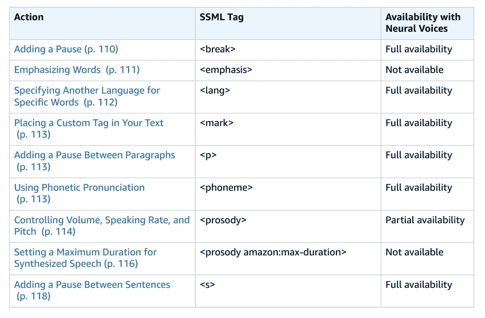
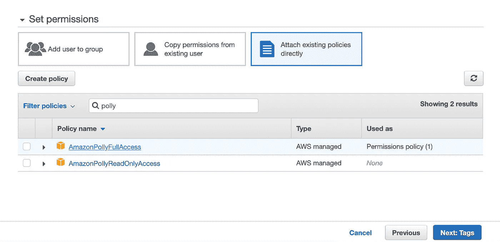

# 如何用 Python 和 Amazon Polly 制作完全可定制的音频助理

> 原文：<https://medium.com/analytics-vidhya/how-to-make-your-own-fully-customizable-audio-assistant-with-python-and-amazon-polly-def49074d5e9?source=collection_archive---------5----------------------->


马库斯·温克勒在 [Unsplash](https://unsplash.com?utm_source=medium&utm_medium=referral) 上的照片

你正开车从一个重要的约会赶往另一个约会(在目前的情况下，你可能更倾向于参加在线会议)，你需要为工作、运动和社交活动找到时间——你的时间是有限而宝贵的。理想情况下，您希望与您和您的企业相关的新闻和数据被自动收集起来，并在两次约会之间以简短的音频消息的形式读给您听:定制的、过滤的新闻——每天。

在本文中，我们将尝试使用 Python、web 抓取、简单的数学方程和 Amazon Polly 来解决这个问题。结果应该是一个完全自动化的助手，它每天在指定的时间准备并读出每日报告。

*一如既往，我的文章旨在教你项目中使用的工具的基础知识，并让你了解如何使用当前的技术创造性地解决问题。*

## 我们从哪里开始？我们需要什么？

该项目分为以下工作包:

1.**计划** —我想在每日报告中听到什么？我在哪里可以获得这方面所需的信息？

2.**代码**——编写一个程序，获取需要的信息，做一些简单的功能，将信息打包成短信。

3.**亚马逊网络服务(AWS) —亚马逊 Polly** —创建一个 AWS 账户，执行设置，在我们的代码中包含 Polly，并对我们的文本执行神经文本到语音转换(NTTS)。

## 1.内容是什么，我们从哪里获得？

在这个项目中，我为自己设定了获取以下信息的目标:

*   今天的日期和天气预报。
*   比特币和 IOTA 的当前价格
*   比特币当前价格与特定购买价值的比率
*   对价格发展趋势的预测。(由于这部分内容会非常广泛，我会在下一篇文章《音频助手第二部分》中参考)。
*   某些股票的表现
*   从个人选择的列表中随机引用

当然，你可以按照自己喜欢的方式定制新闻，并使用同样的技术添加你从网上搜集到的任何信息。

大部分信息都可以在网上找到，用 BeautifulSoup 搜集。为此，我们需要找到包含所需信息的网页，并在 HTML 丛林中奋力寻找我们想要的容器。为了不超出本文的范围，我不会详细讨论这个问题。然而，如果你不熟悉刮痧或美容，请看看我的上一篇文章:

[](/analytics-vidhya/how-to-find-a-car-under-market-value-with-python-beautifulsoup-and-your-own-telegram-bot-c9d91e23c0d1) [## 如何找到低于市场价值的汽车——使用 Python、BeautifulSoup 和您自己的 Telegram Bot。

### 买车是一项需要深思熟虑的投资。但是，当你在竞争时，你如何找到一个好的报价…

medium.com](/analytics-vidhya/how-to-find-a-car-under-market-value-with-python-beautifulsoup-and-your-own-telegram-bot-c9d91e23c0d1) 

在这里，我通过展示一个例子来解释抓取的基本原理，这个例子展示了如何提取你正在寻找的信息，处理它，并设置一个电报机器人来发送自动警报消息。

对于这个项目，我们将使用 coindesk 网站拉比特币和 IOTA 价格。由于一次只有一个值，所以搜索相对简单。查找 HTML 代码，我们可以看到当前值在带有 span 标签的 div 容器“price-large”中。



比特币 HTML-容器

对于天气，我使用网站 wetter.de，同样可以很快发现 div 容器“weather-daybox-minMax”包含两个对象:当天的最高温度和最低温度。为了获得特斯拉股票的当前价格，我使用了 marketwatch 网站。

## 2.让我们开始编码吧

我们的代码主要包括清理收集的数据，做一些简单的计算，创建一个报价列表，一个随机的报价输出，然后将所有信息保存在一个文本中。然后我们嵌入 Amazon Polly，让她朗读我们的文本。首先，我们加载所需的库，我们需要。要使用 Amazon Polly，我们需要从 AWS 服务加载 Boto3 库。

```
import requests
from bs4 import BeautifulSoup
from requests import get
import pandas as pd
import decimal
import itertools
import schedule
import time
import random
from time import sleep
from datetime import datetime
import matplotlib.pyplot as plt
import seaborn as sns
from datetime import date
import boto3
```

为了清理数据(温度、比特币、IOTA、股票价格)，我们再次使用 join、isdigit 和 filter 函数。然后我们把对象转换成整数。这样，原始数据就可以使用了。

```
price = ''.join(filter(lambda i: i.isdigit(), price))
price = int(price)
```

**天气和日期:**为了获得当前日期，我们从“datetime”中导入了“date”。使用函数 date.today()我们可以获得当前日期。用名称%B 我们可以得到月份，用%d 可以得到当天的数字。此选项在音频文件中最有意义。我把关于温度和日期的信息结合成一句话:

```
d = date.today()
date = d.strftime("%B %d")
print("date =", date)
dateweather = "Hello Alexander, today is " + date +" and the maximum temperature is "+ temperature +"° celsius."
```

输出如下所示:

```
date = December 23
Hello Alexander, today is December 23 and the maximum temperature is 18° celsius.
```

**Crypto:** 为了自动给出我们盈利或亏损的信息，我们首先输入一个“购买”值，我们(理论上)购买了硬币，并执行一些简单的计算。假设我们花 17.000 美元买了一个比特币，想知道盈亏情况:

```
CurrentStr = str(Current)
Bought=17000
BoughtStr = str(Bought)
Ratio = Bought/Current
Difference = Current-Bought
DifferenceStr = str(Difference)
IotaStr=str(IOTA_value)
if Difference > 0:

    BitcoinText = "The bitcoin price today is " + CurrentStr + ", which     means you have made a profit of " + DifferenceStr
else:
    Difference = Bought-Current
    DifferenceStr = str(Difference)
    BitcoinText = "The bitcoin price today is" + CurrentStr + ". As of today you have made a loss of " + DifferenceStr

IOTA_Text = "The current price for IOTA is " + IotaStr + "dollars."
crypto = BitcoinText + IOTA_Text
```


[吉利](https://unsplash.com/@gillyberlin?utm_source=medium&utm_medium=referral)在 [Unsplash](https://unsplash.com?utm_source=medium&utm_medium=referral) 上拍摄的照片

**语录:**现在我们创建一个有趣语录列表，每天从列表中随机抽取一段语录发送给我们。创建列表:

```
quote_list =["InsertQuote1Here","InsertQuote2Here","InsertQuote3Here"]
#insert as many quotes in the list as you like
```

我为此收集了十句名言，并把它们列在这个列表上。要获得随机报价，我们可以使用 random.choice 函数。为此，我们一开始就导入了‘Random’库。

```
random_quote = random.choice(quote_list)
```

**将所有零件放在一起:**

```
finaltext = dateweather + crypto + stock + random_quote
```

## 3.文本到语音

现在有趣的部分来了。在神经文本到语音的帮助下，我们将文本变得栩栩如生。Amazon Polly 支持某些 SSML 标签，以便在文本中进行更精确的设置。为此有许多标签。可以在[这里](https://docs.aws.amazon.com/de_de/polly/latest/dg/supportedtags.html)找到它们的概述。

对于这个短消息，我们可以使用标签<break>和</break>

在消息之间添加逻辑中断。不过也有很多有趣的标签，比如轻声说话或者耳语<effect name="”whispered”">。另一个有趣的功能是强调，当某个单词应该被强调时——使用标签 *<强调>。*</effect>



一些 SSML 标签的概述

为了让 Polly 运行起来，我们首先需要创建一个免费的 AWS Amazon 帐户。这包括许多免费功能和许多服务的有限使用。亚马逊 Polly 每个字符的成本:标准 TTS 版本为 100 万个字符(大约 23 小时的音频)支付 4 美元，神经 TTS 版本(听起来不那么机器人化)为 100 万个字符支付 16 美元。然而，前 12 个月是完全免费的，最多 100 万字的配额。

创建 AWS 帐户后，我们需要创建我们的 AWS 凭据。为此，我们转到 AWS 服务中的“IAM”。在“用户”选项卡中，我们可以创建一个新用户。在接下来的创建步骤中，我们为其提供“编程访问”并分配所需的权限。为此，我们转到“直接附加现有策略”并选择“AmazonPollyFullAccess”。一旦创建了用户，保存“访问密钥 ID”和“秘密访问密钥”是很重要的，因为我们将在设置时立即需要它们。



授予此用户完全 Polly 访问权限

接下来，我们安装 Amazon CLI——这是一个用作 AWS 命令行接口的工具。你可以在这里下载 CLI。安装完成后，我们可以通过命令提示符或终端输入命令“aws configure”来输入我们的用户。在这里，我们输入刚刚创建的 AWS 访问密钥 ID 和 AWS 秘密访问密钥，选择一个地区(例如 us-east-2)。*旁注:你可以使用命令“aws 帮助”来显示帮助页面。*

这就完成了设置，我们可以继续代码。一开始，我们已经导入了 Boto3 库来使用该服务。现在我们只需要输入我们想使用的服务，我们的输入文本，输出格式，我们选择的声音，以及我们想使用标准版本还是神经版本。最后一部分是保存音频文件。

```
polly = boto3.client('polly')
spoken_text = polly.synthesize_speech(Text=finaltext,
                                      OutputFormat='mp3',
                                      VoiceId='Joanna',
                                      Engine='neural')
with open('news2.mp3', 'wb') as daily:
    daily.write(spoken_text['AudioStream'].read())
    daily.close()
```

当我们运行该程序时，所有的数据将被收集、准备并创建音频文件。你现在如何处理这个文件取决于你自己。你可以在家里或路上在笔记本上播放，或者再写几行代码，通过电报机器人自动将音频文件发送给你。

我已经在 soundcloud 上传了今天新闻的最终结果: