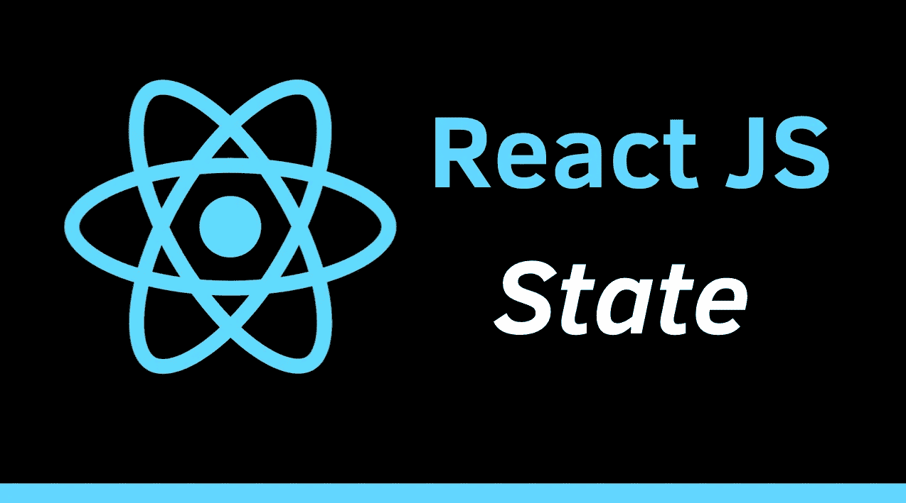

# 如何在 React 中管理状态

> 原文：<https://medium.com/analytics-vidhya/how-to-manage-state-in-react-62173c8bfa24?source=collection_archive---------12----------------------->



在管理 react 组件的状态时，有几种方法可以做到。所以首先我们要定义什么是状态和组件

React 代码由称为组件的实体组成。可以使用 React DOM 库将组件呈现给 DOM 中的特定元素。当呈现一个组件时，可以传入被称为“道具”的值

组件的状态是一组管理其内部发生的事情的方法。例如，您有 ComponentWillMount()方法，该方法在组件呈现时执行，并允许您编写代码在组件呈现时进行 API 调用或向组件分配一些数据。

以下是可用的方法:

**方法你可以返回一个布尔值，指定 React 是否应该继续渲染。**

```
shouldComponentUpdate() {
    return false;
  }
```

**当组件将要从 DOM 中移除时，调用方法。**

```
componentWillUnmount() {

  }
```

当组件将要从 DOM 中移除时，调用方法。

```
componentWillUnmount() {

  }
```

**方法在组件初始化之前被调用，这是设置初始状态和其他初始值的自然位置。**

```
constructor(props) {
    super(props);
    this.state = {favoritecolor: "red"};

 }
```

**在呈现 DOM 中的元素之前调用方法。**

```
getDerivedStateFromProps(props, state) {

  }
```

**组件在 DOM 中更新后调用方法。**

```
componentDidUpdate() {
}
```

react 中管理状态的这种方式是使用基于类的组件，要知道你是否使用基于类的组件，你必须检查你是如何声明组件的。例如

```
class Header extends React.Component {
  constructor(props) {
    super(props);
    this.state = {favoritecolor: "red"};
  }
  render() {
    return (
      <h1>My Favorite Color is {this.state.favoritecolor}</h1>
    );
  }
}
```

这是一个基于类的组件，因为它以类开始，并且有一个构造函数和一个呈现方法。这里要使用状态你必须使用关键字 **this** 来引用组件，然后 de 属性 state。要初始化状态，可以在构造函数内部或组件内部完成。

```
class Header extends React.Component {
  constructor(props) {
    super(props);
    this.state = {count: 0};
  }
 **** render() {
    return (
      <button onClick={() => this.setState({count:count+1})}>The count is {this.state.count}</button>
    );
  }
}
```

因此，我们解释如何在基于类的组件中管理状态，但是在 React 中有两种主要的声明组件的方式，即通过功能组件和基于类的组件。

# 功能组件

功能组件是用一个函数声明的，该函数随后返回一些 JSX。

```
Let's start with a simple example of a Functional Component in React defined as App which returns JSX:import React from 'react';

function App() {
  const greeting = 'Hello Function Component!';

  return <h1>{greeting}</h1>;
}

export default App;
```

您可能已经注意到，功能组件是一个没有呈现功能的 React 组件。函数体中定义的一切都是渲染函数，它最终返回 JSX。

人们称之为功能性无状态组件，因为它们是无状态的，由一个函数来表达。然而，React 钩子使得函数组件中的状态成为可能。

# 基于类的组件

使用 [ES6](https://en.wikipedia.org/wiki/ECMAScript) 类声明基于类的组件。

```
import React,{Component} from "react"
import ReactDOM from "react-dom"
class MyComponent extends Component {
render() {
return(
<h1> Hello world </h1>
 )
}
}
ReactDOM.render(<MyComponent/> ,document.getElementById('root'))
```

组件的定义以粗体显示。步骤如下:

*   `MyComponent`简单地继承自`React.Component`类。
*   调用`render()`方法在浏览器中显示元素。`render()`本质上是一种生命周期方法。这是在创建基于类的组件中为数不多的新信息之一。

# 反应钩

挂钩是让开发人员从功能组件“挂钩”反应状态和生命周期特性的功能。它们使代码可读性强，易于理解。钩子在类内部不起作用——它们让你在没有类的情况下使用 React。

React 提供了一些内置的钩子，比如`useState`、`useContext`、`useReducer`和`useEffect`等等。它们都在 Hooks API 参考中有说明。使用最多的`useState`和`useEffect`分别用于控制 React 组件中的状态和副作用。

# 钩子的规则

钩子也是有规则的，一定要遵守才能用。

1.  钩子应该只在顶层调用(而不是在循环或 if 语句中)。
2.  挂钩只能从 React 函数组件调用，而不能从普通函数或类组件调用

# 但是什么是钩子呢？

挂钩是让您从功能组件“挂钩”React 状态和生命周期特性的功能。钩子在类内部不起作用——它们让你在没有类的情况下使用 React。(我们[不建议](https://reactjs.org/docs/hooks-intro.html#gradual-adoption-strategy)在一夜之间重写你现有的组件，但是如果你愿意，你可以在新的组件中使用钩子。)

React 提供了几个类似`useState`的内置钩子。您还可以创建自己的挂钩，以便在不同组件之间重用有状态行为。我们先来看看内置挂钩

```
import React, { useState, useEffect } from 'react';function Example() {
  const [count, setCount] = useState(0); // Similar to componentDidMount and componentDidUpdate:
  useEffect(() => {
    // Update the document title using the browser API
    document.title = `You clicked ${count} times`;
  }); return (
    <div>
      <p>You clicked {count} times</p>
      <button onClick={() => setCount(count + 1)}>
        Click me
      </button>
    </div>
  );
}
```

效果挂钩 useEffect 增加了从函数组件执行副作用的能力。它与 React 类中的 componentDidMount、componentDidUpdate 和 componentWillUnmount 的作用相同，但是统一到一个 API 中。(在使用效果挂钩时，我们将展示将 useEffect 与这些方法进行比较的示例。)

当您调用 useEffect 时，您是在告诉 React 在刷新对 DOM 的更改后运行您的“Effect”函数。效果是在组件内部声明的，因此它们可以访问其属性和状态。默认情况下，React 会在每次渲染后运行效果，包括第一次渲染。(在使用效果钩子时，我们将更多地讨论这与类生命周期的比较。)

# 定制挂钩

构建您自己的钩子(称为定制钩子)可以让您将组件逻辑提取到可重用的函数中。自定义钩子是一个 JavaScript 函数，它的名字以“use”开头，可以调用其他钩子。钩子的规则也适用于它们，也就是说，定制钩子应该按照 React 执行的规则编写，否则很有可能破坏代码的完整性。查看下面的链接，了解创建定制钩子的规则。

```
import React, { useState } from 'react';function Example() {
  // Declare a new state variable, which we'll call "count"
  const [count, setCount] = useState(0); return (
    <div>
      <p>You clicked {count} times</p>
      <button onClick={() => setCount(count + 1)}>
        Click me
      </button>
    </div>
  );
}
```

在这里，useState 是一个钩子(我们一会儿会谈到这是什么意思)。我们在函数组件内部调用它，为它添加一些本地状态。React 将在重新渲染之间保持这种状态。useState 返回一对值:当前状态值和一个允许您更新它的函数。您可以从事件处理程序或其他地方调用该函数。它类似于类中的 this.setState，只是它没有将新旧状态合并在一起。(我们将展示一个使用状态钩子比较 useState 和 this.state 的例子。)

**参考文献:**

[](https://reactjs.org/docs/hooks-intro.html) [## 介绍钩子-反应

### 钩子是 React 16.8 中的新增功能。它们允许您使用状态和其他 React 特性，而无需编写类。这个…

reactjs.org](https://reactjs.org/docs/hooks-intro.html) [](https://reactjs.org/docs/hooks-reference.html) [## 钩子 API 参考-反应

### 钩子是 React 16.8 中的新增功能。它们允许您使用状态和其他 React 特性，而无需编写类。这个…

reactjs.org](https://reactjs.org/docs/hooks-reference.html) [](https://www.geeksforgeeks.org/reactjs-class-based-components/) [## ReactJS |基于类的组件

### 基于类的组件是 ReactJS 中构建的大多数现代 web 应用程序的基础。这些组件更简单…

www.geeksforgeeks.org](https://www.geeksforgeeks.org/reactjs-class-based-components/) [](https://www.robinwieruch.de/react-function-component) [## 反应功能部件- RWieruch

### React 功能组件-也称为 React 功能组件-是编写现代 React 的现状…

www.robinwieruch.de](https://www.robinwieruch.de/react-function-component)