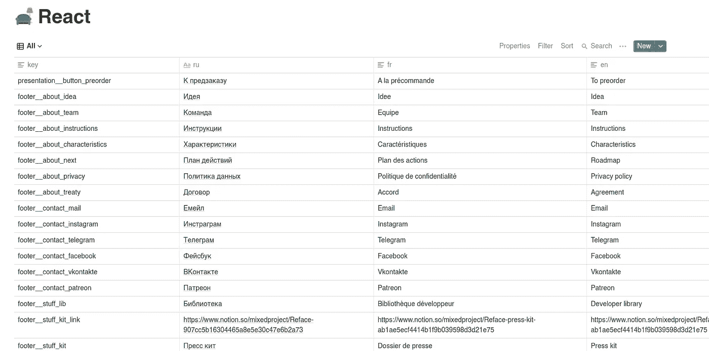

# 如何管理 React 应用程序的翻译

> 原文：<https://medium.com/analytics-vidhya/how-to-manage-translations-of-a-react-application-55b46e6409da?source=collection_archive---------12----------------------->

## 向导

以及如何在翻译任务适当分配的情况下做到这一点


很长一段时间以来，我一直想知道是否存在一种工具，可以在云中的一个表中管理我的网站的翻译。

**在一张表中管理多种语言的好处:**

1.  更快地管理，因为您看到了缺少的翻译
2.  您可以将链接复制到表格，并将其发送给翻译人员

但是 React i18n 的原生解决方案不允许这样做。

**现在让我自我介绍一下。**

我是一家名为[的初创公司](http://reface.tech)的创始人，该公司现在发起了一场全球范围的公关活动。这就是为什么我真的需要一个工具来快速管理翻译。

**所以我决定写几个剧本:**

1.  首先将所有的翻译上传到观念
2.  第二步是将一种语言翻译成所需的一组语言(对于译者来说，检查速度更快，而不是从起始点开始翻译)
3.  第三个将下载所有内容并组成一个文件用于 React

观念是什么？维基百科:

> **概念**是一个应用程序，提供了数据库、看板、wikis、日历和提醒等组件。用户可以连接这些组件来创建自己的知识管理、笔记、数据管理、项目管理等系统。这些组件和系统可以单独使用，也可以与他人合作使用。

所以它是一个非常复杂的应用程序(就像一把瑞士刀)，有很多功能可以让你的生活更简单。

# 工具

我们的脚本将用 Python 编写。

*   对于概念集成，我们将使用概念 API 的[非官方包装器(因为目前概念没有公共包装器)。](https://github.com/jamalex/notion-py)
*   对于 React 单页面应用程序的本地化，我们使用 [react-localization](https://www.npmjs.com/package/react-localization) 包。它的一些功能是检测浏览器语言和支持快速改变语言(例如，如果用户点击某个按钮)。

**该库的数据以以下 JSON 格式存储:**

```
{
   “en”: { “some_key”: “value” }}
```

1.  `en`是语言代码
2.  `some_key`是某个字符串的键(所以我们可以访问它)

*   为了翻译这篇文章，我使用了一个名为 [googletrans](https://pypi.org/project/googletrans/) 的库。从它的名字你就能明白，它使用谷歌翻译工具来翻译文本。

# 第一步。创建表格

该表应该有这样的列:

*   **键**是访问字符串资源的东西
*   **languages columns** 根据您希望 React 站点翻译的语言进行命名。如果你想把你的网站翻译成意大利语**和俄语**和俄语**这两个栏目分别是 **it** 和 **ru** 。**

**下面是我的例子:**



# 第二步。概念授权

我们需要一个叫做`token`的特殊东西来调用概念 API。

**要得到它:**

1.  转到概念
2.  使用我们酷的 Ctrl + Shift + J，打开控制台
3.  转到应用程序—cookie，复制`token_v2`

# 第三步。一些常数

我们开始写 Python 代码。让我们先写一个文件，其中包含一些工作所需的常数。

*   `TRANSLATIONS`是你希望你的网站被翻译的语言列表
*   你的想法是令牌吗
*   `REACT`是存储翻译的表格的链接
*   `REACT_FILE`是存储翻译的文件

# 第四步。将翻译上传到概念的脚本

**简要算法:**

1.  首先我们加载`JSON`
2.  然后任务是迭代通过它的`keys`
3.  对于每个键，我们还应该遍历 JSON 文件中的所有`languages`
4.  对于每个条目，我们应该在概念表中找到(或添加)一个相应的行，并根据语言设置它的`value`

现在让我们写一些代码。首先，我们来写一个用于加载`JSON`文件内容和清理的部分。我们应该清理一下，因为有些 ide(例如 WebStorm)支持多行`JSON`值，但不是规范的`JSON`。

这些多行`JSON`值由几个用“+”连接的字符串组成，所以我们应该将它从内容中完全删除以正确加载`JSON`。

然后，我们应该编写一个函数，为特定的`key`返回(如果不存在，则添加)一个`row`。

*   `current_rows`是概念表的行。我们应该在每一步都让它们支持`JSON`文件中的副本。
*   `database`是概念表的表示
*   如果我们没有找到符合`key`的行，那么我们添加它

**现在让我们编写整个脚本:**

**这里的新东西:**

*   `client`和`database`初始化
*   迭代通过`translations`和`keys`
*   给`row`赋值

# 第五步。内容翻译的脚本

它很小，所以我不会把它分成多个代码块。

1.  我们初始化一个`translator`，它将与谷歌翻译交互
2.  我们问自己关于目标语言和 init `base_language`的问题。通常是英语，因为谷歌翻译擅长从英语翻译成其他语言。
3.  我们初始化概念`database`并得到`current_rows`
4.  然后我们遍历所有行，获取`base_text`并检查目标语言值是否未设置。如果它被设置，那么它已经被翻译，我们应该跳过它。

# 第六步。从概念下载翻译的脚本

它也非常简单，所以我将把它作为一个代码块添加进来。

1.  我们初始化概念`database`，得到`current_rows`。然后我们初始化一个名为`data`的空字典(这将是我们的最终内容)
2.  我们遍历`translations`，从概念中获取每个翻译的值，并将其附加到语言的相应内容中
3.  如果特定语言的内容存在，那么我们将它添加到文件中
4.  在遍历完所有这些翻译之后，我们用适当的格式编写内容

# 参考

## **下面是这个项目的 GitHub 回购:**

[https://github.com/mixeden/React-Translation/](https://github.com/mixeden/React-Translation/)

## 以下是我们使用的库:

1.  观念库:[https://github.com/jamalex/notion-py](https://github.com/jamalex/notion-py)
2.  反应-本地化:[https://www.npmjs.com/package/react-localization](https://www.npmjs.com/package/react-localization)
3.  谷歌运输:[https://pypi.org/project/googletrans/](https://pypi.org/project/googletrans/)