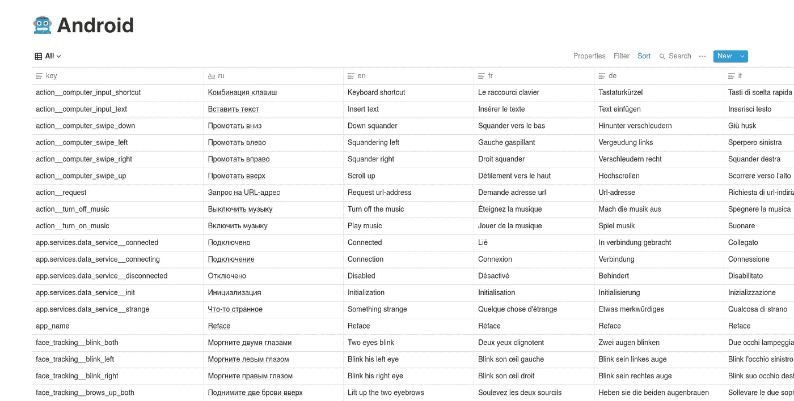

# 如何管理 Android 应用程序的翻译

> 原文：<https://medium.com/analytics-vidhya/how-to-manage-translations-of-an-android-application-387a87c93a93?source=collection_archive---------23----------------------->

## 向导

以及如何在翻译任务适当分配的情况下做到这一点

很长一段时间以来，我一直想知道是否存在一种工具，可以在云中的一个表中管理我的网站的翻译。

**在一个表中管理语言的一些额外好处:**

1.  更快地管理，因为您看到了缺少的翻译
2.  您可以将链接复制到表格，并将其发送给翻译人员

但是 React i18n 的原生解决方案不允许这样做。

现在让我自我介绍一下。

我是创业公司[的创始人，该公司现在发起了一场全球性的公关活动。这就是为什么我真的需要一个工具来快速管理翻译。](http://reface.tech)

**所以我决定写几个剧本:**

1.  首先将所有的翻译上传到观念
2.  第二步是将一种语言翻译成所需的一组语言(对于译者来说，检查速度更快，而不是从起始点开始翻译)
3.  第三步将下载所有内容并将`string.xml`文件添加到相应的文件夹中

# 工具

我们的脚本将用 Python 编写。

*   对于概念集成，我们将使用概念 API 的[非官方包装器(因为目前概念没有公共包装器)。](https://github.com/jamalex/notion-py)

**该库的数据以 XML 格式存储**

# 第一步。创建表格

该表应该有这样的列:

*   **key** 是访问字符串资源的东西
*   语言专栏根据你希望 React 站点翻译的语言来命名。如果你想把你的网站翻译成意大利语**和俄语**和俄语**这两个栏目分别是 **it** 和 **ru** 。**

**下面是我的例子:**

# 第二步。概念授权

我们需要一个叫做`token`的特殊东西来调用概念 API。

**得到它:**

1.  转到概念
2.  使用我们酷的 Ctrl + Shift + J，打开控制台
3.  进入应用程序—cookie，复制`token_v2`

# 第三步。一些常数

我们开始写 Python 代码。让我们先写一个文件，其中包含一些工作所需的常数。

*   `TRANSLATIONS`是您希望网站翻译的语言列表
*   `TOKEN`是你的观念令牌
*   `ANDROID`是存储翻译的表的链接
*   `ANDROID_BASE_LANGUAGE`是将被添加到值文件夹的语言(不带`values-*language_name*`)
*   `ANDROID_FILES`是对应语言的文件列表

# 第四步。将翻译上传到概念的脚本

**简要算法:**

1.  首先，我们加载基本 XML
2.  然后任务是迭代通过它的`strings`
3.  对于每个`string`，我们得到它的`value`和`name`
4.  对于每个条目，我们应该在概念表中找到(或添加)一个相应的行，并相应地将它的`value`设置为`language`

现在我们应该写一些代码。让我们从一个为特定的`key`返回一个`row`的函数开始。

*   `current_rows`是概念表的行。我们应该在每一步都让它们支持`JSON`文件中的副本。
*   `database`是概念表的表示
*   如果我们没有找到符合`key`的行，那么我们添加它

**现在是时候写整个脚本了:**

**这里的新东西:**

*   `client`和`database`初始化
*   遍历`translations`
*   给`row`赋值

# 第五步。内容翻译的脚本

它很小，所以我不会把它分成多个代码块。

1.  我们初始化一个`translator`，它将与谷歌翻译交互
2.  我们问自己关于目标语言和初始化的问题。通常是英语，因为谷歌翻译擅长从英语翻译成其他语言。
3.  我们初始化概念`database`，得到`current_rows`
4.  然后我们遍历所有行，获取`base_text`并检查目标语言值是否未设置。如果它被设置，那么它已经被翻译，我们应该跳过它。

# 第六步。从概念下载翻译的脚本

**这里我们要做的是:**

1.  遍历所有`translations`
2.  为每个文件创建一个结构为`strings.xml`的文件
3.  我们将概念列中的内容添加到相应的文件中
4.  我们将所有内容保存到相应命名的目录中(`values-fr`、`values-it`等)

**现在让我们把它写出来:**

1.  我们初始化概念`database`，得到`current_rows`
2.  我们遍历`translations`，为每个元素创建 strings.xml 结构
3.  然后我们遍历该列中的所有行，将内容添加到`strings.xml`文件的结构中
4.  在遍历完所有这些翻译之后，我们编写内容

# 参考

## 以下是这个项目的 GitHub repo:

 [## mixe den/Android-翻译

### 在 GitHub 上创建一个帐户，为 mixeden/Android 翻译开发做出贡献。

github.com](https://github.com/mixeden/Android-Translation) 

## 以下是我们使用的库:

1.  观念库:[https://github.com/jamalex/notion-py](https://github.com/jamalex/notion-py)
2.  反应-本地化:[https://www.npmjs.com/package/react-localization](https://www.npmjs.com/package/react-localization)
3.  谷歌运输:[https://pypi.org/project/googletrans/](https://pypi.org/project/googletrans/)