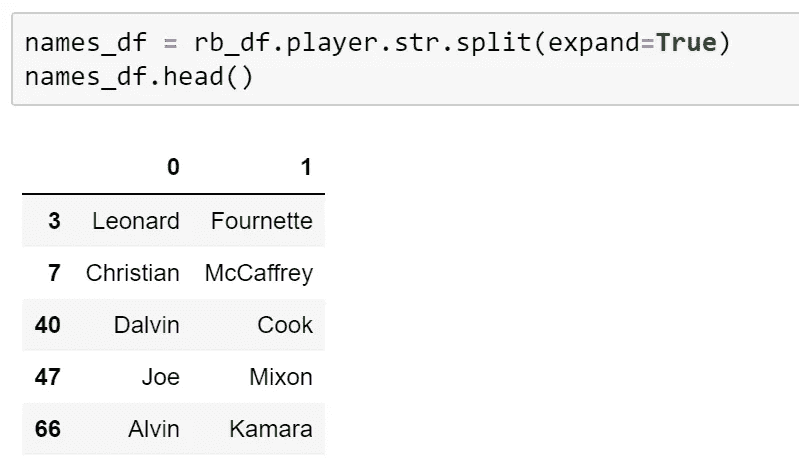
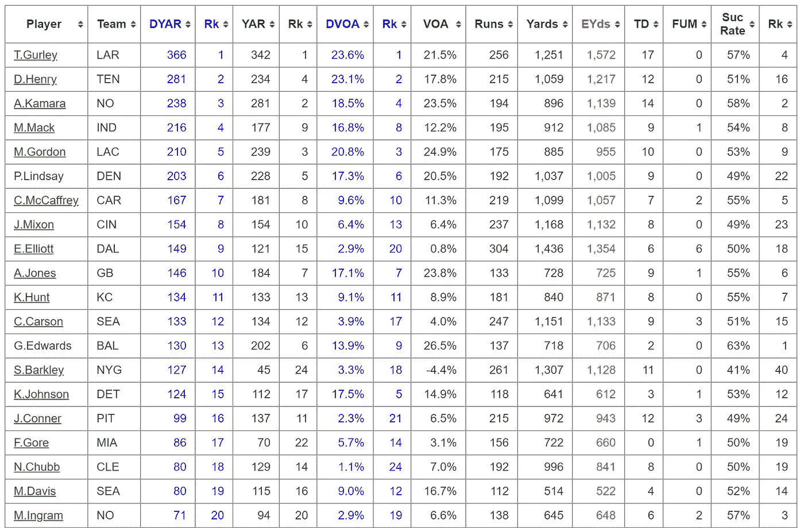
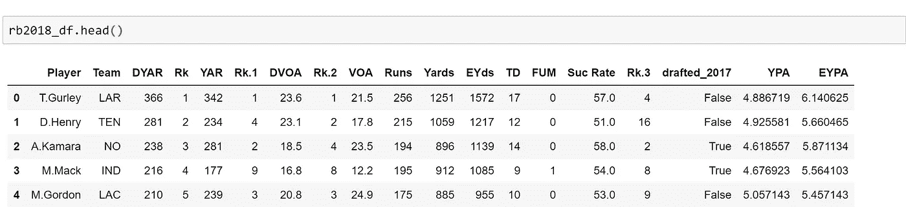

# 如何:在 Pandas 中操作数据框

> 原文：<https://medium.com/analytics-vidhya/how-to-manipulate-dataframes-in-pandas-31375623d859?source=collection_archive---------26----------------------->

*这是 2017 年跑卫系列的第 2 部分，共 3 部分。点击* [*此处*](/analytics-vidhya/how-to-querying-the-internet-for-data-part-1-5385f3961b52) *查看 part 1。*

为了能够从数据源中学习新的东西，您需要确保数据是干净的并且易于处理。这是数据科学工作中最重要的(也是很多人最不喜欢的)一步。

实时观察数据科学家清理数据

如果你还记得最后的 How To，我们正在尝试看看 2017 年的跑卫到底有多好，因为我们被告知选秀班是联盟中最好的。现在，让我们清理数据，以便我们可以看到它是否是真的！

> 在这个 How To 中，我们将再次使用我们 2017 年的跑锋数据，看看这种类型的跑锋是否真的主宰了 NFL。我们将从收集更多的数据开始，清理数据使其可用，然后开始分析数据。

# 创建我们的“干净数据”

到[最后一篇](/analytics-vidhya/how-to-querying-the-internet-for-data-part-1-5385f3961b52)结束时，你应该已经能够在 Pandas 中创建一个数据帧，存储 2017 年起草的跑卫。乍一看，数据似乎很好处理，但结果是，我们应该做一点预处理，使其更容易处理。

## 清理数据

看一下数据，我们可以看到一些球员的名字旁边有一个+。这表明该球员是否参加了职业杯赛，但出于我们的目的，我们可以从名字中去掉它(另外，职业杯赛并不总是衡量一个跑锋有多好的好方法)。另一个需要注意的是，有些整数带有*。这告诉我们球员是否是补偿性选择，但我们只关心球员，而不是他们为什么/如何被选中。

为了清理数据的这些部分，我们必须遍历 DataFrame 的行并清理每个条目。有许多方法可以遍历数据帧，每种方法都有其优点，但是为了简单起见，我们将使用 iterrows 方法。

> 你可以在一篇关于数据科学的[好文章](https://towardsdatascience.com/different-ways-to-iterate-over-rows-in-a-pandas-dataframe-performance-comparison-dc0d5dcef8fe)中查看迭代方法的出色性能差异

当我们在 DataFrame 上调用`.iterrows()`时，它会生成一对(index，Series ),我们可以遍历它们。Pandas 中的系列类似于列表(它是 NumPy 数组的包装)。在我们的例子中，序列是每一行，我们可以使用列名访问该行的不同列。

关于 iterrows 需要注意的一点是，返回的行是原始行的副本。这意味着如果修改它，原始数据帧不会改变。因为我们实际上需要改变我们的数据帧，我们可以使用`.loc`，这是一种通过(row，col)对定位值的方法。然后，一旦我们得到了实际值，我们就可以改变它。我们将使用它将带 a+的玩家姓名更改为不带，带*的回合数也是如此。

现在让我们来看看这一切是如何运作的。

## 添加名称列

我们要对数据帧做的最后一件事是将名称分成两列:第一列和最后一列。这是为了当我们在数据帧中寻找球员时，我们可以通过他们的姓氏来访问他们(我们将使用的其他数据集没有球员的名字)。

要做到这一点，首先看一看跑锋的名字。除了 T. J .洛根，他的名字中有两个空格。我们将不得不改变他的名字，以符合其他人的格式，但不要害怕！我们已经看到了`.loc`是如何工作的，所以我们可以在这里再次使用它。

接下来，我们将使用`str.split()`来拆分名和姓。当您在 DataFrame 的列上调用此函数时，它将按照给定的分隔符拆分字符串。如果我们将它的`expand`参数设置为`True`，它会自动将拆分后的字符串转换为 DataFrame 的列。



这正是我们想要的！

我们可以在我们的`rb_df`中将这两列设置为两个新列。

## 收集 2018 年和 2019 年的统计数据

我们已经从 2017 年开始跑回来，但我们需要一些统计数据来看看他们做得如何。对我们来说幸运的是，足球局外人在一些漂亮的表格中有他们的数据供我们使用。下面是他们的 [2018](https://www.footballoutsiders.com/stats/rb/2018) 和 [2019](https://www.footballoutsiders.com/stats/rb/2019) 数据。



我们将使用的一些 2018 年数据集。亲自查看页面，了解不同的栏目告诉我们关于跑锋的信息！

下一部分将是我们在上一节中已经学到的内容。我们将使用请求来获取 2018 年和 2019 年网页的这些表格，并将它们存储为数据帧。我已经提供了这样做的代码，但它将非常类似于我们如何获得初始数据。

> 注意:我还查看了 2017 年的网页，由于表格的格式，它给创建可用的数据框架带来了很多挑战(列有错误的数据类型，不必要的行等。).虽然可行，但我们可以只坚持 2018 年和 2019 年，这是绰绰有余的数据。如果你想探索 2017 年的数据，看看跑卫在选秀结束后的表现，那就去吧！

对于这些数据框架，我们要做两件事:改变一些列的类型，并添加一些新的列。

## 固定列类型

在查看数据时，您应该注意到一点，即大多数值都是数字；然而，有三个栏目不是:DVOA，美国之音，和 Suc 率。这些列中的百分号表示该列的数据类型是字符串。我们可以很容易地证实这一点。

```
rb2018_df['DVOA'].dtype # dtype('O')
rb2018_df['VOA'].dtype # dtype('O')
rb2018_df['Suc  Rate'].dtype # dtype('O')
```

在 Pandas 中,`dtype('O')`表示对象，在本例中是一个字符串。我们需要它是一个 float 或 int，这样我们就可以用它来可视化图形。

为此，我们可以使用列并应用`str.replace('%', '')`来去掉百分号。然后，一旦只剩下浮点值，我们可以使用`.astype(float)`将整个列从字符串列转换为浮点列。

## 向我们的数据框架添加列

先来说明一个跑锋是否属于 2017 年选秀班。为此，我们将查看跑锋的姓氏是否在我们的`rb_df`的`last`列中。我们可以通过访问这个列作为一个系列:`rb_df['last']`，然后用`.tolist()`把它转换成一个列表。

下一步:回到 iterrows！我们将检查 2018 年(和 2019 年)统计数据帧的每一行，并检查球员的姓氏是否在我们的列表中。Pandas 允许从列表中添加一列，所以我们可以在列表中跟踪它。如果球员在 2017 名单中，我们可以追加`True`，否则追加`False`。最后，只需通过命名并将其设置到列表中来创建一个新列。

接下来我们要添加的两列是每次尝试的码数(YPA)和每次尝试的有效码数(EYPA)。这两个值是基于我们的数据框架中已经有的两个值:YPA =码数/行程和 EYPA =码数/行程。这是熊猫处理得非常好的事情。

因为我们希望对列的每一行都执行相同的操作，所以我们可以简单地对列执行操作，Pandas 将逐个条目地执行它。它看起来像这样:

就这么简单！至此，我们完成了所有的数据帧操作！



2018 年统计最终数据框架的前五个条目

我们能够学习如何在 Pandas 中编辑数据，通过迭代数据帧，使用`.loc`和列操作。现在我们的数据已经为最后一步做好了准备:分析。

在本系列的[最终教程中，我们将学习如何可视化我们的数据，以便我们可以通过视觉得出结论，而不是筛选我们已经拥有的众多列数据。这是能够确定 2017 年的 running back 课程到底有多好的最后一步。](/@amanjaiman/how-to-visualize-your-data-in-python-a1dc46ad1f8d)

*本教程的完整代码如下:*

*一如既往，我很想听听你对这篇文章的看法！将任何问题或意见发送至*[](mailto:amanjaiman@outlook.com)**。**