# 如何在 Tableau 中映射县级数据

> 原文：<https://medium.com/analytics-vidhya/how-to-map-data-on-the-county-level-in-tableau-9178610cd964?source=collection_archive---------1----------------------->

## 地理空间数据可视化

## 您的数据集中没有经度/纬度数据？没问题。

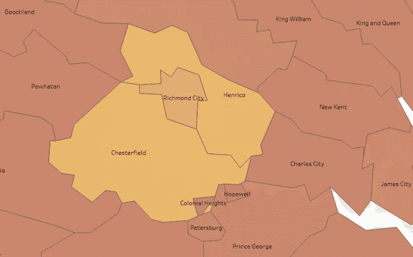

弗吉尼亚地区地图，显示里士满市被四面包围。所有在 Tableau Public(Mapbox OpenStreetMap)中生成的地图图像。作者编辑的所有屏幕截图。

# 概观

县和县一级的地理位置通常形状怪异，蜿蜒曲折。一个较小的县可能几乎完全被一个较大的、独立的管辖区所包围。使用一对集中的经度和纬度坐标来描述较大的县的位置，反而可能定位较小的县的中间点。幸运的是，有一些方法可以解决这个问题。

在本文中，我们将探讨以下内容:

*   用联邦信息处理标准(FIPS)代码标识州和县
*   绘制没有地理坐标的数据集
*   在 Tableau Public 中制作地理数据地图动画

# **动机**

如果您只是在寻找可视化全球或国家级地理数据的简单方法，那么您很幸运。不缺少相关的软件和库文档以及教程。如果您正在研究在县一级可视化数据的方法，信息可能会更少一些。

在本例中，我们正在处理弗吉尼亚州的县和独立城市的数据，其中不包括经度和纬度坐标。在与[相关的 Github 知识库](https://github.com/jammy-bot/va-covid-eda#featured-notebooks)的笔记本中，我们探索了弗吉尼亚州汉普顿路地区的冠状病毒病例、随后的住院治疗和相关死亡与该州其他地区，特别是该州首府里士满报告的病例相比有何不同。我们依靠 Python 与 Plotly Express 的交互绘图，在单个图形上可视化多个地点的数据(包括人口数据),并可选择悬停或深入查看更多细节。

我们在之前的笔记本中使用的动画图使我们能够随着时间的推移快速对多个地点进行可视化比较。我们包括的柱状图和散点图清楚地表明费尔法克斯(县)地区比其他地区受到的影响更严重。然而，这些图表并没有轻易地提到一些可能影响病毒传播的因素。它们没有向我们展示费尔法克斯与华盛顿特区接壤，或者弗吉尼亚海滩(在汉普顿路)是一个地区旅游目的地。通过将相关的地图图像整合到我们的可视化中，这种类型的信息可能会得到更好的传达。这就是我们在当前的探索中要做的。

## b . l . luf

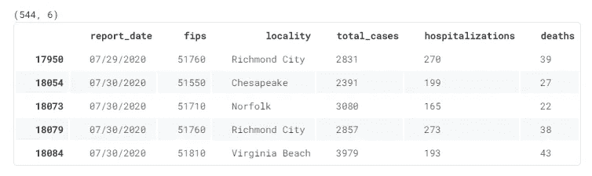

从熊猫数据帧中捕获的数据子集。

出于一致性的考虑，我们将调用之前工作中的主数据集，并保持在相同的时间范围内。我们还希望保持一定水平的交互式发布能力，与我们以前达到的水平相当。

在我们的数据集中，县由名称和 FIPS 代码标识。三位数的 FIPS 代码代表特定州内的县或相当于县的机构。例如，在弗吉尼亚，代码“171”代表谢南多厄。由于相同的代码代表 13 个其他州的不同县，所以可以通过在前面加上两位的州代码来创建五位的 FIPS 代码。弗吉尼亚州的州代码是“51”，所以“51171”是谢南多厄县的五位数 FIPS 代码。

当我们在 Python 中处理数据时，我们使用 Plotly Express (PX)库。要将地理数据添加到我们的可视化分析中，从我们停止的地方开始是合理的。不幸的是，虽然 PX 以前支持通过其“图形工厂”方法从 FIPS 代码数据生成 choropleth 图，但这种方法已经被弃用。目前的方法包括基于 GeoJSON 的 T2 方法和基于 Mapbox 图块的 T4 方法。这两种方法都是可靠的选择，但是，这两种方法都需要将地图置于地理坐标的中心。我们可以求助于其他 Python 库，比如 Folium 或 Geopandas，但是它们也需要地理坐标和/或 shapefiles。

## 剧透警报

为了简化这个练习，我们将远离 Python 和 Pandas 库。相反，我们将在免费的分析平台 Tableau Public 中可视化我们的数据。在 Tableau 中，我们可以为一个列的数据选择一个“地理角色”。Tableau 将使用已经内置在其地图服务器中的数据来分配经度/纬度坐标。

对于包含州名的列，您可以选择“州/省”地理角色，使 Tableau 能够在地图上可视化数据。类似地，我们可以将“County”地理角色分配给我们的`Locality`字段，以便映射数据。同样，Tableau 接受 FIPS 代码作为县级地理的有效数据。

让我们看看如何利用这一功能。

# 加载数据

最初从[弗吉尼亚开放数据门户](https://www.vdh.virginia.gov/coronavirus/)获得 CSV 格式的数据后，我们将使用数据文件的本地版本。我们下载的子集涵盖 2020 年 3 月 17 日至 7 月 31 日期间，数据集列的描述可在数据门户网站上找到。

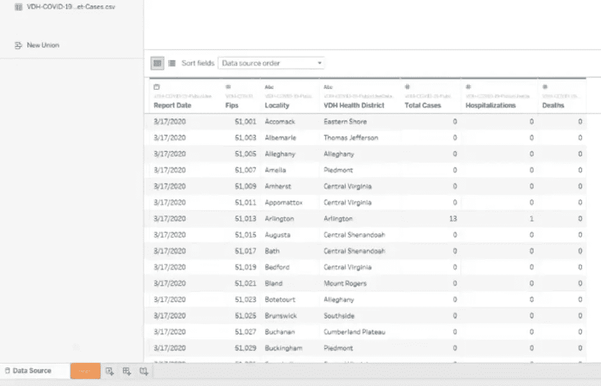

Tableau 中连接的数据表预览。

在 Tableau 中(在本例中，是 Windows 10 上的 64 位 Tableau 桌面公共版)，我们将数据文件作为文本文件进行连接。加载数据时，我们可以立即查看数据集中的列、数据类型和值。我们找到了按`Report Date`排序的`Total Cases`、`Hospitalizations`和`Deaths`列，其中包含每个`Locality`的每日值。地点表示每个记录中所代表的县或独立城市的名称。

不出所料，还有一列显示每个地区的 FIPS ( `Fips`)。此外，我们有一个列指示每个地点的`VDH Health District`,我们不需要这个特殊的探索。

# 轻微的擦洗

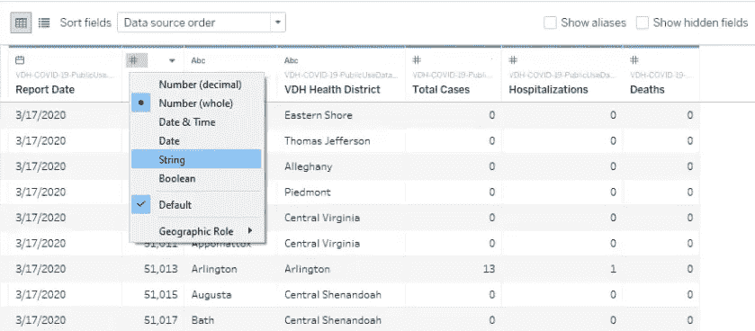

更改数据类型。

我们要解决的第一个问题是作为整数加载的`Fips`数据类型。我们可以通过选择位于列名上方的符号来展开上下文菜单，并选择“String”作为字段的类型。由于我们的数据仅限于弗吉尼亚州的县，我们还将通过打开一个列名右上角的下拉菜单向数据集添加一个`State`列。

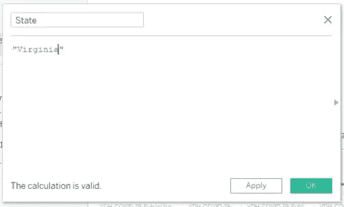

Tableau 提供了向数据集中添加字段的对话框。

从该菜单中，我们选择“创建计算字段…”以打开一个对话框，在该对话框中，我们可以输入“州”作为所需的字段名称。在字段名下面，我们可以输入要沿列执行的计算。在我们的例子中，我们只需要数据集的每一行的值“Virginia”。

接下来，我们选择 Sheet 1 并将其重命名。我们可以看到 Tableau 已经自动做出了一些假设，将我们的数据表分为(定性)维度和(定量)度量。请注意，这些假设不一定符合您的确切需求。

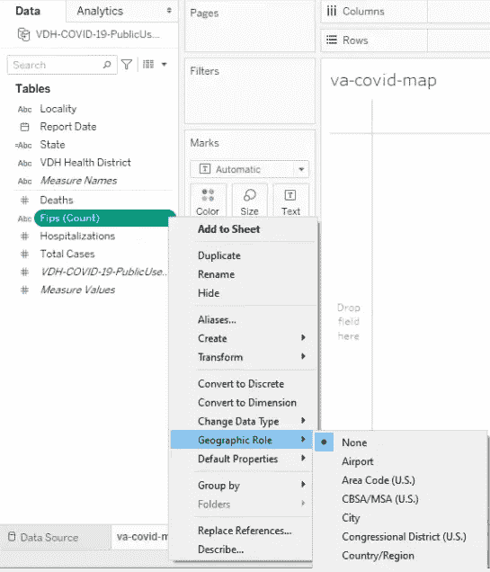

为联邦信息处理标准代码选择地理角色。

在我们的例子中，Tableau 假设`Fips`是一个要计数的度量。我们需要设置该字段的地理角色，以便 Tableau 能够正确地将该字段识别为一个县的维度和唯一标识符。

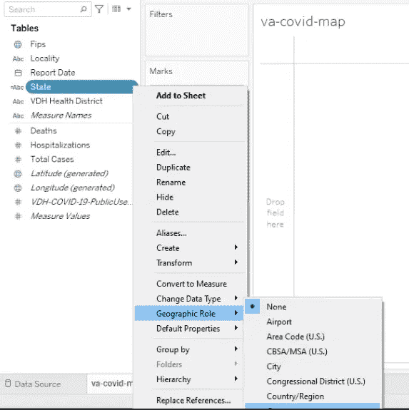

为州维度选择地理角色。

我们按照类似的步骤为我们的`State`维度分配适当的地理角色。请注意 Tableau 如何将与`Fips`相关联的图标从字母字符(当字段被识别为文本度量时)更改为地球符号，现在我们已经将其角色指定为地理维度。

# 可视化维度

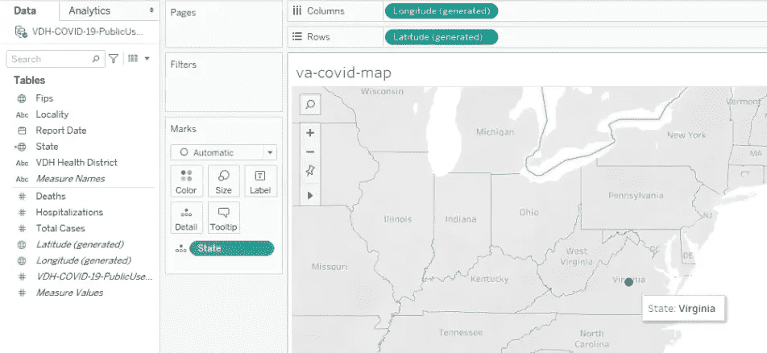

Tableau 工作区。

当我们将适当命名的地理维度拖到 Marks card 的“Detail”属性上时，Tableau 会识别数据并生成相关的经度/纬度值作为列和行，以便在地图背景上定位地理数据。在上面的图像中，我们看到一个蓝色的点，表示地理坐标的交叉点

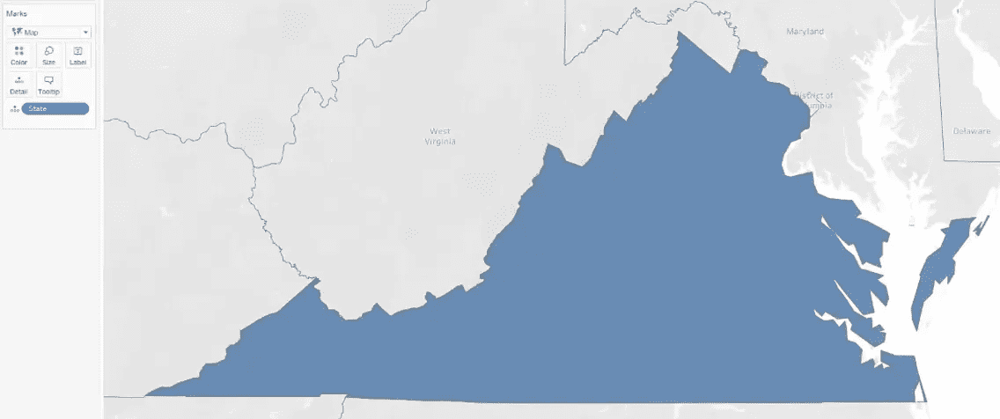

弗吉尼亚联邦的彩色地图。

当我们将标记类型从 automatic 更改为 map 时，Tableau 会为数据集中的州填充颜色。我们的数据仅限于弗吉尼亚州。当然，我们对县级数据感兴趣。

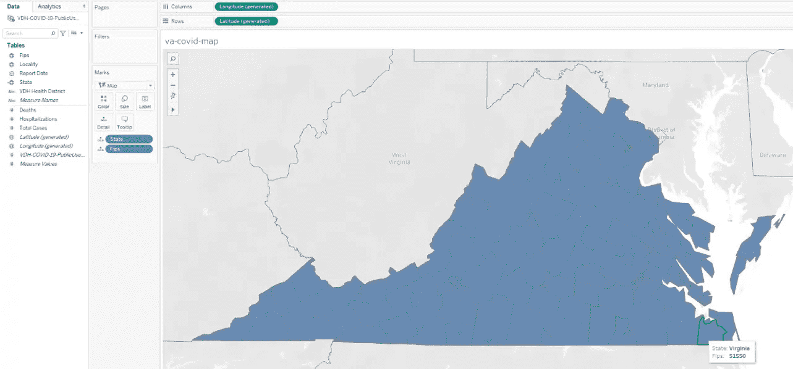

弗吉尼亚州与县纲要。

将`Fips`的地理角色设置为“County”，我们可以将维度拖到 Marks 卡的“Detail”属性上，以便将县边界添加到州地图中。我们看到添加到详图属性的尺寸显示在光标下方区域的工具提示中。

> 注意:`Locality`在 Tableau 中不是可识别的地理角色。我们需要将维度的地理角色设置为“County ”,以便 Tableau 将字段值识别为地理数据。

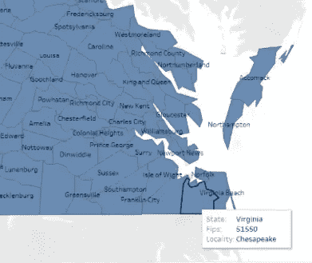

作为地图区域标签添加的地点名称。

我们通过将维度拖到“Label”属性上来为映射的位置添加名称。此外，当我们将光标放在地图上时，地点名称会自动添加到工具提示中。

# 可视化度量

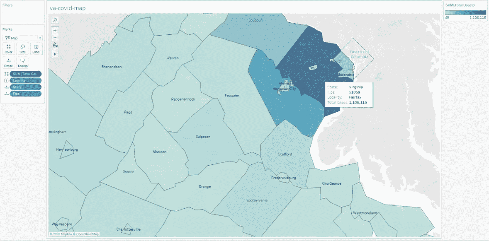

弗吉尼亚地区地图的细节，用颜色表示它们的病例总数。

现在我们将在地图上可视化`Total Cases`数据。我们将度量值拖到 Marks card 的“Color”属性上，Tableau 根据观察期间的案例总数为每个地点着色。还会生成一个图例，定义上限值和下限值以及颜色关联。在这里，上限是 1，106，116，我们可以使用工具提示看到这是费尔法克斯县的案例数。

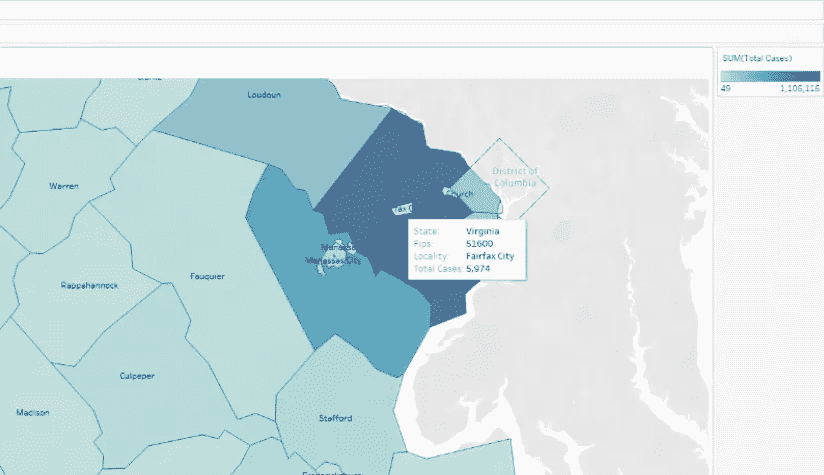

特写:位于弗吉尼亚州费尔法克斯县中部的独立城市费尔法克斯。

相比之下，费尔法克斯市的总病例数不到 6000 例。如果我们尝试使用一对单一的中心地理坐标来定义费尔法克斯县，我们可能会在费尔法克斯市内找到一个点(这里的案件总数要低 185 倍)。

# 地图动画

既然我们已经知道如何在地图上可视化地理数据，我们就可以探索不同时期的数据。理想情况下，我们将能够动画我们的地图，以查看`Total Cases`的变化。

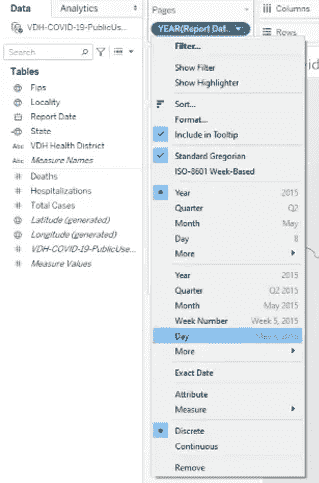

使用 Tableau 的页面卡片更改视图。

我们将`Report Date`维度拖到页面卡片上，并指出我们希望划分数据视图的时间段。我们的数据每天都有报告。我们将按“天”过滤，为每个日期创建一个页面视图。

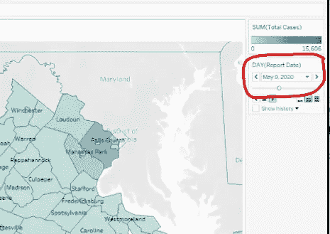

作者强调。

一张新的卡片出现在我们的侧边栏上，我们可以选择一个特定的日期在我们的地图上可视化。我们还可以从图例的下拉菜单中更改地图的颜色主题。

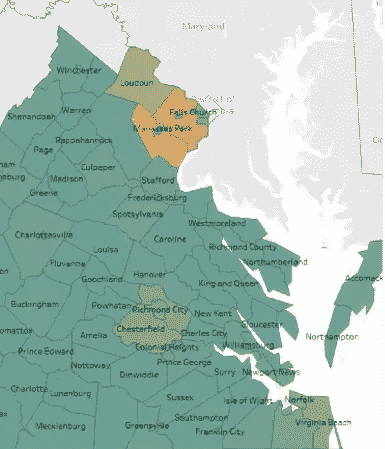

为我们的视觉化改变颜色。

由于我们的数据集包含费尔法克斯县如此大量的案例，因此我们感兴趣的地点(里士满市和东南部的汉普顿路地区)的颜色与非热点地区的颜色没有太大的不同。

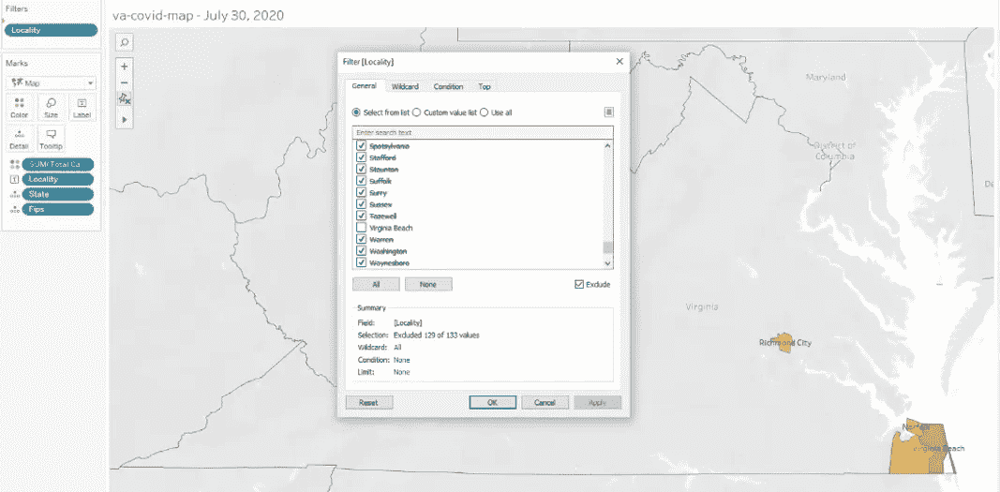

使用 Tableau 的过滤器对话框排除地点。

我们可以在过滤卡上添加`Locality`维度，只突出我们感兴趣的区域。或者，我们可以调整图例色标的中心值。

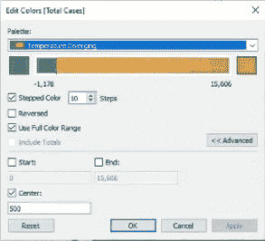

“编辑颜色”对话框允许您为贴图选择调色板和值的范围。

从 Tableau 的“图例”菜单中选择“编辑颜色”选项，我们将选择中心值 500，以确保当任何地区的案例达到 500 时，我们从绿色移动到金色。我们还将图例设置为使用调色板中的所有颜色，分为十个步骤。您可以轻松地试验这些设置，看看它们如何反映数据随时间的变化。

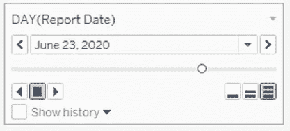

页面视图的动画控件。

您可以拖移滑块来预览更改。要制作地图动画，只需选择滑块下方的向右三角形。动画控件包括用于调整动画速度和方向的附加选项。

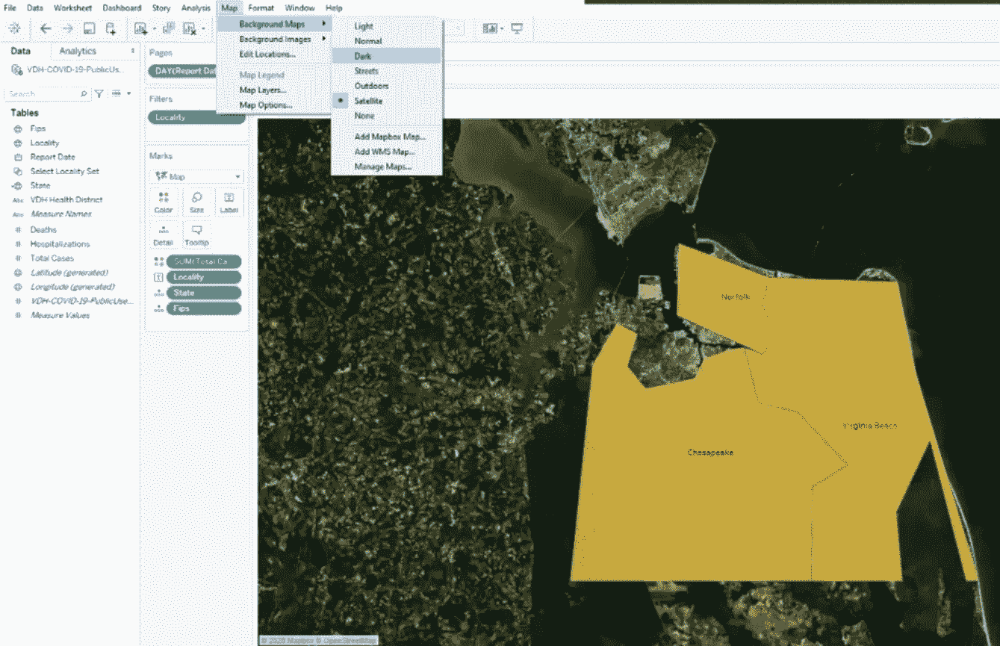

汉普顿路地区强调了卫星地图背景。

Tableau 公共菜单栏包含用于调整可视化外观的附加 API，例如将地理数据投影到卫星影像地图上。

# 继续下去

使用 Tableau 可视化地理数据不仅限于 FIPS 代码:它接受多种选项，包括 GeoJSON 格式的数据、shapefiles，当然还有地理坐标对。为了实践数据科学，我是计算笔记本的粉丝。然而，呈现分析有时需要更容易理解的替代方法。Tableau Public 允许您将您的数据视图(和动画)导出到他们的公共服务器，在那里您可以将您的数据可视化免费提供给几乎任何有互联网连接的人。