# 如何在不到 30 分钟的时间内掌握使用 Python 进行 Web 抓取

> 原文：<https://medium.com/analytics-vidhya/how-to-master-web-scraping-using-python-in-less-than-30-minutes-2bdb0bd1048c?source=collection_archive---------4----------------------->

## 使用 Python 掌握 web 抓取的一些简单步骤

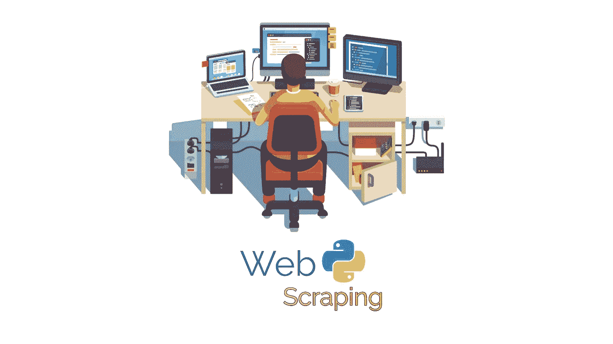

如何在不到 30 分钟的时间内掌握使用 Python 进行 Web 抓取

在这篇文章中，我将分享如何在不到 30 分钟的时间内掌握使用 Python 的 web 抓取。这不是很酷吗？

如果你通过谷歌搜索得到这篇文章，那么你应该已经知道什么是网络抓取。

但如果你还是不知道，那我来解释一下。

> **Web 抓取**是以半结构化的方式从网页中提取某些数据的活动。页面通常使用 HTML 或 XML 等标记语言构建，在开始检索数据之前，该过程将分析文档。**来源:[维基百科](https://en.wikipedia.org/wiki/Web_scraping)**

**那么**为什么是网页抓取呢？**
**网页抓取**的功能是从我们抓取的网页中提取数据，并显示在我们的网站上，如果我们愿意，我们甚至可以将数据保存到数据库中。使用网络抓取的一个例子是比较在线商店之间的产品价格。例如，你想比较 ebay.com 和 Amazon.com 的 iPhone 价格，这样你就可以决定在哪里购买，或者你有一个评论网站，这样你就可以根据价格比较推荐在哪里购买。**

**在这篇文章中，我将只分享**如何在不到 30 分钟的时间内掌握使用 Python 的网络抓取**，而不是做价格比较。**

****现在，该练习了！**
哦，等等，在进入程序代码之前，为了在 30 分钟内掌握使用 python 进行 web 抓取，您需要做一些准备:**

1.  **你必须有一台安装了操作系统的电脑，不管是 Windows 还是 Linux 等等。(这个是肯定的， *lol* )。**
2.  **你必须在你的操作系统上安装 PyCharm(我推荐你使用最新版本的 PyCharm [*这里*](https://www.jetbrains.com/pycharm/download/other.html) )**
3.  **你必须在你的操作系统上安装 Python(我也推荐你使用最新版本的 Python [*这里*](https://www.python.org/downloads/) )**
4.  **你必须在你的操作系统上安装一个浏览器，在这篇文章中我用的是谷歌浏览器。**
5.  **你必须有一个目标网站，你会刮，在这篇文章的目标是[ebay.com](https://www.ebay.com/)。我选择易贝作为目标抓取地，是因为易贝是大型在线市场之一，甚至可以说是全球卖家和买家的聚集地。**

**是的，所有的准备工作都完成了。如果你已经具备了我上面提到的一切，那么你可以在 30 分钟内开始**掌握使用 Python 进行 web 抓取。****

***好了，让我们编码吧！*
**第一阶段—在 PYCHARM 中创建新项目**
在此阶段，我们将在 PyCharm 中创建一个名为 Mastering-Web-Scraping 的新项目，步骤如下:**

1.  **打开 PyCharm 并点击 Create New Project。**

**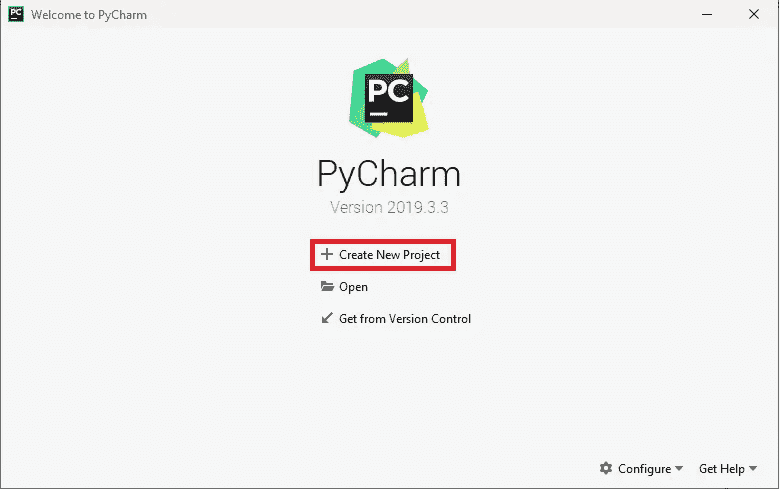**

**在 PyCharm 中创建新项目**

**2.创建项目和虚拟名称。**

**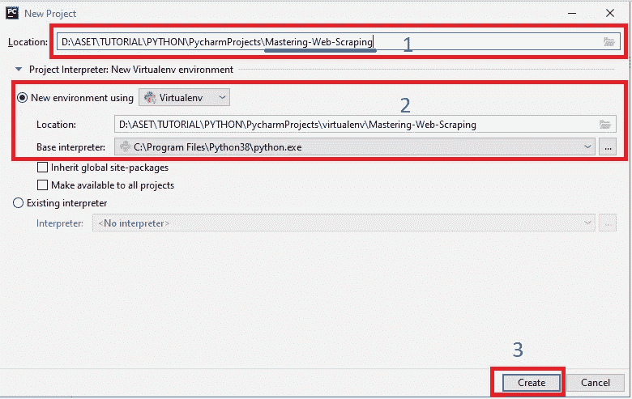**

**创建项目和虚拟名称**

> **现在您在 PyCharm 中有一个名为**Mastering-Web-scrape**的项目，以及同名的 virtualenv。 **Virtualenv** 工作使得我们的项目独立于所有用 python 构建的库或包，所以我们可以只添加我们需要的库，效果是我们制作的程序会更快。**

****第二阶段——安装包请求**
要使用 python 进行网页抓取，我们至少需要 3 个包或库，分别是:**请求**、**美丽的灵魂**和**烧瓶**。在这个阶段，我们将在 **test_scraping_ebay.py** 文件中安装**请求库**。以下是步骤:**

**1.**通过*右键点击你的项目文件夹>创建一个新的 python 文件***点击新建> python 文件>用 test_scraping_ebay >命名 Python 文件选择 Python 文件>按回车键。**

**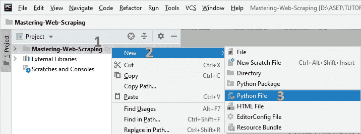**

**在 PyCharm 中创建新的 python 文件**

**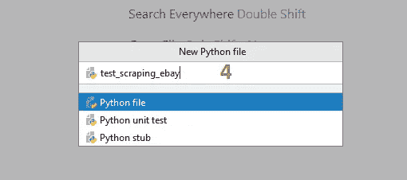**

**用 test_scraping_ebay 命名 python 文件**

**2.在 **test_scraping_ebay.py** 中编写以下代码:**

```
import requests
```

**3.然后，您会在单词 requests 上看到一个**红色标记，如图所示:****

**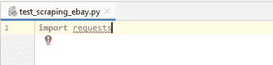**

**“请求”一词上的红色标记**

**4.**确保光标位置如上图**所示，然后按下 **Alt+Enter** 然后会出现以下选项:**

**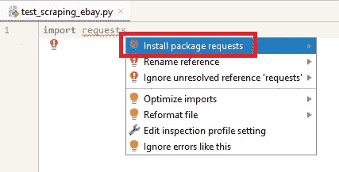**

**请求中的 Alt+Enter**

**5.选择**安装包请求**和**按回车键**，查看 PyCharm 的底部中心，您将看到以下加载:**

**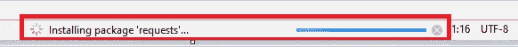**

**安装程序包请求**

**6.等待加载完成，然后库安装过程或包请求已完成。通常标记的通知出现在 PyCharm 的右下角，如下所示:**

**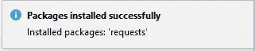**

**已成功安装程序包请求**

**7.库请求安装过程已完成。**

> **那么，库或包请求的功能是什么呢？为什么我们需要安装它？
> **请求** **库**的功能和它的名字一样，就是在浏览器中搜索并显示类似于网站搜索的某个网站的请求 url (http 或 https)地址的结果。返回结果可以是 html、xml 或 json 的形式。如果你想了解更多关于库请求的信息，你可以在这里阅读文档。**

****第三阶段——寻找请求方法**
要使用库请求，我们需要知道几件事，包括请求 url、请求方法、参数、数据和 json。以下是找出答案的步骤:**

**1.通过浏览器进入[**ebay.com**](https://www.ebay.com/)网站，然后在搜索栏中查找“ **iphone** ，出现如下页面:**

**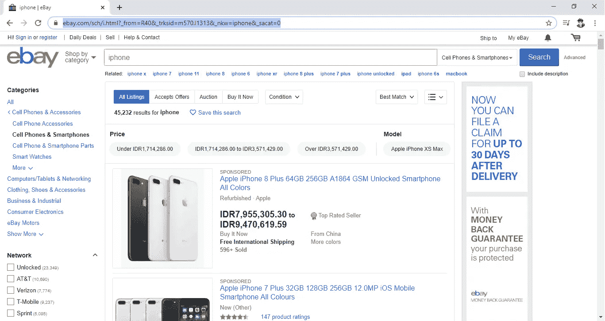**

**ebay.com 上的 iPhone 搜索**

**2.现在您已经获得了 **url** :**

```
[**https://www.ebay.com/sch/i.html?_from=R40&_trksid=m570.l1313&_nkw=iphone&_sacat=0**](https://www.ebay.com/sch/i.html?_from=R40&_trksid=m570.l1313&_nkw=iphone&_sacat=0)
```

**3.按下 **Ctrl+Shift+I** ，检查元素窗口将出现在浏览器的侧面或底部:**

**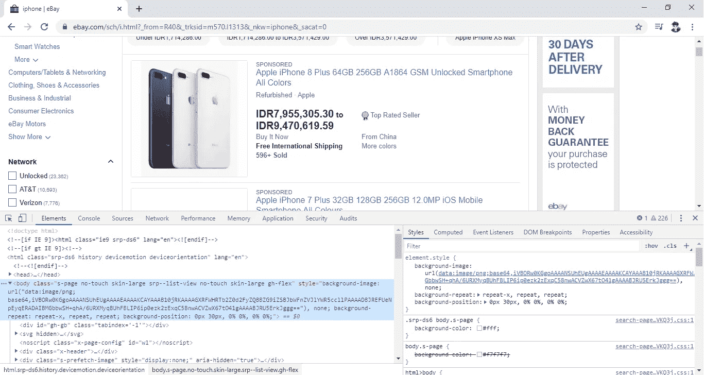**

**检查谷歌开发工具的元素**

**4.如果您在侧面看到 inspect 元素显示，并想将其更改到底部，请在此 处阅读文档 [***。***](https://developers.google.com/web/tools/chrome-devtools/customize/placement)**

**5.接下来在名称栏中查找**I . html _ From = R40&_ trksid = m570 . l 1313&_ nkw = iphone&_ disabled = 0**by:**单击网络选项卡**(1)——>按 **Ctrl+R** - > **全选**(2)——>**滚动到顶部【T35****

**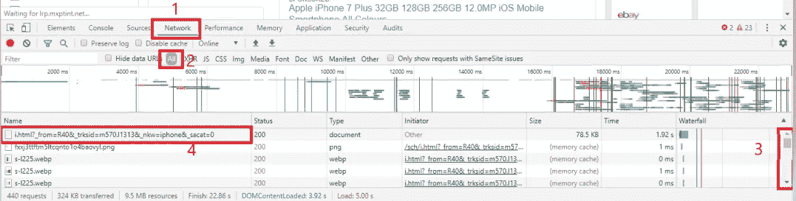**

**转到网络选项卡**

**6.在**点击上图中的数字 4** 后，您将看到以下**标题列**:**

**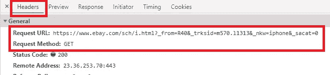**

**标题列**

**7.现在我们有了**请求 Url** 和**请求方法**。**

**8.此外，仍在第 6 步中的同一列中，向下滚动选项卡，然后您将找到以下**参数**:**

**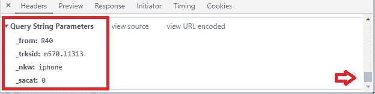**

**因素**

> **从这个阶段我们有:
> 请求方法:**获取**
> 请求 URL:[**https://www.ebay.com/sch/i.html**](https://www.ebay.com/sch/i.html)
> 参数:**_ from = R40&_ trk sid = m570 . l 1313&_ nkw = iphone&_ disabled = 0****

****第四阶段——试用请求库**
得到使用请求库所需的东西后，在这一阶段我将展示如何使用它:**

**1.打开 **test_scraping_ebay.py** 文件。**

**2.请求库中 GET 方法的公式为: **requests.get('url '，params = {'par1': 'par1 value '，' par2': 'par2 value '，… … etc})** 。**

**3.根据上面的公式编写以下代码，但结果被输入到变量中:**

```
html_requests = requests.get(**‘https://www.ebay.com/sch/i.html'**,
params={**‘_from’**:**’R40'**, **’_trksid’**:**’m570.l1313'**, **’_nkw’**:**’iphone’**, **’_sacat’**:**’0'**})print(html_requests.text)
```

**4.由于我们要使用 beautifulsoup 作为一个抓取库，我们需要 html 或 xml 请求结果，所以我们需要**。在 **html_requests** 变量后面的文本**，用于确保请求的结果是 html 或 xml。**

**5.按下 **Ctrl+Shift+F10** 运行程序，你会看到如下结果:**

**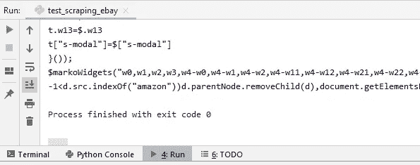**

**试用请求库**

**6.上面的结果将与您在 Google Chrome 浏览器上使用以下 url 按下 **Ctrl+U** 时的结果相同:**

```
[https://www.ebay.com/sch/i.html?_from=R40&_trksid=m570.l1313&_nkw=iphone&_sacat=0](https://www.ebay.com/sch/i.html?_from=R40&_trksid=m570.l1313&_nkw=iphone&_sacat=0)
```

**7.好了，对图书馆申请的审判已经结束了。**

****五阶段—安装 BEAUTIFULSOUP 库**
如何在 PyCharm 中安装 beautifulsoup 库与我们之前做过的如何安装库请求大致相同。以下是方法:**

**1.仍然在 **test_scraping_ebay.py** 文件中，在导入请求的正下方添加以下代码:**

```
from bs4
```

**2.现在你肯定会在 bs4 代码上得到一个**红色标记，如下所示:****

**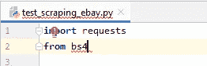**

**bs4 上的红色标记**

**3.当光标附着在 bs4 代码上时，按 **Alt+Enter** ，会出现以下选项:**

**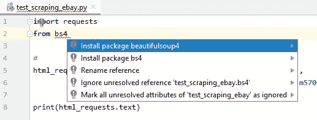**

**Alt+Enter bs4 选项**

**4.选择**安装包美组 4** 和**按 Enter** ，将出现以下加载:**

**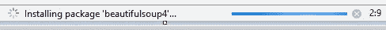**

**安装软件包 beautifulsoup4 时的加载过程**

**5.等待该过程完成，并显示以下通知:**

**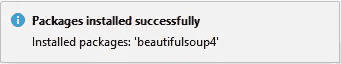**

**成功安装软件包 beautifulsoup4**

**6.安装过程已完成，但仍有红色标记，完成前面的代码以:**

```
**from** bs4 **import** BeautifulSoup
```

**7.好了，这个阶段完成了。**

****第六阶段—试用 beautifulsoup 库**
接下来，我们来测试 beautiful soup 库，不过事先我会说明一下，我们会从这个链接中提取或者废弃的数据:
[https://www.ebay.com/sch/i.html?_from=R40&_ trk sid = m570 . l 1313&_ nkw = iphone&_ sacat = 0](https://www.ebay.com/sch/i.html?_from=R40&_trksid=m570.l1313&_nkw=iphone&_sacat=0)
只有 3 个数据:**产品照片**，**产品名称【T38
嗯，下面是怎么回事:****

**1.打开 **test_scraping_ebay.py** 文件。**

**2.在 html_requests 变量后添加以下代码【T0:**

```
*#declaration BeautifulSoup* soup = BeautifulSoup(html_requests.text, **‘html.parser’**)
```

**3.然后将 ***打印代码*(html _ requests . text)改为:****

```
print(soup)
```

**4.在代码中，我使用 **html.parser** 来确保结果是 html 代码。**

**5.如果您运行上面的代码，结果将与试用请求库相同。**

**6.现在是寻找照片的时候了，打开我们将废弃的 ebay 链接，然后在 Google Chrome 上的一张产品照片上使用 inspect，如下所示:**

****

**右键单击其中一张产品照片**

**7.在 inspect 选项卡上，您会看到类似如下的内容:**

**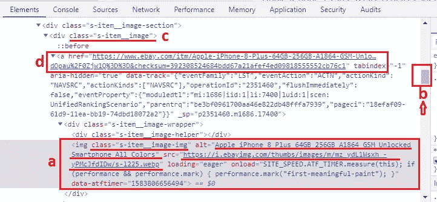**

**谷歌浏览器检查元素**

**8.首先，您将被定向到上图中的“ **a** ”部分，在该部分中，我们获得了两个目标:**产品照片** **和产品名称**，但是我们没有找到产品详细信息的 url 或链接。因此，我们必须在“ **b** ”部分稍微滚动一下**，您将找到**产品详情**“**d**”的 url。为了使用 beautifulsoup 库**进行抓取，我们需要 html 标签和属性**。那么，现在我们已经找到了我们将在“ **c** 部分使用的属性，即 **class = "s-item__image"** 。****

**9.返回 **test_scraping_ebay.py** 并在 soup 变量后添加以下代码:**

```
*#Scrapper* product_image = soup.find_all(attrs={**‘class’**: **‘s-item__image’**})
```

**10.删除**打印(汤)**代码，因为我们将使用带有 **for** 的循环来显示废料的结果，以及代码:**

```
*#Looping product_image with for* **for** img **in** product_image:
    print(img)
```

**11.用 **Ctrl+Shift+F10** 运行 **test_scraping_ebay.py** ，你会从 **class="s-item__image"** 中得到一个“ **divs** ”的集合，如下:**

**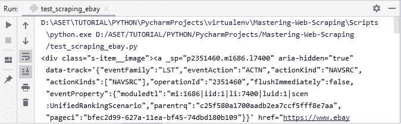**

**class="s-item__image "中的 Div 集合**

**12.那么，如果我们只想显示上面数据中的**产品名称**呢？**

**13.好的，您必须将第 10 步中的代码改为:**

```
*#Looping product_image with for* **for** img **in** product_image:
    print(**img.find('img')['alt']**)
```

**14.然后，您将获得如下产品名称列表:**

**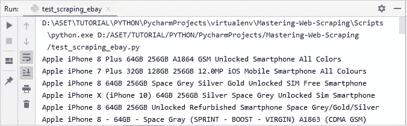**

**产品名称列表**

**15.好了，抓取完成，**下面是 test_scraping_ebay.py 的完整源代码**:**

****test_scraping_ebay.py****

> ****find _ all(attrs = { ' html_attributes ':' html_attributes_value ' })**用于在声明的 html _ attributes 中显示 html _ attributes _ value 中包含的所有标签和属性。
> **find(' tag ')[' attributes ']**函数用于检索 find_all 中包含的特定标记之一的值(attrs = { ' html _ attributes ':' html _ attributes _ value ' })。**

****第七阶段——显示用 FLASK**
抓取的结果在前一阶段我们已经成功抓取到以下 URL:[https://www.ebay.com/sch/i.html?_from=R40&_ trk sid = m570 . l 1313&_ nkw = iphone&_ sacat = 0](https://www.ebay.com/sch/i.html?_from=R40&_trksid=m570.l1313&_nkw=iphone&_sacat=0)
在这一阶段，我将解释如何将前一阶段获得的抓取结果显示到我将使用 FLASK 制作的一个简单网站中。*对于我在前面几个阶段解释过的部分，我不会使用图像，例如:创建新的 python 文件、安装过程以及安装过程成功时的通知，因为这没有什么区别*。 *lol***

**1.**创建一个名为 **run** 的新 python 文件**，那么你将拥有一个 **run.py** 文件。**

**2.**导入** **请求**和**美妆组**:**

```
**import** requests
**from** bs4 **import** BeautifulSoup
```

**3.**安装软件包瓶**，与安装 beautifulsoup 软件包的方式相同，只需写下:**

```
**from** flask
```

**4.当光标在 word flask 上时按下 **Alt+Enter** 然后选择**安装 package flask** 。**

**5.等待安装过程完成。**

**6.安装过程完成后，继续第 3 步中的代码:**

```
**from** flask **import** Flask, render_template
```

**7.为了**启动砂箱**，习惯将砂箱的开合线编码如下:**

```
*#start flask code* app = Flask(__name__)*#scraping code will start here**#end flask code* **if** __name__ == **'__main__'**:
app.run(debug=**True**)
```

**8.**在*的正下方添加以下代码***#刮码将从这里开始:**

```
*#scraping code will start here* @app.route(‘/’)
**def** home():
    **return** render_template(**'index.html'**)
```

**9.因为我们使用了 **render_template** ，我们需要**在我们的项目中创建一个名为 **templates** 的文件夹**，就像这样:**

**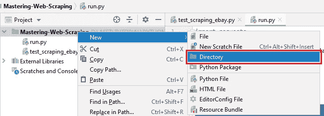**

**右键单击—新—目录**

**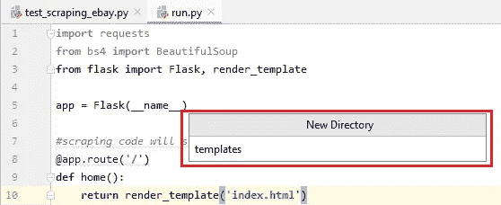**

**创建目录名**

**10.**在我们之前创建的模板文件夹中创建一个名为**索引**的 html 文件**:**

**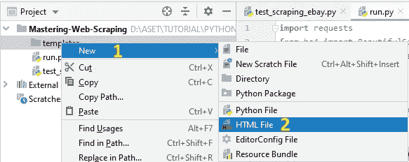**

**创建新的 html 文件**

**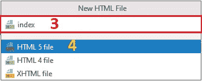**

**将索引命名为 html**

**11.对 html 代码稍加修改就变成了:**

```
<!DOCTYPE **html**>
<**html lang=”en”**>
<**head**>
   <**meta charset=”UTF-8"**>
   <**title**>Scraping Ebay</**title**>
</**head**>
<**body**>
    <**h1**>This is the index.html page</**h1**>
</**body**>
</**html**>
```

**12.回到 **run.py** 文件，然后按下 **Ctrl+Shift+F10** ，然后你会在 run 选项卡上看到这样的内容:**

**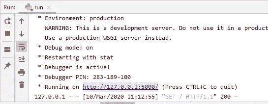**

**运行 run.py 文件**

**13.按下[**http://127 . 0 . 0 . 1:5000/**](http://127.0.0.1:5000/)会出现以下页面:**

**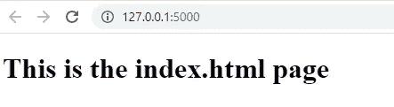**

**index.html·佩奇**

**14.好的，我们已经成功地使用了烧瓶。**

**15.接下来，在本文中，我将使用 **bootstrap4** 模板来显示抓取结果。这里可以看到 html 代码[](https://www.w3schools.com/bootstrap4/tryit.asp?filename=trybs_navbar_fixed&stacked=h)*。***

***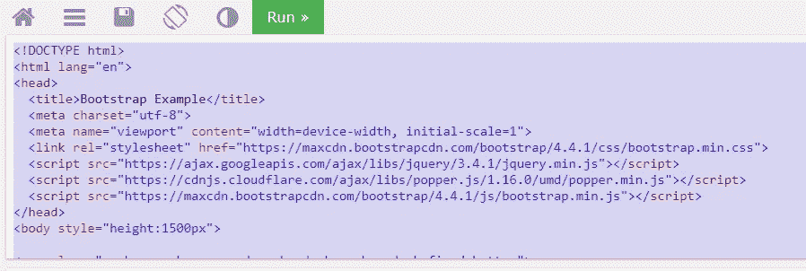***

***w3schools.com***

***16.复制并粘贴所有的 bootstrap4 html 代码到**index.html**。***

***17.**刷新**页面 [http://127.0.0.1:5000/](http://127.0.0.1:5000/) 然后你会看到如下显示:***

***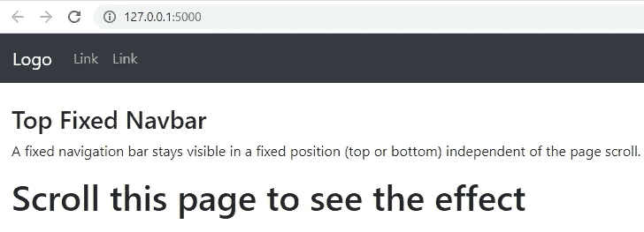***

***带靴子的 index.html 4***

***18.**将**bootstrap 4 html 代码修改为:***

***修改 bootstrap4 html 代码***

***19.这是代码修改后的外观:***

***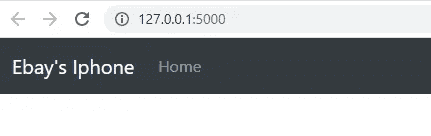***

***修改后的 index.html 与 bootstrap4***

***20.好了，启动程序 4 准备好了。***

***21.返回到 **run.py** 文件，通过添加我们之前在 **test_scraping_ebay.py** 中编写的一些代码来修改“ **def home()** ”，如下所示:***

```
***def** home():
   *#declaration requests* html_requests = requests.get(**'https://www.ebay.com/sch/i.html'**, params={**'_from'**:**'R40'**, **'_trksid'**:**'m570.l1313'**, **'_nkw'**:**'iphone'**, **'_sacat'**:**'0'**}) *#declaration BeautifulSoup* soup = BeautifulSoup(html_requests.text, **'html.parser'**)

   *#Scrapper* product_image = soup.find_all(attrs={**'class'**: **'s-item__image'**})

   **return** render_template(**'index.html'**)*
```

***22.将**返回 render _ template(' index . html ')**修改为:***

```
***return** render_template(**'index.html'**, **images=product_image**)*
```

***23.打开**index.html**文件，查找以下代码:***

```
*<**div class="container-fluid" style="**margin-top:80px**"**></**div**>*
```

***24.在步骤 23 中的 html 代码之间添加以下代码，如下所示:***

```
*<**div** class="container-fluid" style**="**margin-top:80px**"**>
     
        {{**image**|safe}}
        <**a** href=**"{{image.find('a')['href']|safe}}">** {{**image.find('a').find('img')['alt']**|safe}}</**a**>
     
</**div**>*
```

> *****图像**是我们在 **run.py** 文件中创建的变量，该文件位于以下部分:return render _ template**(**' index . html '， **images = product_image)*****

***25.刷新页面[**http://127 . 0 . 0 . 1:5000/**](http://127.0.0.1:5000/)，耶你懂了:***

******

***带刮刀的 index.html***

***26.好了，完成了伙计们！干得好！***

***下面是 run.py 文件的**完整源代码:*****

***run.py 完整源代码***

***然后，这是 index.html 的完整源代码**:*****

***index.html 全部源代码***

***什么？你只需要 10 分钟就能完成？
*好了，我知道了，我知道了，你就复制粘贴一下吧？lol****

***哦，如果在你读完这篇文章后，你仍然没有掌握网络抓取，这意味着你仍然需要提升你的技能男孩！
*哈哈，加油！****

***最后，你可以在我的 github 中查看下面的代码，随意克隆并在你自己的网站上使用。***

***[](https://github.com/EkoMisprajiko/Mastering-Web-Scraping) [## ekommisprajiko/母版制作-网络抓取

### 如何在不到 30 分钟的时间内掌握使用 Python 进行网页抓取

github.com](https://github.com/EkoMisprajiko/Mastering-Web-Scraping) 

如果你不知道如何将你的 PyCharm 项目分享到 github，可以看我的文章 [**如何在 Github**](/@ekomisprajiko/how-to-share-pycharms-project-on-github-de837063c12) 上分享 PyCharm 项目。

似乎这就是我在文章中所能给出的全部:**如何在 30 分钟内掌握使用 Python 进行 web 抓取**。
感谢您的阅读。
下次见，快乐编码！***