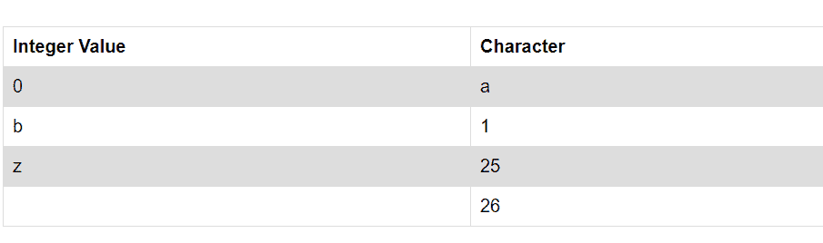

# 如何在 Java 中对序列数据进行热编码

> 原文：<https://medium.com/analytics-vidhya/how-to-one-hot-encode-sequence-data-in-java-1e9ad5194b54?source=collection_archive---------10----------------------->

机器学习算法不够智能，无法理解以文本格式表示的数据。让我们试着在聊天机器人的背景下理解它。

```
User: What is your Name 
ChatBot: My name is ChatBot.User: Tell me about whethere in Pune
ChatBot : Pleasant as always
```

如上例，输入为文本格式，长度可变[输入一个包含 7 个(包括空格)单词，输入包含 11 个单词。在聊天机器人中，通常使用递归神经网络算法进行自然语言处理。算法只理解数字数据，因为数学运算只能在数字数据上执行。因为我们不能对字符串格式的数据执行梯度下降。

为了将字符串格式的数据转换成等价的数字数据，我们可以使用一个热编码作为选项之一。在今天的文章中，我将尝试描述一个热门的 java 编码实现。

让我们通过例子来详细理解它。

字母表中有 26 个字符，如果我们再增加一个字符来表示空白，那么它就变成 27 个。下表描述了映射，最后一行表示映射到 26 的空间。我们有一个有趣的术语来定义下面的映射，即整数编码



现在让我们试着将它与提供给聊天机器人的实际输入文本联系起来

```
Going back to initial example User: What is your Nameinput can be represented as Array of Strings as below.String[] input = [ "what"," ", "is"," ", "your", " ","name"];Integer Encoding for above input can be represengted as below.Integer[] values = [22, 7, 0, 19, 26, 8, 18, 26, 24, 14, 20, 17, 26, 13, 0, 12, 4]
```

这是处理文本数据的第一步，现在让我们更进一步，执行一个热编码。在一种热编码中，数据用 1 或 0 表示。

因为我们使用 27 个字符[字母字符+空格]，我们可以使用下面的逻辑来编码整数编码数组中的每个条目。让我们来看看它的细节。

```
Interger encoding of 'b' = 1
Interger encoding of 'a' = 0Please note 0 will  be first index and 26 will be last index [ Alphabets + space]Now lets use integer array of size 27 to represent one hot encoding.one hot encoding for 'b' = [0, 1, 0, 0, 0, 0, 0, 0, 0, 0, 0, 0, 0, 0, 0, 0, 0, 0, 0, 0, 0, 0, 0, 0, 0, 0, 0] one hot encoding for 'a' = [1, 0, 0, 0, 0, 0, 0, 0, 0, 0, 0, 0, 0, 0, 0, 0, 0, 0, 0, 0, 0, 0, 0, 0, 0, 0, 0]
```

最后，用 Java 实现，不使用任何外部库。

```
package com.ai.algorithm.core; import java.util.Arrays;
import java.util.HashMap; public class OneHotEncoder implements IEncoder {  private HashMap<Character, Integer> intergerEncoder = new HashMap<Character, Integer>();  private Character[] chars = { 'a', 'b', 'c', 'd', 'e', 'f', 'g', 'h', 'i', 'j', 'k', 'l', 'm', 'n', 'o', 'p', 'q',
			'r', 's', 't', 'u', 'v', 'w', 'x', 'y', 'z', ' ' };  private void populateIntegerEncoder() {
		for (int i = 0; i < chars.length; i++) {
			intergerEncoder.put(chars[i], i);
		}
	}  // Populate the integer Encoder  public OneHotEncoder() {
		populateIntegerEncoder();
	}  @Override
	public int[][] encode(String input) {  if (input == null | input.isEmpty()) {
			return null;
		}  input = input.toLowerCase();  int[] intergerEncoding = new int[input.length()];  for (int i = 0; i < input.length(); i++) {
			Character c = input.charAt(i);
			intergerEncoding[i] = intergerEncoder.get(c);
		}  System.out.println("Integer Encoded Values " + Arrays.toString(intergerEncoding));  int[][] oneEncodedValues ​= new int[intergerEncoding.length][chars.length];  for (int i = 0; i < intergerEncoding.length; i++) {
			int[] d = new int[chars.length];
			d[intergerEncoding[i]] = 1;
			oneEncodedValues[i] = d;
		}  printMatrix(oneEncodedValues);
		return oneEncodedValues;
	}  private void printMatrix(int[][] matrix) {
		System.out.println("One hot encoded Values");
		for (int i = 0; i < matrix.length; i++) {
			System.out.println(Arrays.toString(matrix[i]));
		}
	}  public static void main(String[] args) {
		String input = "What is your Name";
		System.out.println("Input String: " + input);
		OneHotEncoder encoder = new OneHotEncoder();
		encoder.encode(input);  } }
```