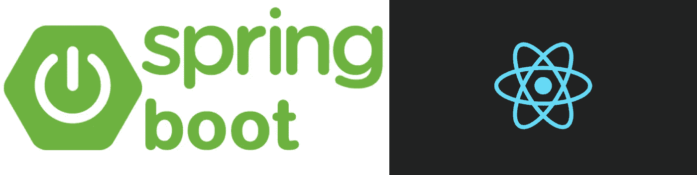
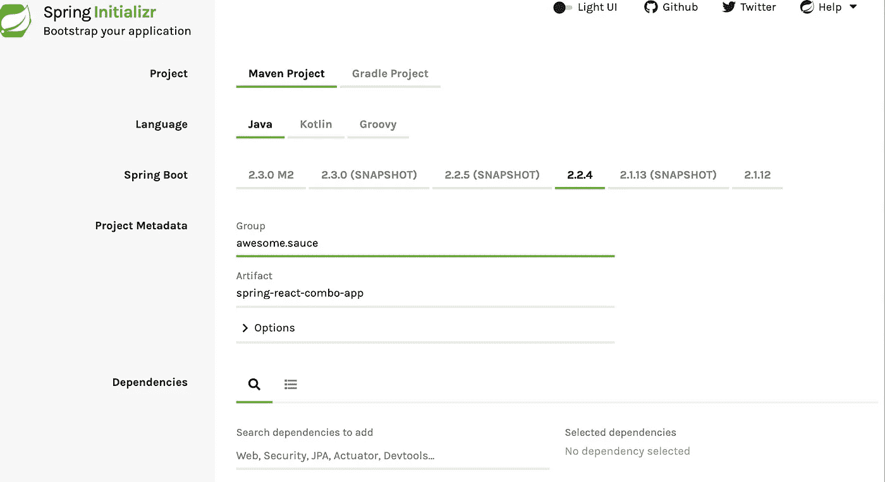
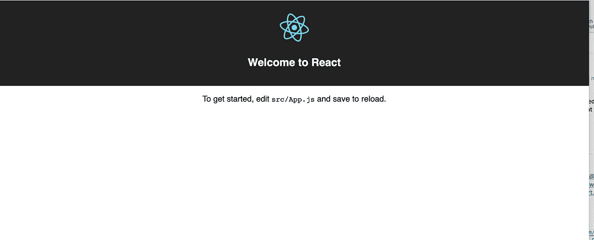
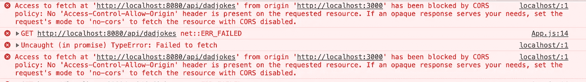
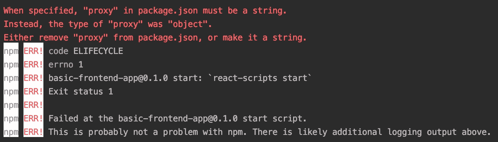
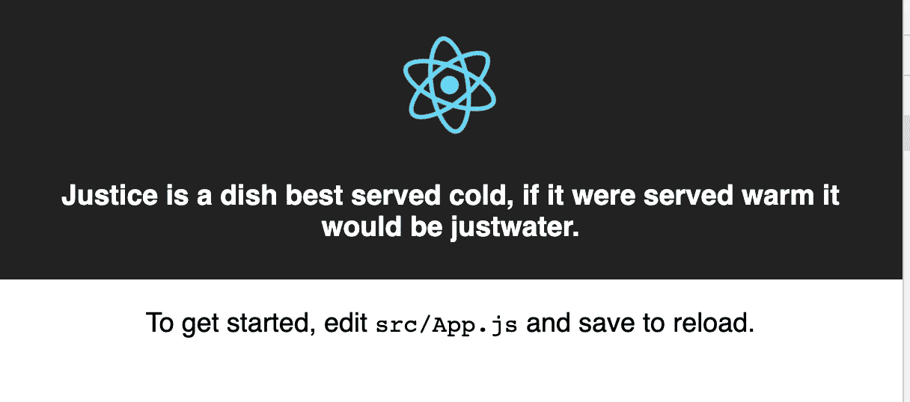

# 如何用 Spring Boot 打包你的 React 应用

> 原文：<https://medium.com/analytics-vidhya/how-to-package-your-react-app-with-spring-boot-41432be974bc?source=collection_archive---------0----------------------->

## 了解如何结合创建反应应用程序与 Spring Boot 给你一个单一的战争文件



这是如何开始的一点背景故事。我的团队需要在我们要求的基础设施上节省一些资金，因为我们希望构建的应用程序的大部分负载都在客户端，而不是服务端。我们决定尝试将 Spring 应用程序和 React 应用程序结合起来，提供一个 war 文件。

**Spring Boot 和 Create React App 做的基本思路。**

1.  创建 React 应用程序可以帮助您快速启动 React 项目。它为您提供了尽快启动和运行所需的所有基本内容。
2.  Spring boot 帮助您快速、轻松地启动和维护 Spring 应用程序。

# 目标:

*   单个 war 文件中的前端和后端，具有优化的生产版本
*   保留 React App 提供的优势，如热重装

# 设置:

*   必须安装 java。头越过[T5 这里 T7 下载一个版本](https://www.oracle.com/java/technologies/javase-downloads.html)
*   必须安装 maven。对于 Mac，我用的是家酿(`brew install maven`)否则，这里头[](https://maven.apache.org/install.html)
*   **必须安装节点。对于 Mac，我用的是家酿(`brew install node`)但除此之外，这里的[](https://nodejs.org/en/download/)**

> ******补充说明:我选择的 ide 是 IntelliJ。当处理 react 代码时，我通常会切换到 VS 代码。随意使用你觉得舒服的东西******

1.  ****在 Github 上创建一个空的 repo，添加一个 Read Me，gitignore，license 等。****
2.  ****转到[https://start . spring . io](https://start.spring.io/)创建您的 spring 应用程序并下载到本地。组和工件也可以是你想要的任何东西。****

********

****GroupId : e.the.awesome****

******神器** : spring-react-combo-app****

****3.将下载的项目解压到 git 目录中。提交提交提交。您的 SpringReactComboAppApplication 应该是这样的。****

****4.现在让我们创建一个基本服务。我们称之为 DadJokesController。这应该在与 SpringReactComboAppApplication 文件相同的文件夹中创建。我知道这不是一个合适的 Rest API 格式，但是现在让我们忽略它。****

****5.在您的终端运行中****

```
**mvn spring-boot:run**
```

****然后在你的浏览器中查看[http://localhost:8080/API/dad joins](http://localhost:8080/api/dadjokes)。你应该看看我们在控制器上加的爸爸笑话。****

****6.要创建 React 应用程序，只需在根目录下运行即可****

```
**npx create-react-app basic-frontend-app**
```

****随便你怎么叫，我就叫我的*基础-前端-app*****

****7.要运行前端应用程序:****

```
**cd basic-frontend-app
npm start**
```

****启动后，它应该看起来像:****

********

****8.因为我们想将我们的爸爸笑话服务集成到前端，首先我们将解决代理问题。如果您已经注意到，您的服务在 localhost:8080 上启动，而前端在 localhost:3000 上启动。如果我们试图从前端调用我们的服务，根据你的浏览器，你会得到一个 CORS 错误。****

********

****解决这个问题的最简单的方法是让您的前端代理从端口 3000 到 8080 的任何请求。此更改将在您的 package.json 文件中进行****

****将以下内容添加到 frontend App.js 文件中****

****重启前端应该就好了。如果你碰巧得到这个错误:我删除了我的 package-lock.json 文件和 node_modules 文件夹重新安装了 npm 包并再次运行它****

********

****9.您的应用程序现在应该看起来像这样。您可以看到爸爸笑话 API 调用的结果。****

********

****10.既然我们的基本前端和后端已经完成，是时候创建一个产品构建和单个 war 文件了。****

****在**下的<依赖关系>下的**中添加这个****

****在 pom 文件的 **<插件>** 部分下，我们将添加以下命令，这些命令将在`mvn clean install` 运行时执行以下操作。****

*   ****使用指定版本的节点安装 npm****
*   ****运行我们前端的生产版本****
*   ****存放生产版本****

*******边注:顺序对你的插件很重要，所以确保你的节点/npm 安装在复制构建文件之前执行*******

****11.添加之后，运行 `mvn clean install`并验证 target/classes 目录包含前端文件和 java 文件。你应该可以走了。****

****最后看一下我的 [**pom 文件**](https://github.com/Emmanuella-Aninye/Spring-Boot-ReactJS-Starter/blob/master/pom.xml) 。****

****所以我只有这些了。如果你想看一看回购或使用它。这里可以在我的 [**Github**](https://github.com/Emmanuella-Aninye/Spring-Boot-ReactJS-Starter) **上找到。******

****接下来是一篇关于如何在 Heroku 上部署 war 文件的文章。期待！****