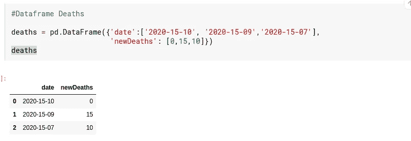

# 如何 pd.merge()一个公共日期列上的两个数据帧。

> 原文：<https://medium.com/analytics-vidhya/how-to-pd-merge-two-data-frames-on-a-common-date-column-e7808d7ccaee?source=collection_archive---------0----------------------->

马库斯·斯皮斯克在 [Unsplash](https://unsplash.com?utm_source=medium&utm_medium=referral) 上的照片

使用新冠肺炎病例和死亡数据进行数据分析的主要挑战之一是将这两个数据框架在日期上合并在一起。由于每个 CSV 数据文件中有重复的日期条目，合并两个数据帧并不简单。以下是我如何应对这一挑战的解释。

# **1。数据下载- Cases.csv**

我已经从 coronovirus.data.gov.uk 下载并保存了 cases.csv 文件到我的 Kaggle 网页中。这是对这些数据的一个快速浏览。

**清理和数据准备—** 转换日期数据类型，检查数据帧长度，检查空值。

**检查任何重复-** 269 个唯一的日期表明这些日期是重复的，即重复几次，因此我们得到长度 975。

**groupby()、sum()** —使用 dates 列上的 groupby()和 newCases 列上的 sum()返回长度为 269 的 series 对象。这将把所有重复的日期组合成一组，并将它们各自的案例相加。

**系列到数据框** — Groupby()函数返回一个系列对象。所以下一步是将这个 series 对象转换成一个 269 行的新数据帧。

**Cases_df 数据帧现已准备就绪，可与另一个数据帧合并。**

# 2 **。数据下载— Deaths.csv**

我已经从 coronovirus.data.gov.uk 下载并保存了 deaths.csv 文件到我的 Kaggle 网页中。这是对这些数据的一个快速浏览。

**清理和数据准备—** 转换日期数据类型，检查数据帧长度，检查空值。

**检查任何重复-** 226 个唯一的日期表明这些日期是重复的，即重复了几次，因此我们得到长度 862。

**groupby()，sum()** —使用 dates 列上的 groupby()和 newDeaths 列上的 sum()返回长度为 226 的 series 对象。这将把所有重复的日期归为一组，并把他们各自的死亡时间加起来。

**系列到数据帧** — Groupby()函数返回一个系列对象。所以下一步是将这个 series 对象转换成一个 226 行的新数据帧。

**死亡数据框现已准备好与病例数据框合并。**

# **合并病例和死亡数据框**

# **下面是我们使用 pd.merge()时实际发生的情况**

为了解释这个过程，我创建了两个微型数据框架，分别命名为病例和死亡。

病例数据框中有 3 个日期条目(十月、九月、六月)。

上面的死亡数据框中有 3 个日期条目。(10 月、9 月、8 月)

# 内部联接时合并

观察:内联接输出有十月，九月。这两个日期都出现在病例和死亡数据框中。

# 外部连接时合并

观察:外连接输出有十月、九月、六月和八月。所有数据均来自病例和死亡数据框。

# 在左连接时合并

观察:左连接输出有十月，九月，六月。所有病例的日期都存在，并且只取死亡病例的匹配日期。

# 右连接时合并

观察:右连接输出有十月、九月、八月。所有死亡日期都存在，并且只取病例中匹配的日期。

总结本文，关键要点是，如果您必须在一个公共列上合并两个数据框，并且公共列有重复项，一种方法是将一个数据框的公共列中的所有值组合在一起。这将删除所有的重复。新的分组对象可以转换回新的数据框。这将使合并更容易，并且在执行合并时具有准确的值。希望这篇文章是有帮助的。谢谢你。