# 如何对原始文本执行 nltk

> 原文：<https://medium.com/analytics-vidhya/how-to-perform-nltk-on-raw-text-5dc5dbe99f0?source=collection_archive---------4----------------------->

如何使用 NLTK 处理原始文本？

网络无疑是探索大量文本的最便捷的方式。虽然我们有网络，但有时我们想使用我们自己的文本，所以我们会得到一些关于如何使用 NLTK 处理原始文本的问题的答案。

我们可能会有更多的问题，例如

a)我们如何从本地文件中访问文本，并可能获得进行 NLTK 的无限材料。

b)我们如何拆分文档并获得单个单词，然后如果需要，我们可以对其进行一些分析。

c)我们如何获得格式化的输出，然后将其保存在一个文件中。

因此，为了回答我们的问题，我们将使用 NLP 概念以及标记化、词干化，还需要结合我们关于字符串文件和正则表达式的 python 知识。

1.1 如何从网络上获取文本？

对于我们的例子，我们使用了网站[http://www.gutenberg.org/catalog/](http://www.gutenberg.org/catalog/)。

我们将导入 nltk 和 word_tokenize，因为我们必须在 nlp 中使用它们。从这个网站上，我们可以选择任何我们想要的书。我们可以选择。txt 格式并获取文本文件的 URL。我们将使用这本书的文本文件，“每日英雄主义”这个编号 62307 是这本书的英文翻译。现在我们可以访问它，如下所示。

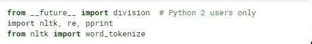

我们需要从 urllib 导入请求。使用 request.urlopen()我们将访问文本文件的 url。通过 read()和 decode()我们获得文本文件并存储在变量 rawtext 中。通过使用 type()函数，我们可以看到 rawtext 变量是一个字符串。

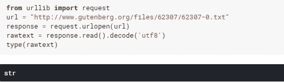

我们可以打印原始文本的长度，也可以打印原始文本的范围，以打印第一行

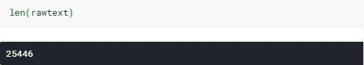

在打印 rawtext 字符串后，我们可以看到第一行是\u，\r，\n，它们是转义序列回车符和由 Python 表示的 Unicode 码位字符。

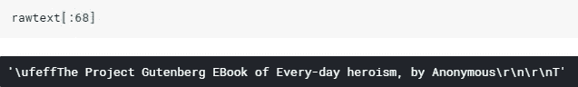

现在，我们必须使用语言处理，这意味着我们将把字符串分解成单词和标点符号的列表，这就是所谓的标记化。

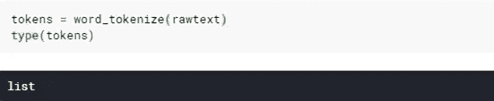

类型()可用于检查标记是否属于列表类型。

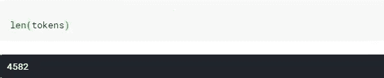

我们也可以得到令牌的长度。

我们可以从列表标记中获取列表的所有元素。

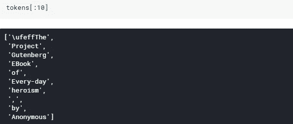

所以对于标记化，我们使用了 NLTK。我们将对标记使用 nltk.next(tokens)函数，并进一步使用文本进行更多的语言处理。

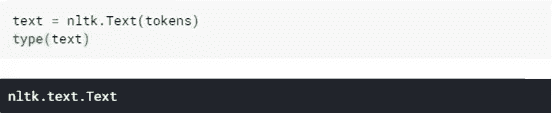

我们可以对文本使用 type()函数，并检查它是否属于文本类型。

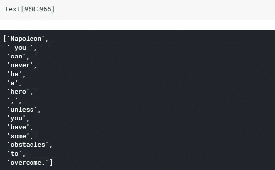

我们可以在 nltk 文本[950:965]中指定范围的起始值和结束值，并获取指定范围内的令牌列表。

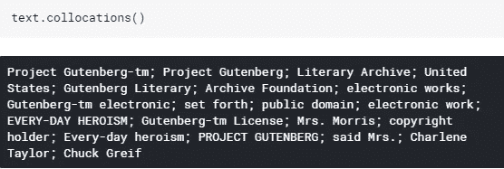

我们也可以使用 text.collocations()函数，因为它显示了带有标题的内容、文章名称、浏览文本的人等等。我们能够使用这个是因为从 Gutenburg 项目网站下载的每个文本内容在标题中都有这些信息，这意味着它们是根据搭配指定的。

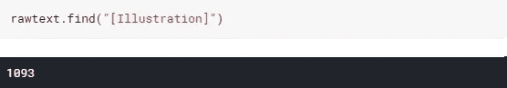

使用 find()和 rfind()我们可以获得在 rawtext 中切分字符串的准确索引位置。

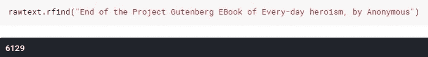

我们使用 find()方法来检测实际内容的开始和结束位置，我们可以用从索引位置 1093 开始到索引位置 6129 的内容结尾来覆盖 rawtext，我们可以获得指定范围内的内容，如下所示。

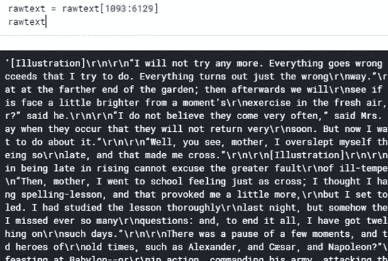

这是我的第一个博客，为像我这样的初学者提供关于 nltk 的想法，这是关于如何访问和处理网站上的文本。所以在我的下一篇博客中，我会写如何访问我们创建的文本文件，并在上面执行 nltk，所以请继续访问我的博客，链接到我的下一篇博客。

参考链接:——[http://nltk.org/,](http://nltk.org/,)[http://docs.python.org/.](http://docs.python.org/.)