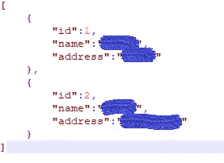

# 如何使用 Delta Lake (Python)在数据块中执行 SCD2

> 原文：<https://medium.com/analytics-vidhya/how-to-perform-scd2-in-databricks-using-delta-lake-python-e538177f23a6?source=collection_archive---------3----------------------->

米卡·鲍梅斯特在 [Unsplash](https://unsplash.com?utm_source=medium&utm_medium=referral) 上的照片

# 什么是 SCD？

SCD 代表缓慢变化的数据。这意味着它根据需求维护数据库、表、文件或云上所有记录的日志。

比如说。

凌晨 1 点有一次处决。该执行返回 3 个数据。这些数据被插入到表或任何其他源中。现在假设在凌晨 2 点又执行了一次，它返回 5 个数据。现在将这些数据与旧数据进行比较。为了比较，必须有一些独特的东西是必需的，如 id，hashcode 等。现在新记录和旧记录有相同的 id 假设 1。那么现在发生了什么，在具有 id 1 的旧数据中被标记为停用，并且新数据被插入并且被标记为活动。如果有新的数据，则简单地插入这些数据。

SCD2 什么都不是，但是它维护所有记录以用于跟踪目的，并且维护日志。

# 背景

我的数据砖笔记本做以下事情:

从 azure blob 存储中的 JSON 文件读取数据。

将 JSON 数据存储在增量表中。

在笔记本中使用 Python 执行 SCD2 操作，并将最终数据存储在主增量表中。

# 方案

在这个场景中，Azure blob 存储上总共有 3 个 JSON 文件，如下图所示。

**文件 1: Data.json**

第一次执行时，这些数据被插入增量表中

**文件 1: Data1.json**

第二次执行时，旧的 id 1 被禁用，新的 id 1 被启用

**文件 1: Data2.json**

第三次执行你可以发现将要发生什么。

**代码**

**步骤 1:** 在名称空间下添加，以启用 delta lake。

spark . SQL(" set spart . data bricksδpreview . enabled = true ")
spark . SQL(" set spart . data bricksδretentiondutationcheck . preview . enabled = false ")

**第二步:**

**#在名称空间下面添加**

从 datetime 导入 datetime，从 pyspark.sql.functions 导入 time delta
col，concat，lit，current_date

**#声明标记的日期 olddate 为无效记录。**

yesterdayday = datetime . today()—time delta(days = 1)
yesterdayday = yesterdayday . strftime(" % Y-% m-% d ")

**#在增量表中创建一个表。**

spark.sql("使用增量位置' DBFS 路径'创建表 TableName(FielName 数据类型)")

**第三步:**

**#为从 blob 存储中读取文件创建 Azure blob 连接。**

spark . conf . set(" fs . azure . account . Key .<storagename>. blob . core . windows . net "，" Secrate Key ")</storagename>

使用文件夹路径从 blob 中读取文件。
path = " wabss://[<container name>@<storage name>. blob . core . windows . net](mailto:specindiacontainer@specindia.blob.core.windows.net)/file path/"

**#文件列表**
filelist=dbutils.fs.ls(路径)

**第四步:**

**#执行以下操作，将数据存储在增量表中。**

对于 filelist 中的 f:
if f . path . ends with(('。JSON ')):
filename = f . name
data = spark . read . option(" multiline "，" true ")。json(f.path)

**#根据场景在 datafram 中添加新列，HASHCode 是 ID+Name+Address**
data = data . select(col(" ID ")，col("Name ")，col("Address)，concat(col("Id)，col("Name)，col("Address "))。别名(" HashCode "))
data = data . with column(' valid from '，lit(current _ date())
data = data . with column(' valid to '，lit(yesterdayday))

**#如果存在，删除表格并将数据保存到临时表格。**
spark . SQL(" DROP TABLE IF EXISTS SCD 2 temptable ")
data . createorreplacetenview(" SCD 2 temptable ")

**#看数据是否插入**
ShowTable = spark . SQL(" select * from SCD 2 temptable ")。显示()

**步骤 5:执行 SCD2 操作**

**#从主增量表和临时表中读取数据，其中 SCD2 是主增量表**

SCD2 =DeltaTable.forPath(spark，"/file store/Demp/SCD 2 ")
updatesDF = table(" SCD 2 temptable ")

**#找到要插入或要禁用旧记录的行，并插入新记录。**

LatestRecord = updatesDF \
。别名(" NewData") \
。join(SCD2.toDF()。别名(" SCD2 ")，" Id") \
。其中(" NewData。HashCode < > SCD2。HashCode 和 SCD2。valid to = ' false ' ")
staged updates =(
LatestRecord
。selectExpr("NULL as mergeKey "，" NewData。*)
。union(updatesdf . select expr(" Id as merge key "，" *))
)

**#在上述 dode 中，LatestRecord 包含基于 id 和 hashcode 差异的新数据，hashcode 是所有数据行的组合，并且对 cusotm 列有效，用于标识该数据是否将被插入。**

SCD 2 . alias(“SCD 2”)。merge(
staged updates . alias(" staged _ updates ")，
"SCD2。Id = mergeKey")\
。when matched update(
condition = " staged _ updates。HashCode < > SCD2。HashCode "，
set = {
" valid to ":" staged _ updates。ValidTo"
}
)。when notmatchedinsert(
values = {
" Id ":" staged _ updates。Id "，
"Name": "staged_updates。姓名"，
"地址":"分期 _ 更新。Address "，
" valid from ":" staged _ updates。ValidFrom "，
"ValidTo": "False "，
"HashCode":"staged_updates。HashCode"
}
)。执行()

在上面的代码中，如果数据匹配，首先禁用旧记录，然后用新数据更新记录。如果数据不匹配，它将简单地输入主表。

**#最后一步:执行下面的查询，查看主表中的数据**

spark . SQL(" select * from SCD 2 order by id ")。显示()

**输出:**

第一次执行:如果 validto 为 false，则记录有效，否则无效。

在这次执行中，它只是将数据插入主增量表中。

**第二次执行:**

在这个执行中，名为 XYZ 的 Id 1 被禁用，新记录被启用。

**第三次执行:**

在该执行中，名为 ABC 的 Id 2 被禁用，并且用启用来更新新记录，并且插入具有 id 4 的新记录。

**注意:目前合并查询只支持字符串或列名。如果使用列名，则它必须在数据框中。**