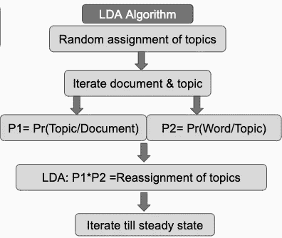

# 如何使用 MALLET 执行主题建模

> 原文：<https://medium.com/analytics-vidhya/how-to-perform-topic-modeling-using-mallet-abc43916560f?source=collection_archive---------8----------------------->

主题建模是自然语言处理中从文本中发现隐含意义的一种强有力的技术。它使用了[潜在狄利克雷分配](https://en.wikipedia.org/wiki/Latent_Dirichlet_allocation) (LDA)的概念。LDA 的算法如下:

在可用于执行主题建模的不同工具中，我个人最喜欢的是基于 Java 的 MALLET。与 python 中的 Gensim 库相比，它的实现非常精确。MALLET 基于 Gibbs 采样技术，因此不同于 Gensim。

# 安装槌棒(在 Mac OS 中)

1.  安装 [Java 开发包](http://www.oracle.com/technetwork/java/javase/downloads/index.html)。
2.  从[网站](http://mallet.cs.umass.edu/)下载木槌。
3.  将 MALLET 解压到系统的一个目录中。该目录的名称似乎是 mallet-2.0.8。

# 准备文本语料库

为了让 MALLET 运行，应该清理文本语料库，并将每个短语作为一个单独的”。txt "文件。

**一)** **清扫文字。**这一步涉及到清洗文字的基本步骤。例子如下:

**b)** **将每一行数据帧转换为一个单独的。txt 文件。**以下代码可用于将数据帧的每一行转换成。txt 文件

# 跑槌

MALLET 从 Mac 上的[终端](http://www.macworld.co.uk/feature/mac-software/get-more-out-of-os-x-terminal-3608274/)运行。以下是说明:

*   开放终端
*   将您的工作目录更改为 MALLET 文件夹(MALLET-2–0–8)。例如:$ CD/Users/shivikakbisen/mallet-2 . 0 . 8
*   **创造”。mallet”文件**该文件创建如下:

*   Let **X =** 包含所有文件夹的路径。txt 文件。和 **Y** =的名称。槌锉。你只需要在下面的命令中输入 X 和 Y。

$./bin/mallet import-dir--输入**X**--输出**Y \**--保持序列--移除停用词

*   **拟合主题模型如下:**

$./bin/mallet train-topics--input**Y**\--num-topics**20**--num-iteration**1000**--optimize-interval**10**--output-doc-topics doc-topics . txt--output-topic-keys**topic-model . txt**

*   — —输入 **Y** 为”。槌”文件**。这是我们之前创建的语料库，我们想从中找到主题。**
*   — — num-topics **20** :例如，我们希望 MALLET 识别 20 个主题。
*   — —迭代次数 **1000** :例如，我们希望 MALLET 迭代分析 1000 次，更多的迭代可能会给我们带来高质量的主题。
*   — —优化区间 **10** : 该超参数建议保持为 10。它给了我很好的结果。
*   ——output-doc-topics doc-topics.txt:保存一个名为 doc-topics . txt 的文件，该文件讲述文档的主题构成。
*   ——output-topic-keys**topic-model.txt**:识别出的主题保存到一个名为 topic-model . txt 的文件中

我用木槌得到了惊人的结果。我使用的文本语料库有社交网络帖子。下面是使用 MALLET 提取的实际主题。出于解释的目的，我命名了这些主题。例如，主题 5 名为就业。上面有所有与招聘信息相关的词汇。

在开发基于机器学习的文本分类器时，主题建模是非常有用的一步。它通过快速提取主题，让我们深入了解大数据。